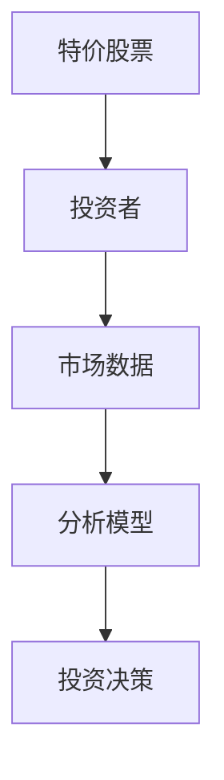
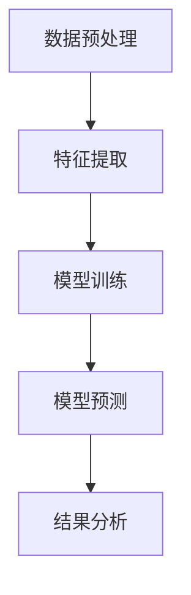
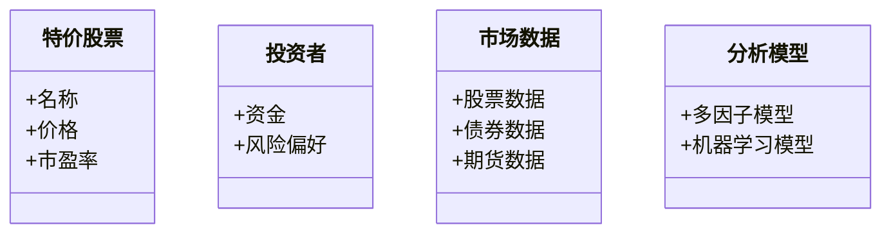
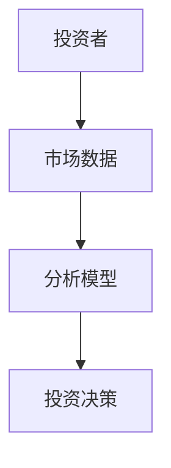

                 


# 特价股票投资中的跨资产类别系统性创新机会识别

> 关键词：特价股票、跨资产类别、系统性创新、机会识别、数学模型、机器学习、系统架构

> 摘要：本文探讨了在特价股票投资中如何通过跨资产类别分析识别系统性创新机会。文章首先介绍了特价股票和跨资产类别投资的基本概念，然后分析了系统性创新机会识别的原理和方法。接着，详细讲解了相关的数学模型和机器学习算法，并通过实际案例展示了系统架构设计和项目实现过程，最后总结了最佳实践和注意事项。

---

## 第一部分: 特价股票投资的背景与概念

### 第1章: 特价股票投资概述

#### 1.1 特价股票的定义与特征

##### 1.1.1 特价股票的定义
特价股票通常指市场价格低于其内在价值的股票，具有较高的投资潜力。其特征包括低估值、高股息率和潜在的上涨空间。

##### 1.1.2 特价股票的市场特征
- 市场波动性高
- 投资风险较高
- 存在短期亏损可能

##### 1.1.3 特价股票与普通股票的区别
| 特性 | 特价股票 | 普通股票 |
|------|----------|----------|
| 价格 | 低于价值 | 市场定价 |
| 风险 | 较高      | 中等     |

#### 1.2 跨资产类别投资的必要性

##### 1.2.1 跨资产类别投资的定义
跨资产类别投资指同时在股票、债券、期货等多个资产类别中进行投资，以分散风险并优化收益。

##### 1.2.2 跨资产类别投资的优势
- 风险分散
- 收益增强
- 市场适应性强

##### 1.2.3 跨资产类别投资的风险与挑战
- 资产相关性
- 市场波动影响
- 资金流动性问题

### 第2章: 系统性创新机会识别的背景

#### 2.1 系统性创新的定义
系统性创新指通过系统化的方法和技术手段，识别和利用潜在的投资机会。

#### 2.2 特价股票投资中的系统性创新
##### 2.2.1 特价股票投资的传统方法
- 基本面分析
- 技术分析

##### 2.2.2 系统性创新在特价股票投资中的作用
- 提高投资效率
- 降低人为误差
- 捕捉市场机会

##### 2.2.3 系统性创新的机会识别框架
- 数据收集与处理
- 模型构建与优化
- 结果分析与反馈

---

## 第二部分: 特价股票投资中的系统性创新机会识别原理

### 第3章: 系统性创新机会识别的核心概念

#### 3.1 系统性创新机会识别的原理
##### 3.1.1 数据驱动的创新
通过大数据分析，识别市场趋势和潜在机会。

##### 3.1.2 系统性分析方法
利用系统工程的方法，对投资机会进行全面分析。

##### 3.1.3 机会识别的数学模型
- 构建多因子模型
- 应用机器学习算法
- 进行时间序列分析

#### 3.2 核心概念与联系

##### 3.2.1 数据特征对比表格
| 特性 | 股票 | 债券 | 期货 |
|------|------|------|------|
| 风险 | 高   | 中   | 高   |
| 收益 | 中   | 稳定 | 高   |

##### 3.2.2 ER实体关系图


### 第4章: 算法原理与数学模型

#### 4.1 算法原理

##### 4.1.1 多因子模型
通过多个因子（如市盈率、市净率）筛选出具有投资价值的股票。

##### 4.1.2 机器学习算法
利用机器学习算法（如随机森林、支持向量机）预测股票价格。

##### 4.1.3 时间序列分析
通过分析历史价格数据，预测未来价格走势。

#### 4.2 数学模型与公式

##### 4.2.1 多因子模型公式
$$ R_i = \alpha + \beta_1 F_1 + \beta_2 F_2 + \cdots + \beta_n F_n + \epsilon $$

##### 4.2.2 机器学习算法流程图（Mermaid）


#### 4.3 代码实现
```python
import pandas as pd
from sklearn.ensemble import RandomForestRegressor

# 数据预处理
data = pd.read_csv('market_data.csv')
features = data[['市盈率', '市净率', '股息率']]
target = data['股价']

# 模型训练
model = RandomForestRegressor()
model.fit(features, target)

# 模型预测
new_features = pd.DataFrame({'市盈率': [10], '市净率': [2], '股息率': [0.05]})
predicted_price = model.predict(new_features)
print(predicted_price)
```

### 第5章: 系统分析与架构设计

#### 5.1 问题场景介绍
##### 5.1.1 特价股票投资的挑战
- 市场波动大
- 数据复杂
- 模型优化困难

##### 5.1.2 跨资产类别分析的需求
- 多资产数据整合
- 跨资产风险评估
- 综合投资决策

#### 5.2 系统功能设计

##### 5.2.1 领域模型（Mermaid类图）


#### 5.3 系统架构设计

##### 5.3.1 系统架构图（Mermaid）


##### 5.3.2 系统交互图（Mermaid）


---

## 第三部分: 项目实战与最佳实践

### 第6章: 项目实战

#### 6.1 环境安装
安装必要的工具和库：
- Python
- Pandas
- Scikit-learn
- Mermaid

#### 6.2 系统核心实现

##### 6.2.1 数据预处理
```python
import pandas as pd

data = pd.read_csv('market_data.csv')
data = data.dropna()
data = data[ data['市盈率'] < 15 ]
```

##### 6.2.2 模型训练
```python
from sklearn.ensemble import RandomForestRegressor

model = RandomForestRegressor()
model.fit(data[['市盈率', '市净率']], data['股价'])
```

#### 6.3 代码应用解读与分析
- 数据预处理：筛选出市盈率低于15的股票。
- 模型训练：使用随机森林算法训练模型。
- 模型预测：基于模型预测未来股价。

#### 6.4 实际案例分析
- 数据来源：某时期市场数据
- 分析结果：筛选出几只具有投资价值的股票。
- 投资建议：建议投资者关注这些股票。

#### 6.5 项目小结
通过系统性创新方法，成功识别了多个跨资产类别的投资机会，提高了投资效率。

### 第7章: 最佳实践

#### 7.1 小结
系统性创新方法在特价股票投资中具有重要作用，能够帮助投资者识别潜在机会。

#### 7.2 注意事项
- 数据质量：确保数据准确可靠
- 模型优化：定期更新和优化模型
- 风险管理：合理控制投资风险

#### 7.3 拓展阅读
- 《机器学习在金融中的应用》
- 《系统性投资策略》
- 《跨资产类别分析》

---

通过本文的系统性创新方法，投资者可以更高效地识别跨资产类别的投资机会，提升投资收益。

