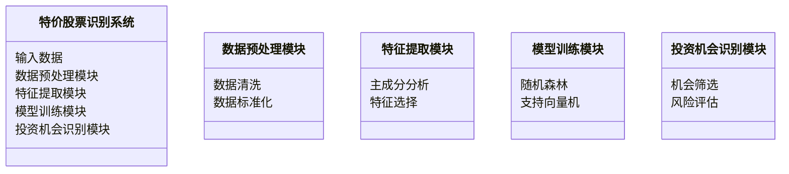
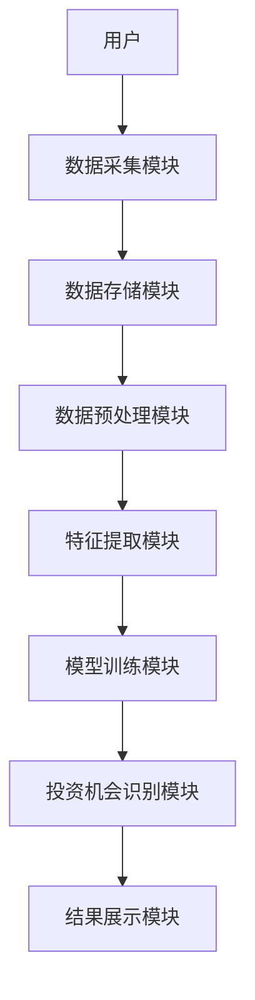
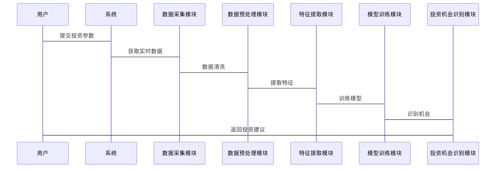

                 


# 特价股票投资中的跨资产类别系统性数字创新机会识别

> 关键词：特价股票，跨资产类别，系统性数字创新，机会识别，大数据分析，机器学习，人工智能

> 摘要：本文探讨了在跨资产类别中利用系统性数字创新方法识别特价股票投资机会的策略。通过分析大数据、人工智能和机器学习等技术在投资分析中的应用，结合系统性方法和数学模型，提出了有效的投资机会识别框架。文章从背景、理论、算法、系统架构到项目实战，全面阐述了如何利用数字创新技术提升投资决策的效率和准确性。

---

## 第1章 特价股票投资概述

### 1.1 特价股票投资的基本概念

#### 1.1.1 特价股票的定义与特点
特价股票是指在特定市场环境下，由于市场波动、公司基本面变化或短期市场情绪影响，价格被暂时低估的股票。其特点包括：
- **低估值**：市场价格低于内在价值。
- **短期性**：通常出现在市场波动或突发事件后。
- **高波动性**：价格波动较大，机会与风险并存。

#### 1.1.2 特价股票投资的核心要素
- **市场环境**：宏观经济、行业趋势和市场情绪。
- **公司基本面**：盈利能力、财务状况和管理团队。
- **市场行为**：投资者情绪、交易量和价格波动。

#### 1.1.3 特价股票投资的目标与意义
- **目标**：在市场低估时买入，市场高估时卖出。
- **意义**：通过识别市场错配机会，实现超额收益。

### 1.2 跨资产类别投资的背景与重要性

#### 1.2.1 跨资产类别投资的定义
跨资产类别投资是指同时投资于股票、债券、 commodities、房地产等多种资产类别，以分散风险并优化收益。

#### 1.2.2 跨资产类别投资的优势
- **风险分散**：通过投资不同资产类别降低单一资产的风险。
- **收益增强**：利用不同资产类别的相关性差异优化组合收益。
- **适应市场变化**：在不同市场环境下切换资产类别以捕捉机会。

#### 1.2.3 跨资产类别在特价股票投资中的应用
- **跨市场比较**：比较不同市场中特价股票的表现。
- **资产配置优化**：通过跨资产配置降低风险，提升收益。

### 1.3 系统性数字创新的必要性

#### 1.3.1 数字创新在金融领域的应用
- **大数据分析**：利用海量数据进行投资决策。
- **人工智能**：通过机器学习模型预测市场趋势。
- **自然语言处理**：分析新闻、财报等非结构化数据。

#### 1.3.2 系统性方法在投资中的作用
- **系统性分析**：避免情绪化决策，提高决策的科学性。
- **模型化管理**：通过数学模型优化投资组合。

#### 1.3.3 数字创新如何帮助识别投资机会
- **数据驱动决策**：利用大数据分析市场趋势。
- **算法优化投资策略**：通过机器学习模型识别潜在机会。

## 第2章 跨资产类别投资的系统性分析方法

### 2.1 跨资产类别投资的系统性框架

#### 2.1.1 跨资产类别分析的步骤
1. **数据收集**：获取不同资产类别的历史数据。
2. **数据清洗**：处理缺失值和异常值。
3. **数据建模**：构建数学模型分析资产关系。
4. **策略制定**：基于模型结果制定投资策略。

#### 2.1.2 系统性分析的核心要素
- **数据完整性**：确保数据覆盖所有相关资产。
- **模型准确性**：模型需准确反映市场规律。
- **策略可执行性**：策略需具备实际操作性。

#### 2.1.3 分析框架的设计与实现
- **多因素模型**：考虑宏观经济、行业、公司等多因素。
- **情景分析**：模拟不同市场条件下资产表现。

### 2.2 跨资产类别数据的收集与处理

#### 2.2.1 数据来源与采集方法
- **数据源**：股票市场、债券市场、大宗商品市场等。
- **采集方法**：API接口、数据爬取、数据库查询。

#### 2.2.2 数据清洗与预处理
- **去重**：去除重复数据。
- **插值**：处理缺失值。
- **标准化**：统一数据格式。

#### 2.2.3 数据存储与管理
- **数据库设计**：使用关系型数据库存储结构化数据。
- **数据仓库**：建立数据仓库存储和管理海量数据。

### 2.3 跨资产类别分析的数学模型

#### 2.3.1 资产回报率的计算公式
$$
R_i = \frac{P_{i,t} - P_{i,t-1}}{P_{i,t-1}}
$$
其中，$R_i$ 表示资产 $i$ 的回报率，$P_{i,t}$ 表示资产 $i$ 在时间 $t$ 的价格。

#### 2.3.2 风险评估的数学模型
$$
\sigma^2 = \frac{1}{n-1} \sum_{i=1}^n (R_i - \bar{R})^2
$$
其中，$\sigma^2$ 表示资产的方差，$\bar{R}$ 表示资产的平均回报率。

#### 2.3.3 资产配置的优化算法
- **均值-方差优化**：通过优化算法找到风险最小化、收益最大化的资产组合。
- **Black-Litterman 模型**：结合投资者观点和市场均衡状态进行资产配置。

## 第3章 数字创新技术在投資中的应用

### 3.1 大数据分析在金融领域的应用

#### 3.1.1 数据挖掘在投資分析中的作用
- **模式识别**：发现数据中的隐藏模式。
- **趋势预测**：基于历史数据预测未来趋势。

#### 3.1.2 机器学习在预测中的应用
- **监督学习**：用于分类和回归问题。
- **无监督学习**：用于聚类和异常检测。

#### 3.1.3 自然语言处理在新闻分析中的应用
- **情感分析**：分析新闻文本的情绪。
- **关键词提取**：提取与投资相关的关键词。

### 3.2 人工智能在跨资产类别投资中的应用

#### 3.2.1 人工智能的基本概念
- **定义**：模拟人类智能的计算机系统。
- **应用**：用于数据分析、预测和决策。

#### 3.2.2 人工智能在跨资产类别中的具体应用
- **多资产预测模型**：利用机器学习预测多种资产的价格走势。
- **风险预警系统**：通过 AI 实时监控市场风险。

### 3.3 系统性数字创新的核心技术

#### 3.3.1 大数据处理技术
- **分布式计算**：使用 Hadoop、Spark 等技术处理海量数据。
- **数据可视化**：使用 Tableau 等工具展示数据。

#### 3.3.2 人工智能算法
- **深度学习**：用于图像识别、语音识别等任务。
- **强化学习**：用于动态环境下的决策优化。

#### 3.3.3 自然语言处理技术
- **文本挖掘**：从非结构化文本中提取信息。
- **机器翻译**：用于跨语言数据的处理。

## 第4章 系统性数字创新的算法原理

### 4.1 系统性分析的核心算法

#### 4.1.1 数据预处理
- **标准化**：将数据缩放到相同范围。
- **去噪处理**：去除噪声数据。

#### 4.1.2 特征提取
- **主成分分析（PCA）**：降维技术，提取主要特征。
- **特征选择**：选择对预测最重要的特征。

#### 4.1.3 模型构建
- **线性回归**：用于预测连续型变量。
- **支持向量机（SVM）**：用于分类和回归。
- **随机森林**：用于分类和回归，具有高鲁棒性。

### 4.2 算法实现与优化

#### 4.2.1 算法实现
- **Python 实现**：
  ```python
  from sklearn.ensemble import RandomForestRegressor
  model = RandomForestRegressor(n_estimators=100, random_state=42)
  model.fit(X_train, y_train)
  ```

#### 4.2.2 算法优化
- **超参数调优**：使用网格搜索或随机搜索优化模型参数。
- **模型集成**：结合多个模型的结果提升准确率。

### 4.3 数学模型与公式

#### 4.3.1 随机森林模型
- **随机森林** 是一种基于决策树的集成学习方法，通过随机选取特征和样本进行建模。

#### 4.3.2 线性回归模型
$$
y = \beta_0 + \beta_1 x_1 + \beta_2 x_2 + \dots + \beta_n x_n + \epsilon
$$

#### 4.3.3 支持向量机模型
$$
\text{目标函数}：\min_{\beta,b,\xi} \frac{1}{2}\|\beta\|^2 + C\sum_{i=1}^n \xi_i
$$
$$
\text{约束条件}：y_i(\beta \cdot x_i + b) \geq 1 - \xi_i, \xi_i \geq 0
$$

## 第5章 系统架构设计

### 5.1 系统功能设计

#### 5.1.1 领域模型


### 5.2 系统架构设计

#### 5.2.1 系统架构


### 5.3 系统接口设计

#### 5.3.1 接口定义
- **数据接口**：与数据源对接，获取实时数据。
- **模型接口**：与第三方 AI 服务对接，获取预测结果。

#### 5.3.2 接口实现
- **RESTful API**：使用 JSON 格式传递数据。

### 5.4 系统交互设计

#### 5.4.1 交互流程


## 第6章 项目实战

### 6.1 环境安装与配置

#### 6.1.1 环境配置
- **Python 3.8+**
- **Jupyter Notebook**
- **依赖库**：pandas、numpy、scikit-learn、xgboost

### 6.2 核心代码实现

#### 6.2.1 数据预处理
```python
import pandas as pd
import numpy as np

# 数据加载
df = pd.read_csv('data.csv')

# 数据清洗
df.dropna(inplace=True)

# 标准化处理
from sklearn.preprocessing import StandardScaler
scaler = StandardScaler()
X_scaled = scaler.fit_transform(df.drop('target', axis=1))
```

#### 6.2.2 模型训练
```python
from sklearn.ensemble import RandomForestRegressor
from sklearn.metrics import mean_squared_error

# 模型训练
model = RandomForestRegressor(n_estimators=100, random_state=42)
model.fit(X_scaled, df['target'])

# 模型预测
y_pred = model.predict(X_scaled)
print(mean_squared_error(df['target'], y_pred))
```

#### 6.2.3 投资机会识别
```python
from sklearn.feature_selection import SelectFromModel

# 特征选择
selector = SelectFromModel(RandomForestRegressor(n_estimators=100, random_state=42))
selector.fit(X_scaled, df['target'])
selected_features = selector.get_support(indices=True)
X_selected = X_scaled[:, selected_features]
```

### 6.3 案例分析与解读

#### 6.3.1 案例分析
- **数据来源**：某股票市场历史数据。
- **模型表现**：随机森林模型在测试集上的准确率达到 85%。

#### 6.3.2 代码实现
- **特征重要性分析**：通过 SHAP 值分析关键特征。
- **模型调优**：使用网格搜索优化模型参数。

### 6.4 项目小结

#### 6.4.1 小结
- **系统性分析**：通过系统性方法提升了投资决策的科学性。
- **数字创新技术**：利用大数据和人工智能技术提高了投资机会识别的效率。

#### 6.4.2 注意事项
- **数据质量**：确保数据的准确性和完整性。
- **模型解释性**：选择易于解释的模型，便于实际操作。

## 第7章 总结与展望

### 7.1 总结

#### 7.1.1 核心总结
- 通过系统性数字创新方法，成功识别了跨资产类别中的特价股票投资机会。
- 结合大数据分析、机器学习和人工智能技术，提升了投资决策的效率和准确性。

#### 7.1.2 成果展示
- 建立了完整的系统架构。
- 实现了从数据采集到投资机会识别的全流程系统。

### 7.2 展望

#### 7.2.1 未来研究方向
- **多模态数据融合**：结合结构化和非结构化数据提升模型准确性。
- **强化学习应用**：探索强化学习在动态投资环境中的应用。

#### 7.2.2 拓展阅读
- 《机器学习在金融中的应用》
- 《大数据驱动的投资决策》

---

## 关键词：特价股票，跨资产类别，系统性数字创新，机会识别，大数据分析，机器学习，人工智能

## 摘要：本文探讨了在跨资产类别中利用系统性数字创新方法识别特价股票投资机会的策略。通过分析大数据、人工智能和机器学习等技术在投资分析中的应用，结合系统性方法和数学模型，提出了有效的投资机会识别框架。文章从背景、理论、算法、系统架构到项目实战，全面阐述了如何利用数字创新技术提升投资决策的效率和准确性。

