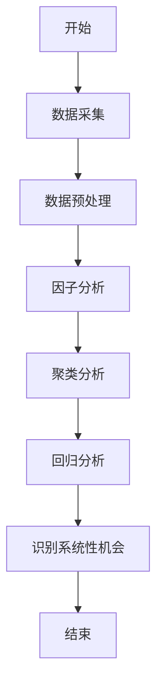

                 


# 特价股票投资中的跨资产类别系统性机会识别

> 关键词：跨资产类别、系统性机会识别、特价股票投资、算法原理、系统架构设计

> 摘要：本文探讨了如何通过系统性方法识别跨资产类别中的特价股票投资机会。文章首先介绍了跨资产类别投资的背景和概念，接着详细讲解了系统性机会识别的核心算法及其数学模型，然后分析了跨资产类别系统的架构设计，最后通过实际案例展示了如何在项目中应用这些理论。文章旨在为投资者和程序员提供跨资产类别投资的深度见解和实践指导。

---

## 第1章: 背景介绍

### 1.1 特价股票投资的定义与特点
#### 1.1.1 特价股票的定义
特价股票是指价格被市场低估的股票，通常具有较高的内在价值与市场价之间的差距。这些股票可能暂时不受市场关注，但具有长期增值的潜力。

#### 1.1.2 特价股票投资的核心特点
- 价值低估：市场价低于内在价值。
- 高股息率：部分特价股票提供较高的股息回报。
- 低流动性：部分特价股票交易量小，市场关注度低。

#### 1.1.3 特价股票与普通股票的区别
| 特性       | 特价股票               | 普通股票               |
|------------|-----------------------|-----------------------|
| 价格       | 通常低于内在价值       | 价格反映市场情绪       |
| 投资者     | 价值投资者为主         | 可能包括投机者         |
| 风险       | 较低，长期回报较高      | 风险较高，波动性较大    |

### 1.2 跨资产类别投资的背景
#### 1.2.1 跨资产类别投资的定义
跨资产类别投资是指将资金分散投资于不同类型的资产（如股票、债券、房地产等），以优化风险和收益的组合。

#### 1.2.2 跨资产类别投资的兴起原因
- 分散风险：通过投资不同资产类别降低整体风险。
- 市场周期：不同资产类别在不同经济周期下的表现不同。
- 多样化收益：不同资产类别提供不同的收益来源。

#### 1.2.3 跨资产类别投资的优势与挑战
| 优势       | 挑战                   |
|------------|-----------------------|
| 分散风险     | 资产类别相关性高         |
| 多样化收益   | 资产类别流动性差异       |
| 抗跌性       | 资产类别监管差异         |

---

## 第2章: 跨资产类别系统性机会识别的核心概念

### 2.1 系统性机会识别的原理
#### 2.1.1 系统性机会的定义
系统性机会是指由于市场整体性因素（如经济周期、政策变化）导致的广泛投资机会。

#### 2.1.2 系统性机会与非系统性机会的区别
| 特性       | 系统性机会           | 非系统性机会         |
|------------|---------------------|---------------------|
| 影响范围     | 影响整个市场或大部分资产 | 影响个别资产或小部分资产 |
| 可预测性     | 较高                 | 较低                 |
| 投资策略     | 基于宏观因素         | 基于微观因素         |

#### 2.1.3 系统性机会识别的关键要素
- 宏观经济指标：GDP增长率、利率、通货膨胀率。
- 市场情绪指标：投资者情绪指数、市场波动率。
- 资产价格关系：相关性分析、协方差矩阵。

### 2.2 跨资产类别机会识别的模型
#### 2.2.1 跨资产类别机会识别的数学模型
系统性机会识别可以基于多元回归模型，如下：
$$ y_i = \beta_0 + \beta_1x_1 + \beta_2x_2 + \cdots + \beta_kx_k + \epsilon $$
其中，$y_i$ 是目标资产回报率，$x_j$ 是宏观经济变量，$\beta_j$ 是回归系数，$\epsilon$ 是误差项。

#### 2.2.2 跨资产类别机会识别的算法流程


---

## 第3章: 跨资产类别系统性机会识别的算法原理

### 3.1 系统性机会识别的核心算法
#### 3.1.1 系统性机会识别的因子分析法
因子分析用于提取影响资产回报的核心因素，如下：
$$ F = \sum_{j=1}^k \lambda_j X_j $$
其中，$F$ 是因子，$\lambda_j$ 是因子载荷，$X_j$ 是原始变量。

#### 3.1.2 系统性机会识别的聚类分析法
聚类分析用于将相似资产分组，如下：
$$ d(x_i, x_j) = \sqrt{(x_{i1} - x_{j1})^2 + (x_{i2} - x_{j2})^2 + \cdots + (x_{in} - x_{jn})^2} $$
其中，$d(x_i, x_j)$ 是资产$i$和$j$之间的距离。

#### 3.1.3 系统性机会识别的回归分析法
回归分析用于预测资产回报，如下：
$$ y = \beta x + \epsilon $$
其中，$y$ 是目标变量，$x$ 是自变量，$\beta$ 是回归系数，$\epsilon$ 是误差项。

---

## 第4章: 跨资产类别系统性机会识别的系统架构设计

### 4.1 系统架构设计概述
#### 4.1.1 系统架构设计的目标
- 实现跨资产类别数据的采集、分析和识别。
- 提供系统性机会识别的可视化界面。

#### 4.1.2 系统架构设计的核心模块
| 模块       | 功能描述                   |
|------------|---------------------------|
| 数据采集模块 | 采集股票、债券等数据       |
| 数据分析模块 | 分析数据，识别系统性机会    |
| 系统输出模块 | 输出识别结果              |

#### 4.1.3 系统架构设计的实现方式
- 数据采集模块：使用API接口获取实时数据。
- 数据分析模块：基于因子分析和聚类分析进行数据处理。
- 系统输出模块：通过可视化工具展示结果。

### 4.2 系统架构设计的详细说明
#### 4.2.1 数据采集模块的设计
```python
import pandas as pd
from pandas_datareader import data as pdr

def get_data(tickers, start_date, end_date):
    data = pd.DataFrame()
    for ticker in tickers:
        df = pdr.get_data_yahoo(ticker, start=start_date, end=end_date)
        data[ticker] = df['Adj Close']
    return data
```

#### 4.2.2 数据分析模块的设计
```python
from sklearn.cluster import KMeans

def cluster_assets(data, n_clusters):
    kmeans = KMeans(n_clusters=n_clusters)
    clusters = kmeans.fit_predict(data)
    return clusters
```

#### 4.2.3 系统输出模块的设计
```python
import matplotlib.pyplot as plt

def visualize_clusters(data, clusters):
    plt.scatter(data[:,0], data[:,1], c=clusters, cmap='viridis')
    plt.xlabel('Factor 1')
    plt.ylabel('Factor 2')
    plt.title('Cluster Visualization')
    plt.show()
```

---

## 第5章: 跨资产类别系统性机会识别的项目实战

### 5.1 项目实战环境安装
#### 5.1.1 开发环境的安装与配置
- 安装Python：Python 3.8+
- 安装依赖库：pandas, numpy, scikit-learn, matplotlib.

#### 5.1.2 数据采集工具的安装与配置
- 使用pandas_datareader或Yahoo Finance API。

#### 5.1.3 数据分析工具的安装与配置
- 使用Jupyter Notebook进行数据可视化和分析。

### 5.2 项目核心实现代码
#### 5.2.1 数据采集代码
```python
import pandas as pd
from pandas_datareader import data as pdr
import datetime

start_date = '2020-01-01'
end_date = '2023-01-01'
tickers = ['AAPL', 'MSFT', 'GOOGL']

data = get_data(tickers, start_date, end_date)
print(data.head())
```

#### 5.2.2 数据分析代码
```python
from sklearn.decomposition import PCA

# 数据标准化
data_norm = (data - data.mean()) / data.std()

# 主成分分析
pca = PCA(n_components=2)
principal_components = pca.fit_transform(data_norm)

# 聚类分析
clusters = cluster_assets(principal_components, n_clusters=3)
```

#### 5.2.3 可视化代码
```python
import matplotlib.pyplot as plt

plt.scatter(principal_components[:,0], principal_components[:,1], c=clusters, cmap='viridis')
plt.xlabel('Principal Component 1')
plt.ylabel('Principal Component 2')
plt.title('Cluster Visualization')
plt.show()
```

---

## 第6章: 最佳实践与小结

### 6.1 小结
跨资产类别系统性机会识别是一种通过分析多个资产类别之间的关系，寻找市场整体性机会的方法。本文通过理论分析和实际案例展示了如何实现这一目标。

### 6.2 注意事项
- 数据质量：确保数据的准确性和完整性。
- 模型选择：根据实际情况选择合适的算法。
- 风险管理：合理控制投资风险。

### 6.3 拓展阅读
- 《投资学》：深入理解资产定价理论。
- 《机器学习实战》：学习更多机器学习算法的应用。

---

通过本文的系统性分析和实际案例，读者可以更好地理解跨资产类别系统性机会识别的方法，并将其应用到实际投资中。

