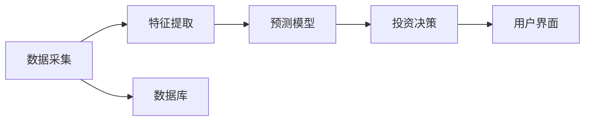

                 


# 特价股票投资中的跨链资产流动性预测分析

## 关键词：跨链资产流动性、特价股票投资、时间序列分析、机器学习、LSTM、ARIMA

## 摘要：  
本文探讨了在跨链环境下，特价股票投资中的资产流动性预测方法。通过分析跨链技术的核心概念、流动性预测的理论基础、算法实现以及实际应用场景，本文提出了基于时间序列分析和机器学习模型的流动性预测方案。文章从背景介绍、核心概念、算法原理、系统设计、实战案例到总结，逐步深入，为读者提供了从理论到实践的全面指导。

---

# 第1章: 特价股票投资与跨链资产流动性概述

## 1.1 特价股票投资的背景与意义  
### 1.1.1 特价股票投资的定义与特点  
特价股票投资是指在特定市场条件下，以低于市场价格买入股票，通过短期波动获利的投资策略。其特点包括高风险、高收益、短周期和低门槛。  

### 1.1.2 跨链资产流动性的概念与重要性  
跨链资产流动性是指在不同区块链之间转移资产的能力。其重要性体现在以下几点：  
- 提高资产的灵活性和可组合性；  
- 降低交易成本和时间；  
- 增强市场深度和稳定性。  

### 1.1.3 特价股票投资中的流动性预测需求  
在特价股票投资中，流动性预测是关键，因为它直接影响投资决策。例如：  
- 当流动性不足时，可能无法以合理价格快速买卖资产；  
- 当流动性充足时，可以抓住短期价格波动的机会。  

---

## 1.2 跨链资产流动性的基本原理  
### 1.2.1 跨链技术的核心概念  
跨链技术是指在不同区块链之间实现资产转移和信息交互的技术。其核心在于通过跨链桥接（如链下中继、原子交换等）实现资产的跨链转移。  

### 1.2.2 資产流动性的定义与衡量指标  
资产流动性是指资产在市场上的交易活跃程度。衡量流动性的重要指标包括：  
- 成交量：单位时间内的交易量；  
- 波动性：价格波动幅度；  
- 深度：大额交易时的价格冲击程度。  

### 1.2.3 跨链流动性对投资决策的影响  
跨链流动性直接影响投资收益和风险。例如：  
- 高流动性跨链资产更容易变现，降低投资风险；  
- 低流动性跨链资产可能面临更大的价格波动，带来更高的收益或亏损。  

---

## 1.3 特价股票投资中的跨链资产流动性问题  
### 1.3.1 跨链资产流动性的主要挑战  
跨链流动性预测面临以下挑战：  
- 数据碎片化：不同链上的数据难以整合；  
- 市场波动性：跨链资产价格受多种因素影响；  
- 技术限制：跨链桥接效率和安全性问题。  

### 1.3.2 特价股票投资中的流动性风险  
- 流动性不足可能导致无法及时卖出资产；  
- 流动性过度可能导致价格波动剧烈，增加投资难度。  

### 1.3.3 跨链流动性预测的必要性与应用场景  
- 必要性：通过预测流动性，投资者可以优化投资策略；  
- 应用场景：跨链资产配置、风险控制、交易时机选择等。  

---

## 1.4 本章小结  
本章介绍了特价股票投资和跨链资产流动性的基本概念，分析了流动性预测的重要性和挑战，并为后续内容奠定了基础。

---

# 第2章: 跨链资产流动性预测的核心概念与联系

## 2.1 跨链资产流动性的核心要素  
### 2.1.1 資产类型与流动性关系  
- 高流动性资产：如比特币、以太坊等主流币种；  
- 低流动性资产：如新兴小币种。  

### 2.1.2 跨链网络的结构特征  
- 跨链网络的节点数量与流动性关系；  
- 跨链桥接的效率与流动性关系。  

### 2.1.3 市场波动对流动性的影响  
- 市场牛市：流动性通常较高；  
- 市场熊市：流动性通常较低。  

---

## 2.2 跨链流动性预测的理论基础  
### 2.2.1 时间序列分析的基本原理  
时间序列分析是基于历史数据预测未来趋势的方法。常用模型包括ARIMA、LSTM等。  

### 2.2.2 机器学习在流动性预测中的应用  
- 机器学习的优势：非线性关系建模能力强；  
- 常用算法：随机森林、XGBoost、LSTM等。  

### 2.2.3 資产价格波动与流动性预测的关系  
- 价格波动反映市场参与度，影响流动性；  
- 流动性预测可以辅助判断价格波动趋势。  

---

## 2.3 跨链流动性预测的数学模型与公式  
### 2.3.1 时间序列模型（ARIMA）  
ARIMA模型用于预测线性时间序列数据，其公式为：  
$$ARIMA(p, d, q) = y_t - \phi_1 y_{t-1} - \dots - \phi_p y_{t-p} = \theta_1 \epsilon_{t-1} + \dots + \theta_q \epsilon_{t-q}$$  
其中，$p$为自回归阶数，$d$为差分阶数，$q$为移动平均阶数。  

### 2.3.2 神经网络模型（LSTM）  
LSTM是一种特殊的RNN，适用于处理长序列数据。其核心在于门控机制：  
$$i_t = \sigma(W_i x_t + U_i h_{t-1} + b_i)$$  
$$f_t = \sigma(W_f x_t + U_f h_{t-1} + b_f)$$  
$$o_t = \sigma(W_o x_t + U_o h_{t-1} + b_o)$$  
$$h_t = i_t \cdot \cosh_t + f_t \cdot \text{prev}_c_t$$  
$$c_t = o_t \cdot h_t$$  

### 2.3.3 混合模型的构建与优化  
- 混合模型的优势：结合时间序列和机器学习的优势；  
- 混合模型的优化：通过交叉验证选择最优参数。  

---

## 2.4 跨链流动性预测的ER实体关系图  


---

## 2.5 本章小结  
本章通过分析跨链资产流动性的核心要素，探讨了时间序列分析和机器学习在流动性预测中的应用，并通过ER实体关系图展示了预测模型的构建过程。

---

# 第3章: 跨链资产流动性预测的算法原理

## 3.1 时间序列预测算法  
### 3.1.1 ARIMA算法原理与实现  
ARIMA算法适用于线性时间序列数据。其实现步骤包括：  
1. 数据平稳化（差分）；  
2. 确定模型参数；  
3. 模型训练与预测。  

### 3.1.2 LSTM算法的原理与优势  
LSTM通过门控机制捕捉长序列数据中的模式。其优势在于：  
- 能够处理非线性数据；  
- 具有良好的记忆能力。  

### 3.1.3 算法选择的依据与优化  
- 算法选择依据：数据特征和预测目标；  
- 算法优化：超参数调优和模型融合。  

---

## 3.2 跨链流动性预测的机器学习模型  
### 3.2.1 数据预处理与特征提取  
- 数据清洗：处理缺失值和异常值；  
- 特征提取：选择关键特征（如成交量、波动率）。  

### 3.2.2 模型训练与调优  
- 模型训练：使用训练数据拟合模型；  
- 模型调优：通过交叉验证优化参数。  

### 3.2.3 模型评估与对比  
- 评估指标：均方误差（MSE）、平均绝对误差（MAE）；  
- 模型对比：ARIMA vs LSTM。  

---

## 3.3 跨链流动性预测的数学模型  
### 3.3.1 ARIMA模型的数学公式  
$$ARIMA(p, d, q) = y_t - \phi_1 y_{t-1} - \dots - \phi_p y_{t-p} = \theta_1 \epsilon_{t-1} + \dots + \theta_q \epsilon_{t-q}$$  

### 3.3.2 LSTM模型的数学公式  
$$i_t = \sigma(W_i x_t + U_i h_{t-1} + b_i)$$  
$$f_t = \sigma(W_f x_t + U_f h_{t-1} + b_f)$$  
$$o_t = \sigma(W_o x_t + U_o h_{t-1} + b_o)$$  
$$h_t = i_t \cdot \cosh_t + f_t \cdot \text{prev}_c_t$$  
$$c_t = o_t \cdot h_t$$  

---

## 3.4 本章小结  
本章详细讲解了ARIMA和LSTM算法的原理、实现和优化方法，并通过对比分析展示了不同算法在跨链流动性预测中的应用。

---

# 第4章: 跨链资产流动性预测的系统设计

## 4.1 问题场景介绍  
跨链流动性预测系统需要解决以下问题：  
- 如何高效采集多链数据；  
- 如何构建高精度预测模型；  
- 如何实时反馈预测结果。  

## 4.2 系统功能设计  
### 4.2.1 数据采集模块  
- 数据源：各区块链的交易数据；  
- 采集方式：实时API调用。  

### 4.2.2 特征提取模块  
- 提取特征：成交量、波动率、市场深度等；  
- 数据预处理：标准化和归一化。  

### 4.2.3 预测模型模块  
- 模型选择：基于数据特征选择ARIMA或LSTM；  
- 模型训练：使用训练数据拟合模型；  
- 模型预测：输出未来流动性预测值。  

### 4.2.4 投资决策模块  
- 投资建议：基于流动性预测结果制定交易策略；  
- 风险控制：设定止损和止盈点。  

---

## 4.3 系统架构设计  
### 4.3.1 系统架构图  


### 4.3.2 系统接口设计  
- 数据接口：API调用；  
- 模型接口：预测结果输出。  

---

## 4.4 系统交互设计  
### 4.4.1 系统交互流程图  


---

## 4.5 本章小结  
本章从系统设计的角度，详细描述了跨链流动性预测系统的功能模块、架构设计和交互流程。

---

# 第5章: 跨链资产流动性预测的项目实战

## 5.1 环境安装与配置  
### 5.1.1 数据采集工具安装  
- 工具：Python、Pandas、 requests库。  

### 5.1.2 模型训练环境配置  
- 环境：Python 3.8+，TensorFlow 2.0+。  

## 5.2 核心代码实现  
### 5.2.1 数据采集代码  
```python
import requests
import pandas as pd

def get_data(api_url):
    response = requests.get(api_url)
    data = response.json()
    df = pd.DataFrame(data)
    return df
```

### 5.2.2 模型训练代码  
```python
from tensorflow.keras import layers

model = layers.Sequential()
model.add(layers.LSTM(64, input_shape=(timesteps, features)))
model.add(layers.Dense(1))
model.compile(loss='mean_squared_error', optimizer='adam')
model.fit(X_train, y_train, epochs=100, batch_size=32)
```

### 5.2.3 模型预测代码  
```python
y_pred = model.predict(X_test)
```

---

## 5.3 案例分析与解读  
### 5.3.1 数据分析与可视化  
- 数据可视化工具：Matplotlib、Seaborn。  

### 5.3.2 模型评估与优化  
- 评估指标：MSE、MAE、R²。  

### 5.3.3 实际案例解读  
- 案例背景：某跨链资产的流动性预测；  
- 模型表现：预测精度分析；  
- 投资决策：基于预测结果制定交易策略。  

---

## 5.4 本章小结  
本章通过实际案例展示了跨链流动性预测系统的实现过程，并通过代码和数据可视化工具帮助读者理解模型的应用。

---

# 第6章: 总结与展望

## 6.1 本章总结  
本文从理论到实践，详细探讨了跨链资产流动性预测的方法和实现。通过时间序列分析和机器学习模型，提出了高效的预测方案，并通过实际案例验证了模型的有效性。

## 6.2 未来展望  
未来的研究方向包括：  
- 更高精度的预测模型：如集成学习和深度学习的结合；  
- 更多应用场景：如多资产配置和风险对冲；  
- 更高效的跨链技术：如Layer-2解决方案和NFT资产流动性预测。  

## 6.3 最佳实践 tips  
- 数据预处理是关键，特征选择直接影响模型性能；  
- 模型选择应基于数据特征和预测目标；  
- 实时反馈和动态调整是提高预测精度的重要手段。  

## 6.4 本章小结  
本章总结了全文的主要内容，并对未来研究方向和最佳实践提出了建议。

---

# 附录: 参考文献与工具清单

## 附录A: 参考文献  
1. Hyndman, R. J., & Athanasopoulos, G. (2018). *Forecasting: principles and practice*.  
2. Goodfellow, I., Bengio, Y., & Courville, A. (2016). *Deep learning*.  
3. 张成林, 等. (2021). *区块链技术与应用*.  

## 附录B: 工具清单  
- 数据采集工具：requests、pandas；  
- 模型训练工具：TensorFlow、Keras；  
- 数据可视化工具：Matplotlib、Seaborn。  

---

# 结束语  

感谢您的阅读！希望本文能为特价股票投资中的跨链资产流动性预测分析提供有价值的参考和指导。

