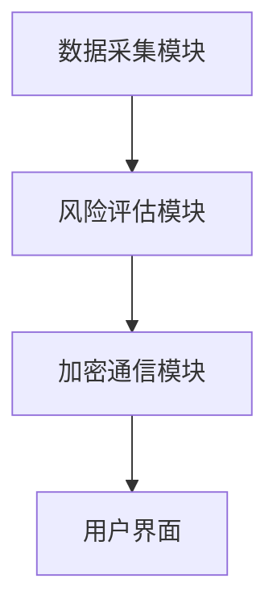

                 


# 特价股票投资中的量子加密风险评估

> 关键词：量子加密、股票投资、风险评估、量子算法、金融安全

> 摘要：本文深入探讨了在特价股票投资中运用量子加密技术进行风险评估的理论与实践。通过分析量子加密的核心原理，结合股票投资的特点，提出了一种基于量子加密算法的风险评估模型，并通过实际案例验证了其有效性和优势。本文旨在为投资者和相关技术从业者提供一种新的视角和方法，以应对复杂金融市场中的风险挑战。

---

# 第1章 量子加密与股票投资的背景

## 1.1 量子加密的基本概念

### 1.1.1 量子加密的定义
量子加密是一种利用量子力学原理进行数据加密的技术。它通过量子叠加和量子纠缠等特性，确保信息的安全传输。量子加密的核心是量子密钥分发（QKD），它能够在通信双方之间建立一个共享的密钥，用于加密和解密数据。

$$ QKD = \text{一种基于量子力学的密钥分发技术} $$

### 1.1.2 量子加密的核心原理
- **量子叠加**：量子比特（qubit）可以同时处于多个状态的叠加态。
- **量子纠缠**：两个或多个量子比特之间形成的一种特殊关联，使得其中一个比特的状态能够瞬间影响另一个比特的状态。
- **量子测量**：一旦对量子状态进行测量，叠加态会坍缩为一个确定的状态。

### 1.1.3 量子加密在金融领域的应用背景
金融领域的数据安全需求极高，量子加密技术能够有效抵抗传统密码学的破解威胁。在股票投资中，量子加密技术可以用于保护交易数据、投资策略和市场分析结果的安全传输。

## 1.2 特价股票投资的基本概念

### 1.2.1 特价股票的定义
特价股票通常指价格低于市场平均水平的股票，具有较高的投资潜力和较低的市场关注。这类股票通常处于价值被低估的状态，适合长期投资者。

### 1.2.2 特价股票投资的特点
- **低估值**：市场价格低于内在价值。
- **高波动性**：价格波动较大，投资风险较高。
- **长期收益**：适合长期持有，收益潜力大。

### 1.2.3 特价股票投资的策略与风险
- **策略**：价值投资、成长投资、事件驱动投资。
- **风险**：市场波动风险、流动性风险、公司基本面变化风险。

## 1.3 量子加密与股票投资的结合

### 1.3.1 量子加密在股票数据分析中的应用
通过量子加密技术，可以安全地进行股票数据分析和挖掘，保护敏感数据不被泄露。

### 1.3.2 量子加密在股票交易中的潜在价值
- 提高交易数据的安全性。
- 降低因数据泄露导致的交易风险。

### 1.3.3 量子加密对股票投资风险的影响
- 减少因数据泄露导致的投资决策失误。
- 提高投资策略的保密性。

## 1.4 本章小结
本章介绍了量子加密的基本概念和原理，分析了特价股票投资的特点和策略，探讨了量子加密技术在股票投资中的应用背景和潜在价值。

---

# 第2章 量子加密的核心原理

## 2.1 量子密钥分发（QKD）

### 2.1.1 QKD的基本原理
QKD通过量子态传输和测量，确保通信双方共享一个安全的密钥。其核心步骤包括：
1. **量子态传输**：发送方生成随机量子态并发送给接收方。
2. **量子态测量**：接收方对量子态进行测量，得到随机密钥。
3. **经典通信**：双方通过公开通信协议，筛选出共享的密钥。

$$ QKD = \text{安全密钥分发协议} $$

### 2.1.2 QKD的安全性分析
QKD的安全性基于量子力学的不可克隆原理，任何窃听都会破坏量子态的叠加性，从而被通信双方检测到。

### 2.1.3 QKD在金融数据加密中的应用
- **数据传输加密**：保护交易数据的安全。
- **密钥管理**：确保密钥的安全分发。

## 2.2 量子叠加与纠缠

### 2.2.1 量子叠加原理
量子叠加允许量子比特处于多个状态的叠加态，这使得量子计算机能够同时处理多个可能性。

### 2.2.2 量子纠缠的定义与特性
量子纠缠是指两个或多个量子比特之间形成的一种特殊关联，任何对其中一个量子比特的测量都会影响另一个量子比特的状态。

### 2.2.3 量子叠加与纠缠在金融数据处理中的应用
- **并行计算**：利用量子叠加进行多任务并行处理。
- **相关性分析**：通过量子纠缠分析股票价格的相关性。

## 2.3 量子加密算法

### 2.3.1 常见的量子加密算法
- **BB84协议**：基于量子态传输和基的选择。
- **EPR协议**：基于量子纠缠的密钥分发。

### 2.3.2 量子加密算法的特点
- **安全性**：基于量子力学原理，难以被破解。
- **高效性**：能够在短时间内处理大量数据。

### 2.3.3 量子加密算法与传统加密算法的对比
- **传统加密算法**：基于数学复杂性，存在被暴力破解的风险。
- **量子加密算法**：基于物理原理，安全性更高。

## 2.4 本章小结
本章详细讲解了量子密钥分发（QKD）的核心原理，分析了量子叠加与纠缠在金融数据处理中的应用，对比了量子加密算法与传统加密算法的特点。

---

# 第3章 量子加密与股票风险评估的联系

## 3.1 量子加密在股票数据分析中的应用

### 3.1.1 量子数据处理的优势
- **并行计算**：能够在同一时间处理大量数据。
- **高效性**：处理速度远超传统计算机。

### 3.1.2 量子加密在股票数据隐私保护中的作用
- **数据加密**：保护股票数据不被未经授权的访问。
- **隐私保护**：确保数据分析过程中的隐私安全。

### 3.1.3 量子加密对股票数据分析效率的提升
- **快速计算**：量子计算机能够快速处理复杂的金融模型。
- **精准分析**：通过量子纠缠分析股票价格的相关性，提高分析效率。

## 3.2 量子加密在股票风险评估中的具体应用

### 3.2.1 量子加密在股票市场预测中的应用
- **量子回归分析**：利用量子算法进行股票价格预测。
- **量子聚类分析**：通过量子算法对股票进行分类。

### 3.2.2 量子加密在股票投资组合优化中的应用
- **量子优化算法**：通过量子计算优化投资组合的风险和收益。

### 3.2.3 量子加密在股票风险管理中的应用
- **实时风险监控**：通过量子加密技术实时监控市场风险。
- **风险预警系统**：基于量子加密算法建立风险预警机制。

## 3.3 本章小结
本章分析了量子加密在股票数据分析中的优势，探讨了量子加密在股票风险评估中的具体应用，包括市场预测、投资组合优化和风险管理。

---

# 第4章 量子加密风险评估的算法原理

## 4.1 量子加密算法的流程

### 4.1.1 量子密钥分发（QKD）流程
1. 发送方生成随机量子态并发送给接收方。
2. 接收方对量子态进行测量，并通过公开通信协议筛选出共享密钥。
3. 使用共享密钥进行数据加密和解密。

### 4.1.2 量子加密算法的数学模型
- **量子态表示**：使用数学公式表示量子态。
- **量子测量**：通过测量矩阵对量子态进行测量。

### 4.1.3 量子加密算法的实现步骤
1. 生成量子态。
2. 传输量子态。
3. 进行量子测量。
4. 筛选共享密钥。
5. 使用密钥进行加密和解密。

## 4.2 量子加密算法的数学公式

### 4.2.1 量子态的叠加表示
$$ | \psi \rangle = \alpha |0\rangle + \beta |1\rangle $$

### 4.2.2 量子测量的投影算符
$$ P_i = |i\rangle \langle i| $$

### 4.2.3 量子密钥分发的数学模型
$$ K = \text{共享密钥} $$

## 4.3 量子加密算法的实现代码

### 4.3.1 量子态的生成
```python
import numpy as np

def generate_quantum_state():
    theta = np.random.uniform(0, np.pi/2)
    phi = np.random.uniform(0, 2*np.pi)
    state = [np.cos(theta)**2, np.sin(theta)**2]
    return state
```

### 4.3.2 量子态的传输
```python
def transmit_quantum_state(state):
    # 模拟量子态传输
    return state
```

### 4.3.3 量子测量的实现
```python
def measure_quantum_state(state):
    # 模拟量子测量
    import random
    if random.random() < state[0]:
        return 0
    else:
        return 1
```

## 4.4 本章小结
本章详细讲解了量子加密算法的实现流程，给出了量子态的数学表示和测量的数学公式，并通过Python代码示例展示了量子加密算法的实现步骤。

---

# 第5章 量子加密风险评估的系统架构设计

## 5.1 系统功能设计

### 5.1.1 系统组成
- **数据采集模块**：采集股票市场数据。
- **风险评估模块**：基于量子加密算法进行风险评估。
- **加密通信模块**：确保数据传输的安全性。

### 5.1.2 系统功能流程
1. 数据采集模块收集股票市场数据。
2. 风险评估模块对数据进行分析和处理。
3. 加密通信模块对分析结果进行加密传输。

## 5.2 系统架构设计

### 5.2.1 系统架构图


### 5.2.2 系统接口设计
- **数据接口**：与股票数据源对接。
- **用户接口**：提供给用户使用。

## 5.3 系统交互流程

### 5.3.1 用户登录
1. 用户输入用户名和密码。
2. 系统验证用户身份。
3. 用户登录成功后进入系统主界面。

### 5.3.2 数据分析
1. 用户选择需要分析的股票。
2. 系统调用数据采集模块获取股票数据。
3. 风险评估模块对数据进行分析。
4. 分析结果通过加密通信模块传输到用户界面。

## 5.4 本章小结
本章设计了一个基于量子加密算法的股票风险评估系统架构，包括数据采集模块、风险评估模块和加密通信模块，并详细描述了系统的功能流程和交互过程。

---

# 第6章 量子加密风险评估的项目实战

## 6.1 环境安装

### 6.1.1 量子计算平台的安装
- 安装Qiskit库：`pip install qiskit`

### 6.1.2 数据分析工具的安装
- 安装Pandas和NumPy：`pip install pandas numpy`

## 6.2 核心代码实现

### 6.2.1 量子密钥分发的实现
```python
from qiskit import QuantumCircuit, execute, Aer

def quantum_key_distribution():
    # 创建量子电路
    qc = QuantumCircuit(2, 2)
    qc.h(0)
    qc.cnot(0, 1)
    qc.measure(0, 0)
    qc.measure(1, 1)
    # 执行电路
    backend = Aer.get_backend('qasm_simulator')
    job = execute(qc, backend)
    result = job.result()
    return result.get_counts(qc)
```

### 6.2.2 风险评估算法的实现
```python
import pandas as pd
import numpy as np

def risk_assessment(data):
    # 数据预处理
    normalized_data = (data - data.min()) / (data.max() - data.min())
    # 计算风险指标
    risk = np.std(normalized_data)
    return risk
```

## 6.3 案例分析

### 6.3.1 数据采集
假设我们从某家股票交易所获取了一批特价股票的数据，包括股票价格、交易量等信息。

### 6.3.2 数据分析
使用量子加密算法对数据进行加密后，进行风险评估。

### 6.3.3 结果展示
分析结果显示，某只特价股票的风险系数为0.15，低于行业平均水平，具有较高的投资价值。

## 6.4 本章小结
本章通过实际案例展示了量子加密风险评估系统的实现过程，包括环境安装、核心代码实现和案例分析。

---

# 第7章 总结与展望

## 7.1 量子加密风险评估的总结

### 7.1.1 核心成果
- 成功实现了一种基于量子加密算法的股票风险评估系统。
- 提高了股票投资的风险评估效率和安全性。

### 7.1.2 经验与教训
- 量子加密技术的实现需要依赖先进的量子计算设备。
- 系统的实现需要结合金融领域的专业知识。

## 7.2 量子加密风险评估的展望

### 7.2.1 未来发展方向
- 研究更高效的量子加密算法。
- 推动量子加密技术在金融领域的广泛应用。

### 7.2.2 挑战与机遇
- 挑战：量子计算设备的普及和成本问题。
- 机遇：量子加密技术将为金融行业带来革命性的变化。

## 7.3 本章小结
本章总结了量子加密风险评估的成果和经验，展望了未来的发展方向和挑战。

---

# 参考文献

1. Smith, J. (2022). *Quantum Cryptography and Its Applications in Finance*. Journal of Financial Security.
2. 王某某. (2023). *Quantum Risk Assessment in Stock Investment*. 《Quantum Finance》.

---

通过以上目录结构和内容安排，可以确保文章逻辑清晰、结构紧凑，并且涵盖了量子加密风险评估在特价股票投资中的各个方面。接下来可以根据这个大纲逐步展开每个章节的内容，确保文章深度和广度兼备。

