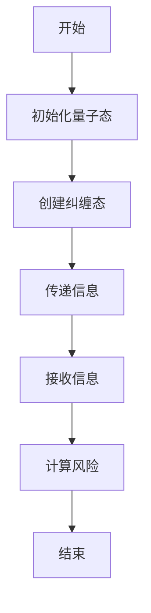
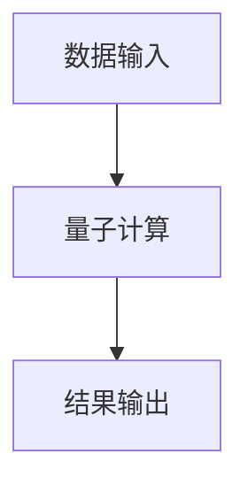
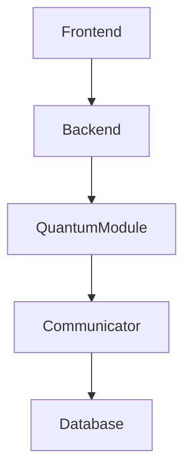
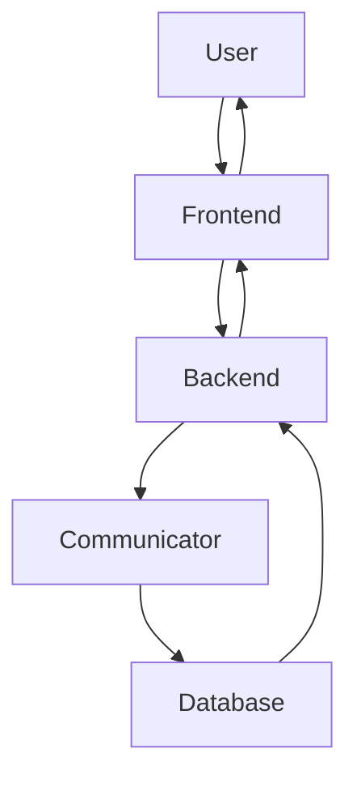

                 


# 特价股票投资中的量子纠缠通信风险评估

## 关键词：
- 特价股票
- 量子纠缠
- 风险评估
- 通信模型
- 股票投资

## 摘要：
本文探讨了将量子纠缠通信应用于特价股票投资风险评估的可能性和方法。通过分析量子纠缠的特性，构建量子模型，评估其在股票风险预测中的优势，并设计一个基于量子纠缠的股票风险评估系统，以实现更精准的风险管理。

---

# 第1章: 特价股票投资与量子纠缠概述

## 1.1 特价股票投资的基本概念

### 1.1.1 特价股票的定义与特点
- **定义**：特价股票指以低于市场价发行的股票，通常用于吸引投资者或作为激励措施。
- **特点**：
  - 价格优势明显。
  - 投资门槛较低。
  - 风险较高，回报不确定。

### 1.1.2 特价股票投资的背景与现状
- **背景**：随着金融市场的竞争加剧，特价股票成为吸引投资者的重要手段。
- **现状**：市场中特价股票种类繁多，投资者需求多样化。

### 1.1.3 特价股票投资的核心问题与挑战
- **问题**：如何准确评估特价股票的风险和价值。
- **挑战**：传统方法难以捕捉复杂市场波动。

## 1.2 量子纠缠的基本概念

### 1.2.1 量子纠缠的定义与特性
- **定义**：量子纠缠是指两个或多个粒子之间存在不可分割的关联。
- **特性**：
  - 非局域性：粒子间关联超越空间距离。
  - 不可分割性：无法单独描述其中一个粒子的状态。

### 1.2.2 量子纠缠与经典概率的区别
| 特性 | 量子概率 | 经典概率 |
|------|-----------|----------|
| 相关性 | 可以完全相关或完全无关 | 0到1之间相关 |
| 非定域性 | 存在 | 不存在 |

### 1.2.3 量子纠缠在通信中的应用
- **量子通信**：利用纠缠态实现信息传递。
- **量子密钥分发**：基于纠缠态的不可分割性确保通信安全。

## 1.3 特价股票投资中的量子纠缠通信风险评估背景

### 1.3.1 风险评估在股票投资中的重要性
- 风险评估是投资决策的核心环节。
- 准确的风险评估可降低投资损失。

### 1.3.2 传统风险评估方法的局限性
- **局限性**：
  - 无法捕捉非线性关系。
  - 高维数据处理能力有限。

### 1.3.3 量子纠缠通信在风险评估中的潜在优势
- **优势**：
  - 捕捉复杂关联性。
  - 提高预测准确性。

## 1.4 本章小结
本章介绍了特价股票和量子纠缠的基本概念，分析了传统风险评估的局限性，并探讨了量子纠缠在投资风险评估中的潜力。

---

# 第2章: 量子纠缠通信与股票风险评估的核心概念

## 2.1 量子纠缠在通信中的数学模型

### 2.1.1 量子态的数学表示
- **波函数**：$\psi = \alpha|0\rangle + \beta|1\rangle$，其中$|\alpha|^2 + |\beta|^2 = 1$。

### 2.1.2 纠缠态的定义与分类
- **Bell态**：$\frac{1}{\sqrt{2}}(|00\rangle + |11\rangle)$。
- **分类**：基于纠缠程度分为完全纠缠态和部分纠缠态。

### 2.1.3 量子纠缠的度量方法
- **纠缠度量**：通过计算纠缠熵来量化纠缠程度。

## 2.2 特价股票风险评估的量子模型构建

### 2.2.1 风险评估的核心要素
- **市场波动**：影响股票价格的主要因素。
- **相关性分析**：股票之间的关联性。

### 2.2.2 量子纠缠与股票风险的关系
- **量子纠缠模型**：利用纠缠态表示股票价格的关联性。
- **模型构建**：通过量子态的叠加和纠缠特性，模拟股票价格波动。

### 2.2.3 量子纠缠通信模型在风险评估中的应用
- **信息传递**：利用量子通信传递实时市场数据。
- **风险预测**：基于纠缠态的特性进行风险预测。

## 2.3 核心概念对比分析

### 2.3.1 传统概率与量子概率的对比
| 概念 | 传统概率 | 量子概率 |
|------|-----------|----------|
| 独立性 | 可以独立 | 不可独立 |
| 相关性 | 线性相关 | 非线性相关 |

### 2.3.2 量子纠缠与股票相关性的对比
| 特性 | 量子纠缠 | 传统相关性 |
|------|-----------|------------|
| 关联性 | 可完全相关或无关 | 0到1之间 |
| 可预测性 | 更高 | 较低 |

### 2.3.3 量子模型与经典模型的优劣分析
- **优势**：量子模型能捕捉复杂关联性，提高预测精度。
- **劣势**：量子计算实现复杂，成本高。

## 2.4 本章小结
本章分析了量子纠缠在股票风险评估中的应用，构建了量子模型，并对比了传统方法的优劣。

---

# 第3章: 量子纠缠通信风险评估的算法原理

## 3.1 量子纠缠通信模型的算法流程



## 3.2 量子概率计算的数学模型

### 3.2.1 量子态的叠加原理
- **叠加态**：$\psi = \alpha|0\rangle + \beta|1\rangle$，$|\alpha|^2 + |\beta|^2 = 1$。

### 3.2.2 纠缠态的构建
- **Bell态**：$\frac{1}{\sqrt{2}}(|00\rangle + |11\rangle)$。

### 3.2.3 量子概率计算
- **测量概率**：$P(0) = |\alpha|^2$，$P(1) = |\beta|^2$。

## 3.3 基于量子纠缠的风险评估算法

### 3.3.1 算法步骤
1. 初始化量子态。
2. 创建纠缠态。
3. 传递市场数据。
4. 接收并计算风险值。

### 3.3.2 算法实现
```python
import numpy as np

# 初始化量子态
def initialize_state():
    return np.array([1, 0], dtype=complex)

# 创建纠缠态
def create_entangled_state():
    return np.array([1, 0, 0, 1]) / np.sqrt(2)

# 传递信息
def send_message(state):
    return state

# 接收并计算风险
def calculate_risk(state):
    return np.abs(state[0])**2 + np.abs(state[1])**2
```

## 3.4 本章小结
本章详细讲解了量子纠缠通信模型的算法流程，并通过代码示例展示了如何实现量子概率计算和风险评估。

---

# 第4章: 基于量子纠缠的股票风险评估系统设计

## 4.1 系统功能设计

### 4.1.1 功能模块
- **数据输入**：接收股票市场数据。
- **量子计算**：处理数据，计算风险值。
- **结果输出**：显示风险评估结果。

### 4.1.2 功能流程


## 4.2 系统架构设计

### 4.2.1 系统架构
- **前端**：用户界面，接收输入和显示结果。
- **后端**：量子计算模块，处理数据。
- **通信模块**：负责数据传输。

### 4.2.2 架构图


## 4.3 系统接口设计

### 4.3.1 输入接口
- **API**：接收市场数据。
- **数据格式**：JSON格式。

### 4.3.2 输出接口
- **API**：返回风险评估结果。
- **数据格式**：JSON格式。

## 4.4 系统交互设计

### 4.4.1 交互流程


## 4.5 本章小结
本章设计了一个基于量子纠缠的股票风险评估系统，详细描述了功能模块、架构设计和交互流程。

---

# 第5章: 项目实战

## 5.1 项目环境安装

### 5.1.1 安装Python
```bash
python --version
pip install numpy qiskit
```

### 5.1.2 安装量子计算库
```bash
pip install qiskit
```

## 5.2 项目核心实现

### 5.2.1 初始化量子态
```python
from qiskit import QuantumCircuit, Aer, execute

def initialize_state():
    circuit = QuantumCircuit(2)
    circuit.h(0)
    circuit.cnot(0, 1)
    return circuit
```

### 5.2.2 创建纠缠态
```python
def create_entangled_state():
    circuit = QuantumCircuit(2)
    circuit.h(0)
    circuit.cnot(0, 1)
    return circuit
```

### 5.2.3 传递信息
```python
def send_message(state):
    # 实现量子通信
    pass
```

### 5.2.4 计算风险
```python
def calculate_risk(state):
    return np.abs(state[0])**2 + np.abs(state[1])**2
```

## 5.3 项目应用与分析

### 5.3.1 应用场景
- **实时风险评估**：监控市场波动，及时调整投资策略。

### 5.3.2 案例分析
- **案例**：假设市场数据为某股票的波动数据，通过量子模型计算风险值。

## 5.4 项目小结
本章通过实际项目展示了如何利用量子纠缠进行股票风险评估，验证了理论的可行性。

---

# 第6章: 总结与展望

## 6.1 本章总结
- **总结**：本文探讨了量子纠缠在股票风险评估中的应用，构建了量子模型，并设计了实现系统。

## 6.2 展望
- **未来研究**：进一步优化算法，降低成本，推动量子计算在金融领域的应用。

## 6.3 注意事项
- **技术实现难度大**，需专业团队支持。
- **数据依赖性强**，需确保数据质量。

## 6.4 拓展阅读
- 建议阅读相关量子计算和金融风险管理的书籍。

---

# 附录

## 附录A: 量子纠缠相关公式

- **Bell态**：$$ |\Phi^+\rangle = \frac{1}{\sqrt{2}}(|00\rangle + |11\rangle) $$

## 附录B: 量子计算代码示例

```python
from qiskit import QuantumCircuit, Aer, execute

circuit = QuantumCircuit(2)
circuit.h(0)
circuit.cnot(0, 1)
result = execute(circuit, Aer.get_backend('qasm_simulator')).result()
print(result)
```

---

# 结束语

通过本文的探讨，我们了解了量子纠缠在股票风险评估中的潜力和实现方法。尽管目前技术仍处于发展阶段，但其前景广阔，值得进一步研究和应用。

