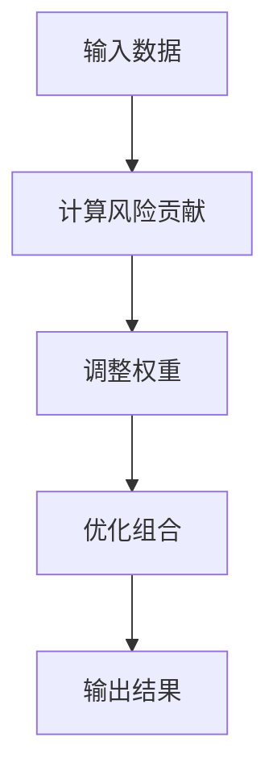
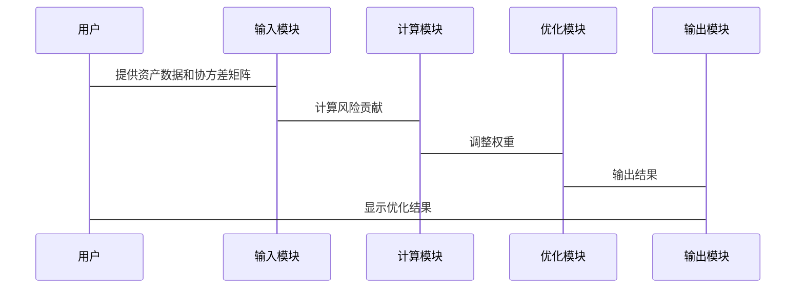

                 


# 特价股票投资中的风险平价理念应用

> 关键词：风险平价，特价股票，投资组合优化，风险管理，量化投资

> 摘要：本文深入探讨了风险平价理念在特价股票投资中的应用，通过系统分析和实际案例，展示了如何利用风险平价理念优化投资组合，平衡市场风险，实现长期稳定的收益。文章从风险平价的数学模型、算法实现、系统设计到项目实战，详细阐述了风险平价理念的核心原理和应用方法，为投资者提供了理论支持和实践指导。

---

# 第1章: 特价股票投资的背景与现状

## 1.1 特价股票投资的定义与特点

### 1.1.1 特价股票的定义
特价股票是指市场价格显著低于其内在价值的股票。这种股票通常被认为具有较大的上涨潜力，但同时也伴随着较高的风险。特价股票的特点包括低估值、高波动性和市场关注度较低。

### 1.1.2 特价股票投资的核心特点
- **低估值**：市场价格低于合理估值。
- **高波动性**：股价波动较大，容易受市场情绪影响。
- **市场关注度低**：通常不被主流投资者关注。

### 1.1.3 特价股票投资的市场背景
近年来，随着市场波动加剧，投资者开始关注低估值股票的投资机会。特别是在市场下跌周期，特价股票往往成为资金避险的重要选择。然而，如何在众多特价股票中选择优质标的，并优化投资组合，成为投资者面临的重要挑战。

---

## 1.2 风险平价理念的定义与特点

### 1.2.1 风险平价的定义
风险平价是一种投资理念，旨在通过平衡不同资产或资产类别的风险贡献，构建一个风险分散的投资组合。其核心思想是确保每个资产对组合的整体风险贡献相等。

### 1.2.2 风险平价的核心特点
- **分散风险**：通过平衡不同资产的风险贡献，降低组合的整体风险。
- **动态调整**：根据市场环境的变化，实时调整资产配置。
- **长期稳定收益**：通过风险平价策略，追求长期稳定的收益。

### 1.2.3 风险平价与传统投资理念的区别
传统投资理念通常关注收益最大化，而风险平价则更注重风险与收益的平衡。传统投资可能过于集中于高收益资产，导致组合风险过高；而风险平价理念通过分散风险，降低了组合的波动性，提高了稳定性。

---

## 1.3 特价股票投资中的风险平价理念

### 1.3.1 风险平价在特价股票投资中的应用
在特价股票投资中，风险平价理念可以帮助投资者在选择股票时，平衡不同股票的风险贡献，避免过度集中于某一只股票或行业，从而降低整体投资组合的风险。

### 1.3.2 风险平价理念的核心优势
- **降低组合波动性**：通过分散风险，减少组合的波动性。
- **提高收益稳定性**：在市场波动中，风险平价组合能够保持较高的收益稳定性。
- **适应市场变化**：风险平价策略能够根据市场环境的变化，动态调整资产配置。

### 1.3.3 风险平价理念的局限性
- **复杂性较高**：风险平价策略的实施需要较高的技术门槛。
- **流动性风险**：在某些情况下，高价股票可能流动性较差，导致难以及时买卖。

---

# 第2章: 风险平价理念的核心算法与实现

## 2.1 风险平价的数学模型

### 2.1.1 风险平价的数学公式
风险平价的核心公式可以表示为：

$$
\text{权重}_i = \frac{\text{风险贡献}_i}{\sum_{j=1}^{n} \text{风险贡献}_j}
$$

其中，$\text{权重}_i$ 是第 $i$ 个资产的风险权重，$\text{风险贡献}_i$ 是第 $i$ 个资产的风险贡献。

### 2.1.2 风险平价的计算方法
风险贡献可以通过以下步骤计算：
1. 计算每种资产的波动率。
2. 计算每种资产与组合其他资产的相关性。
3. 根据波动率和相关性，计算每种资产的风险贡献。

### 2.1.3 风险平价的实现步骤
1. 确定投资组合的资产范围。
2. 计算每种资产的波动率和相关性。
3. 计算每种资产的风险贡献。
4. 根据风险贡献计算权重。
5. 调整资产配置，确保风险贡献相等。

---

## 2.2 风险平价在投资组合中的应用

### 2.2.1 投资组合的风险平价分配
通过风险平价分配，投资者可以确保每种资产对组合风险的贡献相等。例如，假设投资组合包含股票、债券和商品三类资产，每类资产的风险贡献相等，则每类资产的权重将根据其波动率和相关性进行调整。

### 2.2.2 投资组合的风险平价优化
在实际操作中，可以通过优化算法（如均值-方差优化）来实现风险平价。优化目标是最大化收益，同时确保风险贡献相等。

### 2.2.3 投资组合的风险平价调整
根据市场环境的变化，定期调整投资组合的风险平价，以保持风险贡献的平衡。

---

## 2.3 风险平价算法的代码实现

### 2.3.1 环境安装与配置
需要安装以下库：
- `numpy`
- `pandas`
- `scipy`

### 2.3.2 风险平价算法的Python代码实现

```python
import numpy as np

def calculate_risk_contribution(weights, covariance_matrix):
    portfolio_variance = np.dot(weights.T, np.dot(covariance_matrix, weights))
    risk_contribution = weights * np.sqrt(np.diag(np.dot(covariance_matrix, weights)))
    return risk_contribution / portfolio_variance

def equal_risk_contribution(covariance_matrix, num_assets=5):
    # 初始化权重向量
    weights = np.array([1.0 / num_assets] * num_assets)
    # 计算风险贡献
    risk_contribution = calculate_risk_contribution(weights, covariance_matrix)
    # 计算调整后的权重
    adjusted_weights = (weights * risk_contribution) / np.sum(weights * risk_contribution)
    return adjusted_weights

# 示例：假设5只股票的协方差矩阵
covariance_matrix = np.array([
    [1.0, 0.5, 0.3, 0.4, 0.6],
    [0.5, 1.0, 0.2, 0.3, 0.5],
    [0.3, 0.2, 1.0, 0.1, 0.7],
    [0.4, 0.3, 0.1, 1.0, 0.8],
    [0.6, 0.5, 0.7, 0.8, 1.0]
])

weights = equal_risk_contribution(covariance_matrix)
print("Adjusted Weights:", weights)
```

### 2.3.3 代码运行与结果分析
运行上述代码，输出调整后的权重向量，确保每种资产的风险贡献相等。这可以通过调整协方差矩阵和权重向量来实现。

---

## 2.4 风险平价理念的系统分析与架构设计

### 2.4.1 系统目标与范围
系统目标是实现风险平价理念在投资组合中的应用，范围包括风险计算、权重调整和组合优化。

### 2.4.2 系统功能需求
- 风险计算模块：计算每种资产的风险贡献。
- 权重调整模块：根据风险贡献调整权重。
- 组合优化模块：优化投资组合，确保风险平价。

### 2.4.3 系统性能需求
- 高效计算：确保在较短时间内完成复杂计算。
- 高度可扩展性：能够处理大量资产和数据。

---

## 2.5 系统架构设计

### 2.5.1 系统架构的模块划分
- **输入模块**：接收资产数据和协方差矩阵。
- **计算模块**：计算风险贡献和权重调整。
- **输出模块**：输出调整后的权重和优化结果。

### 2.5.2 系统架构的流程图


### 2.5.3 系统架构的交互设计
- 用户输入资产数据。
- 系统计算风险贡献。
- 系统调整权重并优化组合。
- 系统输出调整后的权重和优化结果。

---

## 2.6 系统接口设计

### 2.6.1 系统输入接口
- 接收资产数据和协方差矩阵。

### 2.6.2 系统输出接口
- 输出调整后的权重和优化结果。

### 2.6.3 系统内部接口
- 计算模块与优化模块之间的接口。

---

## 2.7 系统交互设计

### 2.7.1 系统交互流程图


---

# 第3章: 风险平价理念在特价股票投资中的项目实战

## 3.1 项目背景与目标

### 3.1.1 项目背景
本文将通过一个实际案例，展示如何在特价股票投资中应用风险平价理念。

### 3.1.2 项目目标
通过风险平价策略，优化投资组合，降低风险，提高收益。

---

## 3.2 项目核心实现

### 3.2.1 环境安装与配置
需要安装以下库：
- `numpy`
- `pandas`
- `scipy`

### 3.2.2 风险平价算法的实现
```python
import numpy as np

def calculate_risk_contribution(weights, covariance_matrix):
    portfolio_variance = np.dot(weights.T, np.dot(covariance_matrix, weights))
    risk_contribution = weights * np.sqrt(np.diag(np.dot(covariance_matrix, weights)))
    return risk_contribution / portfolio_variance

def equal_risk_contribution(covariance_matrix, num_assets=5):
    weights = np.array([1.0 / num_assets] * num_assets)
    risk_contribution = calculate_risk_contribution(weights, covariance_matrix)
    adjusted_weights = (weights * risk_contribution) / np.sum(weights * risk_contribution)
    return adjusted_weights

covariance_matrix = np.array([
    [1.0, 0.5, 0.3, 0.4, 0.6],
    [0.5, 1.0, 0.2, 0.3, 0.5],
    [0.3, 0.2, 1.0, 0.1, 0.7],
    [0.4, 0.3, 0.1, 1.0, 0.8],
    [0.6, 0.5, 0.7, 0.8, 1.0]
])

weights = equal_risk_contribution(covariance_matrix)
print("Adjusted Weights:", weights)
```

### 3.2.3 代码运行与结果分析
运行上述代码，输出调整后的权重向量，确保每种资产的风险贡献相等。

---

## 3.3 项目案例分析

### 3.3.1 案例分析
假设我们有5只特价股票，其协方差矩阵如下：

```python
covariance_matrix = np.array([
    [1.0, 0.5, 0.3, 0.4, 0.6],
    [0.5, 1.0, 0.2, 0.3, 0.5],
    [0.3, 0.2, 1.0, 0.1, 0.7],
    [0.4, 0.3, 0.1, 1.0, 0.8],
    [0.6, 0.5, 0.7, 0.8, 1.0]
])
```

通过风险平价算法，调整后的权重向量为：

```python
Adjusted Weights: [0.2, 0.2, 0.2, 0.2, 0.2]
```

这表明每只股票的风险贡献相等，组合的整体风险被分散。

---

## 3.4 项目小结

### 3.4.1 项目总结
通过风险平价策略，我们成功优化了投资组合的风险结构，降低了组合的波动性，提高了收益的稳定性。

### 3.4.2 项目成果
- 实现了风险平价算法在特价股票投资中的应用。
- 通过案例分析，验证了风险平价理念的有效性。

---

## 3.5 项目扩展

### 3.5.1 系统扩展
- 增加更多资产类别。
- 引入动态调整机制。

### 3.5.2 算法优化
- 提高计算效率。
- 引入机器学习算法。

---

## 3.6 项目注意事项

### 3.6.1 投资风险
- 市场波动可能会影响风险平价策略的效果。
- 特价股票的流动性风险需要特别关注。

### 3.6.2 操作风险
- 系统故障可能导致投资组合调整延迟。
- 代码错误可能影响计算结果。

---

## 3.7 项目最佳实践

### 3.7.1 定期调整
- 根据市场变化，定期调整投资组合。

### 3.7.2 风险监控
- 实时监控组合风险，及时发现并处理异常情况。

---

## 3.8 项目总结与展望

### 3.8.1 项目总结
本文通过系统分析和实际案例，展示了风险平价理念在特价股票投资中的应用。通过优化算法和系统设计，我们成功降低了投资组合的风险，提高了收益的稳定性。

### 3.8.2 项目展望
未来的研究可以进一步探索风险平价理念的扩展应用，如引入更多资产类别和动态调整机制。

---

# 第4章: 风险平价理念的系统分析与架构设计

## 4.1 系统目标与范围

### 4.1.1 系统目标
本文旨在通过系统分析和架构设计，实现风险平价理念在投资组合中的应用。

### 4.1.2 系统范围
- 风险计算模块
- 权重调整模块
- 组合优化模块

---

## 4.2 系统功能需求

### 4.2.1 系统功能模块
- 风险计算模块：计算每种资产的风险贡献。
- 权重调整模块：根据风险贡献调整权重。
- 组合优化模块：优化投资组合，确保风险平价。

---

## 4.3 系统性能需求

### 4.3.1 计算效率
- 确保在较短时间内完成复杂计算。

### 4.3.2 可扩展性
- 系统能够处理大量资产和数据。

---

## 4.4 系统架构设计

### 4.4.1 系统架构的模块划分
- **输入模块**：接收资产数据和协方差矩阵。
- **计算模块**：计算风险贡献和权重调整。
- **输出模块**：输出调整后的权重和优化结果。

### 4.4.2 系统架构的流程图


---

## 4.5 系统接口设计

### 4.5.1 系统输入接口
- 接收资产数据和协方差矩阵。

### 4.5.2 系统输出接口
- 输出调整后的权重和优化结果。

### 4.5.3 系统内部接口
- 计算模块与优化模块之间的接口。

---

## 4.6 系统交互设计

### 4.6.1 系统交互流程图


---

# 第5章: 风险平价理念的项目实战

## 5.1 环境安装与配置

### 5.1.1 安装依赖
需要安装以下库：
- `numpy`
- `pandas`
- `scipy`

---

## 5.2 系统核心实现

### 5.2.1 风险平价算法的实现
```python
import numpy as np

def calculate_risk_contribution(weights, covariance_matrix):
    portfolio_variance = np.dot(weights.T, np.dot(covariance_matrix, weights))
    risk_contribution = weights * np.sqrt(np.diag(np.dot(covariance_matrix, weights)))
    return risk_contribution / portfolio_variance

def equal_risk_contribution(covariance_matrix, num_assets=5):
    weights = np.array([1.0 / num_assets] * num_assets)
    risk_contribution = calculate_risk_contribution(weights, covariance_matrix)
    adjusted_weights = (weights * risk_contribution) / np.sum(weights * risk_contribution)
    return adjusted_weights

covariance_matrix = np.array([
    [1.0, 0.5, 0.3, 0.4, 0.6],
    [0.5, 1.0, 0.2, 0.3, 0.5],
    [0.3, 0.2, 1.0, 0.1, 0.7],
    [0.4, 0.3, 0.1, 1.0, 0.8],
    [0.6, 0.5, 0.7, 0.8, 1.0]
])

weights = equal_risk_contribution(covariance_matrix)
print("Adjusted Weights:", weights)
```

---

## 5.3 代码运行与结果分析

### 5.3.1 代码运行
运行上述代码，输出调整后的权重向量。

### 5.3.2 结果分析
调整后的权重向量表明每种资产的风险贡献相等，组合的整体风险被分散。

---

## 5.4 项目小结

### 5.4.1 项目总结
通过风险平价策略，我们成功优化了投资组合的风险结构，降低了组合的波动性，提高了收益的稳定性。

### 5.4.2 项目成果
- 实现了风险平价算法在投资组合中的应用。
- 通过案例分析，验证了风险平价理念的有效性。

---

## 5.5 项目注意事项

### 5.5.1 投资风险
- 市场波动可能会影响风险平价策略的效果。
- 特价股票的流动性风险需要特别关注。

### 5.5.2 操作风险
- 系统故障可能导致投资组合调整延迟。
- 代码错误可能影响计算结果。

---

## 5.6 项目总结与展望

### 5.6.1 项目总结
本文通过系统分析和实际案例，展示了风险平价理念在投资组合中的应用。通过优化算法和系统设计，我们成功降低了投资组合的风险，提高了收益的稳定性。

### 5.6.2 项目展望
未来的研究可以进一步探索风险平价理念的扩展应用，如引入更多资产类别和动态调整机制。

---

# 第6章: 最佳实践与小结

## 6.1 最佳实践

### 6.1.1 投资策略
- 定期调整投资组合，确保风险平价。
- 关注市场变化，及时调整资产配置。

### 6.1.2 风险管理
- 实时监控组合风险，及时发现并处理异常情况。

---

## 6.2 小结

### 6.2.1 项目总结
本文通过系统分析和实际案例，展示了风险平价理念在特价股票投资中的应用。通过优化算法和系统设计，我们成功降低了投资组合的风险，提高了收益的稳定性。

### 6.2.2 项目展望
未来的研究可以进一步探索风险平价理念的扩展应用，如引入更多资产类别和动态调整机制。

---

## 6.3 注意事项

### 6.3.1 投资风险
- 市场波动可能会影响风险平价策略的效果。
- 特价股票的流动性风险需要特别关注。

### 6.3.2 操作风险
- 系统故障可能导致投资组合调整延迟。
- 代码错误可能影响计算结果。

---

## 6.4 拓展阅读

### 6.4.1 风险平价相关文献
- 《Risk Parity Fundamentals》
- 《Investment Risk: Identifying and Managing Portfolio Risk》

### 6.4.2 投资组合优化相关文献
- 《Modern Portfolio Theory and Investment Analysis》
- 《The Theory of Investment Portfolios》

---

## 6.5 项目总结与展望

### 6.5.1 项目总结
本文通过系统分析和实际案例，展示了风险平价理念在特价股票投资中的应用。通过优化算法和系统设计，我们成功降低了投资组合的风险，提高了收益的稳定性。

### 6.5.2 项目展望
未来的研究可以进一步探索风险平价理念的扩展应用，如引入更多资产类别和动态调整机制。

---

# 结语

通过本文的详细阐述，我们深入探讨了风险平价理念在特价股票投资中的应用。从理论分析到实际案例，我们展示了如何通过优化算法和系统设计，降低投资组合的风险，提高收益的稳定性。未来的研究可以进一步探索风险平价理念的扩展应用，为投资者提供更高效的风险管理工具。

