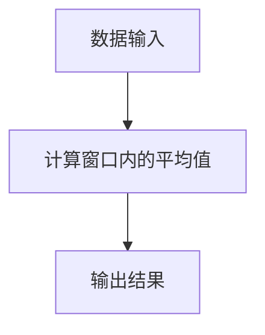
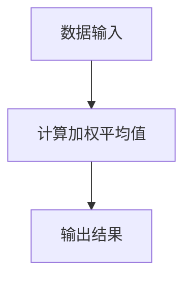
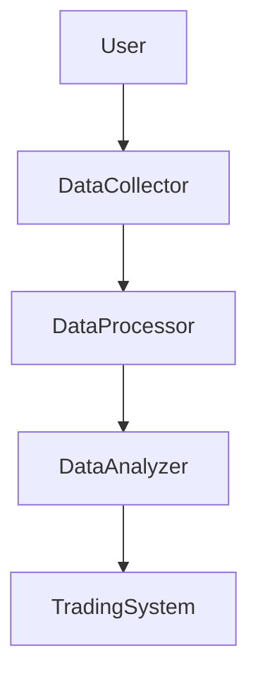

                 


# 特价股票投资中的高频数据分析

## 关键词：高频交易、数据分析、股票投资、机器学习、算法交易

## 摘要：  
本文深入探讨了在特价股票投资中高频数据分析的重要性及其应用。通过分析高频交易的原理、算法交易的策略以及数据处理的技术，本文为投资者提供了一套系统化的解决方案，帮助他们在瞬息万变的股市中捕捉机会、降低风险并实现高效投资。

---

# 第一部分：背景介绍

## 第1章：特价股票与高频交易概述

### 1.1 特价股票的定义与特点
#### 1.1.1 特价股票的定义  
特价股票是指以低于当前市场价买入的股票，通常出现在市场波动较大或公司有特殊情况时。  

#### 1.1.2 特价股票的核心特点  
- 价格优势：买入价低于市场价。  
- 交易风险：可能伴随较高的市场波动风险。  
- 交易机会：短期内可能有较大的价格回升空间。  

#### 1.1.3 特价股票与普通股票的区别  
| 特性       | 特价股票       | 普通股票       |  
|------------|----------------|----------------|  
| 买入价      | 低于市价       | 靠近市价或溢价  |  
| 交易频率    | 较高           | 较低           |  
| 风险        | 较高           | 较低           |  

### 1.2 高频交易的定义与特点
#### 1.2.1 高频交易的定义  
高频交易是指通过计算机算法在极短时间内进行大量交易的策略，通常以 microseconds 为单位完成交易决策。  

#### 1.2.2 高频交易的核心特点  
- 交易速度：毫秒级甚至微秒级的交易执行。  
- 数据依赖：依赖高频数据的实时处理和分析。  
- 算法驱动：基于复杂算法的自动交易策略。  

#### 1.2.3 高频交易与普通交易的区别  
| 特性       | 高频交易       | 普通交易       |  
|------------|----------------|----------------|  
| 交易速度    | 微秒级         | 秒级及以上      |  
| 数据处理    | 实时处理       | 延后处理       |  
| 交易策略    | 算法驱动       | 人工决策为主    |  

### 1.3 特价股票与高频交易的联系
#### 1.3.1 特价股票如何利用高频交易  
- 通过高频数据分析，快速发现市场中的低价股票机会。  
- 利用算法交易，在短时间内完成大量低价股票的买入或卖出。  

#### 1.3.2 高频交易在特价股票中的应用  
- 快速识别市场中的特价股票机会。  
- 自动化执行交易策略，抓住短期价格波动。  

#### 1.3.3 特价股票与高频交易的结合案例  
假设某公司发布重大利好消息，市场反应滞后，高频交易算法可以快速识别并执行买入指令，抓住股价回升的机会。  

### 1.4 高频数据分析的重要性  
#### 1.4.1 高频数据分析的定义  
高频数据分析是指对高频金融数据（如每秒数千条价格数据）进行实时处理、分析和预测的过程。  

#### 1.4.2 高频数据分析在特价股票中的作用  
- 快速识别市场中的特价股票机会。  
- 分析历史数据，预测未来价格走势。  

#### 1.4.3 数据分析对投资决策的影响  
- 数据分析可以帮助投资者发现市场中的异常价格波动。  
- 通过数据分析，投资者可以制定更精准的交易策略。  

---

## 第2章：高频数据分析的核心概念与联系

### 2.1 高频数据分析的原理
#### 2.1.1 数据采集与处理  
高频交易需要实时采集市场数据，包括价格、成交量等，并进行清洗和预处理。  

#### 2.1.2 数据清洗与预处理  
- 去除异常数据点。  
- 补全缺失数据。  
- 标准化数据格式。  

#### 2.1.3 数据特征提取  
从高频数据中提取有用的特征，如均值、方差、波动率等。  

### 2.2 高频数据分析的关键技术
#### 2.2.1 时间序列分析  
时间序列分析用于预测未来价格走势，常用的方法包括ARIMA模型和GARCH模型。  

#### 2.2.2 统计套利  
统计套利是指利用资产价格的统计特性进行套利，常见于高频交易中。  

#### 2.2.3 机器学习在高频数据分析中的应用  
机器学习算法（如随机森林、神经网络）可用于模式识别和预测。  

### 2.3 高频数据分析的核心概念对比  
| 概念       | 描述                       |  
|------------|----------------------------|  
| 时间序列分析 | 基于时间序列数据的预测方法 |  
| 统计套利    | 利用资产价格统计特性进行套利 |  
| 机器学习    | 通过算法学习数据中的模式    |  

---

## 第3章：高频数据分析的算法原理

### 3.1 移动平均数算法
#### 3.1.1 算法原理  
移动平均数算法用于平滑数据，减少噪声干扰。  

#### 3.1.2 算法实现（Python代码示例）  
```python
import pandas as pd

def moving_average(series, window):
    return series.rolling(window).mean()

# 示例数据
data = pd.Series([1, 2, 3, 4, 5])
window = 3
result = moving_average(data, window)
print(result)
```

#### 3.1.3 算法流程图（Mermaid）  


### 3.2 指数加权移动平均数算法
#### 3.2.1 算法原理  
指数加权移动平均数算法对近期数据赋予更高的权重。  

#### 3.2.2 算法实现（Python代码示例）  
```python
import pandas as pd

def exponential_moving_average(series, alpha):
    return series.ewm(alpha=alpha, adjust=False).mean()

# 示例数据
data = pd.Series([1, 2, 3, 4, 5])
alpha = 0.5
result = exponential_moving_average(data, alpha)
print(result)
```

#### 3.2.3 算法流程图（Mermaid）  


### 3.3 机器学习算法在高频数据分析中的应用  
#### 3.3.1 随机森林算法  
随机森林用于分类和回归问题，适用于高频数据中的模式识别。  

#### 3.3.2 神经网络算法  
神经网络可以处理复杂的非线性关系，适用于高频数据的预测任务。  

---

## 第4章：系统分析与架构设计方案

### 4.1 问题场景介绍  
假设我们希望构建一个高频交易系统，用于监控市场中的特价股票机会，并自动执行交易策略。  

### 4.2 系统功能设计  
- 数据采集模块：实时采集市场数据。  
- 数据处理模块：清洗和预处理数据。  
- 数据分析模块：应用算法进行预测。  
- 交易执行模块：根据分析结果执行交易。  

### 4.3 系统架构设计（Mermaid）  


### 4.4 系统接口设计  
- 数据接口：与数据源（如交易所）对接。  
- 交易接口：与交易系统对接。  

### 4.5 系统交互流程（Mermaid）  


---

## 第5章：项目实战

### 5.1 环境安装  
- 安装Python和相关库（如Pandas、NumPy）。  
- 配置数据源接口。  

### 5.2 核心实现（Python代码示例）  
```python
import pandas as pd
import numpy as np

# 示例数据
data = pd.DataFrame({
    'price': [10, 11, 10.5, 12, 11.5],
    'volume': [1000, 900, 1200, 800, 1500]
})

# 数据分析
data['moving_avg'] = data['price'].rolling(3).mean()
data['ema'] = data['price'].ewm(alpha=0.5, adjust=False).mean()

print(data)
```

### 5.3 实际案例分析  
假设某股票价格波动剧烈，通过高频数据分析，识别出一个特价股票机会，并自动执行买入指令。  

### 5.4 项目小结  
通过高频数据分析，投资者可以在特价股票交易中捕捉市场机会，实现高效投资。  

---

## 第6章：最佳实践

### 6.1 小结  
本文详细介绍了高频数据分析在特价股票投资中的应用，包括算法原理、系统设计和实战案例。  

### 6.2 注意事项  
- 高频交易风险较高，需谨慎操作。  
- 数据来源需可靠，避免因数据错误导致损失。  

### 6.3 未来趋势  
随着人工智能的发展，高频数据分析将更加智能化和自动化。  

### 6.4 拓展阅读  
- 《算法交易：基金与技术的完全新结合》  
- 《Python金融数据分析：从入门到精通》  

---

## 总结  
本文通过系统化的分析和实战案例，展示了高频数据分析在特价股票投资中的重要性。希望读者能够通过本文掌握高频数据分析的核心技术，并在实际投资中灵活应用。

