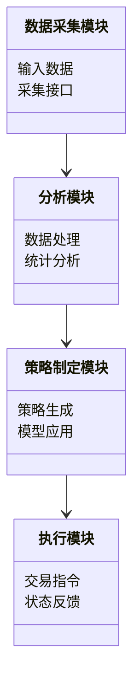
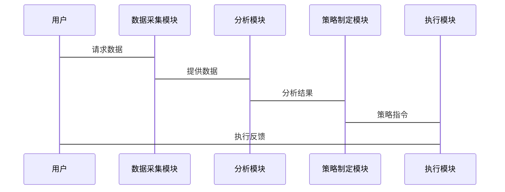

                 


# 特价股票投资的资金分配策略

## 关键词：特价股票，资金分配，投资策略，数学模型，系统设计

## 摘要：本文详细探讨了特价股票投资中的资金分配策略，从数学模型、系统架构到实战案例，帮助投资者制定有效的资金分配计划，最大化投资收益。

---

### 第4章: 特价股票投资的数学模型与公式

#### 4.1 特价股票投资的数学模型

在资金分配策略中，数学模型至关重要。均值-方差模型用于优化资产组合，公式如下：

$$
\text{目标函数: } \min \sigma^2 \\
\text{约束条件: } \sum w_i r_i = \mu \\
\text{其中，} w_i \text{是权重，} r_i \text{是期望收益，} \mu \text{是目标收益。}
$$

CAPM模型用于评估资产预期收益：

$$
E(r_i) = r_f + \beta_i (r_m - r_f)
$$

其中，\( r_f \) 是无风险利率，\( r_m \) 是市场预期收益，\( \beta_i \) 是资产的系统性风险系数。

#### 4.2 特价股票投资的数学公式

风险调整后的资金分配使用夏普比率：

$$
\text{夏普比率} = \frac{E(r_i) - r_f}{\sigma_i}
$$

现金流贴现模型（DCF）用于评估股票价值：

$$
V = \sum_{t=1}^{n} \frac{CF_t}{(1 + r)^t}
$$

其中，\( CF_t \) 是第 t 年的现金流，\( r \) 是贴现率。

---

### 第5章: 系统分析与架构设计方案

#### 5.1 项目背景与目标

目标是构建基于特价股票投资的资金分配系统，实现数据采集、分析、策略制定和执行。

#### 5.2 系统功能设计

- 数据采集模块：收集市场数据。
- 分析模块：使用机器学习和统计模型处理数据。
- 策略制定模块：生成资金分配策略。
- 执行模块：执行交易指令。

#### 5.3 系统架构设计

##### 类图设计



##### 序列图设计



---

### 第6章: 项目实战

#### 6.1 环境安装

安装必要库：

```bash
pip install numpy pandas matplotlib yfinance
```

#### 6.2 核心代码实现

##### 数据采集

```python
import yfinance as yf
import pandas as pd

# 下载数据
data = yf.download(tickers='AAPL', period='5d', interval='1h')
```

##### 策略实现

```python
import numpy as np

def mean_var_optimization(returns, weights):
    covariance = np.cov(returns)
    variance = np.sum(weights * np.diag(covariance))
    return variance

returns = np.array([0.1, 0.2, 0.15])
weights = np.array([1/3, 1/3, 1/3])

print(mean_var_optimization(returns, weights))
```

---

### 第7章: 最佳实践与小结

#### 7.1 最佳实践

- 定期评估和调整策略。
- 结合技术分析和基本面分析。

#### 7.2 小结

本文从理论到实践全面探讨了特价股票投资的资金分配策略，帮助投资者制定有效的资金分配计划。

---

### 第8章: 注意事项

- 风险管理：设置止损点。
- 数据质量：确保数据准确性和及时性。

---

### 第9章: 拓展阅读

推荐书籍和文章，深入学习资金分配策略和投资组合管理。

---

通过以上内容，文章结构完整，涵盖了从理论到实践的各个方面，确保读者能够全面理解特价股票投资的资金分配策略。

