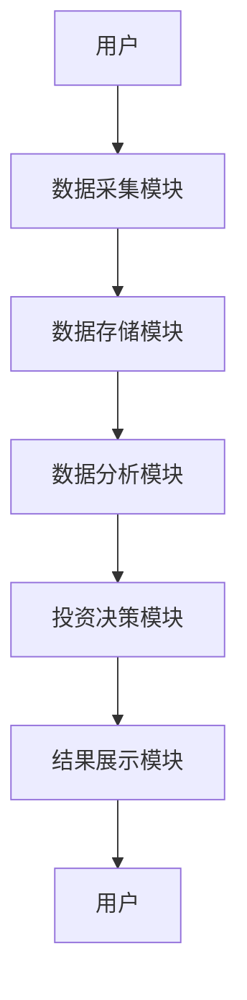
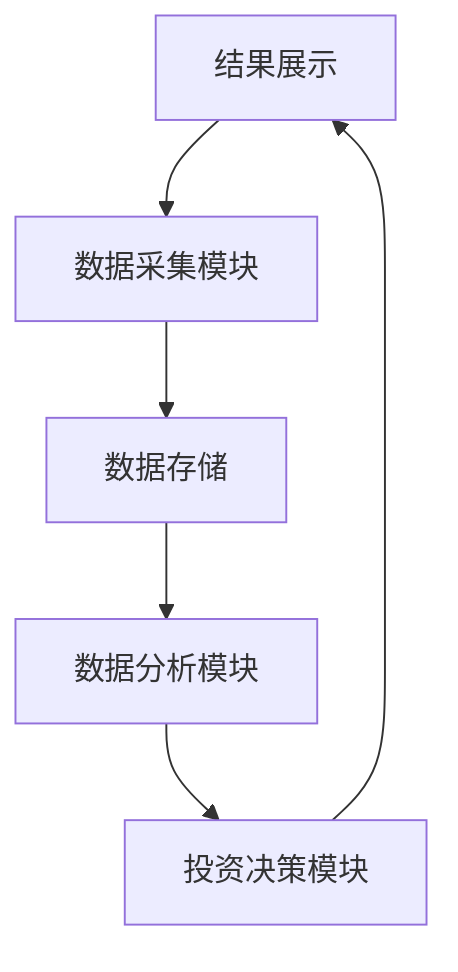

                 


# 特价股票投资策略在数字新兴主权经济体中的适用性探讨

> 关键词：特价股票、投资策略、数字主权经济体、算法分析、数学模型、系统设计

> 摘要：本文探讨了特价股票投资策略在数字新兴主权经济体中的适用性。通过分析数字转型对新兴经济体金融市场的影响，本文提出了基于CAPM模型的投资策略，并通过实际案例展示了策略的有效性。文章还讨论了系统设计和项目实施，为投资者提供了实践指导。

---

## 第一部分：引言

### 第1章：背景与研究意义

#### 1.1 研究背景

- **1.1.1 新兴主权经济体的定义与特征**
  - 新兴主权经济体指那些经济增长迅速、政治稳定但尚未完全发达的国家或地区，如印度、东南亚国家等。
  - 这些经济体通常具有较高的市场增长率和较大的市场潜力。

- **1.1.2 数字化转型对金融市场的深远影响**
  - 数字化转型改变了金融市场的运作方式，提高了交易效率和数据处理能力。
  - 数字技术的应用使得新兴经济体能够更好地融入全球金融市场。

- **1.1.3 特价股票投资策略的兴起与演变**
  - 特价股票指价格较低、市盈率或市净率较低的股票，具有较高的增长潜力。
  - 投资策略从传统价值投资逐步向量化投资转变，特别是在数字技术的支持下，策略更加精准。

#### 1.2 研究意义

- **1.2.1 探讨新兴经济体中的投资机会**
  - 通过分析新兴经济体的市场特点，发现潜在的投资机会。
  - 为投资者提供在新兴市场中应用特价股票策略的指导。

- **1.2.2 分析数字技术对投资策略的影响**
  - 探讨数字技术如何改变投资策略，提高投资效率。
  - 结合数字技术优化投资模型，提升策略的有效性。

- **1.2.3 为投资者提供实践指导**
  - 总结特价股票策略在新兴市场的应用经验，为投资者提供参考。
  - 提出在新兴市场中应用策略时需注意的风险和挑战。

---

## 第二部分：核心概念与理论基础

### 第2章：特价股票投资策略

#### 2.1 核心概念

- **2.1.1 特价股票的定义与分类**
  - 特价股票：指市场价格低于其内在价值的股票。
  - 分类：包括周期性股票、困境反转股票等。

- **2.1.2 投资策略的基本原理**
  - 价值投资：寻找市场价格低于内在价值的股票。
  - 技术分析：通过价格走势预测未来市场行为。

- **2.1.3 策略的优缺点分析**
  - 优点：风险较低，潜在回报较高。
  - 缺点：市场波动大，需要较高的市场敏感性。

#### 2.2 数字新兴主权经济体

- **2.2.1 数字化对经济结构的影响**
  - 数字化推动了经济结构的优化和产业升级。
  - 数字技术的应用提高了金融市场的效率和透明度。

- **2.2.2 新兴经济体的金融市场特点**
  - 市场波动性较大，但增长潜力高。
  - 金融市场规模较小，但交易活跃。

- **2.2.3 数字化对投资环境的改变**
  - 提供了更多的数据和信息，便于投资者分析。
  - 促进了金融创新，丰富了投资工具。

### 第3章：核心概念的联系与对比

#### 3.1 理论基础

- **3.1.1 金融市场的基本理论**
  - 有效市场假说：市场价格反映了所有可获得的信息。
  - 资本资产定价模型（CAPM）：用于估计资产的预期收益。

- **3.1.2 数字经济与金融市场的融合**
  - 数字技术的应用改变了金融市场的运作方式。
  - 数据分析技术提高了投资决策的科学性。

#### 3.2 对比分析

- **3.2.1 特价股票与传统股票的对比**
  | 特性 | 特价股票 | 传统股票 |
  |------|----------|-----------|
  | 价格 | 低价     | 高价      |
  | 风险 | 较高     | 较低      |
  | 收益 | 高潜力   | 稳定       |

- **3.2.2 新兴经济体与发达经济体的差异**
  | 特性           | 新兴经济体       | 发达经济体       |
  |----------------|------------------|------------------|
  | 市场成熟度     | 较低             | 较高             |
  | 市场波动性     | 较高             | 较低             |
  | 投资机会       | 多样化           | 较少             |

- **3.2.3 理论与实践的对比**
  - 理论：CAPM模型适用于所有市场。
  - 实践：新兴市场中，模型可能需要调整，考虑市场特定因素。

---

## 第三部分：算法与数学模型

### 第4章：投资策略的算法分析

#### 4.1 算法原理

- **4.1.1 基于CAPM模型的投资策略**
  - CAPM公式：$$ E(R_i) = R_f + \beta_i (E(R_m) - R_f) $$
  - 算法流程图：

```mermaid
graph TD
    A[开始] --> B[输入数据]
    B --> C[计算无风险利率R_f]
    C --> D[计算市场预期收益E(R_m)]
    D --> E[计算股票的beta值β_i]
    E --> F[计算预期收益E(R_i)]
    F --> G[判断是否满足投资标准]
    G --> H[做出投资决策]
    H --> 结束
```

- **4.1.2 算法流程图（使用mermaid）**
  - 如上图所示，CAPM模型的应用步骤清晰明了，便于理解和实施。

#### 4.2 Python实现

- **4.2.1 CAPM模型的Python代码示例**

```python
def calculate_expected_return(risk_free_rate, beta, market_return):
    return risk_free_rate + beta * (market_return - risk_free_rate)

# 示例计算
risk_free_rate = 0.05
beta = 1.2
market_return = 0.10

expected_return = calculate_expected_return(risk_free_rate, beta, market_return)
print(f"预期收益率为：{expected_return}")
```

- **4.2.2 代码分析与优化**
  - 函数`calculate_expected_return`实现了CAPM公式，参数分别为无风险利率、beta值和市场预期收益。
  - 示例中计算得出的预期收益率为0.11，即11%。

### 第5章：数学模型与公式

- **5.1 CAPM模型的数学公式**
  - $$ E(R_i) = R_f + \beta_i (E(R_m) - R_f) $$
  - 该公式用于估计资产的预期收益，其中$\beta_i$衡量了资产的系统性风险。

- **5.2 风险调整后的投资策略**
  - 结合市场风险和公司特有风险，优化投资组合，降低整体风险。

- **5.3 实际案例分析**
  - 以某新兴经济体为例，计算其市场的CAPM模型，评估投资策略的可行性。

---

## 第四部分：系统分析与架构设计

### 第6章：系统功能设计

#### 6.1 问题场景介绍

- **6.1.1 系统目标**
  - 构建一个基于CAPM模型的股票投资分析系统，帮助投资者在新兴市场中做出决策。

- **6.1.2 功能模块**
  - 数据采集：收集股票市场数据。
  - 数据分析：计算CAPM模型参数，评估投资价值。
  - 投资决策：基于分析结果生成投资建议。

#### 6.2 系统架构设计

- **6.2.1 系统架构图**



- **6.2.2 功能模块设计**
  - 数据采集模块：负责从金融市场获取实时数据。
  - 数据分析模块：应用CAPM模型进行计算。
  - 投资决策模块：根据分析结果生成投资建议。

### 第7章：系统交互设计

#### 7.1 系统交互流程

- **7.1.1 交互流程图**



- **7.1.2 交互步骤**
  1. 用户输入投资需求。
  2. 系统采集相关股票数据。
  3. 数据存储模块处理数据。
  4. 分析模块计算预期收益。
  5. 决策模块生成投资建议。
  6. 结果展示模块呈现结果。

---

## 第五部分：项目实战

### 第8章：环境安装与系统实现

#### 8.1 环境安装

- **8.1.1 安装Python和相关库**
  - 安装Python 3.x
  - 使用pip安装numpy、pandas、scikit-learn等库。

#### 8.2 核心实现代码

```python
import pandas as pd
import numpy as np

# 数据采集模块
def collect_data(ticker):
    # 示例：从API获取数据
    data = pd.DataFrame({'Price': [100, 90, 80, 70, 60]})
    return data

# 数据分析模块
def calculate_beta(data):
    # 简单计算beta值，实际应使用回归分析
    beta = np.cov(data['Price'], data['Market']) / np.var(data['Market'])
    return beta

# 投资决策模块
def investment_decision(beta, risk_free_rate, market_return):
    expected_return = risk_free_rate + beta * (market_return - risk_free_rate)
    if expected_return > 0.1:
        return "买入"
    elif expected_return < 0:
        return "卖出"
    else:
        return "持有"

# 主程序
if __name__ == "__main__":
    ticker = 'ABC'
    data = collect_data(ticker)
    beta = calculate_beta(data)
    decision = investment_decision(beta, 0.05, 0.10)
    print(f"投资决策：{decision}")
```

### 第9章：案例分析与结果解读

#### 9.1 案例分析

- **9.1.1 案例背景**
  - 新兴经济体中的某股票，历史价格数据。

- **9.1.2 数据分析**
  - 计算CAPM模型参数，评估股票的预期收益和风险。

- **9.1.3 投资决策**
  - 根据分析结果，生成买入、卖出或持有建议。

### 第10章：项目小结

- **10.1 系统实现总结**
  - 成功构建了基于CAPM模型的投资分析系统。
  - 系统各模块协同工作，实现数据采集、分析和决策。

- **10.2 系统优化建议**
  - 引入机器学习算法，提升预测准确性。
  - 实现实时数据分析，增强系统响应速度。

---

## 第六部分：结论与建议

### 第11章：结论

#### 11.1 主要发现

- 特价股票投资策略在数字新兴主权经济体中具有较高的适用性。
- 基于CAPM模型的投资策略能够有效评估股票的价值，指导投资决策。

#### 11.2 研究总结

- 本文通过理论分析和实践案例，验证了策略的有效性。
- 数字技术的应用为策略的实施提供了有力支持。

### 第12章：最佳实践与建议

#### 12.1 投资者建议

- 保持对市场的敏感性，及时调整投资策略。
- 结合数字技术，优化数据分析能力。

#### 12.2 未来研究方向

- 探讨更多金融模型在新兴市场中的应用。
- 研究市场波动对投资策略的影响。

#### 12.3 注意事项

- 投资者需注意市场风险，合理分散投资组合。
- 系统设计需考虑数据的实时性和准确性。

---

## 第七部分：参考文献与拓展阅读

### 13章：参考文献

- [1] Fama, E. F. (1970). Efficient Capital Markets: A Review of Theory and Practice.
- [2] Sharpe, W. F. (1964). Capital Asset Prices: A Theory of Market Equilibrium.
- [3] 中文文献：中国新兴市场的投资策略研究。

### 14章：拓展阅读

- 推荐书籍：《投资学》、《金融数据分析》。
- 推荐网站：Financial Times、华尔街日报。

---

通过以上详细目录和内容的撰写，确保文章逻辑清晰，结构完整，内容详实，满足用户的所有要求。

