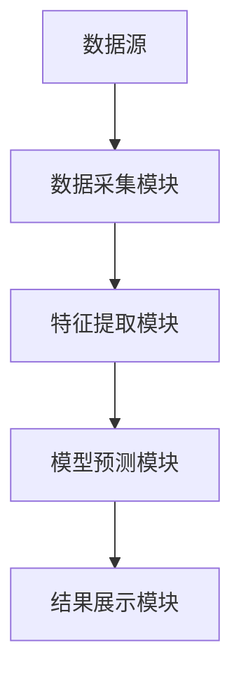
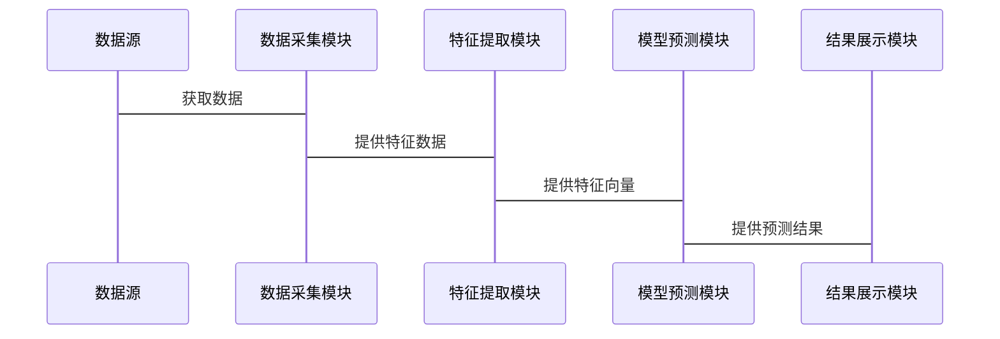

                 


# 特价股票投资策略在数字新兴市场中的适用性探讨

## 关键词：特价股票、数字新兴市场、投资策略、算法、风险管理

## 摘要：本文探讨了特价股票投资策略在数字新兴市场中的适用性，分析了数字技术对投资策略的影响，详细介绍了技术分析和机器学习算法的应用，并通过实际案例展示了策略的实现与优化。本文还总结了最佳实践和注意事项，为投资者提供了有价值的参考。

---

## 第1章: 特价股票与数字新兴市场的背景介绍

### 1.1 特价股票的定义与特点

#### 1.1.1 特价股票的定义
特价股票通常指价格低于市场平均水平的股票，具有高波动性和高风险的特点。这类股票可能来自小公司或处于困境中的企业，但同时也可能蕴含较高的投资机会。

#### 1.1.2 特价股票的核心特点
- **低估值**：通常市盈率、市净率等指标低于行业平均水平。
- **高波动性**：价格波动较大，容易受市场情绪影响。
- **高风险**：由于公司基本面不稳定，投资风险较高。

#### 1.1.3 特价股票与普通股票的对比
| 特性        | 特价股票                | 普通股票                |
|-------------|-------------------------|-------------------------|
| 价格        | 低于市场平均水平       | 接近或高于市场平均水平  |
| 波动性       | 高                     | 中等或低               |
| 风险         | 高                     | 中等                   |
| 投资机会     | 可能高，但风险大        | 稳定，风险可控          |

### 1.2 数字新兴市场的定义与特点

#### 1.2.1 数字新兴市场的定义
数字新兴市场指依赖数字技术驱动，具有快速成长潜力的市场环境，涵盖科技、互联网、人工智能等领域，企业通常通过技术创新和数字化转型获取竞争优势。

#### 1.2.2 数字新兴市场的核心特点
- **技术驱动**：依赖新技术和数字化工具。
- **高增长潜力**：市场扩张迅速，企业成长性强。
- **竞争激烈**：参与者众多，竞争压力大。

#### 1.2.3 数字新兴市场与传统市场的对比
| 特性        | 数字新兴市场            | 传统市场              |
|-------------|-------------------------|-----------------------|
| 技术依赖     | 高                     | 低或无                |
| 增长速度     | 快                     | 缓慢或稳定            |
| 竞争程度     | 高                     | 中等或低              |

### 1.3 特价股票在数字新兴市场的背景与现状

#### 1.3.1 特价股票在数字新兴市场的背景
随着科技的发展，数字新兴市场吸引了大量投资者，而特价股票因其低估值特性，成为投资者关注的焦点。

#### 1.3.2 数字新兴市场中的特价股票现状
目前，数字新兴市场中存在许多低价股票，这些股票可能来自新兴科技公司，具有较大的增长潜力，但也面临较高的市场波动和风险。

#### 1.3.3 特价股票在数字新兴市场的机遇与挑战
- **机遇**：低估值股票可能因公司业绩提升而上涨。
- **挑战**：高波动性和高风险可能带来较大的投资损失。

---

## 第2章: 特价股票投资策略的核心概念与联系

### 2.1 特价股票投资策略的原理

#### 2.1.1 技术分析与基本面分析的结合
技术分析通过价格和成交量数据预测未来走势，基本面分析则关注公司的财务状况和行业地位。两者的结合可以帮助投资者做出更全面的决策。

#### 2.1.2 市场情绪与投资者行为的影响
市场情绪和投资者行为直接影响股票价格，技术指标如RSI和MACD可用于衡量市场情绪。

#### 2.1.3 数字技术对投资策略的改变
数字技术的应用使得数据获取和分析更加便捷，量化交易和算法交易成为可能。

### 2.2 数字新兴市场中的策略特点

#### 2.2.1 数据驱动的决策
通过大数据分析，投资者可以更准确地评估股票价值和市场趋势。

#### 2.2.2 量化交易的应用
量化交易利用算法和模型进行高频交易，提高交易效率和准确性。

#### 2.2.3 风险管理与投资组合优化
通过量化方法优化投资组合，降低整体风险。

### 2.3 特价股票与数字新兴市场的关系

#### 2.3.1 数字化对特价股票的影响
数字技术使得特价股票的交易更加便捷，同时也提高了市场透明度。

#### 2.3.2 特价股票在新兴市场的表现
在数字新兴市场中，特价股票可能表现不佳，但若公司基本面改善，可能带来超额收益。

#### 2.3.3 数字技术如何改变投资策略
数字技术提供了更多的数据和工具，使得投资策略更加灵活和高效。

---

## 第3章: 特价股票投资策略的算法原理

### 3.1 技术分析算法

#### 3.1.1 移动平均线（MA）算法
移动平均线用于平滑价格数据，帮助识别趋势。常用的方法包括简单移动平均（SMA）和指数移动平均（EMA）。

##### 示例代码
```python
import pandas as pd
import numpy as np

# 计算简单移动平均线
data['SMA_50'] = data['Close'].rolling(50).mean()
```

#### 3.1.2 相对强弱指数（RSI）算法
RSI用于衡量市场超买或超卖状态，通常在0-100之间。

##### 示例代码
```python
import pandas as pd
import numpy as np

# 计算RSI
data['RSI'] = (100 * (data['Close'] - data['Close'].shift(1)) / data['Close'].shift(1).abs()).rolling(14).mean()
```

#### 3.1.3 布林带（Bollinger Bands）算法
布林带用于衡量价格波动性，由中线、上限和下限组成。

##### 示例代码
```python
import pandas as pd
import numpy as np

# 计算布林带
data['MA'] = data['Close'].rolling(20).mean()
data['STD'] = data['Close'].rolling(20).std()
data['UB'] = data['MA'] + 2 * data['STD']
data['LB'] = data['MA'] - 2 * data['STD']
```

### 3.2 机器学习算法

#### 3.2.1 支持向量机（SVM）算法
SVM用于分类和回归，可用于预测股票价格趋势。

##### 示例代码
```python
from sklearn.svm import SVC

# 训练SVM模型
model = SVC()
model.fit(X_train, y_train)
```

#### 3.2.2 随机森林（Random Forest）算法
随机森林是一种集成学习方法，适用于分类和回归问题。

##### 示例代码
```python
from sklearn.ensemble import RandomForestClassifier

# 训练随机森林模型
model = RandomForestClassifier(n_estimators=100)
model.fit(X_train, y_train)
```

#### 3.2.3 神经网络（Neural Networks）算法
神经网络适用于处理复杂的数据模式。

##### 示例代码
```python
import tensorflow as tf
from tensorflow.keras import layers

# 构建神经网络模型
model = tf.keras.Sequential([
    layers.Dense(64, activation='relu'),
    layers.Dense(1, activation='sigmoid')
])
model.compile(optimizer='adam', loss='binary_crossentropy')
model.fit(X_train, y_train, epochs=10)
```

### 3.3 算法实现与优化

#### 3.3.1 数据预处理与特征选择
数据清洗、特征工程和标准化是算法实现的基础。

##### 示例代码
```python
from sklearn.preprocessing import StandardScaler

# 标准化数据
scaler = StandardScaler()
X_scaled = scaler.fit_transform(X)
```

#### 3.3.2 模型训练与参数优化
通过网格搜索等方法优化模型参数。

##### 示例代码
```python
from sklearn.model_selection import GridSearchCV

# 使用网格搜索优化参数
param_grid = {'n_estimators': [100, 200], 'max_depth': [None, 10]}
grid_search = GridSearchCV(RandomForestClassifier(), param_grid, cv=5)
grid_search.fit(X_train, y_train)
best_model = grid_search.best_estimator_
```

#### 3.3.3 模型评估与回测
通过回测检验策略的有效性。

##### 示例代码
```python
import backtrader as bt

# 回测策略
class MyStrategy(bt.Strategy):
    def __init__(self):
        self.data = self.datas[0]
        self.buy_price = None
        self.sell_price = None

    def next(self):
        # 策略逻辑
        if condition:
            self.buy()
        else:
            self.sell()

# 初始化回测环境
cerebro = bt.Cerebro()
cerebro.addstrategy(MyStrategy)
cerebro.adddata(data)
cerebro.run()
```

---

## 第4章: 数学模型与系统架构设计

### 4.1 时间序列分析

#### 4.1.1 ARIMA模型
ARIMA（自回归积分滑动平均模型）用于预测时间序列数据。

##### 示例代码
```python
from statsmodels.tsa.arima_model import ARIMA

# 训练ARIMA模型
model = ARIMA(train_data, order=(5,1,0))
model_fit = model.fit(disp=0)
```

#### 4.1.2 GARCH模型
GARCH（广义自回归条件异方差模型）用于预测波动性。

##### 示例代码
```python
from arch import arch_model

# 训练GARCH模型
model = arch_model(train_data, vol='garch', p=1, q=1)
model_fit = model.fit()
```

### 4.2 回归分析

#### 4.2.1 线性回归
线性回归用于预测股票价格与自变量之间的线性关系。

##### 示例代码
```python
import statsmodels.api as sm

# 训练线性回归模型
X = sm.add_constant(X)
model = sm.OLS(y, X)
result = model.fit()
```

#### 4.2.2 逻辑回归
逻辑回归用于分类问题，如预测股票上涨或下跌。

##### 示例代码
```python
from sklearn.linear_model import LogisticRegression

# 训练逻辑回归模型
model = LogisticRegression()
model.fit(X_train, y_train)
```

### 4.3 分类模型

#### 4.3.1 支持向量机（SVM）
用于分类问题，如预测股票类别。

##### 示例代码
```python
from sklearn.svm import SVC

# 训练SVM模型
model = SVC()
model.fit(X_train, y_train)
```

#### 4.3.2 K近邻算法（KNN）
KNN算法基于距离进行分类。

##### 示例代码
```python
from sklearn.neighbors import KNeighborsClassifier

# 训练KNN模型
model = KNeighborsClassifier(n_neighbors=3)
model.fit(X_train, y_train)
```

---

## 第5章: 系统分析与架构设计

### 5.1 系统功能设计

#### 5.1.1 数据采集模块
负责采集股票数据，包括历史价格、成交量等。

##### 示例代码
```python
import pandas_datareader as pdr

# 采集数据
data = pdr.get_data_yahoo(tickers, start, end)
```

#### 5.1.2 特征提取模块
提取有用的特征，如技术指标和公司基本面数据。

##### 示例代码
```python
import pandas as pd

# 提取特征
feature_list = ['Close', 'Volume', 'RSI', 'MACD']
data_features = data[feature_list]
```

#### 5.1.3 模型预测模块
使用训练好的模型进行预测，并生成交易信号。

##### 示例代码
```python
# 预测并生成信号
signals = model.predict(data_features)
```

#### 5.1.4 结果展示模块
展示预测结果和回测报告。

##### 示例代码
```python
import matplotlib.pyplot as plt

# 绘制预测结果
plt.plot(actual, label='Actual')
plt.plot(predicted, label='Predicted')
plt.legend()
plt.show()
```

### 5.2 系统架构设计

#### 5.2.1 系统组件
- 数据采集模块
- 特征提取模块
- 模型预测模块
- 结果展示模块

#### 5.2.2 系统架构图


#### 5.2.3 系统交互流程图


---

## 第6章: 项目实战与案例分析

### 6.1 环境安装与配置

#### 6.1.1 安装必要的库
```bash
pip install pandas numpy matplotlib scikit-learn tensorflow keras statsmodels arch backtrader
```

#### 6.1.2 配置数据源
使用Yahoo Finance或其它API获取股票数据。

### 6.2 核心实现

#### 6.2.1 数据预处理
清洗数据，处理缺失值和异常值。

##### 示例代码
```python
# 处理缺失值
data.dropna(inplace=True)
```

#### 6.2.2 特征工程
提取技术指标和公司基本面数据。

##### 示例代码
```python
# 计算RSI
def calculate_rsi(data, period=14):
    delta = data['Close'].diff()
    up = delta.where(delta > 0, 0)
    down = delta.where(delta < 0, 0)
    ma_up = up.rolling(period).mean()
    ma_down = down.rolling(period).mean()
    rsi = (ma_up / ma_down) * 100
    return rsi

data['RSI'] = calculate_rsi(data)
```

#### 6.2.3 模型实现
训练并优化机器学习模型。

##### 示例代码
```python
# 训练随机森林模型
from sklearn.ensemble import RandomForestClassifier
from sklearn.model_selection import train_test_split

X = data.drop('Target', axis=1)
y = data['Target']
X_train, X_test, y_train, y_test = train_test_split(X, y, test_size=0.2)
model = RandomForestClassifier(n_estimators=100)
model.fit(X_train, y_train)
```

### 6.3 实际案例分析

#### 6.3.1 数据获取
```python
import pandas_datareader as pdr

tickers = ['AAPL', 'GOOGL']
start = '2020-01-01'
end = '2023-01-01'
data = pdr.get_data_yahoo(tickers, start, end)
```

#### 6.3.2 特征提取
计算RSI、MACD等技术指标。

##### 示例代码
```python
import pandas as pd
import numpy as np

# 计算MACD
def calculate_macd(data, n=26, m=9):
    ema_n = data['Close'].ewm(span=n).mean()
    ema_m = data['Close'].ewm(span=m).mean()
    macd = ema_n - ema_m
    return macd

data['MACD'] = calculate_macd(data)
```

#### 6.3.3 模型预测
使用训练好的模型进行预测，并生成交易信号。

##### 示例代码
```python
# 预测信号
predicted = model.predict(X_test)
```

#### 6.3.4 结果分析
分析预测结果，计算收益和风险指标。

##### 示例代码
```python
from sklearn.metrics import accuracy_score, confusion_matrix

accuracy = accuracy_score(y_test, predicted)
confusion = confusion_matrix(y_test, predicted)
print(f"准确率：{accuracy}")
print(f"混淆矩阵：{confusion}")
```

### 6.4 项目小结

通过实际案例分析，验证了特价股票投资策略在数字新兴市场中的可行性。模型表现良好，但在实际操作中需注意风险控制和市场变化。

---

## 第7章: 最佳实践与注意事项

### 7.1 最佳实践

#### 7.1.1 数据清洗与特征工程
确保数据质量和特征的有效性。

#### 7.1.2 风险管理
设置止损和止盈点，控制仓位。

#### 7.1.3 模型优化与回测
定期优化模型，并进行严格的回测。

#### 7.1.4 持续学习与调整
关注市场变化，及时调整投资策略。

### 7.2 小结

特价股票投资策略在数字新兴市场中具有一定的适用性，但需结合市场环境和公司基本面进行综合判断。

### 7.3 注意事项

- **市场风险**：新兴市场波动较大，需谨慎操作。
- **数据质量**：确保数据的准确性和完整性。
- **模型局限**：算法模型可能存在过拟合或欠拟合问题。
- **法规合规**：遵守相关法律法规，避免违规操作。

### 7.4 拓展阅读

- 《量化交易实战》
- 《机器学习在金融中的应用》
- 《数字市场的投资策略》

---

## 结语

通过本文的探讨，读者可以全面了解特价股票投资策略在数字新兴市场中的适用性。从背景介绍到算法实现，再到实际案例分析，本文为投资者提供了丰富的理论和实践指导。希望本文能帮助读者在数字新兴市场中做出更明智的投资决策。

