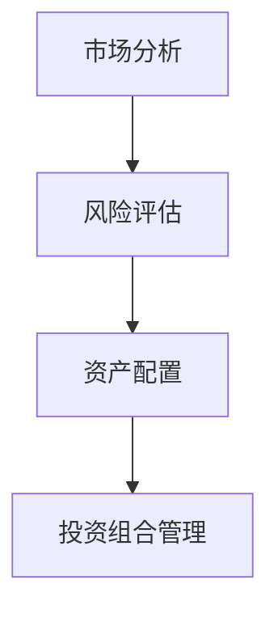
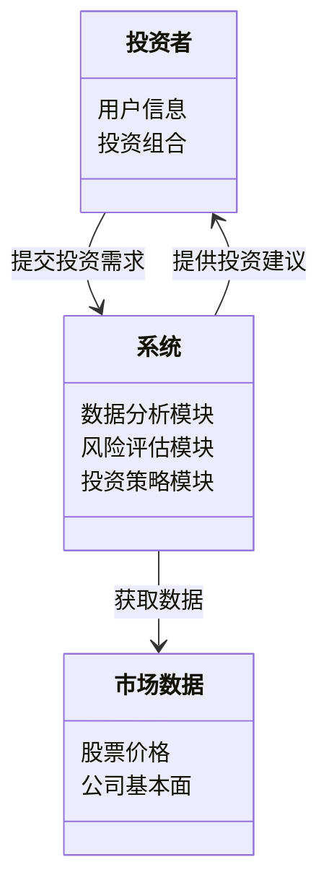
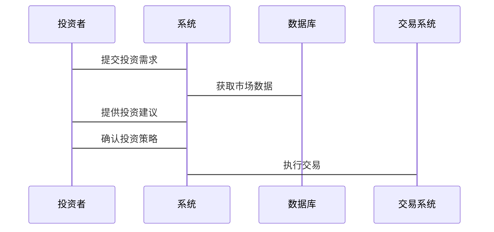

                 


# 特价股票投资策略在数字新兴经济体中的适用性探讨

> 关键词：特价股票，投资策略，数字新兴经济体，经济数字化，风险管理

> 摘要：本文探讨了特价股票在数字新兴经济体中的投资策略的适用性。通过分析数字新兴经济体的市场特点、政策环境和技术驱动因素，本文提出了多种投资策略，并结合数学模型和实际案例，评估了这些策略的有效性和风险。最后，本文提供了优化投资策略的建议和风险管理的策略，为投资者在数字新兴经济体中进行特价股票投资提供了有价值的指导。

---

## 第1章: 特价股票与数字新兴经济体概述

### 1.1 特价股票的基本概念

#### 1.1.1 特价股票的定义
特价股票是指以低于面值的价格发行的股票。这种股票通常用于公司筹集资金或吸引投资者。由于其价格低于面值，特价股票在市场中具有较高的吸引力，尤其是在市场低迷或公司面临短期困境时。

#### 1.1.2 特价股票的特点与分类
特价股票的特点包括低面值、高潜在回报和较高的市场波动性。根据发行目的，特价股票可以分为普通特价股票和附带条件的特价股票（如认股权证附加）。

#### 1.1.3 特价股票的市场定位
特价股票通常在新兴市场或中小企业中较为常见。它们为投资者提供了较高的风险和潜在回报，但也伴随着较高的风险。

### 1.2 数字新兴经济体的定义与特征

#### 1.2.1 数字新兴经济体的概念
数字新兴经济体是指那些在数字化转型中快速发展的新兴国家，如中国、印度、东南亚国家等。这些经济体通过技术创新和数字化改革，推动经济增长和社会进步。

#### 1.2.2 数字新兴经济体的经济特点
数字新兴经济体的特点包括快速经济增长、年轻人口、技术创新和政策支持。这些因素使其成为投资者关注的焦点。

#### 1.2.3 数字新兴经济体的市场结构
数字新兴经济体的市场结构包括多层次资本市场、丰富的金融工具和活跃的投资者。这些市场的特点是波动性高，机会与风险并存。

### 1.3 特价股票与数字新兴经济体的关系

#### 1.3.1 特价股票在数字新兴经济体中的作用
特价股票在数字新兴经济体中起到了重要的融资和投资工具的作用。它们帮助中小企业筹集资金，同时也为投资者提供了高回报的潜在机会。

#### 1.3.2 数字化对特价股票市场的影响
数字化转型使得特价股票的交易更加便捷和透明。技术的进步提高了市场效率，但也增加了市场的波动性和复杂性。

#### 1.3.3 特价股票在数字新兴经济体中的发展现状
随着数字技术的普及，特价股票在数字新兴经济体中的发行和交易量不断增加。这些市场的快速发展为投资者提供了丰富的投资机会。

---

## 第2章: 特价股票投资策略的核心原理

### 2.1 投资策略的基本原理

#### 2.1.1 投资策略的分类
投资策略可以分为价值投资、趋势投资和套利策略等。每种策略都有其独特的特点和适用场景。

#### 2.1.2 投资策略的核心要素
投资策略的核心要素包括市场分析、风险评估、资产配置和投资组合管理。这些要素共同决定了投资策略的成败。

#### 2.1.3 投资策略的数学模型



数学模型可以帮助投资者量化风险和收益。例如，使用CAPM模型评估股票的预期回报：

$$ E(r) = R_f + \beta (R_m - R_f) $$

其中，\( E(r) \) 是预期回报率，\( R_f \) 是无风险利率，\( \beta \) 是贝塔系数，\( R_m \) 是市场预期回报率。

### 2.2 特价股票投资策略的特殊性

#### 2.2.1 特价股票投资的风险与收益
特价股票的风险较高，但潜在回报也较高。投资者需要仔细评估公司的基本面和市场环境。

#### 2.2.2 特价股票投资的市场周期性
特价股票的市场表现受到经济周期的影响。在经济低迷时期，特价股票可能面临更大的风险；在经济复苏时期，特价股票可能有更高的回报。

#### 2.2.3 特价股票投资的策略选择
投资者可以根据市场环境和个人风险偏好选择不同的策略。例如，长期投资者可以选择价值投资，短期投资者可以选择趋势投资。

### 2.3 数字化对投资策略的影响

#### 2.3.1 数字技术对投资策略的改变
数字化技术使得市场数据更加透明和及时，投资者可以更快地做出决策。同时，技术分析工具的普及也改变了投资者的行为方式。

#### 2.3.2 数据驱动的投资策略
数据驱动的投资策略依赖于大量的市场数据和算法。通过分析数据，投资者可以发现市场趋势和潜在机会。

#### 2.3.3 人工智能在投资策略中的应用
人工智能技术可以帮助投资者进行市场预测和风险评估。例如，使用机器学习算法分析市场数据，预测股票价格的变化。

---

## 第3章: 数字新兴经济体中的投资策略分析

### 3.1 数字新兴经济体的市场环境

#### 3.1.1 数字经济的发展现状
数字新兴经济体的经济增长主要依赖于数字化转型。这些国家通过技术创新和数字化改革，推动经济的快速发展。

#### 3.1.2 数字新兴经济体的政策环境
政府政策在数字新兴经济体中起着重要作用。例如，许多国家通过税收优惠和补贴政策鼓励技术创新和数字化发展。

#### 3.1.3 数字新兴经济体的市场参与者
数字新兴经济体的市场参与者包括本地企业和国际投资者。这些参与者共同推动了市场的繁荣和发展。

### 3.2 特价股票在数字新兴经济体中的表现

#### 3.2.1 特价股票的历史表现分析
特价股票的历史表现显示，在数字新兴经济体中，特价股票的回报率较高，尤其是在公司基本面改善的情况下。

#### 3.2.2 数字化对特价股票表现的影响
数字化使得特价股票的交易更加活跃，市场流动性提高。这有助于降低交易成本，提高投资回报。

#### 3.2.3 特价股票在不同数字新兴经济体中的差异
不同数字新兴经济体的市场环境和政策环境不同，导致特价股票的表现也有所不同。例如，中国和印度的市场表现可能差异较大。

### 3.3 投资策略在数字新兴经济体中的适用性

#### 3.3.1 特价股票投资策略的可行性
在数字新兴经济体中，特价股票的投资策略是可行的。投资者可以通过价值投资和趋势投资策略获得较高的回报。

#### 3.3.2 数字化对策略适用性的影响
数字化使得投资策略更加灵活和高效。投资者可以利用技术分析工具和大数据算法优化投资决策。

#### 3.3.3 特价股票投资策略的优化方向
为了提高投资策略的适用性，投资者需要关注市场动态、公司基本面和政策变化。同时，应注重风险管理，避免过度集中投资。

---

## 第4章: 特价股票投资策略的数学模型与算法

### 4.1 投资策略的数学模型

#### 4.1.1 投资回报率的计算公式
$$ \text{投资回报率} = \frac{\text{期末价值} - \text{期初价值}}{\text{期初价值}} \times 100\% $$

#### 4.1.2 风险调整后的回报率
$$ \text{风险调整后回报率} = \text{预期回报率} - \text{风险溢价} $$

### 4.2 技术分析方法

#### 4.2.1 移动平均线（MA）
移动平均线是一种常用的技术分析工具，用于识别市场的趋势。公式为：
$$ MA_n = \frac{1}{n} \sum_{i=1}^{n} P_i $$
其中，\( P_i \) 是第i天的价格，\( n \) 是天数。

#### 4.2.2 相对强弱指数（RSI）
RSI用于衡量市场的超买或超卖状态。公式为：
$$ RSI = \frac{\text{平均上涨幅度}}{\text{平均下跌幅度}} \times 100 $$

---

## 第5章: 系统分析与架构设计方案

### 5.1 问题场景介绍
在数字新兴经济体中，投资者需要面对复杂的市场环境和多变的政策环境。为了优化投资策略，投资者需要构建一个高效的投资管理系统。

### 5.2 项目介绍
本项目旨在设计一个基于数字技术的投资管理系统，帮助投资者优化投资策略，降低风险。

### 5.3 系统功能设计



### 5.4 系统架构设计


### 5.5 系统接口设计
系统接口包括数据接口、用户接口和交易接口。数据接口用于获取市场数据，用户接口用于与投资者交互，交易接口用于执行交易。

### 5.6 系统交互设计



---

## 第6章: 项目实战

### 6.1 环境安装
投资者需要安装数据分析工具（如Python）和交易系统接口。

### 6.2 系统核心实现源代码

```python
def calculate_return(price, period):
    return (price[-1] / price[0]) * 100

def calculate_risk(returns):
    import numpy as np
    return np.std(returns)
```

### 6.3 代码应用解读与分析
上述代码用于计算投资回报率和风险。通过分析股票价格和收益，投资者可以评估投资策略的风险和回报。

### 6.4 实际案例分析
以某数字新兴经济体中的公司为例，分析其股票价格和市场趋势，评估投资策略的可行性。

### 6.5 项目小结
通过实际案例分析，投资者可以更好地理解特价股票的投资策略，并根据市场变化优化投资组合。

---

## 第7章: 总结与展望

### 7.1 总结
本文探讨了特价股票在数字新兴经济体中的投资策略的适用性。通过分析市场环境、政策环境和技术因素，本文提出了多种投资策略，并结合数学模型和实际案例进行了详细分析。

### 7.2 展望
未来，随着数字化技术的进一步发展，特价股票的投资策略将更加多样化和高效。投资者需要关注市场动态和政策变化，优化投资策略，降低风险。

### 7.3 最佳实践 tips
- 投资者应根据市场环境和个人风险偏好选择合适的策略。
- 注重风险管理，避免过度集中投资。
- 关注政策变化和市场趋势，及时调整投资策略。

### 7.4 注意事项
- 特价股票的风险较高，投资者应谨慎决策。
- 投资者应具备一定的市场知识和分析能力。

### 7.5 拓展阅读
推荐阅读相关书籍和文献，深入了解特价股票和数字新兴经济体的投资策略。

---

# 结语
通过本文的探讨，投资者可以更好地理解特价股票在数字新兴经济体中的投资策略，并根据实际情况优化投资组合，实现更高的投资回报。

