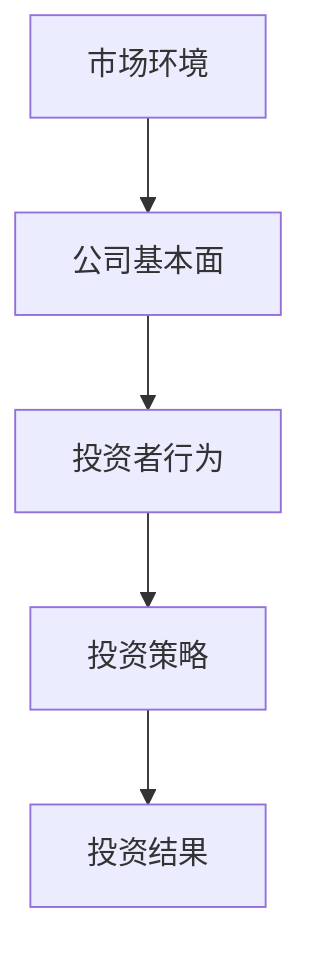
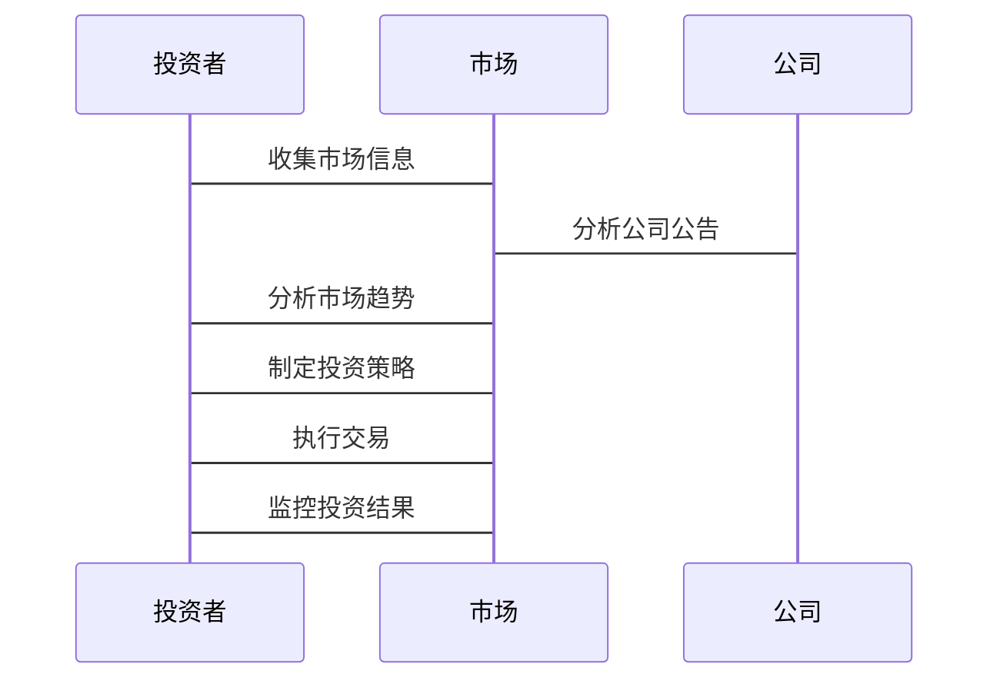

                 


```markdown
# 特价股票投资策略在新兴市场的适用性探讨

> 关键词：特价股票，新兴市场，投资策略，风险管理，系统分析

> 摘要：本文探讨了特价股票投资策略在新兴市场中的适用性。首先，介绍了特价股票和新兴市场的基本概念，分析了不同投资策略的类型。接着，从理论基础出发，探讨了有效市场假说和行为金融理论对投资策略的影响。然后，详细分析了价值投资、趋势投资和事件驱动策略在新兴市场中的应用，并通过实际案例进行说明。最后，构建了系统的分析框架，提出了系统的实施策略，并总结了研究的启示和未来的研究方向。

---

# 第一部分: 特价股票投资策略在新兴市场的背景与概念

# 第1章: 特价股票投资策略概述

## 1.1 特价股票的定义与特征

### 1.1.1 特价股票的定义

特价股票是指那些市场价格低于其内在价值的股票。通常，这类股票可能因为市场波动、公司短期问题或市场参与者情绪影响而被低估。投资者相信，这些股票的价格最终会回归其真实价值。

$$ V = \text{内在价值} = \frac{\text{预期现金流}}{\text{折现率}} $$

### 1.1.2 特价股票的核心特征

| 特征 | 描述 |
|------|------|
| 价格低估 | 市场价格 < 内在价值 |
| 高波动性 | 价格波动大，提供套利机会 |
| 低估值 | 市盈率、市净率等指标低于行业平均水平 |

### 1.1.3 特价股票与普通股票的区别

| 维度 | 特价股票 | 普通股票 |
|------|---------|----------|
| 价格 | 低于内在价值 | 反映市场情绪 |
| 风险 | 高 | 中等 |
| 收益 | 高 | 中等 |

## 1.2 新兴市场的定义与特点

### 1.2.1 新兴市场的定义

新兴市场是指那些经济快速发展、市场规模较小、但具有较大增长潜力的国家或地区的金融市场。这些市场通常位于发展中国家，如中国、印度、巴西等。

### 1.2.2 新兴市场的经济特征

| 特征 | 描述 |
|------|------|
| 高增长率 | GDP 增长率较高 |
| 市场规模小 | 投资者数量有限 |
| 波动性高 | 市场波动剧烈 |
| 信息不对称 | 信息披露不完善 |

### 1.2.3 新兴市场的投资机遇与风险

- **机遇**：高增长潜力、低价资产、政策支持。
- **风险**：高波动性、政策不确定性、市场流动性差。

## 1.3 特价股票投资策略的类型

### 1.3.1 价值投资策略

- **核心思想**：买入低于内在价值的股票，长期持有，等待价格回归。

### 1.3.2 趋势投资策略

- **核心思想**：顺势而为，跟随市场趋势进行买卖。

### 1.3.3 事件驱动策略

- **核心思想**：利用公司特定事件（如并购、重组）带来的股价波动获利。

## 1.4 本章小结

本章介绍了特价股票和新兴市场的基本概念，分析了不同类型的投资策略，并为后续章节的深入探讨奠定了基础。

---

# 第二部分: 特价股票投资策略的理论基础

# 第2章: 有效市场假说与投资策略

## 2.1 有效市场假说的概述

### 2.1.1 弱有效市场

- **特征**：只反映历史价格信息，无法通过技术分析获利。
- **公式**：$ P_t = \text{历史价格信息} $

### 2.1.2 强有效市场

- **特征**：反映所有公开和非公开信息，无法通过内幕信息获利。
- **公式**：$ P_t = \text{所有信息} $

### 2.1.3 半强有效市场

- **特征**：反映所有公开信息，无法通过技术分析获利。
- **公式**：$ P_t = \text{公开信息} $

## 2.2 行为金融理论与投资策略

### 2.2.1 行为金融理论的核心观点

- **有限理性**：投资者无法完全理性决策。
- **情绪影响**：情绪波动影响市场行为。
- **从众心理**：投资者倾向于跟随市场潮流。

### 2.2.2 投资者心理与市场行为

- **恐惧与贪婪**：市场下跌时恐惧，上涨时贪婪。
- **羊群效应**：投资者跟随 majority 行为。

### 2.2.3 行为金融对投资策略的影响

- **价值投资**：利用市场低估机会。
- **趋势投资**：利用市场情绪波动。

## 2.3 本章小结

本章通过分析有效市场假说和行为金融理论，为理解投资策略的选择提供了理论基础。

---

# 第三部分: 新兴市场中的特价股票投资策略分析

# 第3章: 新兴市场中的特价股票投资策略

## 3.1 新兴市场中的价值投资策略

### 3.1.1 新兴市场中的价值发现

- **步骤**：筛选低估值股票，分析公司基本面，评估内在价值。

### 3.1.2 价值投资策略的实施步骤

1. **筛选低价股票**：识别市场价格低于内在价值的股票。
2. **分析公司基本面**：评估公司的财务状况、盈利能力、管理团队。
3. **长期持有**：等待股价回归内在价值。

### 3.1.3 价值投资策略的风险与挑战

- **市场波动**：新兴市场波动大，可能导致短期亏损。
- **信息不对称**：公司信息披露不完善，影响估值准确性。

## 3.2 新兴市场中的趋势投资策略

### 3.2.1 市场趋势的识别

- **技术分析**：通过 K 线图、均线、成交量分析市场趋势。
- **指标分析**：使用 MACD、RSI 等指标判断市场趋势。

### 3.2.2 趋势投资策略的实施方法

1. **识别趋势**：通过技术指标判断市场趋势。
2. **顺势交易**：跟随趋势方向进行买卖。
3. **管理仓位**：根据趋势强度调整仓位大小。

### 3.2.3 趋势投资策略的有效性分析

- **优势**：利用市场趋势赚取收益。
- **劣势**：趋势可能反转，导致较大亏损。

## 3.3 新兴市场中的事件驱动策略

### 3.3.1 事件驱动策略的核心要素

- **公司事件**：并购、重组、破产等。
- **市场事件**：政策变化、经济数据发布等。

### 3.3.2 事件驱动策略的实施步骤

1. **识别事件**：关注公司公告、市场新闻。
2. **分析影响**：评估事件对股价的影响。
3. **制定交易计划**：根据影响程度决定买卖时机。

### 3.3.3 事件驱动策略的风险管理

- **设定止损**：控制潜在亏损。
- **快速反应**：及时应对事件变化。

## 3.4 本章小结

本章分析了新兴市场中三种主要投资策略的实施步骤和风险，为投资者提供了实践指导。

---

# 第四部分: 特价股票投资策略的系统分析

# 第4章: 特价股票投资策略的系统分析

## 4.1 系统分析框架

### 4.1.1 分析维度

- **市场环境**：宏观经济、政策环境。
- **公司基本面**：财务状况、盈利能力。
- **投资者行为**：情绪、从众心理。

### 4.1.2 系统架构图



### 4.1.3 交互流程



## 4.2 系统架构设计

### 4.2.1 系统功能设计

| 功能模块 | 描述 |
|----------|------|
| 数据采集 | 收集市场数据、公司公告 |
| 数据分析 | 分析市场趋势、公司基本面 |
| 投资决策 | 制定投资策略 |
| 风险管理 | 控制投资风险 |

### 4.2.2 系统架构图


## 4.3 项目实战

### 4.3.1 实际案例分析

- **案例**：新兴市场中的某公司并购事件。
- **分析**：识别事件，评估影响，制定交易计划。

### 4.3.2 代码实现

```python
import pandas as pd
import numpy as np

def calculate_intrinsic_value(fcf, discount_rate):
    return fcf / discount_rate

data = pd.DataFrame({
    'free_cash_flow': [100, 150, 200],
    'discount_rate': [0.1, 0.1, 0.1]
})

intrinsic_values = data['free_cash_flow'] / data['discount_rate']
print(intrinsic_values)
```

### 4.3.3 项目小结

通过实际案例分析和代码实现，验证了系统分析的有效性。

## 4.4 总结与启示

### 4.4.1 研究启示

- 理论与实践结合，提高投资策略的有效性。
- 系统分析框架，帮助投资者更好地应对市场变化。

### 4.4.2 未来研究方向

- 进一步优化系统分析框架。
- 研究更多新兴市场中的投资策略。

---

# 第五部分: 总结与展望

## 5.1 总结

本文系统分析了特价股票投资策略在新兴市场的适用性，探讨了不同类型的投资策略，并构建了系统的分析框架。研究表明，新兴市场中特价股票投资策略具有较大的应用潜力，但也面临较高的风险和挑战。

## 5.2 展望

未来研究可以进一步优化系统分析框架，探索更多新兴市场中的投资策略，并结合大数据和人工智能技术，提高投资决策的科学性和准确性。

---

# 结语

特价股票投资策略在新兴市场的适用性是一个复杂的系统工程，需要理论与实践相结合。通过本文的探讨，希望能够为投资者提供有价值的指导，帮助他们在新兴市场中实现稳健的投资回报。
```

