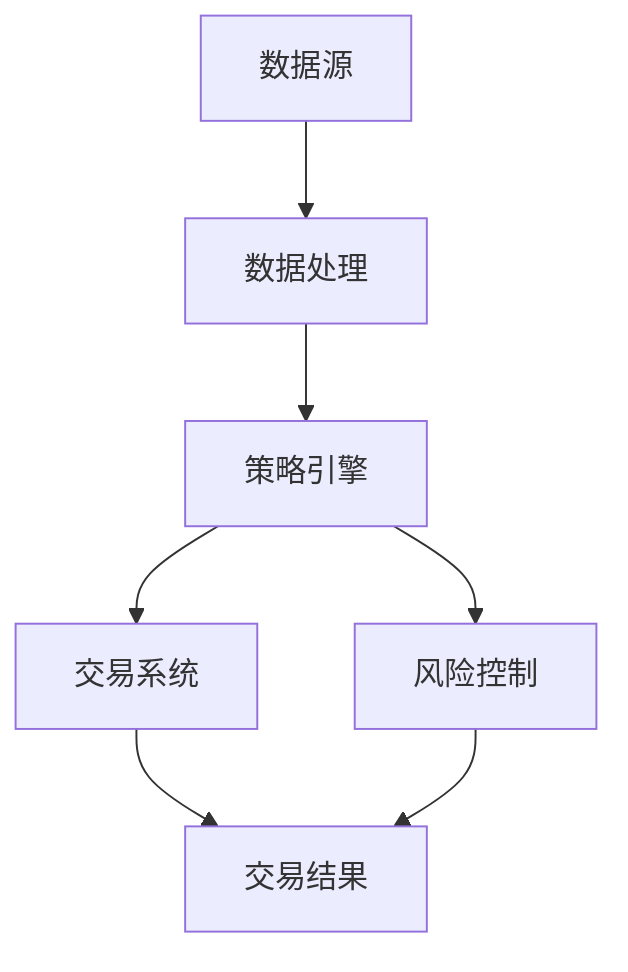
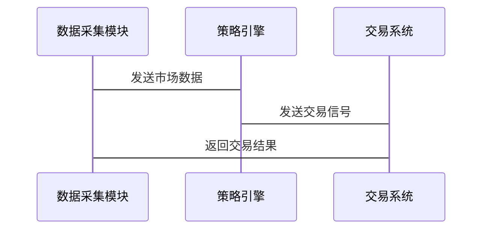

                 


# 特价股票策略在当前市场环境下的适用性

## 关键词：
特价股票策略, 当前市场环境, 适用性分析, 技术分析, 基本面分析, 机器学习, 风险管理

## 摘要：
特价股票策略是一种通过分析市场波动、投资者行为和技术指标来捕捉短期价格波动的交易策略。本文从当前市场环境出发，详细分析特价股票策略的核心概念、算法原理、系统设计、实战案例以及优化建议，探讨其在不同市场条件下的适用性和效果。通过理论与实践相结合的方式，为投资者提供科学的策略选择和风险管理建议。

---

# 第一部分: 特价股票策略的背景与核心概念

## 第1章: 特价股票策略的背景介绍

### 1.1 特价股票策略的定义与特点
#### 1.1.1 特价股票的定义
特价股票策略是一种以短期价格波动为核心目标的交易策略，主要通过技术分析和市场情绪分析，捕捉股票价格在短时间内偏离合理价值的机会。其核心在于利用市场的非理性波动，快速进出市场以获取收益。

#### 1.1.2 特价股票策略的核心特点
- **高频交易**：依赖快速的买卖操作，捕捉微小的价格波动。
- **短期性**：注重短期价格变化，而非长期价值。
- **高风险高收益**：由于波动性高，潜在收益与风险并存。

#### 1.1.3 特价股票策略的边界与外延
- **边界**：适用于市场流动性较高、波动性较大的环境。
- **外延**：结合基本面分析和技术分析，形成多维度策略。

### 1.2 当前市场环境的概述
#### 1.2.1 当前股市的整体环境分析
- 全球经济不确定性增加，市场波动性加剧。
- 技术进步推动量化交易普及，市场参与者多元化。

#### 1.2.2 市场波动性与投资者行为
- 投资者情绪受新闻、政策影响显著。
- 市场波动呈现非线性特征，传统技术分析失效。

#### 1.2.3 特价股票策略的适用场景
- 短期市场波动预测准确的情况下。
- 市场流动性充足，交易成本低的环境。

### 1.3 特价股票策略的核心要素
#### 1.3.1 策略目标与收益来源
- 目标：捕捉短期价格波动，快速获利。
- 收益来源：市场非理性波动和交易机会。

#### 1.3.2 策略实施的关键因素
- 数据获取：高频交易数据的实时性。
- 系统性能：交易系统的速度和稳定性。

#### 1.3.3 策略的优缺点对比
- **优点**：收益潜力大，操作灵活。
- **缺点**：风险高，策略失效风险大。

## 1.4 本章小结
本章通过定义、特点和市场环境的分析，为理解特价股票策略的适用性奠定了基础。下一章将深入探讨其核心理论基础。

---

## 第2章: 特价股票策略的核心理论基础

### 2.1 技术分析与基本面分析的结合
#### 2.1.1 技术分析在特价股票策略中的应用
- 技术指标：如RSI、MACD等，用于判断短期价格趋势。
- 图表形态：如头肩顶、双底等，用于预测价格反转点。

#### 2.1.2 基本面分析对策略的影响
- 公司财务数据：如EPS、ROE等，用于评估长期价值。
- 行业趋势：如政策变化、行业周期对股价的影响。

#### 2.1.3 技术与基本面结合的优势
- 提高策略的准确性：技术分析捕捉短期波动，基本面分析提供长期支撑。
- 减少误判风险：结合两者可以更全面地评估股票价值。

### 2.2 行为金融学对策略的影响
#### 2.2.1 投资者心理与市场情绪
- 羊群效应：投资者跟随市场趋势，导致价格波动加剧。
- 过度自信：投资者倾向于相信自己的判断，忽略市场风险。

#### 2.2.2 行为偏差对策略效果的影响
- 从众心理：导致价格在短期内偏离合理价值。
- 拖延效应：投资者在亏损时倾向于拖延决策，错失止损机会。

#### 2.2.3 如何利用行为金融学优化策略
- 监测市场情绪：通过新闻、社交媒体等数据，预测市场行为。
- 设定止损：避免因情绪波动导致的过度亏损。

### 2.3 大数据分析与机器学习的应用
#### 2.3.1 数据挖掘在特价股票策略中的作用
- 数据清洗：去除噪声数据，提取有效信息。
- 数据建模：使用机器学习模型预测价格波动。

#### 2.3.2 机器学习算法对策略的提升
- 算法选择：如随机森林、神经网络等，用于价格预测。
- 模型优化：通过回测和参数调整，提升预测准确性。

#### 2.3.3 算法优缺点分析
- **优点**：提高预测精度，减少人为干扰。
- **缺点**：模型过拟合风险，数据获取成本高。

### 2.4 本章小结
本章从技术分析、基本面分析和行为金融学的角度，探讨了特价股票策略的理论基础。下一章将分析当前市场环境下策略的适用性。

---

## 第3章: 当前市场环境下特价股票策略的适用性分析

### 3.1 市场波动性对策略的影响
#### 3.1.1 市场波动的周期性分析
- 波动周期：市场波动呈现周期性，投资者需识别周期变化。
- 波动幅度：市场波动加剧时，策略收益增加但风险也上升。

#### 3.1.2 特价股票策略在牛市与熊市中的表现
- 牛市：策略表现较好，但需警惕市场顶部。
- 熊市：策略风险高，需严格控制仓位。

#### 3.1.3 市场波动对策略风险的影响
- 风险放大：波动性高时，策略的收益和风险同步增加。
- 风险控制：通过止损和分散投资降低风险。

### 3.2 投资者行为变化对策略的影响
#### 3.2.1 投资者行为的短期与长期影响
- 短期行为：投资者情绪波动大，影响策略收益。
- 长期行为：投资者理性回归，策略收益下降。

#### 3.2.2 特价股票策略在不同投资者群体中的表现
- 机构投资者：策略收益有限，因机构行为趋于理性。
- 个人投资者：策略收益潜力大，但风险控制能力弱。

#### 3.2.3 行为变化对策略调整的启示
- 灵活调整：根据市场情绪变化，及时调整策略参数。
- 保持冷静：避免因情绪波动导致决策失误。

### 3.3 技术进步对策略的影响
#### 3.3.1 技术进步对策略的影响
- 量化交易普及：策略收益下降，因市场参与者增多。
- 算法优化：通过改进算法，提升策略预测精度。

#### 3.3.2 技术进步对市场结构的影响
- 市场流动性：技术进步提高了市场流动性，降低交易成本。
- 市场深度：算法交易增加了市场深度，但可能导致价格波动加剧。

### 3.4 本章小结
本章分析了市场波动性、投资者行为和技术进步对特价股票策略的影响。下一章将从系统设计角度探讨策略的实现。

---

## 第4章: 特价股票策略的系统分析与架构设计

### 4.1 系统分析与设计
#### 4.1.1 问题场景介绍
- 高频交易环境：系统需支持快速交易和数据处理。
- 多数据源：整合市场数据、新闻数据等多源信息。

#### 4.1.2 系统功能设计
- 数据采集模块：实时采集市场数据。
- 策略引擎：执行策略逻辑，生成交易信号。
- 风险控制模块：监控风险，执行止损。

#### 4.1.3 系统架构设计


#### 4.1.4 系统接口设计
- 数据接口：与数据源对接，获取实时数据。
- 交易接口：与交易系统对接，执行交易指令。

#### 4.1.5 系统交互设计


### 4.2 系统实现细节
#### 4.2.1 核心代码实现
```python
def strategy_logic(data):
    # 数据预处理
    data = preprocess(data)
    # 计算技术指标
    indicators = calculate_indicators(data)
    # 生成交易信号
    signals = generate_signals(indicators)
    return signals

# 数据预处理函数
def preprocess(data):
    # 删除缺失值
    data.dropna(inplace=True)
    return data

# 计算技术指标函数
def calculate_indicators(data):
    # 示例：计算RSI指标
    rsi = ta.RSI(data['close'], period=14)
    return rsi

# 生成交易信号函数
def generate_signals(indicators):
    signals = []
    for i in range(len(indicators)):
        if indicators[i] > 70:
            signals.append('sell')
        elif indicators[i] < 30:
            signals.append('buy')
        else:
            signals.append('hold')
    return signals
```

#### 4.2.2 项目实战案例分析
- 实战案例：使用RSI指标进行策略回测。
- 代码解读：策略逻辑、数据处理和信号生成的实现。
- 案例分析：回测结果、策略表现和风险分析。

### 4.3 本章小结
本章从系统设计和实现角度，详细探讨了特价股票策略的架构和代码实现。下一章将讨论策略的优化与风险管理。

---

## 第5章: 特价股票策略的优化与风险管理

### 5.1 策略优化与调整
#### 5.1.1 策略优化方法
- 参数优化：调整策略参数，如时间周期、指标权重等。
- 策略组合：结合多种策略，降低风险。

#### 5.1.2 参数优化的数学模型
$$
\text{收益最大化} = \sum_{i=1}^{n} (r_i - c_i)
$$
其中，$r_i$为第$i$次交易的收益，$c_i$为交易成本。

#### 5.1.3 策略组合的优化
- 分散投资：降低单一策略的风险。
- 动态调整：根据市场变化，及时调整策略组合。

### 5.2 风险管理与控制
#### 5.2.1 风险管理的重要性
- 风险控制是策略成功的关键，需始终关注。

#### 5.2.2 风险管理的具体措施
- 设置止损：避免单次交易的重大亏损。
- 分散投资：降低策略的整体风险。

#### 5.2.3 压力测试与回测分析
- 回测分析：通过历史数据验证策略的有效性。
- 压力测试：模拟极端市场环境，检验策略的稳定性。

### 5.3 动态调整策略
#### 5.3.1 策略的动态调整
- 根据市场变化，及时调整策略参数。
- 结合市场情绪，优化策略逻辑。

#### 5.3.2 动态调整的实现
- 实时监控：通过系统实时监控市场变化。
- 自动调整：根据设定规则，自动调整策略参数。

### 5.4 本章小结
本章从优化和风险管理的角度，探讨了如何提高策略的稳定性和收益。下一章将展望未来市场环境对策略的影响。

---

## 第6章: 特价股票策略的未来展望

### 6.1 未来市场环境的变化
#### 6.1.1 市场环境的不确定性
- 全球经济波动：地缘政治、经济政策等不确定因素增加。
- 技术进步：人工智能和大数据技术的进一步应用。

### 6.2 技术进步对策略的影响
#### 6.2.1 人工智能的应用
- 更精准的价格预测：通过深度学习模型，提高预测精度。
- 自适应策略：算法自动调整策略参数，适应市场变化。

#### 6.2.2 大数据技术的发展
- 数据来源多样化：整合更多数据源，提高策略的准确性。
- 数据处理能力提升：通过分布式计算，提高数据处理效率。

### 6.3 特价股票策略的演变
#### 6.3.1 策略的多样化
- 结合多种策略：如套利策略、高频交易策略等。
- 多资产配置：从单一股票扩展到多种资产。

#### 6.3.2 策略的智能化
- 自动化交易：通过算法实现无人工干预的交易。
- 智能决策：利用AI技术，优化交易决策。

### 6.4 对投资者的建议
#### 6.4.1 投资者应具备的技能
- 技术分析能力：掌握多种技术指标和图表形态。
- 风险管理能力：具备良好的风险控制意识。

#### 6.4.2 投资者的心理调整
- 保持理性：避免情绪化决策。
- 持续学习：紧跟市场变化和技术进步。

### 6.5 本章小结
本章展望了未来市场环境和技术进步对特价股票策略的影响，为投资者提供了未来的方向和建议。

---

## 附录: 特价股票策略相关工具与数据源

### 附录A: 特价股票策略相关工具
- 数据采集工具：如Yahoo Finance API、Polygon。
- 数据分析工具：如Python的Pandas、NumPy。
- 交易系统：如Interactive Brokers、MetaTrader。

### 附录B: 数据源列表
- 市场数据：Yahoo Finance、Quandl。
- 新闻数据：Google News、Twitter API。
- 公司财报：SEC Edgar、FactSet。

### 附录C: 参考文献
- 文献1：技术分析的经典书籍。
- 文献2：机器学习在金融领域的应用。
- 文献3：行为金融学的研究论文。

---

# 结语

特价股票策略在当前市场环境下的适用性是一个复杂而有趣的话题。通过理论分析、系统设计和实战案例，本文为读者提供了全面的视角。未来，随着技术进步和市场变化，特价股票策略将不断优化，为投资者提供更多的机会和挑战。投资者需具备扎实的技术能力和风险管理能力，才能在市场中立于不败之地。

---

# END

