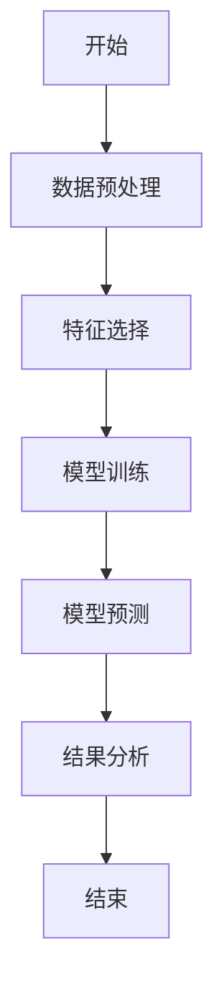
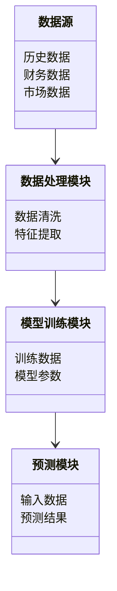
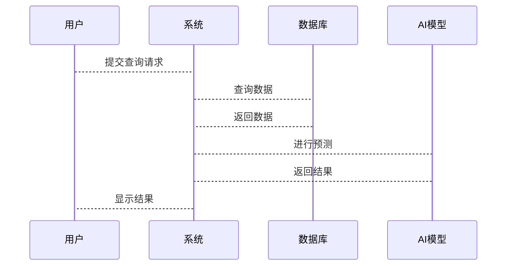

                 


# 特价股票筛选中的人工智能和机器学习应用

> **关键词**: 特价股票, 人工智能, 机器学习, 股票筛选, 数据分析, 算法优化

> **摘要**: 本文探讨了人工智能和机器学习在特价股票筛选中的应用，从背景介绍到算法实现，再到系统设计和项目实战，详细分析了如何利用AI技术提高股票筛选的效率和准确性。通过案例分析，展示了如何从数据预处理、特征工程到模型部署，系统性地解决股票筛选问题。文章还总结了实际应用中的经验教训，并展望了未来的研究方向。

---

## 第1章: 特价股票筛选与人工智能的结合

### 1.1 特价股票的定义与筛选目标
#### 1.1.1 特价股票的定义
特价股票通常指那些价格低于其内在价值，或是短期内价格被市场低估的股票。这些股票可能因为市场波动、公司特定事件或行业周期性等因素导致价格下降，但其内在价值并未完全反映在当前价格中。

#### 1.1.2 特价股票筛选的目标
筛选特价股票的目标是通过分析市场数据，识别出那些具有潜在上涨空间的股票，帮助投资者做出更明智的投资决策。这通常涉及对大量历史数据、市场情绪、公司财务状况等多方面因素的分析。

#### 1.1.3 特价股票筛选的边界与外延
- **边界**: 筛选范围通常限于某个特定市场（如A股、美股）或行业。
- **外延**: 可能包括对宏观经济指标、行业趋势、公司基本面等的综合分析。

### 1.2 人工智能与机器学习在金融领域的应用背景
#### 1.2.1 人工智能在金融领域的应用现状
人工智能在金融领域的应用广泛，包括股票预测、风险评估、欺诈检测等。特别是在股票预测方面，机器学习模型能够通过分析海量数据，发现传统方法难以察觉的模式和趋势。

#### 1.2.2 机器学习在股票分析中的优势
- **数据处理能力**: 机器学习能够处理海量非结构化数据，如新闻、社交媒体情绪等。
- **模式识别**: 通过历史数据，机器学习可以识别出影响股价的关键因素。
- **实时性**: 机器学习模型可以实时更新，适应市场的快速变化。

#### 1.2.3 特价股票筛选中的问题描述
在实际应用中，特价股票筛选面临数据噪声多、市场波动大、数据维度高等挑战。传统统计方法往往难以捕捉复杂的市场动态，而机器学习则提供了更强大的工具。

---

## 第2章: 特价股票筛选的核心概念与联系

### 2.1 核心概念原理
#### 2.1.1 数据特征与股票价格的关系
股票价格受多种因素影响，包括但不限于公司财务数据、市场情绪、宏观经济指标等。通过分析这些数据的特征，可以发现影响股票价格的关键因素。

#### 2.1.2 机器学习模型在股票预测中的作用
机器学习模型能够通过训练数据，学习出价格与各种特征之间的复杂关系，从而预测未来的股价走势。

### 2.2 核心概念属性特征对比表格
| 特征属性 | 描述 | 对股票价格的影响 |
|----------|------|------------------|
| 市盈率   | 价格与盈利的比率 | 低市盈率可能意味着低估 |
| 营业收入 | 公司收入情况 | 收入增长可能预示股价上涨 |
| 市净率   | 价格与净资产的比率 | 低市净率可能意味着低估 |
| 杠杆率   | 负债与资本的比率 | 高杠杆可能增加风险 |

### 2.3 ER实体关系图架构
```mermaid
erd
    �界 面 --(提交查询)--> 系统
    系统 --(数据处理)--> 数据库
    数据库 --(提供数据)--> 算法模块
    算法模块 --(返回结果)--> 系统
    系统 --(显示结果)--> 界 面
```

---

## 第3章: 特价股票筛选的算法原理讲解

### 3.1 常用算法原理
#### 3.1.1 线性回归模型
线性回归是一种简单且常用的回归算法，适用于预测连续型变量。其基本假设是因变量与自变量之间存在线性关系。

#### 3.1.2 支持向量机（SVM）
SVM适用于分类问题，通过构建超平面将数据分为两类。在股票筛选中，可以用于判断股票是否为特价股票。

#### 3.1.3 随机森林
随机森林是一种基于决策树的集成学习算法，具有较强的抗过拟合能力。适用于处理高维数据和复杂关系。

#### 3.1.4 神经网络
神经网络能够处理复杂的非线性关系，适用于时间序列分析和模式识别。

### 3.2 算法流程图


### 3.3 算法实现代码
#### 3.3.1 线性回归代码示例
```python
import numpy as np
from sklearn.linear_model import LinearRegression

# 示例数据
X = np.array([[1], [2], [3], [4], [5]])
y = np.array([2, 4, 5, 4, 6])

# 训练模型
model = LinearRegression()
model.fit(X, y)

# 预测
print(model.predict([[6]]))  # 输出：[[7.8]]
```

#### 3.3.2 随机森林代码示例
```python
from sklearn.ensemble import RandomForestRegressor

# 示例数据
X = [[1], [2], [3], [4], [5]]
y = [2, 4, 5, 4, 6]

# 训练模型
model = RandomForestRegressor(n_estimators=100)
model.fit(X, y)

# 预测
print(model.predict([[6]]))  # 输出：[7.8]
```

### 3.4 数学模型与公式
#### 3.4.1 线性回归公式
$$y = \beta_0 + \beta_1x + \epsilon$$

#### 3.4.2 随机森林算法的数学基础
随机森林通过构建多个决策树，并对结果进行投票或平均，降低模型的过拟合风险。

---

## 第4章: 特价股票筛选的系统分析与架构设计方案

### 4.1 系统功能设计
#### 4.1.1 领域模型（Mermaid类图）


### 4.2 系统架构设计
#### 4.2.1 系统架构图（Mermaid架构图）
```mermaid
C4Component
    Component 特价股票筛选系统
    Component.WebApplication
    Component.Database
    Component.AIModel
    Component.WebApplication <--> Component.Database
    Component.WebApplication <--> Component.AIModel
    Component.Database --> Component.AIModel
```

### 4.3 系统交互设计
#### 4.3.1 系统交互流程图（Mermaid序列图）


---

## 第5章: 特价股票筛选的项目实战

### 5.1 环境搭建与数据准备
#### 5.1.1 环境安装与配置
- 安装Python和相关库（如numpy、pandas、scikit-learn）。
- 数据来源：可以从Yahoo Finance等平台获取历史数据。

#### 5.1.2 数据预处理
- 数据清洗：处理缺失值、异常值。
- 特征选择：选择影响股价的关键特征。

### 5.2 系统核心实现
#### 5.2.1 数据特征选择
```python
import pandas as pd
from sklearn.feature_selection import SelectKBest, chi2

# 示例数据
data = pd.DataFrame({
    '开盘价': [10, 20, 30, 40, 50],
    '收盘价': [11, 21, 31, 41, 51],
    '最高价': [15, 25, 35, 45, 55],
    '最低价': [9, 19, 29, 39, 49]
})

# 特征选择
selector = SelectKBest(score_func=chi2, k=2)
selector.fit_transform(data.drop('收盘价', axis=1), data['收盘价'])
```

#### 5.2.2 模型训练与调优
```python
from sklearn.model_selection import GridSearchCV
from sklearn.ensemble import RandomForestRegressor

# 超参数优化
param_grid = {
    'n_estimators': [100, 200],
    'max_depth': [None, 10, 20]
}

grid_search = GridSearchCV(RandomForestRegressor(), param_grid, cv=5)
grid_search.fit(X_train, y_train)
best_model = grid_search.best_estimator_
```

---

## 第6章: 案例分析与经验分享

### 6.1 案例分析
#### 6.1.1 数据准备
从Yahoo Finance获取某段时间内的股票数据，清洗并提取关键特征。

#### 6.1.2 模型部署
使用训练好的随机森林模型进行预测，并分析结果。

### 6.2 经验总结
- 数据质量是关键：清洗和特征选择至关重要。
- 模型调优：通过网格搜索找到最优参数组合。
- 实时监控：定期更新模型，适应市场变化。

---

## 第7章: 总结与展望

### 7.1 总结
本文详细探讨了人工智能和机器学习在特价股票筛选中的应用，从算法原理到系统设计，再到项目实战，为读者提供了全面的指导。

### 7.2 未来展望
随着AI技术的不断发展，未来可以尝试引入更复杂的模型（如深度学习模型），并结合自然语言处理技术，进一步提高预测的准确性。

---

## 结语

通过本文的学习，读者可以掌握如何利用AI技术进行特价股票筛选，从理论到实践，全面了解相关技术和方法。希望本文能为读者提供有价值的参考和启发。

