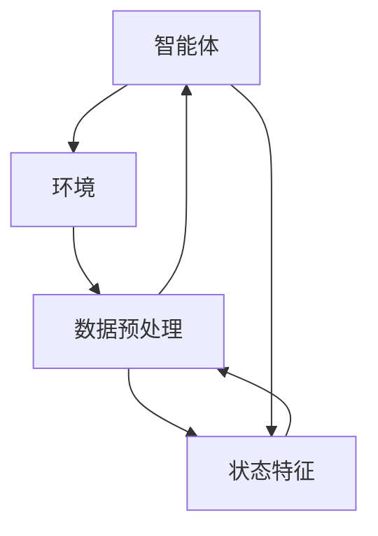

                 


# 特价股票筛选中的强化学习模型应用

## 关键词：强化学习，股票筛选，Q-learning，Deep Q-learning，DQN，DRL

## 摘要：本文详细探讨了如何在特价股票筛选中应用强化学习模型。首先介绍了强化学习的基本概念和股票市场的运作，接着分析了强化学习在股票筛选中的优势和核心要素。然后，深入讲解了Q-learning和Deep Q-learning的算法原理及其数学模型，并通过系统分析与架构设计展示了如何将强化学习应用于股票筛选系统。最后，通过项目实战，提供了具体的代码实现和案例分析，帮助读者更好地理解和应用强化学习模型在特价股票筛选中的实践。

---

# 第一部分: 强化学习与股票筛选的背景介绍

## 第1章: 强化学习的基本概念

### 1.1 强化学习的定义
强化学习（Reinforcement Learning, RL）是一种机器学习范式，通过智能体与环境的交互来学习策略，以最大化累积奖励。与监督学习不同，强化学习不需要标记数据，而是通过试错和奖励机制来优化决策。

### 1.2 股票市场的基本运作
股票市场是金融资产交易的场所，投资者通过买卖股票寻求收益。特价股票通常指价格低于其内在价值的股票，筛选这些股票需要分析多维度的数据和市场趋势。

### 1.3 强化学习在股票筛选中的应用背景
传统股票筛选方法依赖于统计分析和专家经验，但面临数据稀疏性和市场波动性的挑战。强化学习通过模拟市场环境，优化投资策略，为股票筛选提供了新的解决方案。

---

## 第2章: 强化学习的核心概念与联系

### 2.1 强化学习的核心原理
- **状态（State）**：市场当前的状态，如股票价格、成交量等。
- **动作（Action）**：智能体在状态下的决策，如买入、卖出或持有。
- **奖励机制（Reward）**：根据决策的结果给予奖励或惩罚，引导智能体学习最优策略。

### 2.2 强化学习与股票筛选的核心要素
- **特价股票的特征空间**：包括市盈率、市净率、股息率等指标。
- **强化学习模型的输入与输出**：输入是市场数据，输出是投资决策。
- **智能体与市场的交互**：智能体根据当前市场状态做出决策，并获得反馈。

### 2.3 强化学习核心概念对比表
| 概念   | 定义                                                                 |
|--------|----------------------------------------------------------------------|
| 状态   | 当前环境的描述，如股票价格、市场趋势。                                |
| 动作   | 智能体在状态下的决策，如买入或卖出。                                  |
| 奖励   | 对决策结果的反馈，通常是一个数值，用于优化策略。                    |

---

## 第3章: 强化学习算法原理与数学模型

### 3.1 Q-learning算法原理
Q-learning是一种经典的强化学习算法，通过更新Q表来学习最优策略。

#### 3.1.1 Q-learning的基本原理
Q表记录每个状态-动作对的期望奖励，公式如下：
$$ Q(s, a) = Q(s, a) + \alpha (r + \gamma \max Q(s', a') - Q(s, a)) $$

#### 3.1.2 Q-learning的数学模型
状态转移：$s' = f(s, a)$  
奖励函数：$r = g(s, a, s')$  
Q值更新：$Q(s, a) = Q(s, a) + \alpha (r + \gamma \max Q(s', a') - Q(s, a))$

#### 3.1.3 Q-learning的更新流程
1. 接收当前状态$s$。
2. 根据策略选择动作$a$。
3. 执行动作，获得奖励$r$和新状态$s'$。
4. 更新Q表：$Q(s, a) = Q(s, a) + \alpha (r + \gamma \max Q(s', a') - Q(s, a))$。

### 3.2 Deep Q-learning算法原理
Deep Q-learning结合深度神经网络，解决高维状态空间的问题。

#### 3.2.1 Deep Q-learning的基本原理
使用神经网络近似Q值函数，网络结构包括输入层、隐藏层和输出层。

#### 3.2.2 DQN网络结构设计
- 输入层：接收市场数据，如股票价格、成交量等。
- 隐藏层：多个全连接层，提取特征。
- 输出层：输出每个动作的Q值。

#### 3.2.3 DQN的数学模型
目标：最小化预测Q值与实际Q值的误差。  
损失函数：  
$$ \mathcal{L} = \mathbb{E}[(r + \gamma Q_target(s', a') - Q(s, a))^2] $$

---

## 第4章: 强化学习在股票筛选中的系统分析与架构设计

### 4.1 系统分析
- **问题场景**：智能体在股票市场中进行决策，目标是最大化收益。
- **系统目标**：设计一个强化学习模型，用于筛选特价股票。
- **功能需求**：数据采集、状态定义、动作选择、奖励机制设计。

### 4.2 系统功能设计
- **领域模型设计**：股票价格、成交量、市场情绪等状态特征。
- **系统架构设计**：包括数据预处理、智能体、环境和反馈机制。

### 4.3 系统架构图


### 4.4 接口设计与交互流程
- **接口设计**：智能体与环境通过API交互。
- **交互流程**：智能体接收状态，选择动作，执行动作，获得反馈。

---

## 第5章: 项目实战

### 5.1 环境安装
安装Python、TensorFlow和Keras等依赖库。

### 5.2 核心实现代码
```python
import numpy as np
import tensorflow as tf

class DQN:
    def __init__(self, state_space, action_space):
        self.state_space = state_space
        self.action_space = action_space
        self.model = self.build_model()
    
    def build_model(self):
        model = tf.keras.Sequential([
            tf.keras.layers.Dense(64, activation='relu', input_dim=self.state_space),
            tf.keras.layers.Dense(64, activation='relu'),
            tf.keras.layers.Dense(self.action_space, activation='linear')
        ])
        model.compile(optimizer=tf.keras.optimizers.Adam(learning_rate=0.001), loss='mse')
        return model
    
    def act(self, state):
        state = np.array(state)
        prediction = self.model.predict(state.reshape(1, -1))
        return np.argmax(prediction[0])
    
    def train(self, state, action, reward, next_state):
        state = np.array(state)
        next_state = np.array(next_state)
        target = self.model.predict(state.reshape(1, -1))[0]
        next_target = self.model.predict(next_state.reshape(1, -1))[0]
        target[action] = reward + 0.95 * np.max(next_target)
        self.model.fit(state.reshape(1, -1), target.reshape(1, -1), epochs=1, verbose=0)
```

### 5.3 案例分析
通过训练DQN模型，智能体能够识别特价股票的特征，优化投资策略，提高收益。

---

## 第6章: 总结与展望

### 6.1 总结
本文详细探讨了强化学习在特价股票筛选中的应用，从算法原理到系统设计，再到项目实现，为读者提供了全面的指导。

### 6.2 展望
未来的研究方向包括多智能体协作、实时数据处理和模型优化。强化学习将在金融领域发挥更大作用。

---

通过本文的学习，读者可以深入了解强化学习在股票筛选中的应用，并掌握实际的代码实现方法。希望本文能为相关领域的研究和实践提供有价值的参考。

