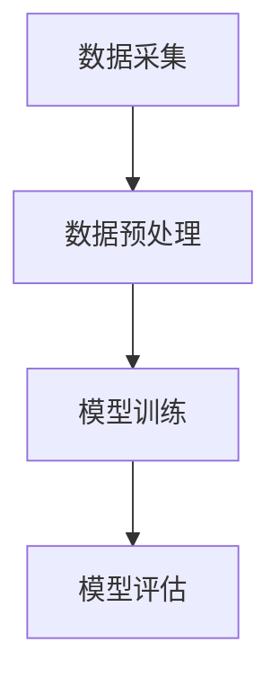
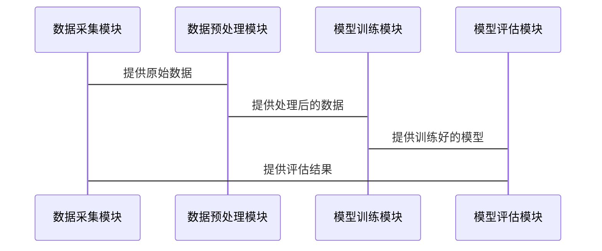
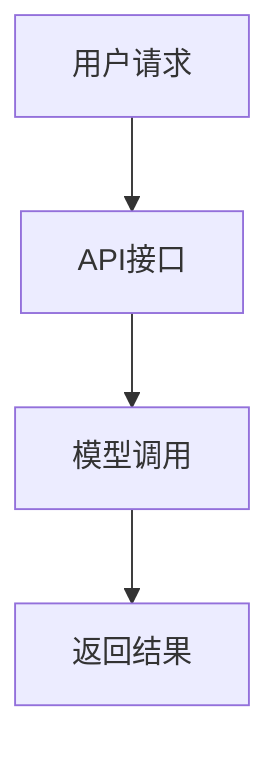

                 


# 特价股票筛选中的深度学习模型应用

> 关键词：深度学习，股票筛选，LSTM，CNN，数据特征

> 摘要：本文深入探讨了深度学习模型在特价股票筛选中的应用，从基础概念到算法原理，再到系统设计和实战案例，全面分析了如何利用深度学习技术提高股票筛选的准确性和效率。文章内容涵盖了深度学习的核心算法、股票数据特征分析、模型构建与优化、系统架构设计以及实际项目案例，旨在为读者提供一个完整的解决方案，帮助他们在金融领域中更好地应用深度学习技术。

---

## 第1章: 特价股票与深度学习概述

### 1.1 特价股票的定义与特征

#### 1.1.1 特价股票的定义
特价股票是指市场价格低于其内在价值的股票，通常被视为被市场低估的投资机会。这类股票往往具有较高的潜在回报率，但同时也伴随着较高的风险。

#### 1.1.2 特价股票的特征
- **低估值**：市盈率、市净率等指标低于行业平均水平。
- **高分红**：部分特价股票公司倾向于高分红，吸引价值投资者。
- **行业龙头**：通常为行业内的龙头企业，具有较强的抗风险能力。

#### 1.1.3 特价股票的筛选标准
- **基本面分析**：包括盈利能力、成长性、财务健康状况等。
- **技术分析**：通过K线图、成交量等技术指标判断股票走势。
- **市场情绪分析**：利用市场情绪指标（如恐慌指数）辅助判断。

### 1.2 深度学习的定义与特点

#### 1.2.1 深度学习的定义
深度学习是一种人工智能技术，通过构建多层神经网络模型，自动提取数据中的特征，并进行分类、回归等任务。

#### 1.2.2 深度学习的核心特点
- **非线性特征提取**：能够捕捉数据中的非线性关系。
- **自动特征工程**：通过神经网络自动提取特征，减少人工干预。
- **高维度数据处理**：适用于高维数据，如图像、文本、时间序列等。

#### 1.2.3 深度学习与传统机器学习的区别
| 特性                | 深度学习               | 传统机器学习           |
|---------------------|-----------------------|------------------------|
| 特征工程            | 自动提取特征           | 需要手动提取特征         |
| 模型复杂度          | 高维、复杂模型          | 低维、简单模型          |
| 数据需求            | 需要大量数据            | 数据量较小即可          |
| 运算能力            | 对硬件要求较高          | 对硬件要求较低          |

### 1.3 特价股票筛选中的深度学习应用背景

#### 1.3.1 传统股票筛选方法的局限性
- **人工筛选耗时耗力**：依赖经验和手动分析，效率低。
- **市场变化难以预测**：传统模型难以捕捉复杂市场变化。
- **数据维度不足**：传统方法通常只考虑部分财务指标，忽略了其他重要因素。

#### 1.3.2 深度学习在金融领域的优势
- **强大的非线性特征提取能力**：能够捕捉传统方法难以发现的市场规律。
- **自动化特征工程**：减少人工干预，提高筛选效率。
- **处理高维数据**：能够充分利用多维度数据，如历史价格、新闻情绪、社交媒体数据等。

#### 1.3.3 特价股票筛选中的深度学习应用前景
随着深度学习技术的不断发展，其在金融领域的应用前景广阔。通过深度学习模型，投资者可以更精准地发现被低估的股票，提高投资收益。

---

## 第2章: 特价股票筛选的核心概念与联系

### 2.1 特价股票筛选的核心概念

#### 2.1.1 特价股票的市场特征
- **低估值**：市盈率（P/E）和市净率（P/B）低于行业平均水平。
- **高股息率**：股息收益率较高，吸引价值投资者。
- **行业龙头**：通常是行业内具有较强竞争优势的公司。

#### 2.1.2 深度学习模型的输入特征
- **时间序列数据**：股票的历史价格、成交量等。
- **文本数据**：公司公告、新闻、社交媒体等。
- **财务数据**：收入、利润、资产负债表等。

#### 2.1.3 模型输出的决策依据
- **预测股价**：模型预测未来一段时间内的股价走势。
- **股票评级**：根据模型输出，将股票分为“买入”、“持有”、“卖出”等评级。
- **筛选结果**：根据模型输出，筛选出符合特价股票条件的股票列表。

### 2.2 深度学习模型与股票数据的关系

#### 2.2.1 数据特征分析
股票数据通常具有以下特征：
- **时序性**：股票价格具有时间序列特性。
- **波动性**：股票价格波动较大，受多种因素影响。
- **相关性**：不同股票之间的价格可能具有相关性。

#### 2.2.2 数据的时序特性
股票价格的时间序列特性可以通过以下方式建模：
- **LSTM网络**：适合处理时间序列数据，能够捕捉长期依赖关系。
- **ARIMA模型**：传统时间序列分析方法，适用于平稳时间序列。

#### 2.2.3 数据的多维度特征
股票数据通常涉及多个维度，包括：
- **价格数据**：开盘价、收盘价、最高价、最低价。
- **成交量数据**：成交额、换手率。
- **财务数据**：收入、利润、每股收益（EPS）。
- **文本数据**：公司公告、新闻、社交媒体情绪。

### 2.3 深度学习模型的核心要素

#### 2.3.1 神经网络结构
- **输入层**：接收股票数据。
- **隐藏层**：提取数据特征。
- **输出层**：生成预测结果。

#### 2.3.2 损失函数与优化器
- **损失函数**：衡量模型输出与真实值的差异，如均方误差（MSE）、交叉熵损失。
- **优化器**：用于优化模型参数，如随机梯度下降（SGD）、Adam优化器。

#### 2.3.3 模型训练与评估
- **训练数据**：用于模型训练。
- **验证数据**：用于模型验证，防止过拟合。
- **测试数据**：用于模型评估，衡量模型的泛化能力。

---

## 第3章: 深度学习模型在特价股票筛选中的算法原理

### 3.1 常见深度学习算法简介

#### 3.1.1 RNN与LSTM
- **RNN**：循环神经网络，适用于处理序列数据。
- **LSTM**：长短期记忆网络，能够捕捉长期依赖关系，适合处理股票时间序列数据。

#### 3.1.2 CNN
- **卷积神经网络**，适用于处理图像数据，但在金融时间序列分析中也有应用。

#### 3.1.3 Transformer
- **基于自注意力机制**，适用于处理序列数据，已被成功应用于自然语言处理领域。

### 3.2 LSTM在股票时间序列预测中的应用

#### 3.2.1 LSTM的基本原理
LSTM通过引入记忆单元（Cell）和遗忘门（Forget Gate）来捕捉长期依赖关系。其核心公式如下：

$$
f_{t} = \sigma(W_f x_t + U_f h_{t-1} + b_f)
$$

$$
i_{t} = \sigma(W_i x_t + U_i h_{t-1} + b_i)
$$

$$
o_{t} = \sigma(W_o x_t + U_o h_{t-1} + b_o)
$$

$$
c_{t} = f_{t} \cdot c_{t-1} + i_{t} \cdot tanh(W_c x_t + U_c h_{t-1} + b_c)
$$

$$
h_{t} = o_{t} \cdot tanh(c_{t})
$$

其中，$f_t$、$i_t$、$o_t$分别为遗忘门、输入门和输出门，$c_t$为记忆单元，$h_t$为隐藏层输出。

#### 3.2.2 LSTM在股票价格预测中的优势
- **捕捉长期依赖关系**：LSTM能够捕捉股票价格的长期趋势。
- **处理非平稳时间序列**：LSTM适用于处理非平稳时间序列数据。

#### 3.2.3 LSTM的训练与调参
- **模型训练**：使用历史股票价格数据训练LSTM模型。
- **参数调优**：通过网格搜索或随机搜索优化模型参数，如学习率、批量大小等。

### 3.3 深度学习模型的数学基础

#### 3.3.1 神经网络的数学模型
神经网络的基本单位是神经元，其输出为：

$$
y = \sigma(W x + b)
$$

其中，$W$为权重矩阵，$b$为偏置项，$\sigma$为激活函数。

#### 3.3.2 损失函数与优化算法
- **均方误差（MSE）**：

$$
L = \frac{1}{N} \sum_{i=1}^{N} (y_i - \hat{y}_i)^2
$$

- **交叉熵损失**：

$$
L = -\frac{1}{N} \sum_{i=1}^{N} y_i \log(\hat{y}_i) + (1 - y_i) \log(1 - \hat{y}_i)
$$

- **优化算法**：随机梯度下降（SGD）和Adam优化器。

#### 3.3.3 深度学习中的梯度下降
梯度下降是一种优化算法，通过计算损失函数对模型参数的梯度，更新参数以最小化损失函数。其基本公式为：

$$
\theta := \theta - \eta \frac{\partial L}{\partial \theta}
$$

其中，$\theta$为模型参数，$\eta$为学习率。

---

## 第4章: 深度学习模型的系统分析与架构设计

### 4.1 系统功能设计

#### 4.1.1 数据采集模块
- **数据来源**：从股票交易数据源（如Yahoo Finance、API接口）获取历史价格、成交量等数据。
- **数据预处理**：清洗数据，处理缺失值、异常值等。

#### 4.1.2 数据预处理模块
- **标准化**：对数据进行标准化处理，使其具有相同的尺度。
- **特征提取**：提取有用特征，如移动平均线（MA）、相对强弱指数（RSI）等。

#### 4.1.3 模型训练
- **数据分割**：将数据分为训练集、验证集和测试集。
- **模型训练**：使用训练数据训练深度学习模型。
- **模型评估**：通过验证集和测试集评估模型性能。

### 4.2 系统架构设计

#### 4.2.1 系统功能模块
- **数据采集模块**：负责数据的获取和预处理。
- **模型训练模块**：负责模型的训练和优化。
- **模型评估模块**：负责模型的性能评估。

#### 4.2.2 系统架构图



#### 4.2.3 系统交互流程



---

## 第5章: 项目实战

### 5.1 项目介绍

#### 5.1.1 项目背景
本项目旨在利用深度学习技术，筛选出具有投资价值的特价股票。

#### 5.1.2 项目目标
- 建立一个基于LSTM的股票价格预测模型。
- 根据模型输出结果，筛选出被低估的股票。

### 5.2 核心实现

#### 5.2.1 环境安装
- **Python**：3.6+
- **深度学习框架**：TensorFlow或Keras
- **数据处理库**：Pandas、NumPy
- **可视化库**：Matplotlib、Seaborn

#### 5.2.2 数据获取与预处理
- 使用Yahoo Finance API获取股票历史数据。
- 对数据进行清洗和标准化处理。

#### 5.2.3 模型实现

##### LSTM模型实现

```python
import numpy as np
from tensorflow.keras.models import Sequential
from tensorflow.keras.layers import LSTM, Dense, Dropout

model = Sequential()
model.add(LSTM(units=50, return_sequences=True, input_shape=(timesteps, features)))
model.add(Dropout(0.2))
model.add(LSTM(units=50, return_sequences=False))
model.add(Dense(1))
model.compile(loss='mean_squared_error', optimizer='adam')
```

##### 模型训练

```python
model.fit(X_train, y_train, epochs=100, batch_size=32, validation_split=0.2)
```

#### 5.2.4 模型评估

```python
train_loss = model.history.history['loss']
val_loss = model.history.history['val_loss']
plt.plot(train_loss, label='Training Loss')
plt.plot(val_loss, label='Validation Loss')
plt.xlabel('Epochs')
plt.ylabel('Loss')
plt.legend()
plt.show()
```

### 5.3 案例分析

#### 5.3.1 数据来源
以某只股票的历史价格数据为例，数据包括开盘价、收盘价、最高价、最低价和成交量。

#### 5.3.2 模型预测

```python
predicted_price = model.predict(X_test)
actual_price = y_test
plt.plot(predicted_price, label='Predicted Price')
plt.plot(actual_price, label='Actual Price')
plt.xlabel('Time Steps')
plt.ylabel('Price')
plt.legend()
plt.show()
```

#### 5.3.3 特价股票筛选
根据模型预测结果，筛选出被低估的股票，并输出筛选结果。

### 5.4 项目小结
通过本项目，我们成功实现了基于LSTM的股票价格预测模型，并利用模型输出结果筛选出具有投资价值的特价股票。这为投资者提供了有力的决策支持。

---

## 第6章: 模型优化与部署

### 6.1 模型优化

#### 6.1.1 超参数调优
- **学习率**：使用Adam优化器，调整学习率。
- **批量大小**：调整批量大小，优化训练效率。
- **网络结构**：增加或减少网络层数，优化模型性能。

#### 6.1.2 模型融合
- **多模型融合**：结合不同模型的预测结果，提高预测准确性。
- **特征融合**：利用多种特征，如技术指标、情绪分析等，提高模型性能。

### 6.2 模型部署

#### 6.2.1 部署方案
- **API接口**：将模型封装成API接口，供其他系统调用。
- **Web界面**：开发一个Web界面，供用户查询股票预测结果。

#### 6.2.2 部署流程



---

## 第7章: 总结与展望

### 7.1 总结
本文详细探讨了深度学习模型在特价股票筛选中的应用，从基础概念到算法原理，再到系统设计和实战案例，全面分析了如何利用深度学习技术提高股票筛选的准确性和效率。

### 7.2 展望
随着深度学习技术的不断发展，其在金融领域的应用前景广阔。未来，可以通过以下方式进一步优化模型：
- **多模态数据融合**：结合文本、图像等多种数据源，提高模型预测能力。
- **强化学习应用**：将强化学习应用于股票交易策略，实现自动化的交易决策。
- **实时预测**：开发实时预测系统，提供动态的股票筛选服务。

### 7.3 最佳实践 Tips
- **数据质量**：确保数据来源可靠，数据预处理到位。
- **模型选择**：根据具体问题选择合适的模型，如时间序列数据选择LSTM。
- **风险控制**：在实际投资中，结合技术分析和基本面分析，降低投资风险。

---

通过本文的学习，读者可以深入了解深度学习在特价股票筛选中的应用，掌握从模型构建到实际部署的全过程，为金融领域的深度学习应用提供有价值的参考。

