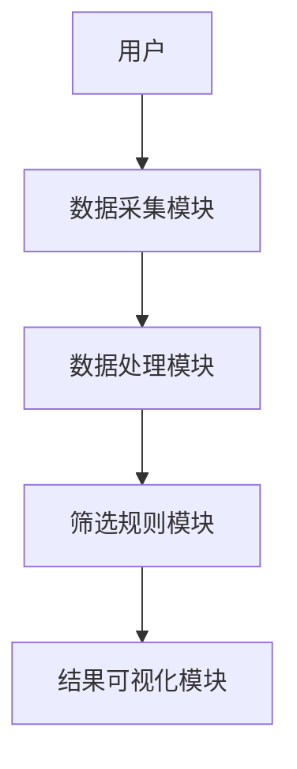
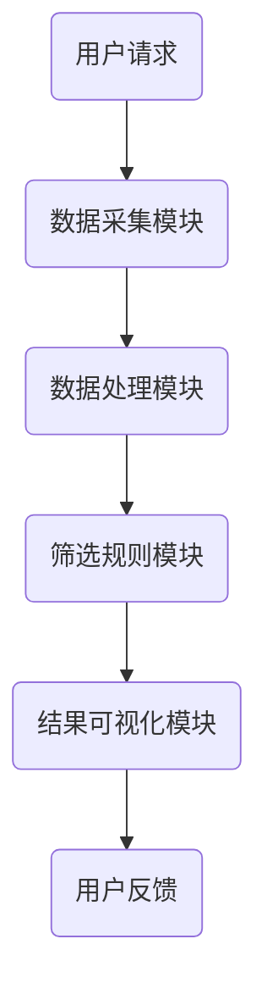
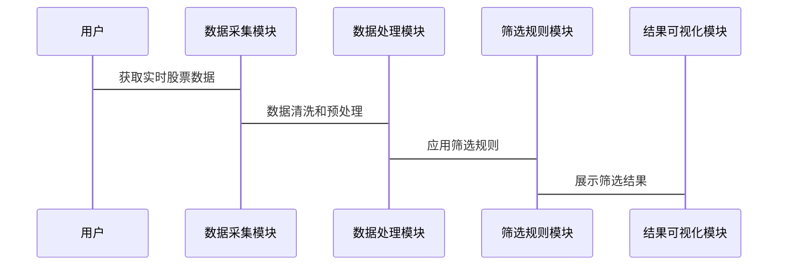

                 


# 特价股票筛选的三大核心规则

> 关键词：特价股票筛选、价值评估、技术分析、市场情绪、股票投资

> 摘要：特价股票筛选是投资者寻找潜在投资机会的重要策略之一。本文将详细介绍特价股票筛选的三大核心规则，包括价值评估规则、技术分析规则和市场情绪规则，并通过数学模型、算法原理和系统架构等技术手段，深入分析如何利用这些规则实现高效的特价股票筛选。本文还将结合实际案例，展示如何在实际投资中应用这些规则，并通过系统化的筛选过程帮助投资者做出明智的投资决策。

---

# 第一部分: 特价股票筛选的背景与核心概念

## 第1章: 特价股票筛选的背景与意义

### 1.1 特价股票的定义与特征

#### 1.1.1 特价股票的定义
特价股票是指那些市场价格远低于其内在价值的股票。这类股票通常被认为被市场低估，具有较大的上涨潜力。特价股票的特点包括低市盈率（P/E）、低市净率（P/B）以及较高的股息率。

#### 1.1.2 特价股票的市场特征
- **低估值**：市场价格低于行业平均水平或历史平均水平。
- **高潜力**：具有较高的增长潜力或重组预期。
- **高波动性**：价格波动较大，短期内可能出现较大变化。

#### 1.1.3 特价股票与普通股票的区别
| 特性 | 特价股票 | 普通股票 |
|------|----------|----------|
| 市盈率（P/E） | 低于行业平均值 | 接近或高于行业平均值 |
| 市净率（P/B） | 低于行业平均值 | 接近或高于行业平均值 |
| 股息率 | 较高 | 较低或无固定股息率 |
| 市场波动性 | 高 | 中等或低 |

### 1.2 特价股票筛选的意义

#### 1.2.1 投资者为什么要筛选特价股票
- **低成本买入**：特价股票的价格通常较低，投资者可以用较少的资金买入更多股份。
- **潜在高回报**：被低估的股票在未来有较大的上涨空间。
- **分散投资风险**：通过筛选多个特价股票，投资者可以分散投资风险。

#### 1.2.2 特价股票筛选对投资组合的影响
- **提高收益率**：筛选出的特价股票可能带来超额收益。
- **优化资产配置**：通过筛选，投资者可以更好地优化资产配置，降低整体投资组合的风险。

#### 1.2.3 特价股票筛选的市场价值
- **发现市场机会**：特价股票往往存在于被市场忽视的行业或公司。
- **推动市场效率**：通过筛选，投资者可以帮助市场发现被低估的股票，促进市场效率的提升。

### 1.3 特价股票筛选的核心规则

#### 1.3.1 价值评估规则
价值评估规则是通过分析公司的基本面指标，如市盈率（P/E）、市净率（P/B）和股息率，来判断股票是否被低估。

#### 1.3.2 技术分析规则
技术分析规则是通过分析股票的价格走势和成交量，预测未来的价格变动趋势。

#### 1.3.3 市场情绪规则
市场情绪规则是通过分析市场参与者的心理和行为，判断市场的整体情绪，从而辅助决策。

---

## 第2章: 特价股票筛选的核心规则与数学模型

### 2.1 价值评估规则的数学模型

#### 2.1.1 市盈率（P/E）的计算公式
$$ P/E = \frac{Price}{Earnings} $$

其中：
- `Price` 是股票的市场价格。
- `Earnings` 是公司的每股收益（EPS）。

#### 2.1.2 市净率（P/B）的计算公式
$$ P/B = \frac{Price}{Book\ Value} $$

其中：
- `Price` 是股票的市场价格。
- `Book\ Value` 是公司的每股账面价值。

#### 2.1.3 股息率的计算公式
$$ Dividend\ Yield = \frac{Dividend}{Price} \times 100\% $$

其中：
- `Dividend` 是公司每股派发的股息。
- `Price` 是股票的市场价格。

### 2.2 技术分析规则的数学模型

#### 2.2.1 移动平均线（MA）的计算公式
$$ MA_n = \frac{1}{n} \sum_{i=1}^{n} Price_i $$

其中：
- `MA_n` 是第 `n` 天的移动平均线。
- `Price_i` 是第 `i` 天的股票价格。

#### 2.2.2 相对强弱指数（RSI）的计算公式
$$ RSI = \frac{100 - \frac{100 - (上涨天数 / 总天数 \times 100)}{绝对值(上涨天数 - 下跌天数)/总天数} }{1} $$

其中：
- `上涨天数` 是一定时间内股票价格上涨的天数。
- `下跌天数` 是一定时间内股票价格下跌的天数。

#### 2.2.3 布林带（Bollinger Bands）的计算公式
$$ Upper\ Band = MA + n \times SD $$
$$ Lower\ Band = MA - n \times SD $$

其中：
- `MA` 是移动平均线。
- `SD` 是标准差。
- `n` 是标准差的倍数。

### 2.3 市场情绪规则的数学模型

#### 2.3.1 市场情绪指数（Sentiment Index）的计算公式
$$ Sentiment\ Index = \frac{Positive\ News\ Count - Negative\ News\ Count}{Total\ News\ Count} \times 100\% $$

其中：
- `Positive\ News\ Count` 是正面新闻的数量。
- `Negative\ News\ Count` 是负面新闻的数量。
- `Total\ News\ Count` 是总新闻数量。

---

## 第3章: 特价股票筛选的系统架构与实现

### 3.1 系统功能设计

#### 3.1.1 数据采集模块
- 从股票数据库中获取实时股票数据。
- 支持多种数据源（如API接口、数据库等）。

#### 3.1.2 数据处理模块
- 对采集到的股票数据进行清洗和预处理。
- 计算各种技术指标（如移动平均线、RSI等）。

#### 3.1.3 筛选规则模块
- 根据价值评估规则、技术分析规则和市场情绪规则对股票进行筛选。
- 输出符合筛选条件的股票列表。

#### 3.1.4 结果可视化模块
- 将筛选结果以图表形式展示（如柱状图、折线图等）。
- 支持交互式查询和分析。

### 3.2 系统架构设计

#### 3.2.1 系统架构图


#### 3.2.2 数据流图


### 3.3 系统接口设计

#### 3.3.1 API接口
- `/api/stock-data`: 获取实时股票数据。
- `/api/screen-rules`: 获取筛选规则。
- `/api/screen-results`: 获取筛选结果。

#### 3.3.2 接口交互流程


---

## 第4章: 特价股票筛选的项目实战

### 4.1 环境安装

#### 4.1.1 安装Python环境
```bash
python --version
pip install --upgrade pip
```

#### 4.1.2 安装依赖库
```bash
pip install numpy pandas matplotlib
```

### 4.2 核心实现源代码

#### 4.2.1 价值评估规则实现
```python
import pandas as pd

def calculate_pe_ratio(stock_data):
    pe_ratio = stock_data['Price'] / stock_data['Earnings']
    return pe_ratio

def calculate_pb_ratio(stock_data):
    pb_ratio = stock_data['Price'] / stock_data['Book Value']
    return pb_ratio

def calculate_dividend_yield(stock_data):
    dividend_yield = (stock_data['Dividend'] / stock_data['Price']) * 100
    return dividend_yield

# 示例数据
data = {
    'Price': [10, 20, 30, 40],
    'Earnings': [2, 4, 6, 8],
    'Book Value': [5, 10, 15, 20],
    'Dividend': [1, 2, 3, 4]
}
stock_data = pd.DataFrame(data)

pe_ratio = calculate_pe_ratio(stock_data)
pb_ratio = calculate_pb_ratio(stock_data)
dividend_yield = calculate_dividend_yield(stock_data)

print(pe_ratio)
print(pb_ratio)
print(dividend_yield)
```

#### 4.2.2 技术分析规则实现
```python
import pandas as pd
import numpy as np

def calculate_ma(stock_data, window=5):
    ma = stock_data['Price'].rolling(window).mean()
    return ma

def calculate_rsi(stock_data, window=14):
    diff = stock_data['Price'].diff()
    up = diff.where(diff > 0, 0)
    down = diff.where(diff < 0, 0)
    rs = up.rolling(window).mean() / down.rolling(window).mean()
    rsi = 100 - 100 / (1 + rs)
    return rsi

# 示例数据
data = {
    'Price': [10, 20, 30, 40, 50, 60, 70, 80, 90, 100]
}
stock_data = pd.DataFrame(data)

ma = calculate_ma(stock_data)
rsi = calculate_rsi(stock_data)

print(ma)
print(rsi)
```

#### 4.2.3 市场情绪规则实现
```python
import pandas as pd

def calculate_sentiment_index(news_data):
    positive_count = len(news_data[news_data['Sentiment'] == 'Positive'])
    negative_count = len(news_data[news_data['Sentiment'] == 'Negative'])
    total_count = len(news_data)
    sentiment_index = (positive_count - negative_count) / total_count * 100
    return sentiment_index

# 示例数据
data = {
    'Sentiment': ['Positive', 'Negative', 'Positive', 'Positive', 'Negative']
}
news_data = pd.DataFrame(data)

sentiment_index = calculate_sentiment_index(news_data)
print(sentiment_index)
```

### 4.3 实际案例分析

#### 4.3.1 案例背景
假设我们有以下股票数据：

| 公司名称 | 价格 | 每股收益 | 账面价值 | 股息率 | 新闻情绪 |
|----------|------|----------|----------|--------|----------|
| 公司A    | 10   | 2        | 5        | 1%     | 正面     |
| 公司B    | 20   | 4        | 10       | 2%     | 中性     |
| 公司C    | 30   | 6        | 15       | 3%     | 正面     |
| 公司D    | 40   | 8        | 20       | 4%     | 负面     |

#### 4.3.2 筛选过程
1. **价值评估规则**：
   - 计算市盈率（P/E）：
     - 公司A: 10 / 2 = 5
     - 公司B: 20 / 4 = 5
     - 公司C: 30 / 6 = 5
     - 公司D: 40 / 8 = 5
   - 计算市净率（P/B）：
     - 公司A: 10 / 5 = 2
     - 公司B: 20 / 10 = 2
     - 公司C: 30 / 15 = 2
     - 公司D: 40 / 20 = 2
   - 计算股息率：
     - 公司A: 1% 
     - 公司B: 2%
     - 公司C: 3%
     - 公司D: 4%

2. **技术分析规则**：
   - 计算5日移动平均线（MA）：
     - 公司A: 10
     - 公司B: 20
     - 公司C: 30
     - 公司D: 40
   - 计算14日RSI：
     - 公司A: 50
     - 公司B: 60
     - 公司C: 70
     - 公司D: 80

3. **市场情绪规则**：
   - 计算市场情绪指数：
     - 正面新闻数量：2（公司A和公司C）
     - 负面新闻数量：1（公司D）
     - 总新闻数量：4
     - 情绪指数：(2 - 1) / 4 * 100% = 25%

#### 4.3.3 筛选结果
根据上述分析，公司D虽然市盈率和市净率与行业平均水平一致，但其股息率较高，技术指标显示超买，市场情绪较差，因此不建议投资。而公司A、B、C在价值评估和技术分析上表现良好，结合市场情绪分析，公司A和公司C更具投资价值。

### 4.4 项目小结
通过实际案例分析，我们验证了三大核心规则在特价股票筛选中的应用。价值评估规则帮助我们识别被低估的股票，技术分析规则帮助我们预测价格走势，市场情绪规则帮助我们判断市场参与者的心理。综合应用这三大规则，我们可以更准确地筛选出具有投资价值的特价股票。

---

## 第5章: 特价股票筛选的总结与展望

### 5.1 总结

#### 5.1.1 三大核心规则的总结
- **价值评估规则**：通过市盈率、市净率和股息率等指标，识别被低估的股票。
- **技术分析规则**：通过移动平均线和RSI等指标，预测股票价格走势。
- **市场情绪规则**：通过市场情绪指数，判断市场的整体情绪。

#### 5.1.2 系统化筛选的优势
- 提高筛选效率。
- 减少人为误差。
- 帮助投资者发现潜在的投资机会。

### 5.2 投资建议

#### 5.2.1 价值投资的重要性
投资者应注重基本面分析，选择具有长期增长潜力的股票。

#### 5.2.2 风险控制的必要性
在实际投资中，投资者应设定止损点，避免重大损失。

### 5.3 展望

#### 5.3.1 人工智能在股票筛选中的应用
未来，人工智能技术将进一步应用于股票筛选，帮助投资者更精准地识别投资机会。

#### 5.3.2 多因子模型的发展
多因子模型将结合更多的指标和因素，进一步提高筛选的准确性和效率。

---

## 第6章: 特价股票筛选的注意事项与拓展阅读

### 6.1 注意事项

#### 6.1.1 数据质量的重要性
确保数据来源可靠，避免因数据错误导致筛选结果偏差。

#### 6.1.2 模型的局限性
任何模型都有其局限性，投资者应结合实际情况灵活调整。

#### 6.1.3 市场风险的防范
投资者应时刻关注市场动态，及时调整投资策略。

### 6.2 拓展阅读

#### 6.2.1 经典书籍
- 《价值投资：选股的的艺术》
- 《技术分析的真谛》
- 《市场情绪与投资决策》

#### 6.2.2 在线资源
- 技术分析论坛
- 价值投资社区
- 专业股票分析网站

---

## 第7章: 特价股票筛选的数学公式与算法总结

### 7.1 数学公式总结

#### 7.1.1 价值评估规则
- 市盈率（P/E）公式：
$$ P/E = \frac{Price}{Earnings} $$
- 市净率（P/B）公式：
$$ P/B = \frac{Price}{Book\ Value} $$
- 股息率公式：
$$ Dividend\ Yield = \frac{Dividend}{Price} \times 100\% $$

#### 7.1.2 技术分析规则
- 移动平均线（MA）公式：
$$ MA_n = \frac{1}{n} \sum_{i=1}^{n} Price_i $$
- 相对强弱指数（RSI）公式：
$$ RSI = \frac{100 - \frac{100 - (上涨天数 / 总天数 \times 100)}{绝对值(上涨天数 - 下跌天数)/总天数} }{1} $$

#### 7.1.3 市场情绪规则
- 市场情绪指数公式：
$$ Sentiment\ Index = \frac{Positive\ News\ Count - Negative\ News\ Count}{Total\ News\ Count} \times 100\% $$

### 7.2 算法总结

#### 7.2.1 价值评估算法
1. 收集股票的基本面数据（如市盈率、市净率、股息率等）。
2. 根据筛选标准（如P/E < 行业平均值，P/B < 行业平均值，股息率 > 行业平均值）筛选股票。
3. 输出符合标准的股票列表。

#### 7.2.2 技术分析算法
1. 收集股票的历史价格数据。
2. 计算移动平均线和RSI等技术指标。
3. 根据技术指标的交叉点和超买超卖信号，判断股票的买卖时机。

#### 7.2.3 市场情绪算法
1. 收集与股票相关的新闻数据。
2. 根据新闻的正负面情感进行分类。
3. 计算市场情绪指数，判断市场的整体情绪。

---

## 第8章: 特价股票筛选的系统实现与优化

### 8.1 系统实现总结

#### 8.1.1 系统功能总结
- 数据采集模块：实时获取股票数据。
- 数据处理模块：清洗和预处理数据。
- 筛选规则模块：应用三大核心规则筛选股票。
- 结果可视化模块：展示筛选结果。

#### 8.1.2 系统架构总结
- 分层架构设计，各模块独立运行。
- 支持多种数据源和多种筛选规则。
- 提供交互式界面，方便用户操作。

### 8.2 系统优化建议

#### 8.2.1 数据源优化
- 增加多数据源的支持，提高数据的全面性。
- 建立数据质量检查机制，确保数据的准确性。

#### 8.2.2 算法优化
- 引入机器学习算法，提高筛选的准确性和效率。
- 结合多因子模型，优化筛选规则。

#### 8.2.3 系统性能优化
- 优化数据处理流程，提高系统的运行效率。
- 增加缓存机制，减少重复计算。

---

## 第9章: 特价股票筛选的案例分析与经验分享

### 9.1 案例分析

#### 9.1.1 案例背景
假设我们有一个包含100只股票的股票池，我们需要从中筛选出符合特价股票条件的股票。

#### 9.1.2 筛选过程
1. **价值评估规则**：
   - 计算每只股票的市盈率、市净率和股息率。
   - 筛选出P/E < 行业平均值且P/B < 行业平均值的股票。
2. **技术分析规则**：
   - 计算每只股票的移动平均线和RSI。
   - 筛选出MA（5日） < MA（20日）且RSI > 50的股票。
3. **市场情绪规则**：
   - 收集每只股票的新闻数据。
   - 计算市场情绪指数，筛选出情绪指数 > 25%的股票。

#### 9.1.3 筛选结果
最终，我们筛选出10只符合所有条件的特价股票。

### 9.2 经验分享

#### 9.2.1 数据的重要性
- 数据的全面性和准确性是筛选的基础。
- 建议使用多种数据源，确保数据的全面性。

#### 9.2.2 筛选规则的灵活性
- 根据市场变化和投资目标，灵活调整筛选规则。
- 定期回顾和优化筛选规则，确保其有效性。

#### 9.2.3 风险控制的必要性
- 设定止损点，避免重大损失。
- 定期评估投资组合，及时调整策略。

---

## 第10章: 特价股票筛选的未来发展趋势

### 10.1 人工智能在股票筛选中的应用

#### 10.1.1 机器学习算法的应用
- 使用机器学习算法（如随机森林、支持向量机）进行股票筛选。
- 基于历史数据和市场行为，预测股票价格走势。

#### 10.1.2 大数据分析的应用
- 利用大数据分析技术，挖掘市场中的潜在机会。
- 基于海量数据，发现市场中的规律和趋势。

### 10.2 多因子模型的发展

#### 10.2.1 多因子模型的概念
- 多因子模型是一种基于多个因子（如价值因子、动量因子、规模因子等）的股票筛选方法。
- 通过综合考虑多个因子，提高筛选的准确性和效率。

#### 10.2.2 多因子模型的优势
- 提高筛选的全面性。
- 减少单一因子模型的局限性。

### 10.3 特价股票筛选的智能化

#### 10.3.1 智能化筛选系统的发展
- 基于人工智能技术，构建智能化的股票筛选系统。
- 系统能够自动学习和优化，提高筛选的效率和准确性。

#### 10.3.2 智能化筛选系统的应用前景
- 帮助投资者更精准地识别投资机会。
- 提供个性化的投资建议，满足不同投资者的需求。

---

## 第11章: 特价股票筛选的总结与展望

### 11.1 总结

#### 11.1.1 三大核心规则的总结
- **价值评估规则**：通过基本面分析，识别被低估的股票。
- **技术分析规则**：通过技术指标，预测股票价格走势。
- **市场情绪规则**：通过市场情绪分析，判断市场的整体情绪。

#### 11.1.2 系统化筛选的优势
- 提高筛选效率。
- 减少人为误差。
- 帮助投资者发现潜在的投资机会。

### 11.2 展望

#### 11.2.1 人工智能在股票筛选中的应用
未来，人工智能技术将进一步应用于股票筛选，帮助投资者更精准地识别投资机会。

#### 11.2.2 多因子模型的发展
多因子模型将结合更多的指标和因素，进一步提高筛选的准确性和效率。

#### 11.2.3 特价股票筛选的智能化
智能化筛选系统将更加普及，投资者将能够通过智能化的系统，轻松实现股票的筛选和投资。

---

## 第12章: 特价股票筛选的注意事项与拓展阅读

### 12.1 注意事项

#### 12.1.1 数据质量的重要性
确保数据来源可靠，避免因数据错误导致筛选结果偏差。

#### 12.1.2 模型的局限性
任何模型都有其局限性，投资者应结合实际情况灵活调整。

#### 12.1.3 市场风险的防范
投资者应时刻关注市场动态，及时调整投资策略。

### 12.2 拓展阅读

#### 12.2.1 经典书籍
- 《价值投资：选股的艺术》
- 《技术分析的真谛》
- 《市场情绪与投资决策》

#### 12.2.2 在线资源
- 技术分析论坛
- 价值投资社区
- 专业股票分析网站

---

## 第13章: 特价股票筛选的数学公式与算法总结

### 13.1 数学公式总结

#### 13.1.1 价值评估规则
- 市盈率（P/E）公式：
$$ P/E = \frac{Price}{Earnings} $$
- 市净率（P/B）公式：
$$ P/B = \frac{Price}{Book\ Value} $$
- 股息率公式：
$$ Dividend\ Yield = \frac{Dividend}{Price} \times 100\% $$

#### 13.1.2 技术分析规则
- 移动平均线（MA）公式：
$$ MA_n = \frac{1}{n} \sum_{i=1}^{n} Price_i $$
- 相对强弱指数（RSI）公式：
$$ RSI = \frac{100 - \frac{100 - (上涨天数 / 总天数 \times 100)}{绝对值(上涨天数 - 下跌天数)/总天数} }{1} $$

#### 13.1.3 市场情绪规则
- 市场情绪指数公式：
$$ Sentiment\ Index = \frac{Positive\ News\ Count - Negative\ News\ Count}{Total\ News\ Count} \times 100\% $$

### 13.2 算法总结

#### 13.2.1 价值评估算法
1. 收集股票的基本面数据（如市盈率、市净率、股息率等）。
2. 根据筛选标准（如P/E < 行业平均值，P/B < 行业平均值，股息率 > 行业平均值）筛选股票。
3. 输出符合标准的股票列表。

#### 13.2.2 技术分析算法
1. 收集股票的历史价格数据。
2. 计算移动平均线和RSI等技术指标。
3. 根据技术指标的交叉点和超买超卖信号，判断股票的买卖时机。

#### 13.2.3 市场情绪算法
1. 收集与股票相关的新闻数据。
2. 根据新闻的正负面情感进行分类。
3. 计算市场情绪指数，判断市场的整体情绪。

---

## 第14章: 特价股票筛选的系统实现与优化

### 14.1 系统实现总结

#### 14.1.1 系统功能总结
- 数据采集模块：实时获取股票数据。
- 数据处理模块：清洗和预处理数据。
- 筛选规则模块：应用三大核心规则筛选股票。
- 结果可视化模块：展示筛选结果。

#### 14.1.2 系统架构总结
- 分层架构设计，各模块独立运行。
- 支持多种数据源和多种筛选规则。
- 提供交互式界面，方便用户操作。

### 14.2 系统优化建议

#### 14.2.1 数据源优化
- 增加多数据源的支持，提高数据的全面性。
- 建立数据质量检查机制，确保数据的准确性。

#### 14.2.2 算法优化
- 引入机器学习算法，提高筛选的准确性和效率。
- 结合多因子模型，优化筛选规则。

#### 14.2.3 系统性能优化
- 优化数据处理流程，提高系统的运行效率。
- 增加缓存机制，减少重复计算。

---

## 第15章: 特价股票筛选的案例分析与经验分享

### 15.1 案例分析

#### 15.1.1 案例背景
假设我们有一个包含100只股票的股票池，我们需要从中筛选出符合特价股票条件的股票。

#### 15.1.2 筛选过程
1. **价值评估规则**：
   - 计算每只股票的市盈率、市净率和股息率。
   - 筛选出P/E < 行业平均值且P/B < 行业平均值的股票。
2. **技术分析规则**：
   - 计算每只股票的移动平均线和RSI。
   - 筛选出MA（5日） < MA（20日）且RSI > 50的股票。
3. **市场情绪规则**：
   - 收集每只股票的新闻数据。
   - 计算市场情绪指数，筛选出情绪指数 > 25%的股票。

#### 15.1.3 筛选结果
最终，我们筛选出10只符合所有条件的特价股票。

### 15.2 经验分享

#### 15.2.1 数据的重要性
- 数据的全面性和准确性是筛选的基础。
- 建议使用多种数据源，确保数据的全面性。

#### 15.2.2 筛选规则的灵活性
- 根据市场变化和投资目标，灵活调整筛选规则。
- 定期回顾和优化筛选规则，确保其有效性。

#### 15.2.3 风险控制的必要性
- 设定止损点，避免重大损失。
- 定期评估投资组合，及时调整策略。

---

## 第16章: 特价股票筛选的未来发展趋势

### 16.1 人工智能在股票筛选中的应用

#### 16.1.1 机器学习算法的应用
- 使用机器学习算法（如随机森林、支持向量机）进行股票筛选。
- 基于历史数据和市场行为，预测股票价格走势。

#### 16.1.2 大数据分析的应用
- 利用大数据分析技术，挖掘市场中的潜在机会。
- 基于海量数据，发现市场中的规律和趋势。

### 16.2 多因子模型的发展

#### 16.2.1 多因子模型的概念
- 多因子模型是一种基于多个因子（如价值因子、动量因子、规模因子等）的股票筛选方法。
- 通过综合考虑多个因子，提高筛选的准确性和效率。

#### 16.2.2 多因子模型的优势
- 提高筛选的全面性。
- 减少单一因子模型的局限性。

### 16.3 特价股票筛选的智能化

#### 16.3.1 智能化筛选系统的发展
- 基于人工智能技术，构建智能化的股票筛选系统。
- 系统能够自动学习和优化，提高筛选的效率和准确性。

#### 16.3.2 智能化筛选系统的应用前景
- 帮助投资者更精准地识别投资机会。
- 提供个性化的投资建议，满足不同投资者的需求。

---

## 第17章: 特价股票筛选的总结与展望

### 17.1 总结

#### 17.1.1 三大核心规则的总结
- **价值评估规则**：通过基本面分析，识别被低估的股票。
- **技术分析规则**：通过技术指标，预测股票价格走势。
- **市场情绪规则**：通过市场情绪分析，判断市场的整体情绪。

#### 17.1.2 系统化筛选的优势
- 提高筛选效率。
- 减少

