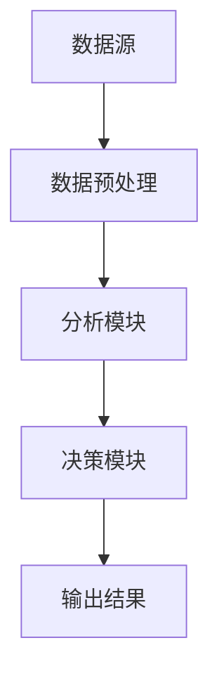
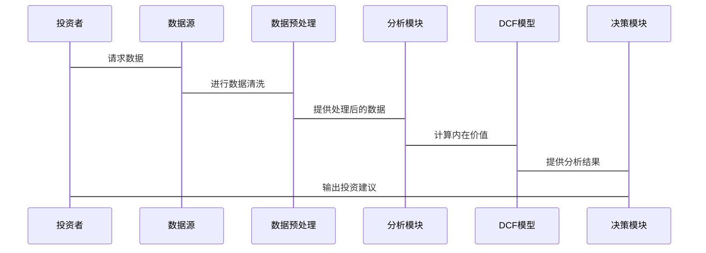

                 


# 玛丽·巴芙特的新兴市场价值投资：高风险中的高回报

## 关键词：新兴市场，价值投资，玛丽·巴芙特，高风险，高回报，DCF模型，内在价值，安全边际

## 摘要：  
本文深入探讨了玛丽·巴芙特在新兴市场中进行价值投资的策略，分析了高风险中的高回报机制。通过详细讲解价值投资的核心概念、算法原理和系统架构，结合实际案例，为读者提供了在新兴市场中寻找投资机会的实用方法。文章还总结了最佳实践和注意事项，帮助投资者在高风险环境中实现稳健收益。

---

## 第一部分：新兴市场与价值投资的背景介绍

### 第1章：新兴市场的概述

#### 1.1 新兴市场的定义与特点
- **1.1.1 新兴市场的定义**  
  新兴市场是指那些经济快速增长但尚未完全工业化的国家的金融市场，如中国、印度、巴西等。这些市场通常具有较大的增长潜力，但也伴随着较高的波动性和不确定性。

- **1.1.2 新兴市场的特点**  
  - 经济增长快，但波动性大。
  - 市场流动性相对较低，信息透明度不足。
  - 行业集中度低，新兴行业较多。
  - 法律法规不够完善，政策风险较高。

- **1.1.3 新兴市场与成熟市场的对比**  
  新兴市场与成熟市场在市场规模、投资者结构、市场效率等方面存在显著差异。新兴市场的波动性和不确定性更高，但潜在回报也更大。

#### 1.2 价值投资的基本概念
- **1.2.1 价值投资的定义**  
  价值投资是一种投资策略，强调以低于公平价值的价格购买优质的资产。其核心在于寻找市场低估的股票，通过长期持有实现收益。

- **1.2.2 价值投资的核心原则**  
  - 以合理价格购买优质资产。
  - 长期持有，避免频繁交易。
  - 着重于公司的基本面分析，如盈利能力、财务状况、行业地位等。

- **1.2.3 价值投资的历史发展**  
  价值投资由本杰明·格雷厄姆提出，后由大卫·多德和彼得·林奇等投资者进一步发展。玛丽·巴芙特是该策略的现代代表之一，她将价值投资的理念应用于新兴市场。

#### 1.3 新兴市场与价值投资的结合
- **1.3.1 新兴市场中的价值投资机会**  
  新兴市场中存在许多被低估的优质公司，尤其是那些在本地市场占据主导地位的龙头企业。

- **1.3.2 新兴市场中的价值投资挑战**  
  - 市场波动大，信息不透明。
  - 法律法规风险较高。
  - 财务造假问题突出。

- **1.3.3 玛丽·巴芙特的价值投资策略在新兴市场的应用**  
  玛丽·巴芙特强调寻找具有强大竞争优势、合理估值和良好治理结构的公司。她在新兴市场的投资策略包括关注龙头企业、分散投资和长期持有。

---

## 第二部分：价值投资的核心概念与联系

### 第2章：价值投资的核心原理

#### 2.1 安全边际的概念
- **2.1.1 安全边际的定义**  
  安全边际是指股票的市场价格低于其内在价值的部分。通过购买价格低于内在价值的股票，投资者可以降低投资风险。

- **2.1.2 安全边际的重要性**  
  安全边际提供了缓冲空间，即使公司表现不佳或市场波动，投资者仍能获得正收益。

- **2.1.3 如何计算安全边际**  
  安全边际 = 内在价值 - 市场价格

  例如：如果一只股票的内在价值为50元，市场价格为40元，则安全边际为10元。

  ```mermaid
  graph TD
    A[内在价值] --> B[市场价格]
    B --> C[安全边际]
    C --> D(安全边际 = 内在价值 - 市场价格)
  ```

#### 2.2 内在价值的概念
- **2.2.1 内在价值的定义**  
  内在价值是基于公司基本面因素（如盈利能力、现金流、资产价值等）计算的股票理论价值。

- **2.2.2 内在价值的计算方法**  
  常用的方法包括：
  - 股息贴现模型（DDM）：基于股息的现值计算内在价值。
  - 现金流贴现模型（DCF）：基于未来现金流的现值计算内在价值。

  ```mermaid
  graph TD
    A[现金流] --> B[折现率] --> C[现值]
    C --> D[内在价值]
  ```

- **2.2.3 内在价值与市场价值的关系**  
  当市场价格低于内在价值时，股票具有投资价值。

#### 2.3 价值投资与其他投资策略的对比
- **2.3.1 成长投资 vs. 价值投资**  
  成长投资注重高成长性的公司，而价值投资注重低估值的公司。

  | 对比维度 | 成长投资 | 价值投资 |
  |----------|----------|----------|
  | 核心目标 | 高成长   | 高安全边际 |
  | 估值标准 | 高市盈率 | 低市盈率  |

- **2.3.2 投资期限**  
  成长投资通常需要较短的投资期限，而价值投资适合长期持有。

---

## 第三部分：价值投资的算法原理讲解

### 第3章：DCF模型的原理与应用

#### 3.1 DCF模型的定义与作用
- DCF（Discounted Cash Flow）模型是评估公司内在价值的常用方法。
- 通过预测公司未来现金流并将其折现，计算公司股权或整体的内在价值。

#### 3.2 DCF模型的数学公式
- 现金流的现值计算：
  $$ PV = \frac{CF_t}{(1 + r)^t} $$
  其中，CF_t 是第t年的现金流，r是折现率，t是时间。

- 内在价值计算：
  $$ Intrinsic\ Value = \sum_{t=1}^{n} \frac{CF_t}{(1 + r)^t} $$

#### 3.3 DCF模型的步骤
1. 预测未来现金流。
2. 确定合适的折现率。
3. 计算现金流的现值之和，得到内在价值。
4. 比较市场价格与内在价值，判断是否低估。

#### 3.4 DCF模型的代码实现
以下是一个简单的DCF模型代码示例：

```python
def calculate_intrinsic_value(fcf, discount_rate, horizon):
    pv = 0
    for t in range(1, horizon + 1):
        pv += fcf[t] / (1 + discount_rate) ** t
    return pv

# 示例数据
fcf = [100, 120, 150, 200]  # 前四年自由现金流
discount_rate = 0.10          # 折现率
horizon = 4                   # 预测年数

iv = calculate_intrinsic_value(fcf, discount_rate, horizon)
print(f"内在价值为：{iv}")
```

#### 3.5 DCF模型的注意事项
- 现金流预测的准确性直接影响内在价值的计算。
- 折现率的选择应基于市场利率和风险水平。

---

## 第四部分：系统分析与架构设计方案

### 第4章：投资决策系统的架构设计

#### 4.1 问题场景介绍
- 投资者需要在新兴市场中筛选潜在的投资标的。
- 需要评估公司的基本面和市场价值，制定投资组合。

#### 4.2 系统功能设计
- 数据收集模块：获取公司财务数据、行业信息等。
- 分析模块：计算内在价值、安全边际等指标。
- 决策模块：根据分析结果生成投资建议。

#### 4.3 系统架构设计


#### 4.4 系统接口设计
- 数据接口：与财务数据库对接。
- 分析接口：调用DCF模型计算内在价值。
- 决策接口：生成投资建议。

#### 4.5 系统交互流程


---

## 第五部分：项目实战

### 第5章：新兴市场价值投资的实战分析

#### 5.1 项目背景与目标
- 分析某新兴市场中的龙头企业，评估其投资价值。

#### 5.2 数据收集与处理
- 收集公司的财务数据、行业数据等。
- 使用Python进行数据清洗和预处理。

#### 5.3 分析与建模
- 应用DCF模型计算内在价值。
- 计算安全边际，判断是否低估。

#### 5.4 实战结果与解读
- 公司A的内在价值为100元，市场价格为80元，安全边际为20元，具有较高的投资价值。

#### 5.5 项目小结
- DCF模型在新兴市场中的应用需要考虑数据的可获得性和模型的适用性。
- 安全边际是判断投资价值的重要指标。

---

## 第六部分：最佳实践与注意事项

### 第6章：新兴市场价值投资的最佳实践

#### 6.1 投资心态与纪律
- 长期投资，避免短期波动的干扰。
- 保持耐心，坚持价值投资的原则。

#### 6.2 风险管理与分散投资
- 分散投资，降低行业和公司的特定风险。
- 定期评估投资组合，调整持仓。

#### 6.3 持续学习与更新
- 关注宏观经济和行业动态。
- 不断学习新的分析方法和投资策略。

#### 6.4 小结
- 价值投资在新兴市场中仍然有效，但需要更加谨慎地选择标的和管理风险。
- 理解市场的特殊性，灵活调整投资策略。

---

## 总结

本文详细探讨了玛丽·巴芙特在新兴市场中的价值投资策略，从理论到实践，为投资者提供了系统的指导。通过DCF模型和安全边际等工具，投资者可以在高风险的新兴市场中寻找高回报的机会。然而，投资过程中需要保持纪律、管理和更新知识，以应对市场的复杂性和不确定性。

