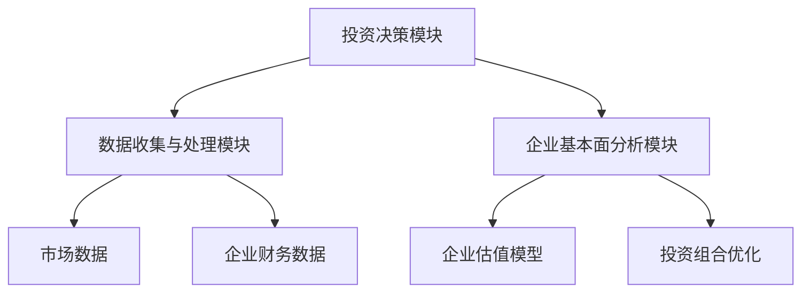

                 


# 玛丽·巴芙的女性视角价值投资

## 关键词：价值投资、玛丽·巴芙、女性视角、投资策略、算法实现、系统架构、案例分析

## 摘要：  
本文从价值投资的基本概念出发，结合玛丽·巴芙的投资理念，深入探讨女性视角在价值投资中的独特作用。通过构建价值投资系统架构、分析投资策略的数学模型、实现投资算法，并通过具体案例分析，展示如何从女性视角出发，优化投资决策，提升投资收益。

---

# 《玛丽·巴芙的女性视角价值投资》正文

## 第一部分：价值投资基础

### 第1章：价值投资的基本概念

#### 1.1 价值投资的定义与核心理念  
价值投资是一种以基本面分析为核心的投资策略，强调以低于内在价值的价格买入优质资产，长期持有，等待价值回归。其核心理念包括：  
1. **长期主义**：关注企业的长期价值，而非短期市场波动。  
2. **安全边际**：买入价格应低于企业的内在价值，以降低投资风险。  
3. **价值发现**：通过深入分析企业财务状况、行业地位和竞争优势，发现被市场低估的投资标的。  

#### 1.2 玛丽·巴芙的投资风格  
玛丽·巴芙是价值投资领域的代表性人物，其投资风格以稳健、长期和注重基本面分析著称。她强调：  
1. **女性视角的独特性**：女性投资者更注重企业的社会价值、团队协作和长期可持续发展。  
2. **风险控制**：通过严格筛选低风险、高分红的优质企业，构建稳健的投资组合。  
3. **长期持有**：避免频繁交易，耐心等待企业价值的逐步释放。

---

## 第二部分：女性视角与投资决策

### 第2章：女性视角在价值投资中的作用

#### 2.1 女性投资者的心理特征与决策模式  
女性投资者在心理特征和决策模式上具有独特的优势：  
1. **风险厌恶**：女性投资者通常更倾向于规避高风险投资，注重资产的安全性。  
2. **长期视角**：女性更关注企业的长期可持续发展，而非短期收益。  
3. **情绪稳定性**：女性投资者在市场波动中通常更冷静，能够避免情绪化决策。  

#### 2.2 基于女性视角的价值评估方法  
1. **社会性别视角分析**：从女性消费行为、企业社会责任等方面评估企业的潜在价值。  
2. **女性领导力对企业价值的影响**：女性领导者的决策风格通常更加温和、注重团队协作，这可能为企业带来更高的长期价值。  
3. **长期视角下的投资策略**：女性视角更注重企业的长期发展和可持续性，这与价值投资的核心理念高度契合。

---

## 第三部分：价值投资的系统架构

### 第3章：价值投资系统的构建

#### 3.1 投资系统的核心模块  
价值投资系统可以划分为以下核心模块：  
1. **数据收集与处理模块**：获取企业财务数据、市场数据等。  
2. **企业基本面分析模块**：对企业盈利能力、成长能力、财务状况等进行评估。  
3. **投资决策模块**：基于分析结果，制定投资策略。  

#### 3.2 系统架构设计  
以下是价值投资系统的架构设计：  



---

## 第四部分：价值投资的算法与数学模型

### 第4章：价值投资的数学模型

#### 4.1 投资组合优化的数学模型  
投资组合优化的目标是最大化收益的同时最小化风险。其数学公式如下：  

$$ \text{目标函数：} \max \sum_{i=1}^{n} w_i R_i - \lambda \sum_{i=1}^{n} w_i^2 \sigma_i^2 $$  
$$ \text{约束条件：} \sum_{i=1}^{n} w_i = 1 $$  

其中，\( w_i \) 是第 \( i \) 资产的投资权重，\( R_i \) 是第 \( i \) 资产的预期收益，\( \sigma_i \) 是第 \( i \) 资产的风险，\( \lambda \) 是风险惩罚系数。  

#### 4.2 价值评估的算法实现  
以下是基于Python的价值评估算法实现：  

```python
def value_investment_strategy(stock_data, market_data):
    # 计算企业估值
    intrinsic_value = stock_data['Revenue'] * 0.5 + stock_data['NetIncome'] * 0.3
    # 计算安全边际
    margin_of_safety = intrinsic_value * 0.2
    # 生成投资信号
    buy_signal = market_data['Price'] < intrinsic_value - margin_of_safety
    sell_signal = market_data['Price'] > intrinsic_value + margin_of_safety
    return buy_signal, sell_signal
```

---

## 第五部分：项目实战与案例分析

### 第5章：价值投资的实战应用

#### 5.1 项目环境与工具安装  
1. **环境搭建**：安装Python、Pandas、NumPy等工具。  
2. **数据获取**：使用Yahoo Finance获取股票数据。  

#### 5.2 核心算法实现  
以下是投资组合优化的代码实现：  

```python
import numpy as np
import pandas as pd

def portfolio_optimization(returns):
    # 计算协方差矩阵
    covariance_matrix = returns.cov()
    # 计算权重
    weights = np.linalg.inv(covariance_matrix).sum()
    weights = weights / weights.sum()
    return weights
```

#### 5.3 案例分析与经验总结  
通过分析某公司股票，验证算法的有效性：  
1. **数据回测**：计算过去5年的收益与风险。  
2. **策略优化**：调整权重，优化投资组合。  
3. **结果分析**：比较不同策略下的收益与风险。

---

## 第六部分：总结与展望

### 第6章：总结与展望  

#### 6.1 小结  
本文从价值投资的基本概念出发，结合玛丽·巴芙的投资理念，探讨了女性视角在价值投资中的独特作用。通过系统架构设计、算法实现和案例分析，展示了如何从女性视角优化投资决策。  

#### 6.2 注意事项  
1. 投资者需结合市场环境和个人风险承受能力，合理调整投资策略。  
2. 价值投资需要长期坚持，避免短期市场的干扰。  

#### 6.3 拓展阅读  
1. 《价值投资入门》  
2. 《投资的女性智慧》  

---

以上是《玛丽·巴芙的女性视角价值投资》的完整内容，涵盖了从理论到实践的全过程，结合了技术分析与投资策略，为读者提供了全面的指导。

