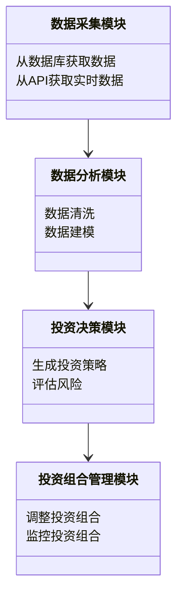
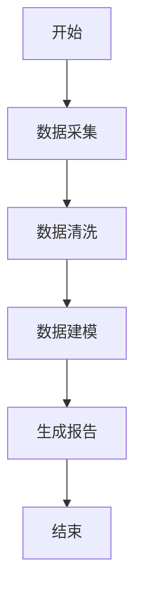
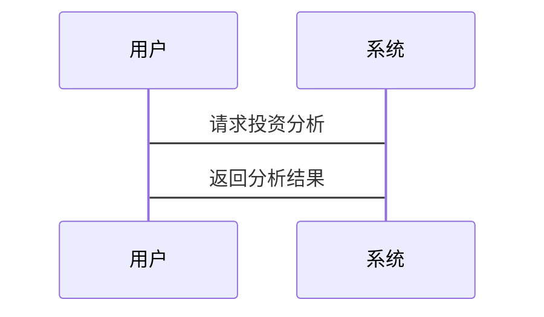

                 


# 玛丽·巴芙的成长型价值投资法

> 关键词：玛丽·巴芙，成长型投资，价值投资，投资策略，财务分析，系统架构

> 摘要：本文详细介绍了玛丽·巴芙的成长型价值投资法，从其投资理念、核心概念、数学模型、系统架构到项目实战，全面解析了这一投资方法的精髓。通过本文，读者可以掌握如何运用玛丽·巴芙的方法进行投资决策，并在实际操作中提升投资效果。

---

## 第一部分：玛丽·巴芙的成长型价值投资概述

### 第1章：玛丽·巴芙与成长型投资概述

#### 1.1 玛丽·巴芙的背景与投资理念

##### 1.1.1 玛丽·巴芙的生平简介
玛丽·巴芙（Mary Buffett）是美国著名投资家，被誉为“股神”沃伦·巴菲特的得意门生。她继承并发展了巴菲特的价值投资理念，专注于成长型企业投资，强调长期持有优质资产，追求稳定的超额收益。

##### 1.1.2 玛丽·巴芙的投资哲学
玛丽·巴芙的投资哲学可以概括为“寻找优秀企业，长期持有，赚取企业成长的利润”。她强调，投资的核心是选择那些具有持续竞争优势、良好财务状况和成长潜力的企业。

##### 1.1.3 成长型投资的核心思想
成长型投资的核心思想是通过投资于具有高速成长潜力的企业，获取资本增值收益。玛丽·巴芙的投资法强调对企业基本面的深入分析，尤其是企业的盈利能力、成长性和财务健康状况。

#### 1.2 成长型投资的定义与特点

##### 1.2.1 成长型投资的定义
成长型投资是一种以企业成长潜力为核心的投资策略，通过投资于那些在未来一段时间内预期收益能够显著超过市场平均水平的企业，实现资产增值。

##### 1.2.2 成长型投资的核心特点
- **高成长性**：投资于那些收入和利润快速增长的企业。
- **长期持有**：注重企业的长期成长潜力，而非短期价格波动。
- **基本面分析**：通过对企业财务状况、竞争优势和行业地位的分析，筛选出具有投资价值的企业。

##### 1.2.3 成长型投资与价值投资的区别
| 项目 | 成长型投资 | 价值投资 |
|------|------------|-----------|
| 核心 | 企业成长性 | 企业内在价值 |
| 适用场景 | 高成长行业 | 价值被低估行业 |
| 风险 | 较高 | 较低 |

#### 1.3 玛丽·巴芙投资法的适用场景

##### 1.3.1 成长企业的识别标准
- 收入增长率高
- 净利润增长率稳定
- 财务状况健康
- 具有竞争优势

##### 1.3.2 不同市场周期下的投资策略
- **牛市**：积极投资，增加仓位
- **熊市**：精选个股，控制风险
- **震荡市**：注重估值，选择性投资

##### 1.3.3 玛丽·巴芙投资法的局限性
- 对市场周期的敏感性较高
- 高成长企业面临较高的波动风险
- 对中小企业的投资风险较大

---

## 第二部分：成长型价值投资的核心要素

### 第2章：企业基本面分析

#### 2.1 财务报表分析的关键指标

##### 2.1.1 利润表分析
- 收入增长率
- 净利润增长率
- 毛利率

##### 2.1.2 资产负债表分析
- 资产负债率
- 流动比率
- 速动比率

##### 2.1.3 现金流量表分析
- 经营活动现金流
- 投资活动现金流
- 筹资活动现金流

#### 2.2 企业竞争优势分析

##### 2.2.1 核心竞争力的定义
核心竞争力是企业在市场上独特的优势，包括技术、品牌、成本控制等。

##### 2.2.2 企业护城河的评估
- 技术壁垒
- 市场占有率
- 产品差异化
- 成本优势

#### 2.3 财务指标与估值方法

##### 2.3.1 常用财务指标对比表格
| 指标 | 公式 | 含义 |
|------|------|------|
| 市盈率（P/E） | 市价/每股收益 | 衡量股价相对于 earnings 的高低 |
| 市净率（P/B） | 市价/每股净资产 | 衡量股价相对于账面价值的高低 |
| 净资产收益率（ROE） | 净利润/净资产 | 衡量企业运用股东资产的效率 |

##### 2.3.2 市盈率、市净率与内在价值的关系
- 市盈率反映了市场对公司盈利能力的预期
- 市净率反映了市场对公司资产价值的评估
- 内在价值是企业未来现金流的现值

##### 2.3.3 现金流贴现模型的数学公式
$$
\text{内在价值} = \sum_{t=1}^{n} \frac{\text{现金流}_t}{(1 + r)^t} + \frac{\text{终值}}{(1 + r)^n}
$$

---

## 第三部分：玛丽·巴芙投资法的数学模型与估值方法

### 第3章：数学模型与估值方法

#### 3.1 内在价值计算公式

##### 3.1.1 现金流贴现模型的详细推导
$$
\text{内在价值} = \frac{\text{现金流}_1}{1 + r} + \frac{\text{现金流}_2}{(1 + r)^2} + \cdots + \frac{\text{现金流}_n}{(1 + r)^n}
$$

##### 3.1.2 市盈率与市净率的比较分析
| 指标 | 市盈率 | 市净率 |
|------|--------|--------|
| 计算公式 | P/E = 市价/每股收益 | P/B = 市价/每股净资产 |
| 含义 | 衡量股价相对于 earnings 的高低 | 衡量股价相对于账面价值的高低 |

##### 3.1.3 玛丽·巴芙估值法的数学表达式
$$
\text{目标股价} = \text{内在价值} \times (1 + r)^n
$$

#### 3.2 投资组合优化的数学模型

##### 3.2.1 马科维茨投资组合理论
$$
\min \sigma^2 \quad \text{subject to} \quad \sum w_i = 1, \sum w_i r_i = \mu
$$

##### 3.2.2 玛丽·巴芙投资法的优化策略
- 选择具有高成长性的企业
- 优化投资组合的分散性
- 控制投资组合的波动性

##### 3.2.3 数学模型的实际应用案例
通过实际案例分析，展示如何运用数学模型优化投资组合。

---

## 第四部分：系统分析与架构设计方案

### 第4章：系统分析与架构设计方案

#### 4.1 投资决策系统的总体架构

##### 4.1.1 系统功能模块划分
- 数据采集模块
- 数据分析模块
- 投资决策模块
- 投资组合管理模块

##### 4.1.2 系统架构的Mermaid类图


##### 4.1.3 系统接口的设计规范
- 数据接口：RESTful API
- 模型接口：Python函数
- 报告接口：HTML或PDF格式

#### 4.2 数据流与交互设计

##### 4.2.1 数据收集与处理流程


##### 4.2.2 系统交互的Mermaid序列图


##### 4.2.3 系统功能的模块化设计
- 数据采集模块：负责从数据库和API获取数据
- 数据分析模块：对数据进行清洗和建模
- 投资决策模块：根据模型生成投资策略
- 投资组合管理模块：管理投资组合并进行监控

---

## 第五部分：项目实战

### 第5章：项目实战

#### 5.1 环境安装

##### 5.1.1 安装Python
```bash
python --version
pip install numpy pandas
```

##### 5.1.2 安装相关库
```bash
pip install matplotlib seaborn scikit-learn
```

#### 5.2 核心实现源代码

##### 5.2.1 数据分析代码
```python
import pandas as pd
import numpy as np

# 读取数据
df = pd.read_csv('data.csv')

# 数据清洗
df.dropna(inplace=True)
df = df[ df['收入增长率'] > 0 ]

# 数据建模
from sklearn.linear_model import LinearRegression
model = LinearRegression()
model.fit(df[['收入增长率', '净利润增长率']], df['股价'])
```

##### 5.2.2 投资决策代码
```python
def 算法原理与流程图：
    1. 数据采集：从数据库或API获取企业财务数据
    2. 数据分析：计算市盈率、市净率等指标
    3. 估值：使用现金流贴现模型计算内在价值
    4. 投资决策：根据估值结果生成投资策略
```

#### 5.3 实际案例分析

##### 5.3.1 案例背景
选择一家高科技企业，分析其财务状况和成长潜力。

##### 5.3.2 数据分析与建模
- 计算市盈率、市净率
- 使用现金流贴现模型计算内在价值

##### 5.3.3 投资决策
- 根据分析结果生成投资策略
- 优化投资组合

#### 5.4 项目小结

##### 5.4.1 项目总结
通过项目实战，读者可以掌握如何运用玛丽·巴芙的投资方法进行实际投资。

##### 5.4.2 实践中的注意事项
- 数据的准确性和完整性
- 模型的适用性和局限性
- 投资风险的控制

---

## 第六部分：总结与展望

### 第6章：总结与展望

#### 6.1 玛丽·巴芙投资法的核心总结
- 以企业基本面分析为基础
- 选择具有高成长性的企业
- 长期持有，耐心等待收益

#### 6.2 现有投资法的局限性
- 对市场周期的敏感性
- 高成长企业波动风险
- 中小企业的投资风险

#### 6.3 对未来投资法的展望
- 结合人工智能技术优化投资决策
- 运用大数据分析提升投资效率
- 探索更多投资策略的组合优化方法

---

## 参考文献

1. 巴菲特，沃伦. 《巴菲特投资准则》
2. 巴特，彼得. 《价值投资入门》
3. 玛丽·巴芙. 《成长型投资策略》

---

通过以上目录和内容的规划，读者可以系统地学习玛丽·巴芙的成长型价值投资法，并在实际操作中提升自己的投资能力。

