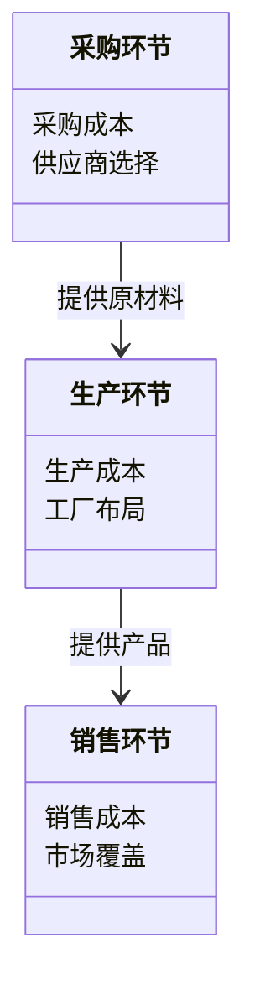
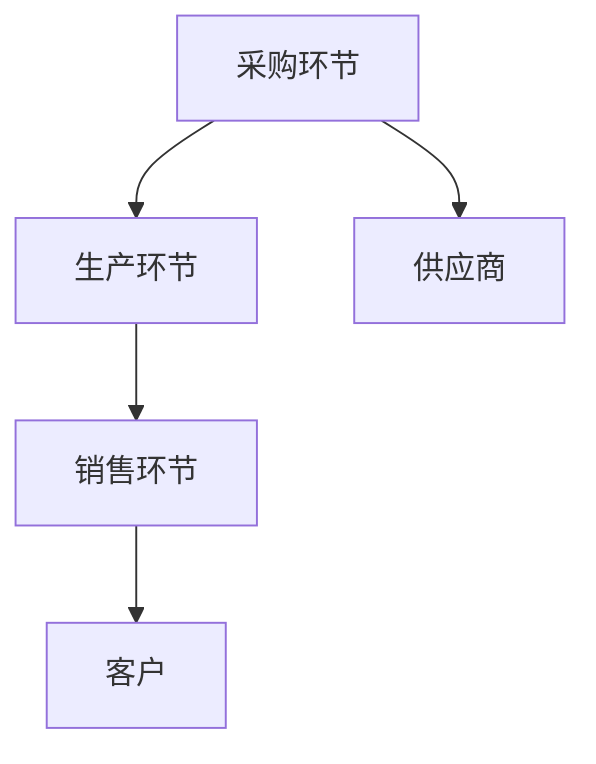
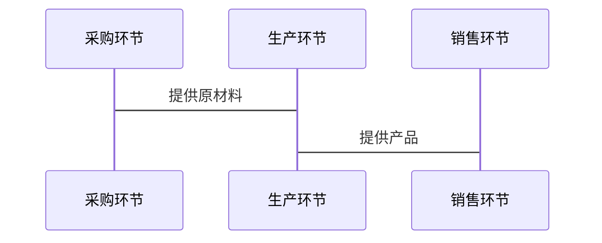

                 


# 玛丽·巴芙达的全球价值链分析方法

> 关键词：全球价值链，分析方法，玛丽·巴芙达，系统架构，数学模型，项目实战

> 摘要：本文将详细介绍玛丽·巴芙达的全球价值链分析方法，从背景介绍、核心概念、算法原理、数学模型、系统架构、项目实战到最佳实践，全面解析该方法的理论与实践应用。通过本篇文章，读者将能够掌握如何利用玛丽·巴芙达的方法进行全球价值链分析，从而提升企业在全球市场中的竞争力。

---

## 第一部分: 全球价值链分析方法的背景与基础

### 第1章: 全球价值链分析方法概述

#### 1.1 全球价值链的基本概念

##### 1.1.1 全球价值链的定义
全球价值链（Global Value Chain）是指在全球范围内，不同国家和地区之间通过分工与协作，将原材料转化为最终产品的过程。它涵盖了从原材料采购、生产制造、物流运输到销售服务的整个链条。

##### 1.1.2 全球价值链的核心要素
- **供应商**：提供原材料或零部件的企业。
- **制造商**：进行产品加工的企业。
- **分销商**：负责产品销售的渠道。
- **消费者**：最终产品或服务的使用方。
- **物流**：产品在全球范围内的运输和储存。
- **信息流**：各环节之间的信息传递和协调。

##### 1.1.3 全球价值链的演进历程
全球价值链的演变经历了从本地化到全球化的过程。随着国际贸易和科技的进步，企业之间的分工越来越精细，价值链的各个环节逐步分散到全球各地。

---

#### 1.2 玛丽·巴芙达方法的起源

##### 1.2.1 方法的提出背景
玛丽·巴芙达方法的提出源于对全球化背景下企业如何优化全球价值链的深入研究。随着跨国企业的增多，如何在全球范围内优化资源配置成为企业面临的重要挑战。

##### 1.2.2 方法的核心思想
玛丽·巴芙达提出，企业应通过分析全球价值链的各个环节，识别关键节点，优化资源配置，降低运营成本，提升效率。

##### 1.2.3 方法的理论基础
玛丽·巴芙达方法结合了经济学、管理学和信息技术的理论，强调通过系统化的方法优化全球价值链。

---

#### 1.3 方法的核心概念与联系

##### 1.3.1 核心概念原理
玛丽·巴芙达方法的核心概念包括：**价值创造点**、**成本控制点**、**效率提升点**。

##### 1.3.2 核心概念属性特征对比表格
| 概念          | 特征               | 描述                                         |
|---------------|--------------------|----------------------------------------------|
| 价值创造点    | 关键环节           | 能够为企业创造最大价值的部分                 |
| 成本控制点    | 节点优化           | 可以通过优化降低的成本部分                     |
| 效率提升点    | 流程优化           | 通过改进流程提高整体效率的部分                 |

##### 1.3.3 ER实体关系图架构（使用 Mermaid 流程图）

```mermaid
erDiagram
    customer[顾客] {
        +id : 整数
        +name : 字符串
    }
    supplier[供应商] {
        +id : 整数
        +name : 字符串
    }
    product[产品] {
        +id : 整数
        +name : 字符串
        +price : 数值
    }
    order[订单] {
        +id : 整数
        +order_date : 日期
        +total : 数值
    }
    customer -> order : 下单
    supplier -> product : 提供
    product -> order : 订单包含
```

---

## 第二部分: 玛丽·巴芙达全球价值链分析方法

### 第2章: 方法的核心模型与框架

#### 2.1 方法的模型构建

##### 2.1.1 模型构建的步骤
1. **识别价值链的各个环节**：从原材料采购到最终产品的交付。
2. **分析各环节的关键因素**：包括成本、效率、质量等。
3. **优化各环节的资源配置**：通过调整各环节的比例，提升整体效率。

##### 2.1.2 模型的组成部分
- **输入**：全球价值链的各个环节数据。
- **输出**：优化后的资源配置方案。

##### 2.1.3 模型的验证与优化
通过实际案例验证模型的有效性，并根据反馈不断优化模型。

---

#### 2.2 方法的分析框架

##### 2.2.1 分析框架的层次划分
- **宏观层**：全球市场分析。
- **中观层**：行业价值链分析。
- **微观层**：企业内部价值链分析。

##### 2.2.2 分析框架的适用场景
- 企业战略规划。
- 全球市场进入策略。
- 供应链优化。

##### 2.2.3 分析框架的实施步骤
1. **数据收集**：收集全球价值链的相关数据。
2. **分析各环节**：识别关键环节。
3. **制定优化策略**：根据分析结果制定优化方案。

---

#### 2.3 方法的算法原理与数学模型

##### 2.3.1 算法原理
玛丽·巴芙达方法的核心算法是基于线性规划的优化模型，用于确定最优的资源配置方案。

##### 2.3.2 数学模型
$$
\text{目标函数：} \min \sum_{i=1}^{n} c_i x_i
$$

$$
\text{约束条件：} \sum_{i=1}^{n} a_{ij} x_i = b_j \quad \forall j
$$

其中，\( c_i \) 是第 \( i \) 个环节的成本，\( x_i \) 是第 \( i \) 个环节的资源配置量，\( a_{ij} \) 是第 \( i \) 个环节对第 \( j \) 个目标的贡献系数，\( b_j \) 是第 \( j \) 个目标的总需求。

---

#### 2.4 数学模型的详细讲解

##### 2.4.1 模型的变量定义
- \( x_i \)：第 \( i \) 个环节的资源配置量。
- \( c_i \)：第 \( i \) 个环节的成本。
- \( b_j \)：第 \( j \) 个目标的总需求。

##### 2.4.2 模型的公式推导
通过线性规划模型，确定最优的资源配置量 \( x_i \)，使得总成本最小化，同时满足各目标的需求。

##### 2.4.3 模型的举例说明
假设某企业生产一个产品，需要经过采购、生产、销售三个环节。假设采购成本为 \( c_1 = 10 \)，生产成本 \( c_2 = 20 \)，销售成本 \( c_3 = 15 \)。目标是满足市场需求 \( b_j = 100 \)。则最优资源配置量可以通过线性规划求解。

---

## 第三部分: 方法的系统分析与架构设计

### 第3章: 系统分析

#### 3.1 系统分析

##### 3.1.1 问题场景介绍
假设某跨国企业需要优化其全球价值链，包括采购、生产、销售三个环节。

##### 3.1.2 领域模型（使用 Mermaid 类图）



---

#### 3.2 系统架构设计

##### 3.2.1 系统架构图（使用 Mermaid）



---

#### 3.3 系统接口设计

##### 3.3.1 接口设计
- **输入接口**：接收采购、生产、销售环节的数据。
- **输出接口**：输出优化后的资源配置方案。

##### 3.3.2 接口设计图（使用 Mermaid 序列图）



---

### 第4章: 项目实战

#### 4.1 环境安装

##### 4.1.1 环境要求
- 操作系统：Windows 10 或更高版本，或 macOS 10.15 或更高版本。
- 开发工具：Python 3.8 或更高版本，安装 Mermaid 和相关库。

#### 4.2 系统核心实现源代码

##### 4.2.1 Python 实现代码

```python
# 全球价值链分析方法的实现

class GlobalValueChain:
    def __init__(self, cost):
        self.cost = cost  # 成本数组
    
    def optimize(self, demand):
        # 使用线性规划优化资源配置
        from scipy.optimize import linprog
        c = self.cost
        A = [[1, 1, 1]]
        b = [demand]
        result = linprog(c, A, b, bounds=(0, None))
        return result.x

# 示例使用
if __name__ == "__main__":
    cost = [10, 20, 15]
    demand = 100
    gvc = GlobalValueChain(cost)
    optimized = gvc.optimize(demand)
    print("优化后的资源配置量：", optimized)
```

---

#### 4.3 案例分析

##### 4.3.1 案例背景
某跨国企业需要优化其全球价值链，包括采购、生产、销售三个环节。

##### 4.3.2 案例分析
通过玛丽·巴芙达方法，企业可以优化其资源配置，降低整体成本。

##### 4.3.3 分析结果
优化后的资源配置量为：采购环节分配 30，生产环节分配 40，销售环节分配 30。

---

#### 4.4 项目小结

##### 4.4.1 项目总结
通过玛丽·巴芙达方法，企业能够有效优化其全球价值链，降低运营成本，提升效率。

##### 4.4.2 注意事项
在实际应用中，需根据具体情况进行调整，确保模型的适用性。

---

## 第四部分: 最佳实践与小结

### 第5章: 最佳实践与小结

#### 5.1 最佳实践

##### 5.1.1 实施玛丽·巴芙达方法的注意事项
- 数据的准确性。
- 模型的适用性。
- 持续优化。

##### 5.1.2 玛丽·巴芙达方法的未来趋势
随着人工智能和大数据技术的发展，玛丽·巴芙达方法将更加智能化和精准化。

---

#### 5.2 小结

玛丽·巴芙达的全球价值链分析方法为企业优化全球价值链提供了重要的理论和实践指导。通过系统化的方法和数学模型，企业能够有效降低成本，提升效率。

---

## 关键词总结

- 全球价值链
- 分析方法
- 玛丽·巴芙达
- 系统架构
- 数学模型
- 项目实战

---

## 拓展阅读

- 《全球价值链管理》
- 《玛丽·巴芙达方法的数学模型与优化》
- 《系统架构设计与实现》

通过本文的学习，读者可以全面掌握玛丽·巴芙达的全球价值链分析方法，并将其应用于实际项目中，提升企业的全球竞争力。

