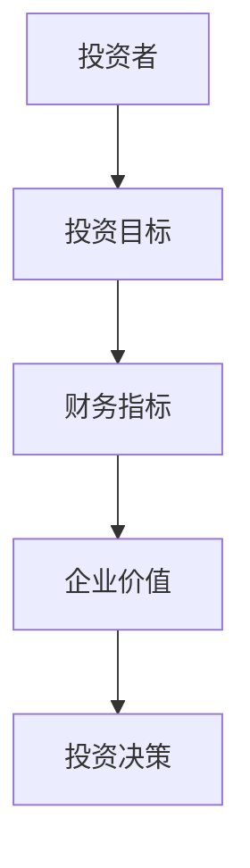

                 

# 玛丽·巴芙达的质量型价值投资理念

---

## 关键词：
质量型价值投资，玛丽·巴芙达，投资策略，企业分析，风险管理

---

## 摘要：
质量型价值投资是一种以企业内在质量和长期价值为核心的投资理念，强调通过深入分析企业的财务状况、竞争优势和治理结构，选择具有持续增长潜力的优质企业进行投资。本文将系统地阐述质量型价值投资的背景、核心理念、数学模型、系统架构、实战案例以及投资心理与风险管理策略，为投资者提供全面的理论和实践指导。

---

## 第一部分: 质量型价值投资的背景与核心理念

### 第1章: 质量型价值投资的起源与核心概念

#### 1.1 质量型价值投资的起源
- **投资学的演进历程**：从早期的“烟堆”式投资到现代的多维度价值评估，质量型投资理念逐步形成。
- **玛丽·巴芙达的生平简介**：作为价值投资的先驱，她的投资理念对巴菲特产生了深远影响。
- **质量型价值投资的核心思想**：强调企业质量、长期稳定性和内在价值，而非短期市场波动。

#### 1.2 质量型价值投资的核心概念
- **价值投资的定义与特点**：
  - 价值投资：通过分析企业的内在价值，寻找被市场低估的投资标的。
  - 特点：注重长期持有、分散投资、逆向思维。
- **质量型投资的内涵与外延**：
  - 内涵：关注企业的财务健康、竞争优势和治理结构。
  - 外延：涵盖消费、金融、科技等多个行业。
- **质量型价值投资的核心要素对比表**：

| 核心要素       | 质量型价值投资 | 其他投资理念 |
|----------------|----------------|--------------|
| 投资目标       | 企业内在价值   | 市场趋势     |
| 投资策略       | 长期持有       | 短期交易     |
| 风险控制       | 企业质量保障   | 市场波动     |

#### 1.3 质量型价值投资与其他投资理念的区别
- **与成长型投资的区别**：
  - 成长型投资注重企业的高增长潜力，而质量型投资注重企业的稳健增长。
- **与趋势投资的区别**：
  - 趋势投资依赖于市场趋势，而质量型投资依赖于企业基本面。
- **与股息投资的区别**：
  - 股息投资注重股息收益，而质量型投资注重企业长期价值。

### 第2章: 质量型价值投资的核心策略

#### 2.1 质量型价值投资的核心策略
- **企业内在价值的评估方法**：
  - 使用DCF模型（现金流折现法）计算企业价值。
  - 关注企业的自由现金流、ROE（净资产收益率）和ROA（资产回报率）。
- **质量型企业的筛选标准**：
  - 财务健康：低负债率、高利润率、稳定的现金流。
  - 竞争优势：独特的商业模式、高市场占有率、强大的品牌影响力。
  - 治理结构：优秀的管理层、透明的公司治理、合理的股权结构。
- **投资组合的构建逻辑**：
  - 分散投资：避免过度集中，降低风险。
  - 长期持有：耐心等待企业的价值实现。

#### 2.2 质量型投资的风险控制策略
- **投资组合的风险分散**：
  - 通过多样化投资降低行业和个股风险。
  - 定期审视和调整投资组合，确保符合质量标准。
- **质量型企业的长期稳定性**：
  - 选择具有持续竞争优势的企业，减少市场波动影响。
- **市场波动的应对策略**：
  - 避免追涨杀跌，坚持价值投资原则。
  - 在市场低迷时增加优质资产配置。

---

## 第二部分: 质量型价值投资的数学模型与算法原理

### 第3章: 质量型价值投资的数学模型与算法原理

#### 3.1 质量型价值投资的数学模型
- **企业内在价值的计算公式**：
  $$ V = \frac{CF}{r - g} $$
  - 其中，CF为自由现金流，r为折现率，g为增长率。
- **股票估值的DCF模型**：
  DCF模型通过预测企业未来现金流，将其折现为当前价值，评估股票的内在价值。
- **投资组合的夏普比率计算**：
  $$ Sharpe Ratio = \frac{E(r - r_f)}{\sigma} $$
  - 其中，E(r - r_f)为投资组合的超额收益，σ为收益的标准差。

#### 3.2 投资决策的算法原理
- **基于质量型指标的决策树模型**：
  通过企业财务指标（如ROE、负债率）和市场指标（如PE、PB）构建决策树，筛选优质企业。
- **质量型投资组合优化的线性规划算法**：
  使用线性规划方法，优化投资组合的收益与风险平衡。
- **质量型投资的风险调整收益算法**：
  在考虑风险的前提下，最大化投资收益，使用夏普比率等指标衡量风险调整后的收益。

---

## 第三部分: 质量型价值投资的系统架构与实现

### 第4章: 质量型价值投资的系统架构与实现

#### 4.1 投资分析系统架构
- **系统功能模块划分**：
  - 数据采集与处理：收集企业财务数据、市场数据等。
  - 质量型指标计算：计算ROE、ROA、负债率等关键指标。
  - 投资组合优化：基于指标结果构建最优投资组合。
- **系统架构的ER实体关系图**：

#### 4.2 投资决策流程
- **数据采集与处理**：
  - 从金融数据库中获取企业的财务数据和市场数据。
- **质量型指标计算**：
  - 计算ROE、ROA、负债率等指标，评估企业的财务健康状况。
- **投资组合优化**：
  - 使用线性规划算法优化投资组合，平衡收益与风险。

---

## 第四部分: 质量型价值投资的实战案例分析

### 第5章: 质量型价值投资的实战案例分析

#### 5.1 案例分析
- **玛丽·巴芙达的经典投资案例**：
  - 投资可口可乐：长期持有，享受企业增长和分红。
  - 投资吉列刀片公司：看重企业的竞争优势和稳定的现金流。
- **投资决策过程**：
  - 数据分析：计算企业的ROE、ROA等指标。
  - 竞争优势分析：评估企业的市场地位和品牌影响力。
  - 风险评估：分析企业的财务健康状况和行业风险。

---

## 第五部分: 质量型价值投资的投资心理与风险管理

### 第6章: 投资心理与风险管理

#### 6.1 投资心理
- **贪婪与恐惧的克服**：
  - 避免追涨杀跌，坚持价值投资。
  - 在市场恐慌时寻找机会，在市场狂热时保持冷静。
- **耐心与纪律的培养**：
  - 长期持有优质企业，避免频繁交易。

#### 6.2 风险管理策略
- **分散投资**：
  - 通过多样化投资降低风险。
  - 定期审视和调整投资组合。
- **风险预警机制**：
  - 监测企业的财务状况和市场环境变化。
  - 在风险加剧时及时调整投资策略。

---

## 总结

质量型价值投资是一种以企业内在价值为核心的投资理念，强调长期持有优质企业，注重财务健康和竞争优势。通过系统的数学模型和风险控制策略，投资者可以更好地把握投资机会，实现长期稳健的收益。玛丽·巴芙达的投资理念为现代价值投资提供了宝贵的实践经验，值得投资者深入研究和借鉴。

---

**Tips:**
- **长期视角**：质量型价值投资需要耐心和纪律，避免短期市场的波动干扰。
- **风险管理**：通过分散投资和风险预警机制，降低投资组合的整体风险。
- **持续学习**：市场环境不断变化，投资者需要持续学习和调整投资策略。

---

**注意事项：**
- 投资有风险，入市需谨慎。本文内容仅为理论分析，实际投资需结合市场实际情况。
- 本文涉及的数学模型和算法仅为示例，具体实现需根据实际情况调整。

---

**拓展阅读：**
- 巴菲特的《致股东的信》
- 彼得·林奇的《选股的艺术》
- 约翰·邓普顿的《投资的成功之道》

