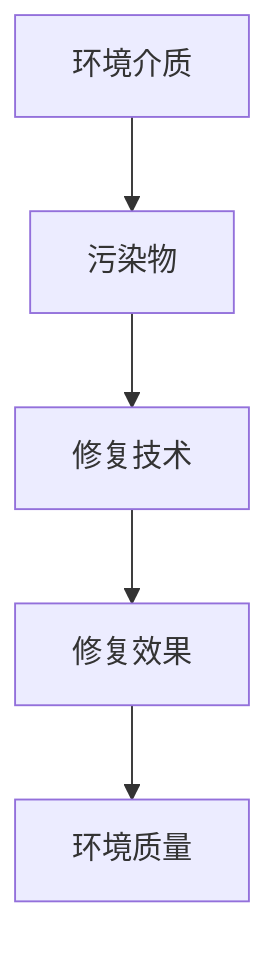
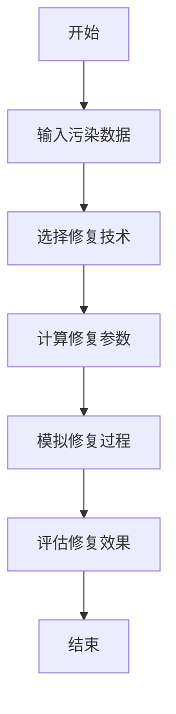
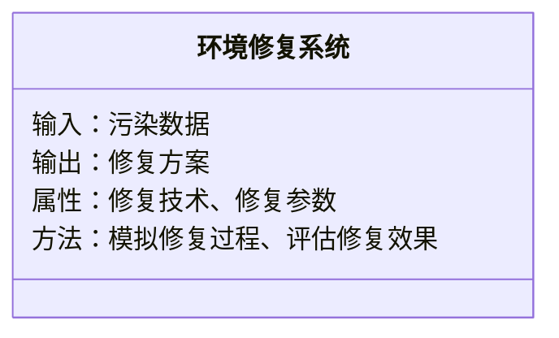
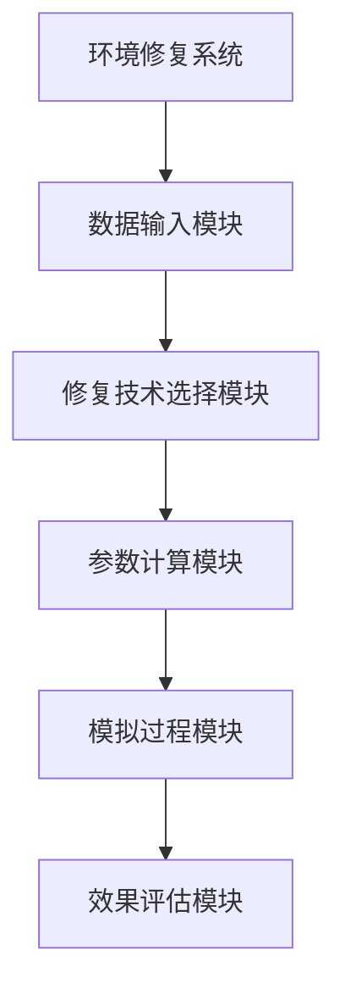

                 

# 《环境修复技术公司的市场前景与投资机会》

---

## 关键词：
环境修复技术、市场前景、投资机会、技术原理、商业模式

---

## 摘要：
本篇文章深入探讨环境修复技术公司的市场前景与投资机会，从技术原理、市场需求、商业模式等多维度进行分析，揭示环境修复技术在环保领域的巨大潜力。文章通过详细的技术分析、市场数据和实际案例，为投资者提供清晰的决策参考，帮助其抓住环境修复技术带来的投资机遇。

---

# 第一部分：环境修复技术公司的背景介绍

## 第1章：环境修复技术的定义与背景

### 1.1 环境修复技术的定义
环境修复技术是指通过物理、化学或生物方法，修复被污染的土壤、水源和空气等环境介质，使其恢复到可接受的环境质量水平的技术。这些技术广泛应用于工业污染治理、生态修复等领域。

### 1.2 环境修复技术的背景
随着工业化进程的加快，环境污染问题日益严重，环境修复技术成为解决这一问题的重要手段。政府政策的推动、公众环保意识的增强以及技术的进步，为环境修复技术的发展提供了良好的市场环境。

### 1.3 环境修复技术的市场需求
环境污染的严重性、法律法规的严格要求以及企业社会责任的增强，推动了环境修复技术的市场需求不断增长。特别是在土壤修复和水污染治理领域，市场需求潜力巨大。

---

## 第2章：环境修复技术的核心概念

### 2.1 环境修复技术的核心原理
环境修复技术的核心原理包括：
1. **物理修复**：通过物理手段（如挖掘、过滤）去除污染物。
2. **化学修复**：利用化学反应将污染物转化为无害物质。
3. **生物修复**：利用微生物等生物因子降解污染物。

### 2.2 不同修复技术的优缺点对比

| 技术类型       | 优点                         | 缺点                           |
|----------------|------------------------------|--------------------------------|
| 物理修复       | 操作简单，效果显著           | 成本较高，适用于小范围修复     |
| 化学修复       | 修复速度快，适用范围广       | 可能产生二次污染               |
| 生物修复       | 环保性强，成本低             | 修复周期长，效果有限           |

### 2.3 环境修复技术的ER实体关系图

---

## 第3章：环境修复技术的算法原理

### 3.1 环境修复技术的算法概述
环境修复技术的算法主要涉及污染物的迁移、降解和修复过程的模拟。通过建立数学模型，可以预测修复效果并优化修复方案。

### 3.2 污染物迁移模型
$$ C(x,t) = \frac{Q}{2\pi D} e^{-x^2/(4 D t)} $$
其中，$C(x,t)$表示污染物浓度，$Q$为源强，$D$为扩散系数，$x$为空间坐标，$t$为时间。

### 3.3 修复效率计算公式
$$ E = \frac{C_{\text{初始}} - C_{\text{最终}}}{C_{\text{初始}}} \times 100\% $$
其中，$C_{\text{初始}}$为初始污染物浓度，$C_{\text{最终}}$为修复后的污染物浓度。

### 3.4 算法流程图

---

## 第4章：环境修复技术的系统分析与架构设计

### 4.1 系统分析
环境修复技术的系统分析包括：
1. **问题场景**：识别环境污染问题及其修复需求。
2. **领域模型**：构建污染-修复-效果的系统模型。

### 4.2 系统架构设计
环境修复技术的系统架构设计包括：
1. **功能模块**：数据输入、技术选择、参数计算、模拟过程、效果评估。
2. **系统架构图**：

---

## 第5章：环境修复技术的市场分析与商业模式

### 5.1 环境修复技术的市场需求
随着环保政策的加强和公众环保意识的提升，环境修复技术的市场需求持续增长。特别是在工业污染治理和生态修复领域，市场潜力巨大。

### 5.2 环境修复技术的商业模式
环境修复技术的商业模式主要包括：
1. **技术授权模式**：将修复技术授权给企业使用。
2. **服务外包模式**：提供修复服务，按效果收费。
3. **PPP模式**：政府与企业合作，共同承担修复成本。

### 5.3 投资机会分析
环境修复技术的投资机会主要集中在以下几个方面：
1. **技术创新**：研发新型修复技术，提高修复效率和降低成本。
2. **市场拓展**：在新兴市场中推广环境修复技术。
3. **政策支持**：利用政府政策支持，获取资金和资源。

---

## 第6章：环境修复技术的未来展望

### 6.1 技术发展趋势
环境修复技术的未来发展趋势包括：
1. **智能化修复**：利用人工智能和大数据优化修复过程。
2. **绿色修复**：减少修复过程中的资源消耗和环境污染。
3. **多技术融合**：将物理、化学和生物修复技术有机结合，提高修复效果。

### 6.2 市场发展趋势
随着环保意识的增强和政策支持的加大，环境修复技术的市场将保持快速增长。特别是在土壤修复和水污染治理领域，市场潜力巨大。

### 6.3 投资建议
投资者应重点关注以下领域：
1. **技术创新**：投资于新型修复技术的研发。
2. **市场拓展**：布局新兴市场，扩大业务范围。
3. **政策支持**：利用政策支持，降低投资成本。

---

## 第7章：最佳实践与小结

### 7.1 最佳实践
1. **技术创新**：持续改进修复技术，提高修复效率和降低成本。
2. **市场拓展**：积极开拓新兴市场，扩大业务范围。
3. **政策支持**：充分利用政府政策，获取资金和资源支持。

### 7.2 小结
环境修复技术在环保领域具有重要的地位和广阔的市场前景。通过技术创新、市场拓展和政策支持，环境修复技术公司将迎来更多的投资机会和更大的发展空间。

---

## 参考文献
1. 环境修复技术相关文献
2. 环境保护政策文件
3. 相关技术专利和研究报告

---

## 拓展阅读
1. 《环境修复技术的核心原理与应用》
2. 《环境修复技术的商业模式与投资策略》
3. 《环境修复技术的未来发展趋势与挑战》

--- 

这篇文章详细探讨了环境修复技术公司的市场前景与投资机会，从技术原理、市场需求、商业模式等多个维度进行了深入分析，为投资者提供了清晰的决策参考。

