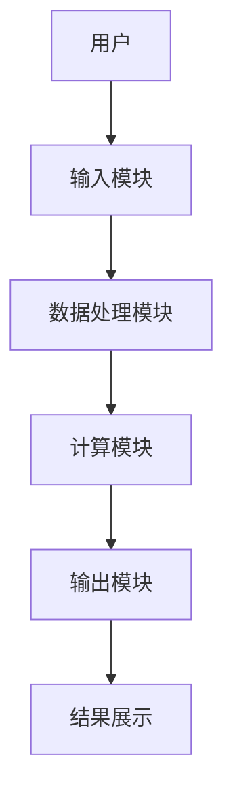
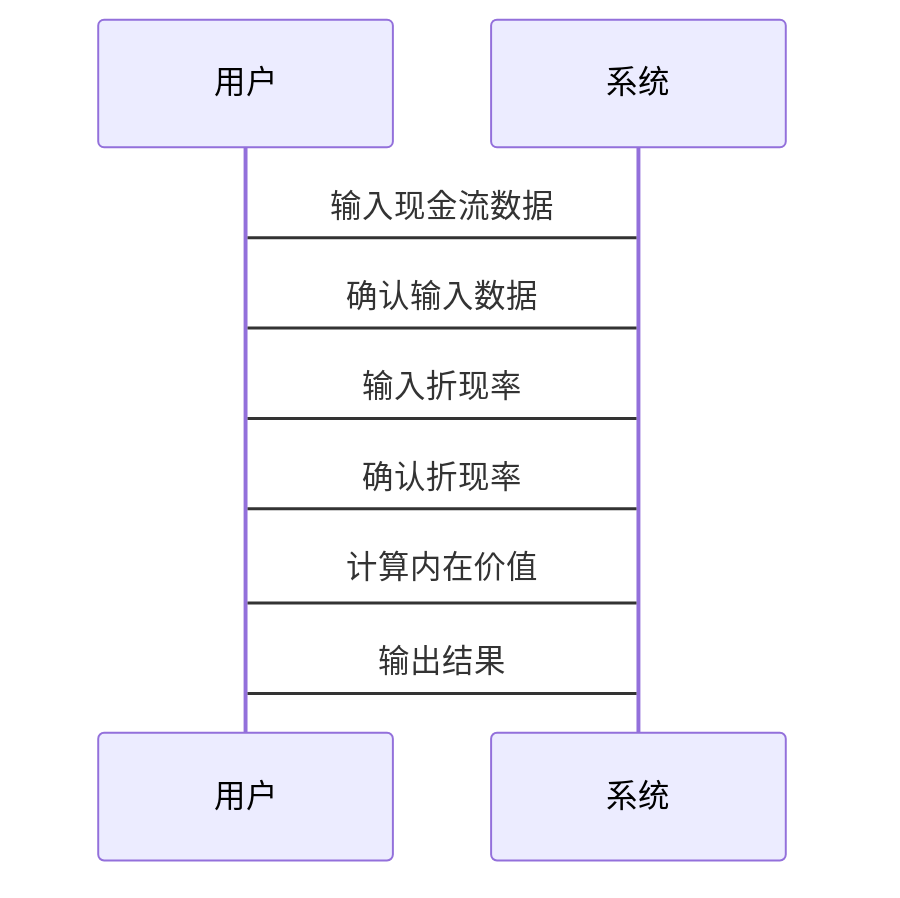

                 


# 现金流折现模型：企业内在价值的科学估算方法

> **关键词**：现金流折现模型，企业价值评估，贴现率，内在价值，现值计算，投资分析

> **摘要**：现金流折现模型（DCF模型）是一种科学估算企业内在价值的重要方法，通过将未来现金流折现至现值，帮助投资者评估企业的长期投资价值。本文将从基础概念、数学模型、系统架构到实际案例，详细讲解现金流折现模型的核心原理和应用方法。

---

## 第一部分: 现金流折现模型基础

### 第1章: 现金流折现模型概述

#### 1.1 现金流折现模型的背景与意义

现金流折现模型（Discounted Cash Flow Model, DCF模型）是企业价值评估中最常用的方法之一。它通过将企业未来产生的现金流折现，计算出企业的内在价值，从而为投资决策提供科学依据。

- **背景**：企业价值的评估需要考虑其未来现金流的现值。DCF模型能够将未来的不确定性转化为当前的价值，帮助投资者识别潜在的投资机会。
- **意义**：DCF模型不仅能够评估企业的整体价值，还能用于项目评估、并购分析和资本预算等场景。

#### 1.2 现金流折现模型的核心概念

- **现金流**：企业未来产生的现金流入和流出，包括经营现金流、投资现金流和筹资现金流。
- **折现率**：用于将未来现金流折现为现值的利率，通常包括无风险利率和风险溢价。
- **内在价值**：企业未来现金流的现值，反映了其真实价值。

### 第2章: 现金流折现模型的数学基础

#### 2.1 现金流的现值计算

现金流的现值计算是DCF模型的核心步骤。现值公式如下：

$$
PV = \frac{CF}{(1 + r)^t}
$$

其中，$CF$ 是现金流，$r$ 是折现率，$t$ 是时间。

#### 2.2 贴现率的确定

贴现率通常包括无风险利率和风险溢价。WACC（加权平均资本成本）是常用的贴现率计算方法：

$$
WACC = w_d \cdot r_d + w_e \cdot r_e
$$

其中，$w_d$ 和 $w_e$ 是债务和股权的权重，$r_d$ 和 $r_e$ 是债务和股权的资本成本。

#### 2.3 永续年金与增长型现金流的现值计算

- **永续年金**：假设现金流恒定，现值公式为：

$$
PV = \frac{CF}{r}
$$

- **增长型现金流**：假设现金流以固定增长率 $g$ 增长，现值公式为：

$$
PV = \frac{CF}{r - g}
$$

---

## 第二部分: 现金流折现模型的核心原理

### 第3章: 现金流折现模型的系统分析与架构设计

#### 3.1 系统功能设计

- **数据输入**：现金流、折现率等参数的输入。
- **模型计算**：现值计算、贴现率调整、内在价值评估。
- **结果输出**：内在价值、敏感性分析、投资决策建议。

#### 3.2 系统架构设计

使用Mermaid图表示系统架构：



#### 3.3 系统交互设计

使用Mermaid图表示系统交互流程：



---

## 第三部分: 项目实战

### 第4章: 现金流折现模型的项目实现

#### 4.1 环境安装

- **工具**：Python、NumPy、Matplotlib。
- **安装命令**：
  ```bash
  pip install numpy matplotlib
  ```

#### 4.2 核心代码实现

```python
import numpy as np

def discounted_cash_flow(cash_flows, discount_rate):
    return np.npv(discount_rate, cash_flows)

# 示例数据
cash_flows = [-100, 200, 300, 400]
discount_rate = 0.10

# 计算现值
pv = discounted_cash_flow(cash_flows, discount_rate)
print(f"现值: {pv}")
```

#### 4.3 案例分析

假设某企业未来5年的现金流分别为100万、150万、200万、250万和300万，折现率为10%。现值计算如下：

$$
PV = \frac{100}{1.1^1} + \frac{150}{1.1^2} + \frac{200}{1.1^3} + \frac{250}{1.1^4} + \frac{300}{1.1^5}
$$

计算结果为：

$$
PV \approx 620.93 \text{万元}
$$

---

## 第四部分: 总结与展望

### 第5章: 总结

现金流折现模型是企业价值评估的重要工具，通过科学计算未来现金流的现值，帮助投资者做出合理的投资决策。本文详细讲解了DCF模型的核心原理、系统架构和实际应用，为读者提供了全面的理论和实践指导。

### 5.2 小结

- **最佳实践**：选择合理的折现率，考虑企业的风险和市场环境。
- **注意事项**：模型结果仅供参考，需结合实际进行调整。
- **拓展阅读**：深入学习WACC模型和风险调整贴现率方法。

---

## 附录: 现金流折现模型的数学公式汇总

- **现值公式**：

$$
PV = \sum_{t=1}^{n} \frac{CF_t}{(1 + r)^t}
$$

- **WACC公式**：

$$
WACC = w_d \cdot r_d + w_e \cdot r_e
$$

- **永续年金公式**：

$$
PV = \frac{CF}{r}
$$

---

通过以上内容，您可以全面掌握现金流折现模型的理论与实践，为企业价值评估提供科学依据。

