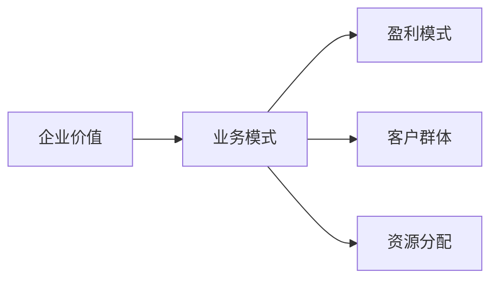
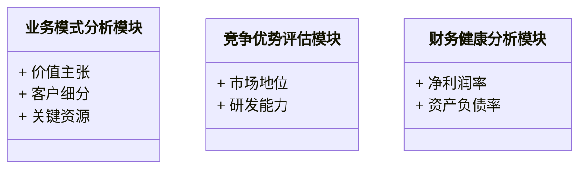

                 


# 理解业务模式：巴菲特选股的第一步

> 关键词：业务模式，巴菲特选股，投资策略，竞争优势，财务分析

> 摘要：本文深入探讨了业务模式分析在巴菲特选股中的核心作用，通过系统的方法和实际案例，揭示了如何通过理解企业的业务模式和竞争优势来做出明智的投资决策。文章从背景介绍、核心概念、系统分析到项目实战，全面阐述了如何将业务模式分析应用于投资实践。

---

## 第一部分: 业务模式与巴菲特选股的背景

### 第1章: 业务模式的核心概念

#### 1.1 业务模式的定义与特征

##### 1.1.1 业务模式的定义
业务模式（Business Model）描述了企业如何创造价值、传递价值和获取价值的基本逻辑。它包括企业的核心产品或服务、目标客户、资源分配、价值主张以及盈利方式。简单来说，业务模式是企业实现可持续盈利的路径。

##### 1.1.2 业务模式的特征
| 特征 | 描述 |
|------|------|
| 独特性 | 每个企业的业务模式都是独特的，反映了其市场定位和竞争优势。 |
| 可扩展性 | 优秀的业务模式具有良好的扩展性，能够适应市场变化和规模增长。 |
| 可持续性 | 业务模式必须能够在较长的时间内为公司创造价值，而不仅仅是一个短期的策略。 |
| 竞争性 | 业务模式必须能够在竞争激烈的市场中生存并获得超额利润。 |

##### 1.1.3 业务模式与企业价值的关系
业务模式是企业价值的源泉。通过分析业务模式，投资者可以判断企业的盈利能力和成长潜力。例如，一家公司如果拥有独特的竞争优势（如专利技术）和稳定的客户群体，其业务模式往往能够带来持续的高回报。

**图1.1：业务模式与企业价值的关系**


#### 1.2 巴菲特投资理念的形成

##### 1.2.1 巴菲特的投资哲学
巴菲特的投资哲学基于价值投资，他强调购买具有强大竞争优势的企业，并长期持有这些企业。他的选股标准包括企业具有持续的盈利能力、强大的管理团队和合理的估值。

##### 1.2.2 巴菲特选股方法的演变
从早期的低市盈率选股到后来的买入并持有优质企业的策略，巴菲特的方法不断完善。他的成功证明了深入分析企业的业务模式和财务状况是选股的关键。

### 第2章: 巴菲特选股方法的核心要素

#### 2.1 企业的竞争优势

##### 2.1.1 什么是竞争优势？
竞争优势是企业在市场上胜过竞争对手的独特能力或资源。例如，苹果的创新能力和品牌忠诚度就是其竞争优势。

#### 2.1.2 如何评估竞争优势？
- 分析企业的核心产品或服务是否具有独特性。
- 考察企业的市场地位，如是否是行业领导者。
- 评估企业的研发能力，是否能够持续创新。

#### 2.2 企业的财务健康

##### 2.2.1 财务健康的重要性
健康的财务状况是企业长期盈利的基础。投资者需要关注企业的盈利能力、资产负债情况和现金流。

##### 2.2.2 财务指标分析
- **净利润率**：衡量企业的盈利能力。
- **资产负债率**：衡量企业的财务杠杆风险。
- **现金流**：衡量企业的经营健康状况。

#### 2.3 企业的管理团队

##### 2.3.1 管理团队的作用
一个优秀的管理团队能够带领企业不断前进，抓住市场机会，应对挑战。

##### 2.3.2 如何评估管理团队？
- 考察管理团队的历史业绩。
- 了解团队的稳定性。
- 分析团队的战略规划能力。

---

## 第二部分: 业务模式的系统分析

### 第3章: 业务模式的分析框架

#### 3.1 业务模式的构成要素

##### 3.1.1 价值主张
价值主张是企业向客户提供的价值，包括产品或服务的独特性。

##### 3.1.2 客户细分
客户细分是指将市场分为不同的客户群体，每个群体有不同的需求和特征。

##### 3.1.3 关键资源
关键资源是企业成功运营所必需的资源，包括人力、技术和财务资源。

**图3.1：业务模式的构成要素**


#### 3.2 业务模式的类型

##### 3.2.1 销售模式
通过直接销售或分销商将产品或服务卖给客户。

##### 3.2.2 订阅模式
客户定期支付费用，持续获得产品或服务。

##### 3.2.3 平台模式
通过构建平台，连接供需双方，创造多方价值。

### 第4章: 业务模式的数学模型与分析

#### 4.1 业务模式的数学建模

##### 4.1.1 业务模式的变量定义
- 收入（Revenue）
- 成本（Cost）
- 利润（Profit）

##### 4.1.2 业务模式的数学公式
$$ 利润 = 收入 - 成本 $$

##### 4.1.3 业务模式的优化模型
通过优化收入和成本，最大化利润。例如，通过提高价格或降低成本来增加利润。

#### 4.2 业务模式的算法实现

##### 4.2.1 算法原理
使用线性回归模型预测收入和成本，进而预测利润。

##### 4.2.2 算法流程图


##### 4.2.3 算法实现代码
```python
import numpy as np
from sklearn.linear_model import LinearRegression

# 输入数据
X = np.array([[100, 200], [200, 300], [300, 400]])  # 收入和成本
y = np.array([100, 200, 300])  # 利润

# 建立模型
model = LinearRegression()
model.fit(X, y)

# 预测结果
predicted_profit = model.predict([[400, 500]])
print(predicted_profit)
```

---

## 第三部分: 巴菲特选股方法的实战分析

### 第5章: 业务模式的系统架构设计

#### 5.1 系统功能设计

##### 5.1.1 业务模式分析模块
分析企业的业务模式，包括价值主张、客户细分和关键资源。

##### 5.1.2 竞争优势评估模块
评估企业的竞争优势，包括市场地位和研发能力。

##### 5.1.3 财务健康分析模块
分析企业的财务状况，包括净利润率和资产负债率。

**图5.1：系统功能设计类图**


#### 5.2 系统架构设计

##### 5.2.1 系统架构图


### 第6章: 项目实战与案例分析

#### 6.1 项目环境安装与配置

##### 6.1.1 系统环境要求
- 操作系统：Windows 10或更高版本
- Python：3.8或更高版本
- 必要的库：numpy、scikit-learn

##### 6.1.2 开发工具安装
安装Jupyter Notebook和Python环境。

##### 6.1.3 数据库配置
配置MySQL数据库，用于存储企业的业务模式数据。

#### 6.2 核心代码实现

##### 6.2.1 业务模式分析代码
```python
import pandas as pd
import numpy as np

# 加载数据
data = pd.read_csv('business_model.csv')

# 分析收入和成本
revenue = data['收入']
cost = data['成本']
profit = data['利润']

# 计算净利润率
net_margin = (profit / revenue) * 100
print("净利润率：", net_margin.mean())
```

##### 6.2.2 竞争优势评估代码
```python
import numpy as np
from sklearn.metrics import accuracy_score

# 加载数据
data = pd.read_csv('competitive_edge.csv')

# 评估市场地位
market_share = data['市场占有率']
# 评估研发能力
r_and_d = data['研发支出']

# 训练模型
model = LinearRegression()
model.fit(market_share.values.reshape(-1, 1), r_and_d)

# 预测结果
predicted_r_and_d = model.predict([[0.7]])
print("预测的研发支出：", predicted_r_and_d)
```

---

## 第四部分: 业务模式的动态变化与应对策略

### 第7章: 业务模式的动态变化分析

#### 7.1 行业趋势对业务模式的影响

##### 7.1.1 技术变革的影响
技术进步可能导致传统业务模式的转型，例如电子商务的兴起改变了零售业的业务模式。

##### 7.1.2 市场需求的变化
消费者偏好的变化可能迫使企业调整其价值主张和客户细分。

##### 7.1.3 竞争格局的演变
新竞争者的加入或现有竞争者的策略调整可能影响企业的业务模式。

#### 7.2 企业转型与业务模式创新

##### 7.2.1 如何应对变化？
- 定期评估业务模式的有效性。
- 寻找新的市场机会。
- 投资于技术研发和人才培养。

---

## 第五部分: 总结与展望

### 第8章: 投资策略与风险管理

#### 8.1 长期投资视角

##### 8.1.1 长期投资的重要性
长期投资能够跨越短期市场波动，抓住企业的长期增长潜力。

##### 8.1.2 风险管理
通过分散投资和严格的风险评估，降低投资组合的风险。

### 第9章: 最佳实践与小结

#### 9.1 最佳实践
- 深入研究企业的业务模式。
- 关注企业的竞争优势和财务健康。
- 保持长期投资视角。

#### 9.2 小结
通过理解业务模式，投资者可以更好地识别具有长期增长潜力的企业，从而做出更明智的投资决策。

---

# 关键词总结：
- 业务模式
- 巴菲特选股
- 投资策略
- 竞争优势
- 财务分析

---

# 总结：
通过本文的分析，读者可以掌握如何从业务模式的角度分析企业，从而更好地应用巴菲特的选股方法。理解业务模式不仅是投资的关键，也是企业持续增长的核心。希望本文能够为投资者提供有价值的见解和实用的工具。

