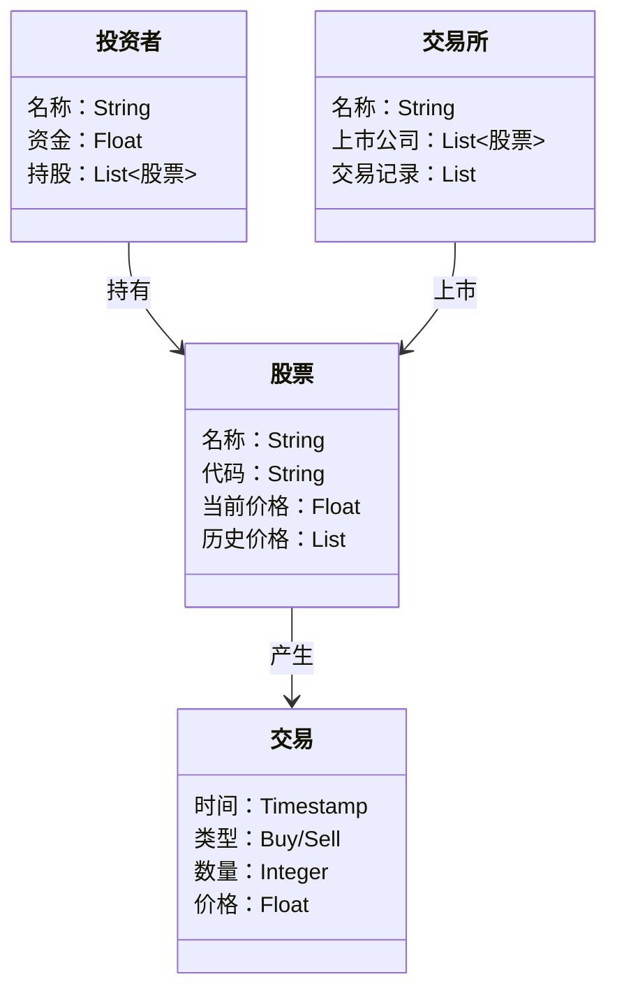
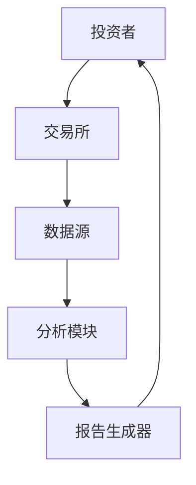
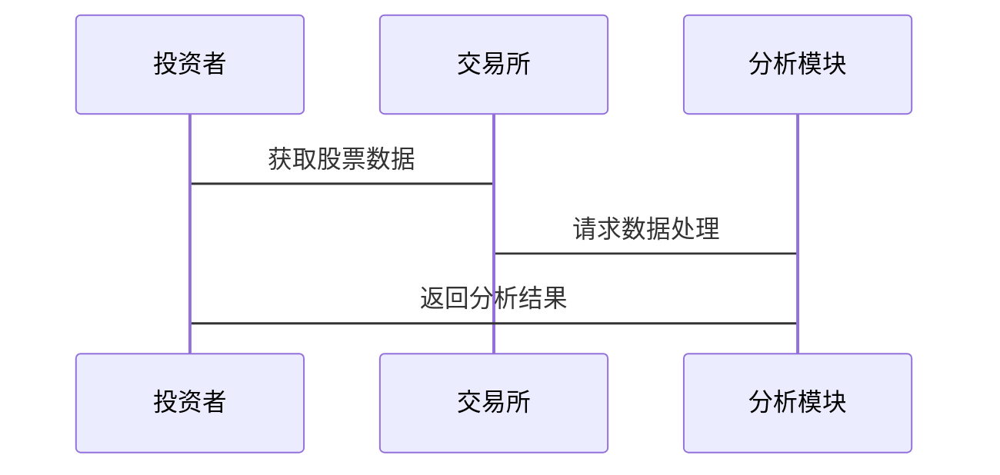

                 


# 瑞典股市估值:北欧经济强国的市场表现

> 关键词：瑞典股市, 估值, 宏观经济, 技术分析, 投资策略

> 摘要：本文深入分析瑞典股市的估值情况，探讨其宏观经济因素、行业分析、技术分析及投资策略。通过系统分析和实际案例，为投资者提供清晰的指导和建议。

---

## 第一部分: 瑞典经济与股市概述

### 第1章: 瑞典经济的基本情况

#### 1.1 瑞典经济体系与特点

- 瑞典经济的特点：高福利、低失业率、高创新能力。
- 瑞典在北欧经济中的地位：作为欧元区之外的重要经济体，具有较高的稳定性和吸引力。
- 瑞典股市的历史与发展：从19世纪末开始，经历了多次波动，但整体表现稳定。

#### 1.2 瑞典股市的基本结构

- 主要股票交易所：纳斯达克 OMX 斯德哥尔摩交易所。
- 主要指数： OMX Stockholm 30 指数。
- 行业分布：涵盖信息技术、金融、制造业等多个领域。

#### 1.3 瑞典股市的投资环境

- 金融监管体系：严格且透明，保护投资者利益。
- 市场流动性：高，交易活跃。
- 国际化程度：较高，吸引外资流入。

### 1.4 本章小结

通过本章，读者可以了解瑞典经济的基本情况及其对股市的影响，为后续分析奠定基础。

---

## 第二部分: 宏观经济因素对瑞典股市的影响

### 第2章: 宏观经济指标与股市的关系

#### 2.1 GDP与股市的关系

- GDP增长与股市指数的相关性分析：经济增长通常带动股市上涨。
- 数据分析：瑞典近年来的GDP增长与股市指数的同步性。

#### 2.2 央行利率对股市的影响

- 利率变化对股市的影响：低利率环境有利于股市上涨。
- 数据分析：瑞典央行利率调整与股市指数的变动。

#### 2.3 汇率对股市的影响

- 汇率波动对出口型企业的影响：汇率下降有利于出口，提升企业盈利。

### 2.3 本章小结

通过分析宏观经济指标，投资者可以更好地理解股市的波动原因，并据此制定投资策略。

---

## 第三部分: 瑞典股市的行业分析

### 第3章: 行业分析方法与工具

#### 3.1 行业PE与市盈率分析

- PE指标的定义：市盈率=股价/每股收益。
- 行业PE分析：低于行业平均水平的行业可能具有投资价值。

#### 3.2 行业ROE与盈利能力分析

- ROE指标的定义：净资产收益率=净利润/平均净资产。
- 行业ROE分析：高ROE行业通常具有较强的盈利能力。

#### 3.3 行业增长潜力分析

- 行业增长潜力的评估方法：结合行业发展趋势和市场需求。

### 3.4 重点行业的投资机会

#### 3.4.1 信息技术行业的投资机会

- 行业现状：技术创新驱动增长。
- 投资建议：关注具有高成长性的科技公司。

#### 3.4.2 金融行业的投资机会

- 行业现状：稳定且收益较高。
- 投资建议：选择具有良好风险管理能力的银行或保险公司。

#### 3.4.3 制造业行业的投资机会

- 行业现状：注重高端制造和技术创新。
- 投资建议：关注新能源和环保设备制造企业。

### 3.5 本章小结

通过分析各行业的表现和潜力，投资者可以找到具有投资价值的行业和企业。

---

## 第四部分: 瑞典股市的技术分析

### 第4章: 技术分析的基本概念

#### 4.1 移动平均线（MA）

- MA的定义：一定时期内股价的平均值。
- MA的应用：用于判断趋势和支撑位。

#### 4.2 相对强弱指数（RSI）

- RSI的定义：衡量股价超买或超卖状态的指标。
- RSI的应用：RSI低于30时可能为超卖，RSI高于70时可能为超买。

#### 4.3 布林格带（Bollinger Bands）

- Bollinger Bands的定义：由三条曲线组成的指标，用于衡量股价的波动性。
- Bollinger Bands的应用：股价在上下轨之间波动，突破上轨可能为买入信号，突破下轨可能为卖出信号。

### 4.4 技术分析策略

#### 4.4.1 趋势跟踪策略

- 策略描述：跟随趋势，突破趋势线时买入或卖出。
- 优势：在趋势性较强的市场中表现较好。

#### 4.4.2 超买超卖策略

- 策略描述：利用RSI等指标寻找超买或超卖机会。
- 优势：适合短期交易者。

#### 4.4.3 支撑与阻力策略

- 策略描述：在支撑位买入，在阻力位卖出。
- 优势：利用价格波动的规律性。

### 4.5 本章小结

技术分析为投资者提供了丰富的工具和策略，帮助他们更好地把握市场趋势。

---

## 第五部分: 瑞典股市的投资策略

### 第5章: 投资策略的核心要素

#### 5.1 价值投资策略

- 策略描述：寻找被市场低估的股票，长期持有。
- 核心理念：关注企业的基本面，寻找具有持续盈利能力的企业。

#### 5.2 成长投资策略

- 策略描述：投资于成长性良好的企业，预期未来收益增长。
- 核心理念：关注企业的成长潜力和创新能力。

#### 5.3 技术投资策略

- 策略描述：基于技术分析信号进行买卖决策。
- 核心理念：通过技术指标预测价格波动。

### 5.2 风险管理策略

#### 5.2.1 投资组合分散化

- 分散化的重要性：降低特定资产的风险。
- 实现方法：将资金分配到不同行业、不同资产类别中。

#### 5.2.2 止损策略

- 止损的定义：设定一个价格水平，当价格下跌至该水平时立即卖出以限制亏损。
- 止损的应用：在技术分析中常用，帮助投资者控制风险。

### 5.3 本章小结

通过合理的投资策略和风险管理，投资者可以提高投资收益并降低风险。

---

## 第六部分: 瑞典股市的系统分析与架构设计

### 第6章: 系统分析与架构设计方案

#### 6.1 领域模型设计

- 使用mermaid绘制领域模型类图，展示系统的主要实体及其关系。



#### 6.2 系统架构设计

- 使用mermaid绘制系统架构图，展示系统的各个模块及其交互。



### 6.3 系统接口设计

- API接口设计：RESTful API，用于获取股票数据、执行交易等。

### 6.4 系统交互设计

- 使用mermaid绘制序列图，展示投资者、交易所和分析模块的交互流程。



### 6.5 本章小结

通过系统分析和架构设计，投资者可以更好地理解瑞典股市的运作机制，并利用技术手段优化投资决策。

---

## 第七部分: 项目实战

### 第7章: 瑞典股市估值的实战分析

#### 7.1 环境安装

- 安装必要的工具：Python、Pandas、Matplotlib、Scikit-learn。

#### 7.2 核心实现源代码

- 示例代码：使用Python进行股票数据分析和估值模型构建。

```python
import pandas as pd
import numpy as np
import matplotlib.pyplot as plt
from sklearn.linear_model import LinearRegression

# 加载数据
data = pd.read_csv('swedish_stocks.csv')

# 数据预处理
data['date'] = pd.to_datetime(data['date'])
data.set_index('date', inplace=True)

# 计算移动平均线
data['MA_50'] = data['close'].rolling(50).mean()

# 计算相对强弱指数
data['RSI'] = data['close'].rolling(14).apply(lambda x: (x[-1] - x[0])/x[0] * 100)

# 可视化
plt.figure(figsize=(12, 6))
plt.plot(data['close'], label='Close Price')
plt.plot(data['MA_50'], label='50-Day MA')
plt.title('Stock Price and MA')
plt.xlabel('Date')
plt.ylabel('Price')
plt.legend()
plt.show()

# 建立线性回归模型
model = LinearRegression()
X = data[['open', 'high', 'low', 'volume']]
y = data['close']
model.fit(X, y)

# 预测
predicted = model.predict(X)
plt.scatter(y, predicted)
plt.xlabel('Actual Price')
plt.ylabel('Predicted Price')
plt.title('Linear Regression: Actual vs Predicted')
plt.show()
```

#### 7.3 实际案例分析

- 选取某段时间内的股票数据，进行估值分析和预测。

#### 7.4 代码应用解读与分析

- 解释代码的功能：数据加载、预处理、指标计算、可视化、模型建立与预测。

### 7.5 本章小结

通过实战分析，读者可以将理论知识应用于实际操作，提升数据分析和投资决策能力。

---

## 第八部分: 总结与展望

### 第8章: 总结与注意事项

#### 8.1 投资总结

- 瑞典股市整体表现稳定，具有较高的投资潜力。
- 信息技术和金融行业具有较高的投资价值。

#### 8.2 投资注意事项

- 注意宏观经济风险，如全球经济波动和地缘政治风险。
- 保持分散投资，合理配置资产。

### 8.3 未来展望

- 随着技术进步和全球经济的变化，瑞典股市将继续展现出独特的投资机会。

---

## 第九部分: 最佳实践与小结

### 第9章: 最佳实践 tips

#### 9.1 投资策略建议

- 长期投资者应关注企业的基本面和成长潜力。
- 短期投资者应结合技术分析和市场情绪进行交易。

#### 9.2 风险管理技巧

- 设定止损点，避免重大亏损。
- 定期评估投资组合，及时调整。

### 9.3 本章小结

通过本文的分析，投资者可以更好地把握瑞典股市的投资机会，并通过合理的策略和风险管理实现稳健的投资收益。

---

## 第十部分: 拓展阅读

### 第10章: 拓展阅读推荐

- 推荐书籍：《投资学》、《技术分析的理论与实践》。
- 推荐网站：纳斯达克 OMX 官网、瑞典央行网站。

---

通过以上结构，文章从宏观到微观，从理论到实践，全面分析了瑞典股市的估值和市场表现，为投资者提供了详实的指导和建议。

