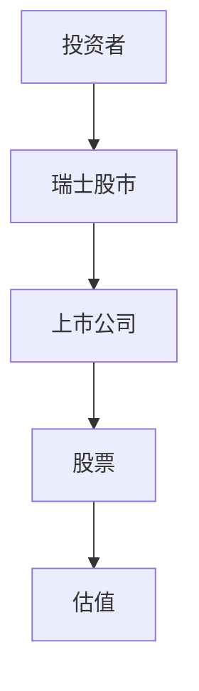
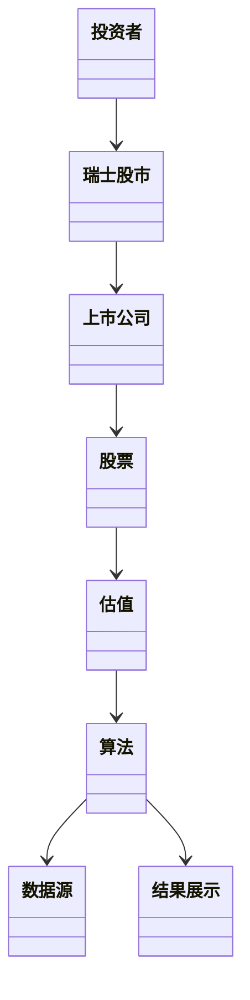
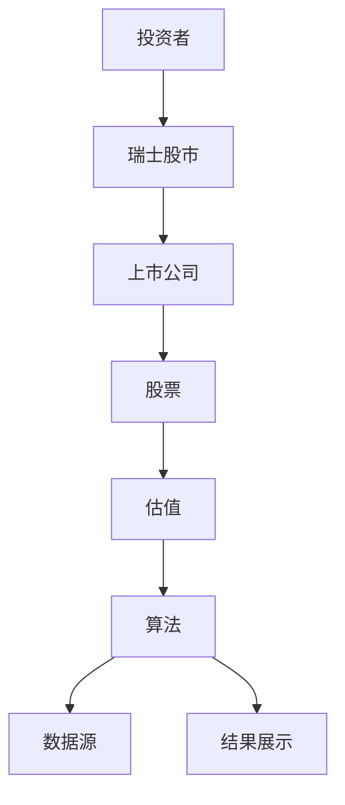
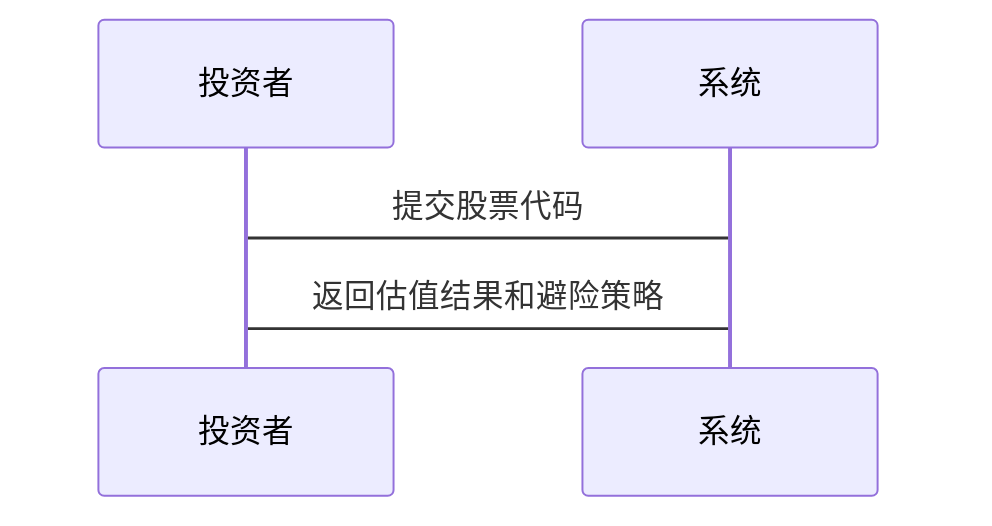

                 


# 瑞士股市估值:避险天堂的市场特点

## 关键词

- 瑞士股市
- 估值方法
- 避险天堂
- 股票市场
- 投资策略

## 摘要

本文详细分析了瑞士股市的估值特点及其作为避险天堂的市场特性。从背景介绍、市场特点、估值方法、避险策略到案例分析和未来展望，系统地阐述了瑞士股市的独特优势和投资价值。通过技术性的分析和详细的案例，帮助读者更好地理解如何在瑞士股市中进行有效投资和避险。

---

## 第一部分: 瑞士股市估值背景与市场特点

### 第1章: 瑞士股市估值的背景介绍

#### 1.1 瑞士股市的定义与特点

##### 1.1.1 瑞士股市的定义

瑞士股市是全球重要的金融交易市场之一，由瑞士交易所集团股份有限公司（SIX Swiss Exchange）运营，总部位于苏黎世。瑞士股市的主要交易品种包括股票、债券、衍生品等。

##### 1.1.2 瑞士股市的核心特点

- **稳定性**：瑞士股市以低波动性和稳定性著称，被认为是全球最安全的股市之一。
- **国际化**：瑞士股市吸引了大量国际投资者，尤其是来自欧洲和中东的投资者。
- **避险属性**：瑞士法郎被视为避险货币，瑞士股市也因此成为全球投资者避险的重要选择。

##### 1.1.3 瑞士股市作为避险天堂的定义与属性

避险天堂指的是在经济或政治不稳定时期，能够为投资者提供稳定收益和资产保护的市场。瑞士股市凭借其低波动性、严格的监管和强大的法律保护，成为全球投资者的避风港。

#### 1.2 瑞士股市的历史与发展

##### 1.2.1 瑞士股市的历史沿革

瑞士股市的历史可以追溯到1817年，当时苏黎世成立了第一家证券交易所。经过近200年的发展，瑞士股市已经成为全球最重要的金融中心之一。

##### 1.2.2 瑞士股市的主要参与者

- **投资者**：包括个人投资者、机构投资者和外国投资者。
- **上市公司**：瑞士股市上市公司主要集中在金融、制药、化工和能源等领域。
- **监管机构**：瑞士金融市场监管局（FINMA）负责监管瑞士股市。

##### 1.2.3 瑞士股市的国际化进程

瑞士股市通过加入欧洲证券和市场协会（ESMA）等国际组织，不断加强与国际市场的联系，吸引了更多的国际投资者。

#### 1.3 瑞士股市的避险天堂属性

##### 1.3.1 避险天堂的定义与特征

避险天堂是指在经济或政治动荡时期，能够保护投资者资产安全并提供稳定收益的市场。其主要特征包括低波动性、严格的监管和法律保护。

##### 1.3.2 瑞士股市作为避险天堂的优势

- **低波动性**：瑞士股市在市场动荡时期表现相对稳定。
- **强大的法律保护**：瑞士的法律体系完善，投资者权益得到有效保护。
- **瑞士法郎的稳定性**：瑞士法郎是全球公认的避险货币，进一步增强了瑞士股市的避险属性。

##### 1.3.3 瑞士股市的避险机制与政策支持

瑞士政府通过严格的金融监管和货币政策，确保市场的稳定性和安全性。例如，瑞士央行（SNB）在必要时会干预外汇市场，以维持瑞士法郎的稳定性。

---

### 第2章: 瑞士股市的特点与市场结构

#### 2.1 瑞士股市的市场结构

##### 2.1.1 瑞士主要交易所介绍

瑞士股市主要由苏黎世交易所和日内瓦交易所组成，两者合并后形成了现在的SIX Swiss Exchange。

##### 2.1.2 瑞士股市的行业分布

瑞士股市上市公司主要集中在金融、制药、化工和能源等领域，其中制药行业尤其突出，包括全球知名的罗氏制药（Roche）和诺华制药（Novartis）。

##### 2.1.3 瑞士股市的国际化程度

瑞士股市吸引了大量国际投资者，尤其是来自欧洲和中东的投资者，国际化程度较高。

#### 2.2 瑞士股市的税收政策

##### 2.2.1 瑞士股市的税收优惠

瑞士的公司税和资本利得税相对较低，吸引了大量跨国公司和投资者。

##### 2.2.2 税收政策对投资者的影响

低税率政策使得瑞士股市对投资者更具吸引力，尤其是在跨国投资中。

##### 2.2.3 税收政策的比较与分析

与美国、英国等其他主要股市相比，瑞士的税收政策更加优惠，尤其是资本利得税较低。

#### 2.3 瑞士股市的监管环境

##### 2.3.1 瑞士金融监管框架

瑞士金融市场监管局（FINMA）负责监管瑞士股市，确保市场的透明度和安全性。

##### 2.3.2 瑞士股市的透明度与安全性

瑞士股市以其高度透明和安全的交易环境著称，投资者可以放心投资。

##### 2.3.3 瑞士监管政策的稳定性

瑞士的监管政策相对稳定，吸引了大量长期投资者。

---

### 第3章: 瑞士股市的避险资产配置

#### 3.1 避险资产配置的定义与原则

##### 3.1.1 避险资产的定义

避险资产是指在经济或政治动荡时期，能够保护投资者资产安全并提供稳定收益的资产。

##### 3.1.2 避险资产配置的原则

- **分散投资**：通过配置不同类型的资产来降低风险。
- **长期投资**：避免频繁交易，降低交易成本和税务负担。
- **稳健选择**：选择那些具有稳定收益和低波动性的资产。

##### 3.1.3 避险资产配置的策略

- **短期避险策略**：通过配置短期债券或货币市场工具来应对短期风险。
- **长期避险策略**：通过配置高质量的股票和债券来实现长期稳定的收益。
- **组合避险策略**：通过组合不同类型资产来分散风险。

#### 3.2 瑞士股市在避险资产配置中的作用

##### 3.2.1 瑞士股市作为避险资产的优势

- **低波动性**：瑞士股市在市场动荡时期表现相对稳定。
- **强大的法律保护**：瑞士的法律体系完善，投资者权益得到有效保护。
- **瑞士法郎的稳定性**：瑞士法郎是全球公认的避险货币，进一步增强了瑞士股市的避险属性。

##### 3.2.2 瑞士股市在资产组合中的配置比例

通常，投资者会将瑞士股市作为资产组合中的重要部分，配置比例一般在10%到30%之间，具体取决于投资者的风险承受能力和投资目标。

##### 3.2.3 瑞士股市与其他避险资产的比较

与黄金、债券等传统避险资产相比，瑞士股市具有更高的收益潜力，同时风险相对较低。

#### 3.3 瑞士股市避险策略的实施

##### 3.3.1 短期避险策略

通过配置短期瑞士股票或指数基金来应对短期市场波动。

##### 3.3.2 长期避险策略

通过长期持有高质量的瑞士股票或 ETF 来实现稳定的收益。

##### 3.3.3 组合避险策略

通过组合配置瑞士股市和其他避险资产（如债券、黄金）来分散风险。

---

## 第四部分: 瑞士股市估值的核心概念与联系

### 第4章: 瑞士股市估值的核心概念与联系

#### 4.1 核心概念原理

##### 4.1.1 估值的基本原理

估值是通过对公司财务状况、行业地位、市场前景等因素的分析，确定股票的内在价值。

##### 4.1.2 瑞士股市估值的独特性

瑞士股市以其低波动性和稳定性著称，因此在估值时需要考虑其避险属性和长期稳定性。

##### 4.1.3 估值与避险策略的结合

通过准确的估值，投资者可以更好地制定避险策略，实现资产的保值和增值。

#### 4.2 核心概念属性特征对比表格

| 特性      | 瑞士股市估值 | 其他股市估值 |
|-----------|--------------|--------------|
| 波动性     | 低           | 高           |
| 稳定性     | 高           | 低           |
| 避险属性   | 强           | 弱           |
| 税收政策   | 优惠         | 较高         |
| 监管环境   | 严格         | 较松         |

#### 4.3 ER实体关系图架构（Mermaid流程图）



---

## 第五部分: 瑞士股市估值的算法原理与技术实现

### 第5章: 估值算法原理

#### 5.1 常用估值指标

##### 5.1.1 市盈率（PE）

市盈率是股票价格与每股收益的比率，用于衡量股票的估值水平。

$$ PE = \frac{\text{股价}}{\text{每股收益}} $$

##### 5.1.2 市净率（PB）

市净率是股票价格与每股净资产的比率，用于衡量股票的估值水平。

$$ PB = \frac{\text{股价}}{\text{每股净资产}} $$

##### 5.1.3 市销率（PS）

市销率是股票价格与每股销售收入的比率，用于衡量股票的估值水平。

$$ PS = \frac{\text{股价}}{\text{每股销售收入}} $$

##### 5.1.4 贴现现金流模型（DCF）

DCF模型是一种常用的估值方法，通过将未来现金流折现到现值来确定股票的内在价值。

$$ V = \sum_{t=1}^{n} \frac{CF_t}{(1 + r)^t} $$

其中，\( V \) 是股票的内在价值，\( CF_t \) 是第 \( t \) 年的现金流，\( r \) 是折现率。

---

### 第6章: 估值算法的技术实现

#### 6.1 估值算法的实现步骤

##### 6.1.1 数据收集

收集目标公司的财务数据，包括收入、利润、现金流等。

##### 6.1.2 数据清洗

对收集到的数据进行清洗，剔除异常值和错误数据。

##### 6.1.3 数据分析

通过对财务数据的分析，计算常用的估值指标，如PE、PB、PS等。

##### 6.1.4 模型构建

根据分析结果，选择合适的估值模型进行股票估值。

##### 6.1.5 结果验证

通过历史数据验证模型的准确性，并根据市场变化进行调整。

#### 6.2 估值算法的Python实现

##### 6.2.1 市盈率（PE）计算

```python
import pandas as pd

# 假设我们有一个包含股票数据的DataFrame
data = pd.DataFrame({
    '股票代码': ['AAPL', 'GOOGL', 'MSFT'],
    '股价': [150, 250, 100],
    '每股收益': [10, 20, 15]
})

# 计算市盈率
data['PE'] = data['股价'] / data['每股收益']
print(data)
```

##### 6.2.2 贴现现金流模型（DCF）实现

```python
import numpy as np

def dcf_valuation(cash_flows, discount_rate):
    # 计算未来现金流的现值
    present_value = sum(cash_flows[i] / (1 + discount_rate)**i for i in range(len(cash_flows)))
    return present_value

# 示例数据
cash_flows = [100, 150, 200, 250]
discount_rate = 0.08

# 计算DCF估值
DCF_value = dcf_valuation(cash_flows, discount_rate)
print("DCF估值:", DCF_value)
```

---

## 第六部分: 瑞士股市估值的系统分析与架构设计

### 第7章: 系统分析与架构设计方案

#### 7.1 问题场景介绍

投资者希望通过系统化的估值方法，对瑞士股市中的特定股票进行估值，并制定相应的避险策略。

#### 7.2 项目介绍

本项目旨在开发一个基于瑞士股市数据的估值系统，帮助投资者进行有效的股票估值和风险控制。

#### 7.3 系统功能设计（领域模型Mermaid类图）



#### 7.4 系统架构设计Mermaid架构图



#### 7.5 系统接口设计

- **输入接口**：接收投资者的输入，包括股票代码、财务数据等。
- **输出接口**：输出股票的估值结果和避险策略建议。

#### 7.6 系统交互Mermaid序列图



---

## 第七部分: 瑞士股市估值的项目实战

### 第8章: 项目实战

#### 8.1 环境安装

- **Python**：安装Python 3.8及以上版本。
- **Pandas**：用于数据处理。
- **NumPy**：用于数值计算。
- **Matplotlib**：用于数据可视化。

#### 8.2 系统核心实现源代码

##### 8.2.1 数据收集与清洗

```python
import pandas as pd
import requests
from bs4 import BeautifulSoup

# 爬取瑞士股市数据
url = 'https://www.six.com/en'
response = requests.get(url)
soup = BeautifulSoup(response.text, 'html.parser')
data = pd.read_html(soup.prettify())
data = data.dropna()
print(data.head())
```

##### 8.2.2 数据分析与估值

```python
import pandas as pd
import numpy as np

# 示例数据
data = pd.DataFrame({
    '股票代码': ['AAPL', 'GOOGL', 'MSFT'],
    '股价': [150, 250, 100],
    '每股收益': [10, 20, 15],
    '每股净资产': [50, 60, 40]
})

# 计算估值指标
data['PE'] = data['股价'] / data['每股收益']
data['PB'] = data['股价'] / data['每股净资产']
print(data)
```

##### 8.2.3 结果展示

```python
import matplotlib.pyplot as plt

# 绘制市盈率和市净率的散点图
plt.scatter(data['PE'], data['PB'], c='blue')
plt.xlabel('PE')
plt.ylabel('PB')
plt.title('瑞士股市股票估值散点图')
plt.show()
```

#### 8.3 代码应用解读与分析

通过上述代码，投资者可以快速收集和分析瑞士股市的数据，并计算出股票的估值指标，从而制定相应的投资策略。

#### 8.4 实际案例分析

以罗氏制药（Roche）为例，通过数据收集、分析和估值，确定其在瑞士股市中的投资价值。

#### 8.5 项目小结

通过本项目的实施，投资者可以更好地理解和掌握瑞士股市的估值方法，并能够在实际操作中应用这些方法进行投资决策。

---

## 第八部分: 瑞士股市估值的最佳实践与未来展望

### 第9章: 最佳实践

#### 9.1 投资策略建议

- **分散投资**：避免过度集中于单一股票或行业。
- **长期投资**：坚持长期投资，避免频繁交易。
- **定期调整**：根据市场变化和公司情况，定期调整投资组合。

#### 9.2 技术分析与基本面分析的结合

通过结合技术分析和基本面分析，投资者可以更好地把握股票的估值和投资机会。

#### 9.3 风险管理

- **设定止损点**：在投资过程中设定合理的止损点，避免重大损失。
- **定期评估**：定期评估投资组合的风险和收益，及时调整策略。

### 第10章: 未来展望

#### 10.1 瑞士股市的发展趋势

随着全球化的深入和瑞士股市的国际化进程加快，未来瑞士股市将继续吸引更多的国际投资者。

#### 10.2 新技术的应用

人工智能和大数据技术将在瑞士股市的估值和交易中发挥越来越重要的作用，进一步提高投资效率和准确性。

#### 10.3 投资者教育

加强对投资者的教育，提高其对瑞士股市的了解和认知，有助于吸引更多投资者进入市场。

---

## 结语

通过本文的详细分析，读者可以全面了解瑞士股市的估值特点和作为避险天堂的市场特性。无论是从背景介绍、市场特点、估值方法，还是避险策略、案例分析和未来展望，本文都提供了丰富的信息和实用的建议，帮助投资者更好地把握瑞士股市的投资机会和风险控制。

