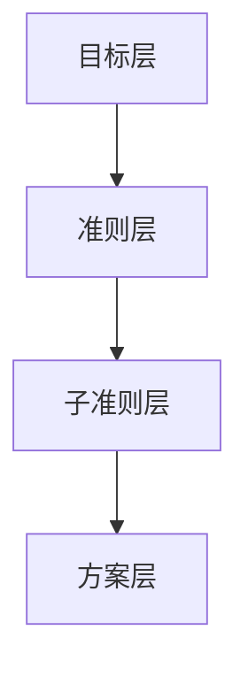
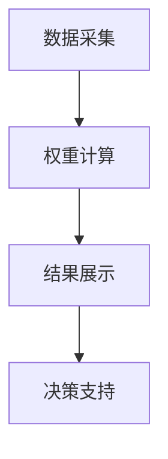

                 


# 生态修复项目的社会效益量化与投资决策

## 关键词
生态修复, 社会效益, 投资决策, 层次分析法（AHP）, 经济效益, 环境效益, 投资回报率

## 摘要
本文系统探讨了生态修复项目的社会效益量化方法及其在投资决策中的应用。通过引入层次分析法（AHP），构建了社会效益量化模型，并结合实际案例分析，提出了科学的投资决策框架，为生态修复项目的可持续发展提供了理论依据和实践指导。

---

# 第一部分: 生态修复项目的社会效益量化与投资决策概述

## 第1章: 生态修复项目背景与概念

### 1.1 生态修复的定义与内涵
生态修复是指通过人为干预，恢复被破坏的生态系统，使其接近自然状态的过程。它包括对土地、水源、植被等的修复，以改善生态功能和生物多样性。

**核心概念**：
- **生态修复**：修复被破坏的生态系统。
- **社会效益**：生态修复带来的社会价值，包括经济效益、环境效益和社会认可度。

### 1.2 生态修复项目的社会效益
社会效益是生态修复项目的重要组成部分，包括提升居民生活质量、减少环境污染、促进经济增长等方面。

### 1.3 社会效益量化的重要性
通过量化社会效益，可以科学评估生态修复项目的投资价值，为决策者提供数据支持。

---

## 第2章: 生态修复项目社会效益量化的核心概念

### 2.1 层次分析法（AHP）原理
层次分析法是一种用于多目标决策的结构化方法，适用于生态修复项目的多维度评价。

**步骤**：
1. 构建层次结构。
2. 确定各层次的权重。
3. 计算综合评价。

**Mermaid图示**：


### 2.2 生态修复项目社会效益的评价指标
- **经济效益指标**：投资回报率（ROI）。
- **社会效益指标**：居民满意度。
- **环境效益指标**：生态系统的稳定性。

---

## 第3章: 生态修复项目社会效益量化的理论基础

### 3.1 层次分析法（AHP）的应用
通过案例分析，详细讲解AHP在生态修复项目中的应用步骤，包括指标权重计算和综合评价模型的构建。

**Python代码示例**：
```python
import numpy as np
from scipy.stats import rankdata

def calculate_weights(criteria_values):
    # 计算权重
    n = len(criteria_values)
    weights = rankdata(criteria_values, method='min') / sum(rankdata(criteria_values, method='min'))
    return weights

criteria_values = [0.4, 0.2, 0.3, 0.1]
weights = calculate_weights(criteria_values)
print("权重为：", weights)
```

**数学公式**：
$$权重 = \frac{rank}{\sum rank}$$

### 3.2 综合评价模型的构建
结合经济效益、社会效益和环境效益，构建综合评价模型。

**公式**：
$$总评分 = \sum (权重_i \times 评分_i)$$

---

## 第4章: 生态修复项目社会效益量化的系统分析

### 4.1 系统架构设计
设计一个基于AHP的系统，包括数据采集、权重计算和结果展示模块。

**系统架构图**：


### 4.2 系统功能模块
- 数据采集模块：收集项目数据。
- 权重计算模块：应用AHP算法计算权重。
- 结果展示模块：生成可视化报告。

---

## 第5章: 生态修复项目社会效益量化的投资决策模型

### 5.1 投资决策框架
结合社会效益量化结果，构建投资决策模型，评估项目的可行性和收益潜力。

### 5.2 投资回报率（ROI）计算
$$ROI = \frac{净收益}{投资成本} \times 100\%$$

### 5.3 投资风险评估
通过分析项目的社会效益和环境效益，评估投资风险。

---

## 第6章: 项目实战：城市河道生态修复项目

### 6.1 项目背景
某城市河道因污染严重，需进行生态修复。

### 6.2 项目实施
- 数据采集：收集水质、生物多样性等数据。
- 权重计算：应用AHP计算社会效益权重。
- 投资决策：评估项目ROI和风险。

### 6.3 结果分析
通过分析，项目社会效益显著，投资回报率高，建议实施。

---

## 第7章: 结论与展望

### 7.1 结论
生态修复项目的社会效益量化是科学投资决策的关键，层次分析法（AHP）提供了有效的解决方案。

### 7.2 展望
未来研究可进一步结合机器学习优化社会效益量化模型，提升决策精度。

---

## 小结
本文通过系统分析和实际案例，详细探讨了生态修复项目社会效益量化的方法及其在投资决策中的应用，为相关决策者提供了理论依据和实践指导。

