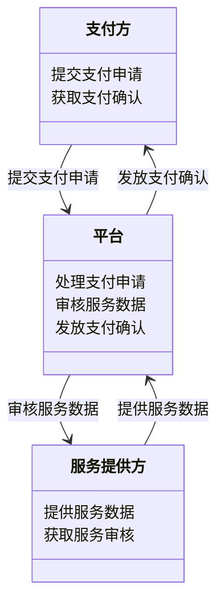

                 


# 生态系统服务付费机制的投资模式探讨

## 关键词
- 生态系统服务
- 付费机制
- 投资模式
- 算法原理
- 系统架构

## 摘要
本文探讨了生态系统服务付费机制的投资模式，从背景、核心概念、算法原理、系统架构到项目实战，全面分析了其在环境保护和可持续发展中的应用。通过详细讲解，帮助读者理解如何通过付费机制实现生态资源的价值化，并结合实际案例和代码示例，展示了投资模式的实施路径。

---

# 第一部分: 生态系统服务付费机制的背景与概念

## 第1章: 生态系统服务的基本概念

### 1.1 生态系统服务的定义与分类
#### 1.1.1 生态系统服务的定义
生态系统服务是指自然生态系统提供的对人类有益的服务，包括 provisioning（提供资源）、regulating（调节功能）、supporting（支持功能）和 cultural（文化功能）四大类。

#### 1.1.2 生态系统服务的分类
1. ** provisioning services**：直接提供食物、水、纤维等资源。
2. ** regulating services**：调节气候、水循环、病虫害控制等。
3. ** supporting services**：维持生态系统的养分循环、水分保持等。
4. ** cultural services**：提供娱乐、教育、精神慰藉等。

#### 1.1.3 生态系统服务的特征与属性
- **公共性**：通常具有非排他性。
- **外部性**：使用服务不会增加额外成本。
- **不可分割性**：难以单独量化。

### 1.2 生态系统服务付费机制的背景
#### 1.2.1 环境保护与可持续发展的需求
全球环境问题日益严峻，生态系统服务的保护成为可持续发展的重要部分。

#### 1.2.2 市场化机制在环境保护中的作用
通过市场机制，将生态服务的价值转化为经济收益，激励保护行为。

#### 1.2.3 生态系统服务付费机制的全球实践
国际上已有多个国家和地区在进行试点，如德国的支付农业生态服务（PAES）项目。

---

## 第2章: 生态系统服务付费机制的定义与框架

### 2.1 生态系统服务付费机制的定义
生态系统服务付费机制（PES）是一种通过支付手段，激励保护者提供生态服务的市场机制。

### 2.2 生态系统服务付费机制的框架体系
- **支付方**：通常是政府、企业或受益者。
- **服务提供方**：通常是农民、社区或土地所有者。
- **平台**：用于撮合交易和管理支付的平台。

---

## 第3章: 生态系统服务付费机制的投资模式概述

### 3.1 投资模式的基本概念
投资模式是指投资者通过付费机制，购买生态服务的过程。

### 3.2 生态系统服务付费机制与投资模式的联系
- **双向驱动**：付费机制促进投资，投资反过来支持机制运行。
- **多方共赢**：政府、企业和社区共同受益。

---

# 第二部分: 生态系统服务付费机制的核心概念与联系

## 第4章: 核心概念的原理与特征对比

### 4.1 生态系统服务付费机制的原理
- **经济学基础**：基于外部性理论，通过支付内部化外部成本。
- **生态学基础**：保护生态系统的功能，实现可持续发展。

### 4.2 核心概念的特征对比
| 特征     | 生态系统服务 | 商品服务 |
|----------|--------------|-----------|
| 产权      | 非排他性      | 排他性     |
| 交易方式  | 点对点或平台   | 市场交易    |
| 价格确定  | 协商定价      | 市场决定    |

### 4.3 实体关系图（ER图）
```mermaid
erDiagram
    actor 支付方 {
        <属性> 服务类型
        <属性> 支付金额
    }
    actor 服务提供方 {
        <属性> 服务质量
        <属性> 服务面积
    }
    actor 平台 {
        <属性> 交易记录
        <属性> 价格标准
    }
    支付方 --> 平台 : 提交支付申请
    服务提供方 --> 平台 : 提供服务数据
    平台 --> 支付方 : 支付确认
    平台 --> 服务提供方 : 服务审核
```

---

## 第5章: 生态系统服务付费机制的算法原理

### 5.1 算法原理
支付金额 = 服务价值 × 交易数量 × 支付比例

### 5.2 算法实现
```python
def calculate_payment(service_value, transaction_volume, payment_ratio):
    return service_value * transaction_volume * payment_ratio

# 示例
service_value = 100  # 每单位服务的价值
transaction_volume = 5  # 交易数量
payment_ratio = 0.2  # 支付比例
payment = calculate_payment(service_value, transaction_volume, payment_ratio)
print(payment)  # 输出：100 * 5 * 0.2 = 100
```

---

## 第6章: 生态系统服务付费机制的系统架构

### 6.1 问题场景
- 支付方需要购买生态服务。
- 服务提供方需要证明服务的真实性。

### 6.2 系统功能设计


---

## 第7章: 生态系统服务付费机制的项目实战

### 7.1 环境安装
- 安装Python和相关库。
- 配置数据库和API接口。

### 7.2 核心代码实现
```python
from flask import Flask
from flask_restful import Resource, Api

app = Flask(__name__)
api = Api(app)

class Payment(Resource):
    def post(self):
        data = request.get_json()
        service_value = data.get('service_value')
        transaction_volume = data.get('transaction_volume')
        payment_ratio = data.get('payment_ratio')
        payment = service_value * transaction_volume * payment_ratio
        return {'payment': payment}

api.add_resource(Payment, '/calculate_payment')

if __name__ == '__main__':
    app.run(debug=True)
```

---

## 第8章: 总结与展望

### 8.1 总结
本文详细探讨了生态系统服务付费机制的投资模式，从理论到实践，展示了其在环境保护中的重要性。

### 8.2 展望
未来，随着技术进步，生态系统服务付费机制将更加智能化和高效化。

---

# 第三部分: 结论与参考文献

## 结论
生态系统服务付费机制的投资模式是实现可持续发展的重要手段，通过市场化机制和技术创新，可以有效保护生态环境。

## 参考文献
- 生态系统服务付费机制的相关文献
- 相关学术论文和案例研究

---

# 最佳实践 tips

- 在实施付费机制时，需确保数据的真实性和透明度。
- 投资者应关注长期效益，而不仅仅是短期收益。
- 政府应提供政策支持和监管，确保机制的公平性。

---

通过以上步骤，我们可以看到生态系统服务付费机制的投资模式不仅有助于环境保护，还能带来经济和社会效益。希望本文能为相关领域的研究和实践提供有价值的参考。

