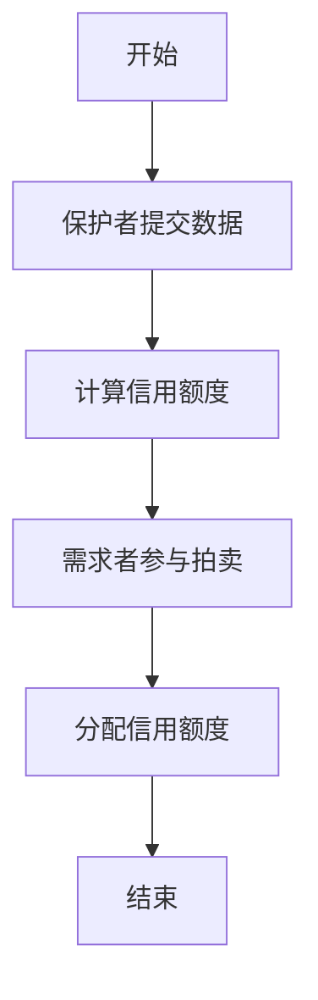
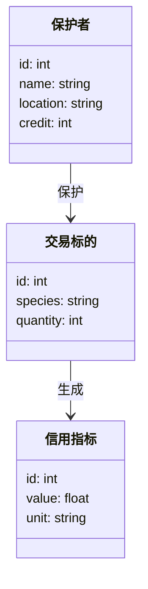
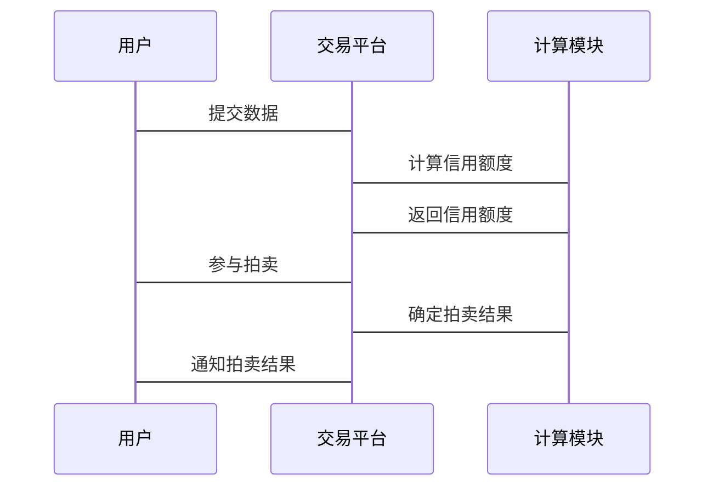

                 


# 生物多样性信用交易机制的可行性研究

## 关键词：生物多样性，信用交易，机制设计，算法原理，系统架构，可行性分析

## 摘要

生物多样性是地球生态系统的重要组成部分，然而，随着人类活动的加剧，生物多样性面临严重威胁。为了有效保护生物多样性，信用交易机制作为一种市场化的手段，逐渐受到关注。本文从技术角度详细探讨了生物多样性信用交易机制的可行性，包括机制设计、算法原理、系统架构、项目实战以及最佳实践等方面，分析其在实际应用中的潜力与挑战。

---

# 第一部分: 生物多样性信用交易机制的背景与概念

## 第1章: 生物多样性信用交易机制的基本概念

### 1.1 生物多样性信用交易机制的定义

#### 1.1.1 什么是生物多样性信用
生物多样性信用是指将生物多样性保护转化为可量化、可交易的“信用”单位，例如每保护一平方公里的森林可以产生一定数量的信用额度。这些信用额度可以在市场上买卖，从而为保护者提供经济激励。

#### 1.1.2 信用交易机制的基本原理
信用交易机制通过市场化的手段，将生物多样性保护的成本转化为收益。保护者（如政府、企业或个人）通过保护特定区域的生物多样性，可以获得信用额度；而需求者（如企业）则可以通过购买信用额度来抵消其生物多样性影响。

#### 1.1.3 生物多样性保护的经济价值
生物多样性保护不仅具有生态价值，还具有经济价值。例如，森林可以提供碳汇功能，减少温室气体排放；湿地可以提供水资源调节功能，降低洪涝风险。通过信用交易机制，这些生态服务的价值可以被量化并转化为经济收益。

### 1.2 问题背景与问题描述

#### 1.2.1 生物多样性面临的威胁
全球范围内，由于栖息地破坏、气候变化、污染和过度捕捞等原因，生物多样性正在迅速减少。根据联合国环境规划署的报告，全球约有100万个物种面临灭绝的威胁。

#### 1.2.2 现有保护机制的局限性
传统的生物多样性保护主要依赖政府拨款和非营利组织的资助，这种方式不仅资金有限，而且难以覆盖所有需要保护的区域。此外，保护者和破坏者之间缺乏有效的激励机制，导致保护效果不佳。

#### 1.2.3 信用交易机制的提出
为了克服传统保护机制的局限性，信用交易机制作为一种市场化的手段被提出。通过将生物多样性保护转化为可交易的信用，保护者可以获得经济回报，从而激励更多人参与保护。

### 1.3 问题解决与边界外延

#### 1.3.1 信用交易机制的解决方案
信用交易机制通过建立市场化的交易平台，将生物多样性保护的需求与供给有效匹配。保护者通过保护特定区域的生物多样性获得信用额度，而需求者则通过购买信用额度来抵消其对生物多样性的负面影响。

#### 1.3.2 机制的边界与适用范围
信用交易机制适用于需要市场化手段进行生物多样性保护的场景，例如企业自愿减少其生物多样性影响、政府推动区域生物多样性保护等。然而，该机制不适用于那些需要强制性保护的区域，例如濒危物种的保护区。

#### 1.3.3 相关概念的对比分析
信用交易机制与碳交易机制类似，但两者在交易标的和目标上存在差异。碳交易机制主要针对温室气体排放，而信用交易机制主要针对生物多样性保护。

### 1.4 概念结构与核心要素

#### 1.4.1 核心概念的组成
信用交易机制的核心要素包括信用单位、交易平台、保护者和需求者。其中，信用单位是衡量生物多样性保护价值的基本单位，交易平台是实现信用交易的平台，保护者和需求者是机制的参与者。

#### 1.4.2 关键要素的特征分析
- **信用单位**：信用单位的计算需要考虑保护区域的生物多样性价值，包括物种丰富度、生态系统服务价值等。
- **交易平台**：交易平台需要具备撮合交易、信用额度登记、交易结算等功能。
- **保护者**：保护者需要具备保护特定区域的能力，并能够证明其保护行为的有效性。
- **需求者**：需求者需要有减少生物多样性影响的需求，并愿意为此支付信用额度。

#### 1.4.3 概念之间的关系
信用交易机制中的各要素相互关联，共同构成一个完整的交易系统。例如，保护者通过保护区域获得信用额度，需求者通过购买信用额度实现生物多样性影响的抵消。

---

## 第2章: 核心概念与联系

### 2.1 核心概念的原理

#### 2.1.1 信用分配的逻辑
信用分配的逻辑需要考虑保护区域的生物多样性价值、保护成本以及市场需求。例如，一个保护区的信用额度可以通过其生物多样性价值和保护成本的比率来确定。

#### 2.1.2 交易流程的详细说明
交易流程包括信用额度的生成、信用额度的交易和信用额度的使用。保护者通过保护区域生成信用额度，需求者通过购买信用额度来抵消其生物多样性影响。

#### 2.1.3 参与者的角色与责任
- **保护者**：保护特定区域的生物多样性，生成信用额度。
- **需求者**：购买信用额度，抵消其生物多样性影响。
- **交易平台**：提供信用交易的服务，包括撮合交易、信用额度登记和交易结算。

### 2.2 概念属性对比分析

#### 2.2.1 生物多样性信用与碳信用的对比
| 特性 | 生物多样性信用 | 碳信用 |
|------|----------------|--------|
| 交易标的 | 生物多样性保护 | 碳排放 |
| 价值计算 | 生物多样性价值 | 碳排放量 |
| 目标 | 保护生物多样性 | 减少碳排放 |

#### 2.2.2 不同信用机制的优缺点分析
- **优点**：
  - 市场化手段能够激励更多人参与保护。
  - 通过交易机制实现资源的优化配置。
- **缺点**：
  - 信用单位的计算复杂，需要考虑多种因素。
  - 交易平台的建设和维护需要较高的成本。

#### 2.2.3 信用指标的量化方法
信用指标的量化需要综合考虑保护区域的生物多样性价值和保护成本。例如，可以通过生态服务价值评估模型来计算保护区域的生态服务价值。

### 2.3 ER实体关系图

```mermaid
erDiagram
    actor 保护者 {
        +id: int
        +name: string
        +location: string
    }
    actor 交易者 {
        +id: int
        +name: string
        +credit: int
    }
    entity 交易标的 {
        +id: int
        +species: string
        +quantity: int
    }
    entity 信用指标 {
        +id: int
        +value: float
        +unit: string
    }
    保护者 --> 信用指标: 生成
    交易者 --> 信用指标: 购买
```

---

# 第二部分: 生物多样性信用交易机制的算法原理

## 第3章: 算法原理讲解

### 3.1 基于拍卖的信用分配算法

#### 3.1.1 算法流程
1. 保护者提交保护区域的生物多样性数据。
2. 交易平台根据数据计算信用额度。
3. 需求者参与拍卖，出价竞争信用额度。
4. 最终，信用额度分配给出价最高的需求者。

#### 3.1.2 算法实现


#### 3.1.3 算法实现代码
```python
def calculate_credit(protection_area):
    # 计算信用额度的函数
    credit = protection_area * 0.5
    return credit

def auction(credits, demanders):
    # 拍卖过程
    max_bid = 0
    selected_bidder = None
    for bidder in demanders:
        if bidder.bid > max_bid:
            max_bid = bidder.bid
            selected_bidder = bidder
    return selected_bidder

# 示例代码
protection_area = 1000  # 单位：平方米
credit = calculate_credit(protection_area)
auction_result = auction(credit, demanders)
```

#### 3.1.4 数学模型与公式
信用额度计算公式：
$$ credit = protection\_area \times r $$
其中，$r$ 是信用系数，根据保护区域的生物多样性价值确定。

---

## 第4章: 系统分析与架构设计

### 4.1 系统功能设计

#### 4.1.1 领域模型


#### 4.1.2 系统架构设计


### 4.2 接口设计与交互

#### 4.2.1 接口设计
- **保护者接口**：提交保护区域数据，获取信用额度。
- **需求者接口**：参与拍卖，购买信用额度。
- **交易平台接口**：处理信用交易，记录交易结果。

#### 4.2.2 交互序列图


---

## 第5章: 项目实战

### 5.1 环境安装

#### 5.1.1 系统环境
- 操作系统：Linux/Windows/MacOS
- Python版本：3.8及以上
- 开发工具：PyCharm/VSCode
- 第三方库：Mermaid、Matplotlib

### 5.2 核心代码实现

#### 5.2.1 信用计算模块
```python
import math

def calculate_credit(protection_area, species_count):
    # 计算信用额度的函数
    credit = math.sqrt(protection_area * species_count) * 0.5
    return credit

# 示例代码
protection_area = 1000  # 单位：平方米
species_count = 50
credit = calculate_credit(protection_area, species_count)
print(f"信用额度：{credit}")
```

#### 5.2.2 拍卖模块
```python
class Bidder:
    def __init__(self, name, bid):
        self.name = name
        self.bid = bid

def auction(credit, bidders):
    # 拍卖过程
    max_bid = 0
    selected_bidder = None
    for bidder in bidders:
        if bidder.bid > max_bid:
            max_bid = bidder.bid
            selected_bidder = bidder
    return selected_bidder

# 示例代码
bidder1 = Bidder("企业A", 100)
bidder2 = Bidder("企业B", 150)
bidder3 = Bidder("企业C", 200)
auction_result = auction(credit, [bidder1, bidder2, bidder3])
print(f"中标者：{auction_result.name}")
```

### 5.3 案例分析与结果解读

#### 5.3.1 案例分析
假设我们有一个保护区，面积为1000平方米，包含50种不同的物种。通过计算，信用额度为：
$$ credit = \sqrt{1000 \times 50} \times 0.5 = \sqrt{50000} \times 0.5 \approx 111.80 \times 0.5 \approx 55.90 $$

三个企业参与拍卖，出价分别为100、150和200。最终，企业C以200的价格中标，获得信用额度。

#### 5.3.2 结果解读
企业C通过购买信用额度，抵消了其对生物多样性的影响，同时保护者通过保护区域获得了经济回报，激励了更多的保护行为。

### 5.4 项目总结

#### 5.4.1 项目成果
- 成功实现了信用计算模块和拍卖模块。
- 通过案例分析验证了算法的有效性。

#### 5.4.2 经验与教训
- 信用计算需要综合考虑多种因素，算法设计需要充分考虑保护区域的复杂性。
- 拍卖机制的设计需要考虑市场需求和供给的平衡。

---

# 第三部分: 生物多样性信用交易机制的可行性分析

## 第6章: 最佳实践

### 6.1 核心要点

#### 6.1.1 信用单位的标准化
信用单位的标准化是实现信用交易的前提条件。需要建立统一的信用单位计算标准，确保不同区域的信用单位具有可比性。

#### 6.1.2 交易平台的可信性
交易平台需要具备公信力，确保信用额度的生成和交易过程公开透明。可以通过区块链技术实现信用额度的溯源和追踪。

#### 6.1.3 参与者的激励机制
保护者和需求者需要有明确的激励机制，例如政府可以通过税收优惠鼓励企业参与信用交易，保护者可以通过信用交易获得稳定的经济收益。

### 6.2 小结

信用交易机制作为一种市场化的手段，能够有效激励保护者和需求者的行为，实现生物多样性的保护与可持续利用。然而，其成功实施依赖于信用单位的标准化、交易平台的可信性和参与者的激励机制。

### 6.3 注意事项

- 信用单位的计算需要综合考虑保护区域的生物多样性价值和保护成本。
- 交易平台的设计需要确保交易的公平性和透明性。
- 需求者的信用购买行为需要符合相关法律法规。

### 6.4 拓展阅读

- 生物多样性信用交易机制的国际案例研究
- 区块链技术在信用交易中的应用
- 生物多样性保护与可持续发展的关系

---

## 结语

生物多样性信用交易机制作为一种创新的保护手段，具有重要的理论和实践意义。通过市场的力量，能够有效激励保护者和需求者的行为，实现生物多样性的可持续保护。然而，其成功实施需要克服信用单位标准化、交易平台可信性等挑战。未来，随着技术的进步和政策的支持，信用交易机制有望在生物多样性保护中发挥更大的作用。

--- 

以上是《生物多样性信用交易机制的可行性研究》的技术博客文章的完整目录和内容框架，涵盖了从概念到技术实现的全过程分析，旨在为读者提供全面而深入的技术解读。

