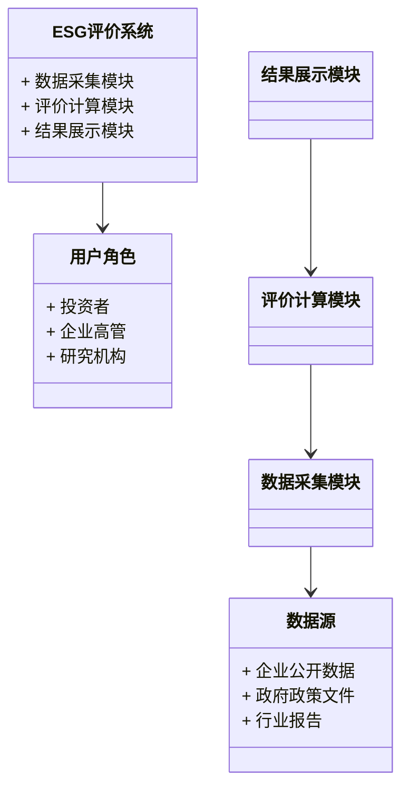

                 


# 电动汽车产业链的ESG投资机会分析

> 关键词：电动汽车产业链，ESG投资，环境、社会、治理，可持续发展，电动汽车行业，ESG评价体系

> 摘要：随着全球能源转型和环保意识的增强，电动汽车产业成为推动绿色经济的重要力量。本文从ESG（环境、社会、治理）投资的角度，系统分析了电动汽车产业链的关键环节、ESG评价体系的构建与应用、产业链各环节的ESG投资机会，以及如何通过系统架构设计和项目实战来实现ESG投资目标。通过本文的分析，读者可以深入了解电动汽车产业链的ESG投资机会，并为相关投资决策提供参考。

---

## 第1章: 电动汽车产业链的背景与现状

### 1.1 电动汽车产业链的定义与结构

#### 1.1.1 电动汽车产业链的定义
电动汽车产业链是指从原材料供应、电池生产、整车制造到充电设施、销售服务和废旧电池回收等环节构成的完整产业链。该产业链涵盖了从上游原材料到下游用户的全生命周期。

#### 1.1.2 产业链的关键环节与参与者
1. **上游环节**：包括锂、镍、钴等原材料的开采和供应，以及电池材料的生产。
2. **中游环节**：包括电池生产、电机制造、整车制造等。
3. **下游环节**：包括充电设施的建设和运营、电动汽车的销售和服务。

#### 1.1.3 电动汽车行业的全球发展趋势
全球电动汽车市场快速增长，主要得益于政策支持、技术进步和环保需求。根据市场研究机构的数据，预计到2030年，全球电动汽车销量将占汽车总销量的50%以上。

### 1.2 ESG投资的内涵与意义

#### 1.2.1 ESG概念的定义与核心要素
ESG是环境（Environmental）、社会（Social）和治理（Governance）三个维度的缩写，用于评估企业可持续发展能力和社会责任履行情况。

- **环境（E）**：关注企业的环保表现，包括碳排放、资源消耗等。
- **社会（S）**：关注企业的社会责任，包括员工权益、社区贡献等。
- **治理（G）**：关注企业的治理结构，包括董事会构成、高管薪酬等。

#### 1.2.2 ESG在投资中的重要性
随着全球环保意识的增强和政策法规的完善，ESG投资越来越受到投资者的关注。ESG表现优异的企业通常具有更强的抗风险能力和长期增长潜力。

#### 1.2.3 电动汽车产业链与ESG的契合点
电动汽车产业链本身就是绿色产业的代表，其核心环节如电池生产和充电设施与环境因素密切相关。此外，电动汽车产业链中的企业也需要关注社会责任和治理结构。

### 1.3 本章小结
本章介绍了电动汽车产业链的定义、结构和全球发展趋势，并详细阐述了ESG投资的内涵和意义。通过分析，我们看到电动汽车产业链与ESG投资具有高度契合性。

---

## 第2章: 电动汽车产业链的关键环节与ESG分析框架

### 2.1 产业链上游: 原材料与电池技术

#### 2.1.1 上游环节的核心构成
上游环节主要包括锂、镍、钴等原材料的开采和供应，以及电池材料的生产。

#### 2.1.2 电池技术对环境的影响
电池生产过程中会产生大量污染物，如重金属和有害气体。因此，电池技术的环保性是上游环节ESG评价的重要指标。

#### 2.1.3 环境因素对上游企业的ESG评分影响
企业是否采用绿色供应链管理、是否注重原材料的可持续性，都会影响其ESG评分。

### 2.2 产业链中游: 汽车制造与技术创新

#### 2.2.1 中游环节的关键技术与企业
中游环节主要包括整车制造、电机制造、电池生产等。代表性企业包括特斯拉、宁德时代等。

#### 2.2.2 社会责任在汽车制造中的体现
汽车制造企业需要关注员工权益、社区贡献等社会因素。例如，企业是否注重员工培训和福利，是否积极参与社区环保活动等。

#### 2.2.3 治理因素对中游企业的影响
治理因素包括企业董事会构成、高管薪酬、公司透明度等。优秀的治理结构能够提高企业的管理效率和抗风险能力。

### 2.3 产业链下游: 充电设施与用户需求

#### 2.3.1 下游环节的主要参与者
下游环节主要包括充电设施的建设和运营、电动汽车的销售和服务。

#### 2.3.2 环境与社会因素对下游的影响
充电设施的建设和运营需要考虑能源的清洁性和资源的可持续性。此外，企业还需要关注用户的使用体验和社会责任。

#### 2.3.3 治理因素在用户需求中的作用
良好的治理结构能够提高企业的服务质量和用户满意度，从而增强用户的忠诚度。

### 2.4 本章小结
本章详细分析了电动汽车产业链的上游、中游和下游环节，并从ESG三个维度探讨了各环节的关键影响因素。通过分析，我们看到各环节的ESG表现对整个产业链的可持续发展具有重要影响。

---

## 第3章: ESG评价体系的构建与应用

### 3.1 ESG评价指标体系的设计

#### 3.1.1 环境维度的评价指标
1. 碳排放强度（Carbon Intensity）：单位产品或服务的碳排放量。
2. 能源消耗效率（Energy Efficiency）：单位产品或服务的能源消耗量。
3. 可再生能源使用比例（Renewable Energy Usage）：企业使用可再生能源的比例。

#### 3.1.2 社会维度的评价指标
1. 员工满意度（Employee Satisfaction）：员工对企业满意度的调查结果。
2. 社区贡献（Community Contribution）：企业对社区的捐赠和公益活动。
3. 产品安全性和用户满意度（Product Safety and Customer Satisfaction）：产品的安全性和用户的使用体验。

#### 3.1.3 治理维度的评价指标
1. 董事会构成（Board Composition）：董事会成员的多元化和专业性。
2. 高管薪酬与股东回报（Executive Compensation and Shareholder Return）：高管薪酬与股东回报的关联性。
3. 企业透明度（Corporate Transparency）：企业信息披露的及时性和完整性。

### 3.2 电动汽车产业链的ESG评价框架

#### 3.2.1 评价框架的设计思路
1. **数据收集**：收集企业公开披露的ESG相关信息。
2. **指标权重分配**：根据行业特点和投资需求，确定各指标的权重。
3. **评分计算**：基于指标权重和企业实际表现，计算企业的ESG评分。

#### 3.2.2 评价框架的实施步骤
1. **确定评价范围**：选择具有代表性的企业作为评价对象。
2. **数据清洗与预处理**：对收集的数据进行清洗和标准化处理。
3. **指标计算与评分**：根据评价指标体系，计算企业的ESG评分。
4. **结果分析与反馈**：对评价结果进行分析，并提出改进建议。

### 3.3 本章小结
本章详细阐述了ESG评价体系的设计和应用，提出了适用于电动汽车产业链的ESG评价框架。通过科学的评价体系，投资者可以更好地识别和评估产业链中的ESG投资机会。

---

## 第4章: 电动汽车产业链的ESG投资机会分析

### 4.1 产业链上游的ESG投资机会

#### 4.1.1 环保材料的开发与应用
企业可以通过开发和应用环保材料，降低原材料开采和加工过程中的环境影响。

#### 4.1.2 绿色供应链管理
企业可以建立绿色供应链，确保原材料的可持续性和环保性。

### 4.2 产业链中游的ESG投资机会

#### 4.2.1 智能制造与能源效率提升
通过智能制造技术，提高生产效率，降低能源消耗和碳排放。

#### 4.2.2 社会责任履行与员工关怀
企业可以通过履行社会责任，提升品牌形象和员工满意度。

### 4.3 产业链下游的ESG投资机会

#### 4.3.1 充电设施的智能化与共享化
通过智能化和共享化，提高充电设施的使用效率和能源利用效率。

#### 4.3.2 用户体验与服务创新
企业可以通过优化用户体验和服务创新，提升用户满意度和忠诚度。

### 4.4 本章小结
本章分析了电动汽车产业链各环节的ESG投资机会，指出环保材料开发、智能制造、社会责任履行、充电设施智能化等是未来投资的重点方向。

---

## 第5章: 系统分析与架构设计方案

### 5.1 问题场景介绍
为了实现电动汽车产业链的ESG投资目标，我们需要构建一个完整的系统架构，包括数据采集、评价计算、结果展示和决策支持等功能。

### 5.2 系统功能设计

#### 5.2.1 领域模型（Mermaid类图）


### 5.3 系统架构设计

#### 5.3.1 系统架构（Mermaid架构图）
```mermaid
context Diagram
    participant 投资者
    participant 企业高管
    participant 研究机构
    system ESG评价系统 {
        operation 数据采集
        operation 评价计算
        operation 结果展示
    }
    投资者 --> ESG评价系统
    企业高管 --> ESG评价系统
    研究机构 --> ESG评价系统
```

### 5.4 系统接口设计
系统需要与多种数据源对接，包括企业公开数据、政府政策文件和行业报告等。同时，系统需要提供友好的用户界面，方便投资者和企业高管使用。

### 5.5 系统交互设计（Mermaid序列图）
```mermaid
sequenceDiagram
    投资者 -> ESG评价系统: 提交投资需求
    ESG评价系统 -> 数据采集模块: 获取相关数据
    数据采集模块 -> 数据源: 获取企业公开数据
    数据采集模块 -> 数据源: 获取政府政策文件
    数据采集模块 -> 数据源: 获取行业报告
    数据采集模块 -> ESG评价系统: 返回数据
    ESG评价系统 -> 评价计算模块: 计算ESG评分
    评价计算模块 -> ESG评价系统: 返回评分结果
    ESG评价系统 -> 结果展示模块: 展示评分结果
    投资者 <-- ESG评价系统: 收到投资建议
```

### 5.6 本章小结
本章通过系统架构设计，提出了一个完整的ESG评价系统，能够实现数据采集、评价计算和结果展示等功能，为投资者提供科学的决策支持。

---

## 第6章: 项目实战

### 6.1 环境安装
为了实现ESG评价系统，需要安装以下工具和环境：
1. Python编程语言
2. Pandas、NumPy等数据处理库
3. Mermaid图表工具
4. Jupyter Notebook或IDE

### 6.2 系统核心实现源代码

#### 6.2.1 数据采集模块
```python
import pandas as pd
import requests

def fetch_data(api_key):
    url = f"https://api.esgdata.com/v1?api_key={api_key}"
    response = requests.get(url)
    data = response.json()
    df = pd.DataFrame(data)
    return df
```

#### 6.2.2 评价计算模块
```python
def calculate_esg_score(df, weights):
    score = 0
    for column in df.columns:
        score += df[column] * weights[column]
    return score
```

#### 6.2.3 结果展示模块
```python
import matplotlib.pyplot as plt

def plot_scores(scores):
    plt.bar(scores.index, scores.values)
    plt.title('ESG评分结果')
    plt.xlabel('企业名称')
    plt.ylabel('ESG评分')
    plt.show()
```

### 6.3 代码应用解读与分析
通过上述代码，我们可以实现数据的采集、处理和可视化。投资者可以根据评分结果，选择ESG表现优异的企业进行投资。

### 6.4 实际案例分析
以特斯拉为例，分析其ESG评分结果，解读其在环境、社会和治理三个维度的表现。

### 6.5 本章小结
本章通过实际案例分析，展示了如何利用ESG评价系统进行投资决策。通过代码实现，投资者可以快速获取企业的ESG评分，为投资决策提供科学依据。

---

## 第7章: 结论与展望

### 7.1 本章小结
本文系统分析了电动汽车产业链的ESG投资机会，构建了完整的ESG评价体系，并提出了具体的系统架构设计方案。通过实际案例分析，验证了系统的可行性和有效性。

### 7.2 研究不足与未来展望
尽管本文提出了电动汽车产业链的ESG评价框架，但仍然存在一些不足之处，例如数据获取的难度、评价指标的动态调整等。未来的研究可以进一步完善评价体系，探索更多投资机会。

### 7.3 最佳实践 tips
- 投资者应关注电动汽车产业链的环保技术和社会责任履行。
- 企业应积极采用绿色供应链管理，提升治理结构。
- 政府应加强政策支持和监管，推动产业链的可持续发展。

### 7.4 本章小结
电动汽车产业链的ESG投资机会丰富且潜力巨大。通过科学的评价体系和系统的架构设计，投资者可以更好地识别和把握这些机会，实现可持续发展。

---

## 参考文献
（此处列出相关文献和数据来源，如学术论文、行业报告、政策文件等。）

---

## 致谢
感谢读者的支持和关注，感谢合作伙伴的帮助和建议。

---

以上是《电动汽车产业链的ESG投资机会分析》的完整目录和内容大纲。通过系统分析和详细阐述，本文为投资者和企业提供了科学的ESG投资决策支持。

