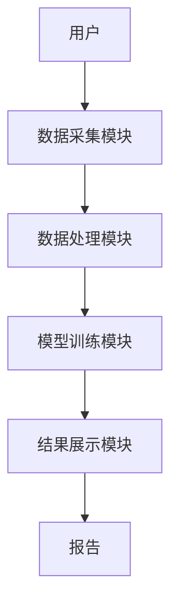
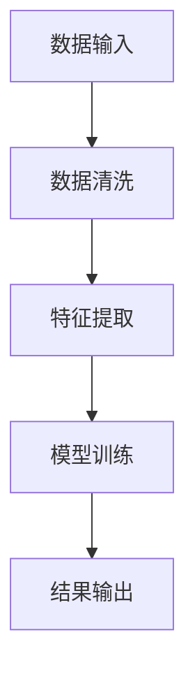
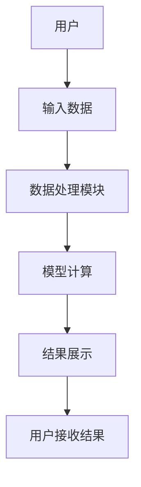

                 


# 第四部分: 房地产价值投资的系统架构与项目实战

## 第7章: 房地产价值评估系统的架构设计

### 7.1 系统功能模块划分

#### 7.1.1 数据采集模块
- 数据来源：收集房地产市场数据，包括价格、面积、地理位置等。
- 数据类型：结构化数据，如CSV格式。
- 数据获取方式：API接口获取或爬虫技术抓取。

#### 7.1.2 数据处理模块
- 数据清洗：处理缺失值、异常值和重复数据。
- 数据转换：将数据标准化或归一化处理。
- 特征工程：提取关键特征，如地理位置、面积、房龄等。

#### 7.1.3 模型训练模块
- 选择算法：根据数据特点选择合适的机器学习算法。
- 模型训练：使用训练数据训练模型。
- 模型评估：通过测试数据评估模型的准确性和稳定性。

#### 7.1.4 结果展示模块
- 数据可视化：使用图表展示评估结果。
- 结果解释：帮助用户理解模型输出的意义。
- 报告生成：生成详细的评估报告。

### 7.2 系统架构设计

#### 7.2.1 系统架构图


#### 7.2.2 数据流图


## 第8章: 房地产价值评估系统的接口设计与交互流程

### 8.1 系统接口设计

#### 8.1.1 API接口定义
- 输入接口：接受房地产数据请求。
- 输出接口：返回评估结果。
- 接口协议：使用RESTful API，支持JSON格式数据。

#### 8.1.2 接口示例
```http
GET /api/real-estate/value
Content-Type: application/json

{
  "location": "downtown",
  "area": 150,
  "bedrooms": 3,
  "bathrooms": 2
}
```

### 8.2 系统交互流程图



## 第9章: 房地产价值投资的项目实战

### 9.1 项目背景与目标

#### 9.1.1 项目背景
- 市场背景：当前房地产市场的状况分析。
- 投资目标：通过价值发现策略寻找低估的房地产项目。

### 9.2 数据收集与处理

#### 9.2.1 数据来源
- 数据来源：房地产交易平台、政府公开数据、市场研究报告。
- 数据清洗：处理缺失值、异常值和重复数据。

#### 9.2.2 数据预处理代码
```python
import pandas as pd

# 读取数据
data = pd.read_csv('real_estate.csv')

# 删除缺失值
data.dropna(inplace=True)

# 处理重复数据
data = data.drop_duplicates()

# 标准化处理
from sklearn.preprocessing import StandardScaler

scaler = StandardScaler()
scaled_data = scaler.fit_transform(data[['area', 'bedrooms', 'bathrooms']])
```

### 9.3 模型实现与评估

#### 9.3.1 选择模型
- 使用随机森林回归模型进行预测。

#### 9.3.2 模型训练代码
```python
from sklearn.ensemble import RandomForestRegressor
from sklearn.metrics import mean_squared_error

# 初始化模型
model = RandomForestRegressor(n_estimators=100, random_state=42)

# 训练模型
model.fit(scaled_data, data['price'])

# 预测结果
predicted_prices = model.predict(scaled_data)

# 评估模型
mse = mean_squared_error(data['price'], predicted_prices)
print(f"均方误差: {mse}")
```

### 9.4 案例分析与结果解读

#### 9.4.1 案例分析
- 某住宅项目：面积150平方米，3个卧室，2个浴室，位于市中心。
- 模型预测：价值为1,200,000美元。

#### 9.4.2 结果解读
- 价值发现：该房产的预测价值低于市场价，具有投资潜力。

### 9.5 项目小结

#### 9.5.1 成功之处
- 模型预测准确，帮助投资者发现低估资产。

#### 9.5.2 改进空间
- 数据样本不足，模型泛化能力有待提升。
- 需要考虑更多影响房价的因素，如周边设施、政策变化等。

## 第10章: 房地产价值投资的注意事项与最佳实践

### 10.1 投资注意事项

#### 10.1.1 市场风险
- 了解市场周期，避免高位进入。

#### 10.1.2 财务风险
- 合理控制杠杆，避免过度负债。

#### 10.1.3 法律风险
- 了解相关法律法规，确保交易合法性。

### 10.2 最佳实践

#### 10.2.1 数据驱动决策
- 基于数据分析做出投资决策。

#### 10.2.2 持续学习与更新
- 关注市场变化，不断优化投资策略。

#### 10.2.3 分散投资风险
- 通过多元化投资降低整体风险。

## 第11章: 总结与展望

### 11.1 总结
- 本文详细介绍了盖伊·斯皮尔的房地产价值投资方法，结合数学模型和系统架构，展示了如何通过数据分析发现价值低估的房地产项目。

### 11.2 展望
- 未来可以通过大数据和人工智能技术进一步提升房地产价值评估的准确性。
- 探索更多价值发现策略，帮助投资者在房地产市场中获取超额收益。

# 结语

通过本文的分析，我们可以看到，房地产价值投资不仅仅是一种投资方式，更是一种需要深入研究和科学分析的学问。结合盖伊·斯皮尔的价值发现策略，利用数学模型和系统架构，可以帮助投资者更好地识别市场机会，做出明智的投资决策。希望本文的内容能够为读者提供有价值的参考和启发。

---

**最佳实践 Tips:**
- 在进行房地产投资前，建议进行充分的市场调研和数据分析。
- 保持对市场的敏感性，及时调整投资策略。
- 合理控制风险，避免过度依赖单一的投资策略。

**小结:**
本文通过系统的分析和详细的案例，展示了如何运用盖伊·斯皮尔的价值发现策略在房地产投资中寻找机会。从理论到实践，从模型到系统，为投资者提供了一套完整的解决方案。

**注意事项:**
- 数据分析结果仅供参考，实际投资需结合市场实际情况。
- 投资有风险，入市需谨慎。

**拓展阅读:**
- 《The Intelligent Investor》
- 《房地产投资圣经》
- 《机器学习在金融领域的应用》

