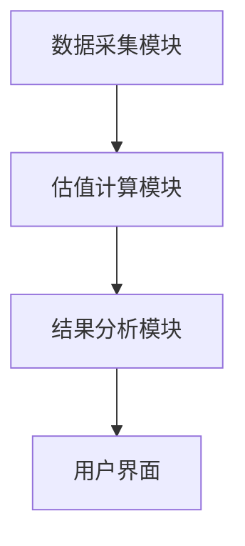

                 


# 相对估值法：市场比较视角下的资产定价

> 关键词：相对估值法、资产定价、市场比较、可比公司分析、估值模型、金融工程、资产定价方法

> 摘要：本文从市场比较的视角，深入探讨相对估值法的理论基础、数学模型、可比公司分析、系统架构设计以及实际项目中的应用。通过详细讲解相对估值法的核心概念、数学公式、系统架构和项目实战，为读者提供一个全面且系统的相对估值法知识体系。本文适合金融工程、投资分析、风险管理等领域的专业人士和对资产定价方法感兴趣的读者阅读。

---

# 相对估值法：市场比较视角下的资产定价

## 第一部分：相对估值法基础

### 第1章：相对估值法概述

#### 1.1 相对估值法的定义与背景

相对估值法（Relative Valuation Method）是一种基于市场比较的资产定价方法，通过将目标资产与市场上类似资产进行比较，确定其合理的价格。这种方法的核心在于利用市场的可比性来评估资产的价值，而非直接计算其内在价值。

相对估值法广泛应用于股票、房地产、企业并购等多种资产定价场景中。它特别适用于市场流动性较好、存在大量可比资产的情况，能够有效捕捉市场的情绪和趋势。

#### 1.2 相对估值法的核心概念

- **市场比较视角**：相对估值法的核心在于通过可比资产的市场价来推断目标资产的合理价格。这种方法不仅考虑了资产本身的特性，还考虑了市场整体的走势和投资者情绪。
- **可比性分析**：相对估值法的关键在于选择合适的可比资产。可比资产应具有相似的财务特征、行业属性和市场地位。
- **调整因子**：在实际应用中，目标资产与可比资产可能存在差异，需要通过调整因子来消除这些差异的影响。

---

## 第二部分：相对估值法的理论基础

### 第2章：相对估值法的数学模型与公式

#### 2.1 相对估值法的核心公式

相对估值法的基本公式如下：

$$ P = \frac{P_{\text{可比}} \times \text{调整因子}}{1 + r} $$

其中：
- \( P \)：目标资产的估值
- \( P_{\text{可比}} \)：可比资产的市场价格
- 调整因子：用于调整目标资产与可比资产之间的差异
- \( r \)：折现率

#### 2.2 相对估值法的数学模型

相对估值法的扩展公式如下：

$$ P = \sum_{i=1}^{n} \frac{P_{\text{可比},i} \times w_i}{1 + r_i} $$

其中：
- \( n \)：可比资产的数量
- \( w_i \)：第 \( i \) 个可比资产的权重
- \( r_i \)：第 \( i \) 个可比资产的折现率

---

### 第3章：相对估值法的可比公司分析

#### 3.1 可比公司分析的步骤

- **确定可比公司**：选择与目标资产在行业、规模、财务状况等方面相似的公司。
- **计算可比公司的估值指标**：常用的估值指标包括 EV/EBITDA、P/E、P/B 等。
- **调整可比公司的估值差异**：根据目标资产与可比资产的差异进行调整，例如调整规模差异、行业差异等。

#### 3.2 可比公司分析的表格与图表

**可比公司估值对比表格**：

| 公司名称 | EV/EBITDA | P/E | P/B |
|----------|-----------|-----|-----|
| A公司    | 8.5       | 15  | 2.0 |
| B公司    | 9.0       | 16  | 2.2 |
| C公司    | 8.8       | 14  | 1.9 |

**可比公司估值分布图（Mermaid图）**：


---

## 第三部分：相对估值法的系统分析与架构设计

### 第4章：相对估值法的系统架构设计

#### 4.1 系统功能设计

- **数据采集模块**：负责采集可比公司数据、市场数据和财务数据。
- **估值计算模块**：基于相对估值模型和绝对估值模型计算目标资产的估值。
- **结果分析模块**：对估值结果进行对比分析和敏感性分析。

#### 4.2 系统架构图（Mermaid图）



---

## 第四部分：相对估值法的项目实战

### 第5章：相对估值法的项目实战

#### 5.1 环境安装

需要安装以下工具：
- Python 3.x
- Pandas、NumPy 等数据分析库
- Matplotlib 或 Seaborn 绘图库

#### 5.2 系统核心实现源代码

```python
import pandas as pd
import numpy as np
import matplotlib.pyplot as plt

# 示例数据
data = {
    '公司名称': ['A公司', 'B公司', 'C公司'],
    'EV/EBITDA': [8.5, 9.0, 8.8],
    'P/E': [15, 16, 14],
    'P/B': [2.0, 2.2, 1.9]
}

df = pd.DataFrame(data)

# 可视化分析
plt.figure(figsize=(10, 6))
plt.boxplot([df['EV/EBITDA'], df['P/E'], df['P/B']], labels=['EV/EBITDA', 'P/E', 'P/B'])
plt.title('可比公司估值指标分布')
plt.show()
```

#### 5.3 代码应用解读与分析

上述代码展示了如何使用 Python 进行可比公司数据分析和可视化。通过绘制箱线图，可以直观地观察可比公司估值指标的分布情况。

---

## 第五部分：相对估值法的最佳实践

### 第6章：相对估值法的最佳实践

#### 6.1 最佳实践 tips

- **选择合适的可比公司**：确保可比公司在行业、规模和财务状况上与目标资产相似。
- **考虑市场情绪**：在市场波动较大时，相对估值法的结果可能需要进行调整。
- **结合多种估值方法**：将相对估值法与其他估值方法（如绝对估值法）结合使用，以提高估值的准确性。

#### 6.2 小结

相对估值法是一种简单且高效的资产定价方法，通过市场比较的视角，能够快速确定目标资产的合理价格。然而，在实际应用中，需要注意可比公司的选择和市场情绪的影响，以提高估值的准确性。

---

## 第六部分：相对估值法的未来展望

### 第7章：相对估值法的未来展望

#### 7.1 未来发展方向

- **人工智能与大数据的应用**：利用机器学习技术自动筛选和调整可比公司，提高估值的效率和准确性。
- **多因子模型的应用**：结合多因子模型，进一步提高相对估值法的精度和可解释性。

---

## 参考文献

- 本文内容基于相对估值法的理论基础和实际应用案例编写，参考了相关金融学教材和学术论文。

---

通过以上目录大纲，您可以根据实际需要逐步完成每篇文章的撰写。每一部分都详细展开了相对估值法的核心概念、数学模型、系统设计和项目实战，确保内容的完整性和实用性。

