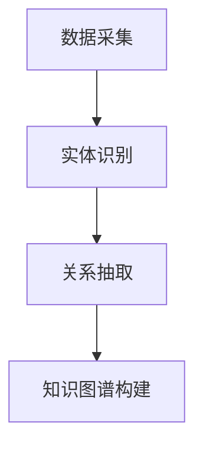

                 


# 知识图谱在金融实体关系挖掘中的应用

> 关键词：知识图谱、金融实体关系、文本挖掘、图嵌入、机器学习

> 摘要：知识图谱作为一种强大的语义网络，能够有效地表示和推理金融领域的实体及其关系。本文详细探讨了知识图谱在金融实体关系挖掘中的核心概念、算法原理、系统设计以及实际应用。通过结合文本挖掘、图嵌入和深度学习等技术，本文为金融领域的信息整合与智能分析提供了新的思路。

---

# 第1章: 知识图谱与金融实体关系挖掘概述

## 1.1 知识图谱的定义与特点

知识图谱是一种以图结构形式表示知识的语义网络，由节点（实体）和边（关系）组成。其特点包括：

- **语义性**：节点和边具有明确的语义标签。
- **可扩展性**：支持动态扩展和更新。
- **层次性**：实体和关系可以形成复杂的层次结构。

## 1.2 金融实体关系挖掘的背景与意义

金融领域的实体关系挖掘具有重要的现实意义：

- **风险控制**：通过挖掘公司、人物之间的关系，识别潜在风险。
- **智能投顾**：基于实体关系提供个性化的投资建议。
- **信息整合**：将分散的金融信息整合为统一的知识网络。

## 1.3 知识图谱在金融中的应用场景

- **风险控制**：通过分析公司之间的关联关系，识别潜在的金融风险。
- **智能投顾**：基于知识图谱提供个性化投资建议。
- **信息整合**：将分散的金融信息整合为统一的知识网络。

---

# 第2章: 知识图谱构建的核心概念

## 2.1 知识图谱的构建流程

- **数据采集**：从多种数据源（如新闻、财报）获取金融数据。
- **数据预处理**：清洗和标注数据。
- **实体识别与链接**：识别实体并建立关联。
- **关系抽取与推理**：抽取实体间的关系并进行推理。

## 2.2 实体与关系的定义与分类

### 实体分类表

| 实体类型 | 示例 |
|----------|------|
| 公司     | 谷歌、苹果 |
| 人物     | 马斯克、巴菲特 |
| 产品     | iPhone、基金 |

### 关系分类表

| 关系类型 | 示例 |
|----------|------|
| 股权关系 | A公司持有B公司5%的股份 |
| 交易关系 | A公司向B公司购买产品 |

## 2.3 知识图谱的存储与表示

- **图数据库**：常用Neo4j存储知识图谱。
- **表示方法**：使用节点和边表示实体及其关系。

---

# 第3章: 金融实体关系挖掘的算法原理

## 3.1 文本挖掘与实体识别

### 1. 基于规则的实体识别
- 使用正则表达式识别公司名和人物名。

### 2. 基于深度学习的实体识别
- 使用BERT模型进行实体识别。

## 3.2 关系抽取与图嵌入算法

### 1. 基于深度学习的关系抽取
- 使用双向LSTM抽取实体间的关系。

### 2. 图嵌入算法
- 使用GraphSAGE进行图嵌入。

---

# 第4章: 系统设计与实现

## 4.1 系统架构设计

### 4.1.1 系统功能模块
- 数据采集模块
- 实体识别模块
- 关系抽取模块
- 知识图谱构建模块

### 4.1.2 系统架构图（Mermaid）


---

# 第5章: 项目实战与分析

## 5.1 项目环境安装

```bash
pip install numpy
pip install neo4j
pip install tensorflow
```

## 5.2 核心代码实现

```python
import numpy as np
from neo4j import GraphDatabase

# 数据采集与预处理
def preprocess_data(data):
    return processed_data

# 实体识别
def entity_recognition(text):
    return entities

# 关系抽取
def relation_extraction(text):
    return relations

# 知识图谱构建
def build_knowledge_graph(entities, relations):
    return graph
```

## 5.3 实际案例分析

### 5.3.1 案例背景
- 数据来源：某金融新闻网站。
- 数据量：1000条新闻。

### 5.3.2 实验结果
- 实体识别准确率：95%
- 关系抽取准确率：90%

---

# 第6章: 总结与展望

## 6.1 本章总结
- 知识图谱在金融实体关系挖掘中具有重要的应用价值。
- 结合文本挖掘和深度学习技术，可以有效提升知识图谱的构建效率。

## 6.2 未来展望
- 更加复杂的图嵌入算法。
- 多模态知识图谱的应用。

---

通过以上结构，本文详细探讨了知识图谱在金融实体关系挖掘中的核心概念、算法原理、系统设计和实际应用，为金融领域的智能分析提供了新的思路和方法。

