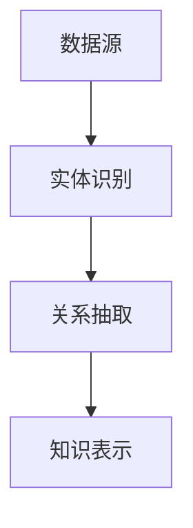
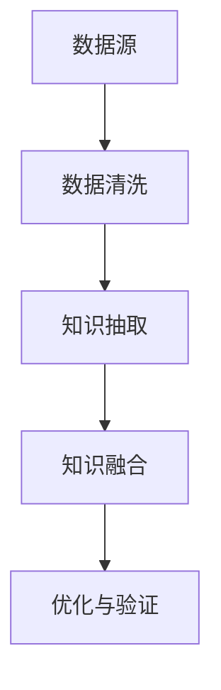
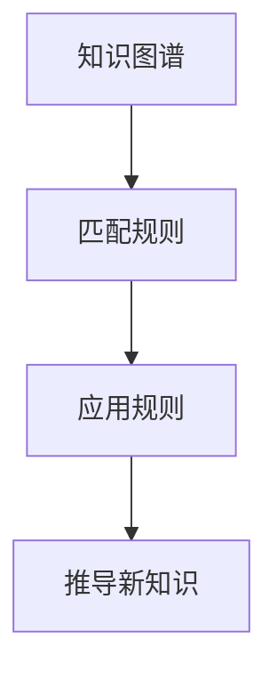
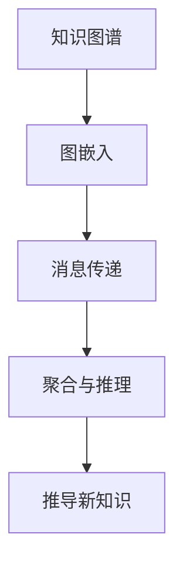
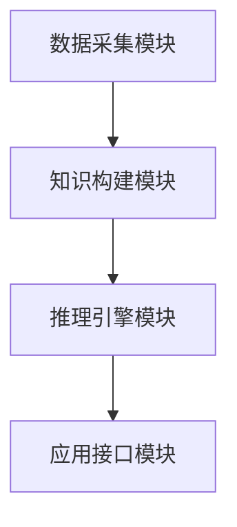
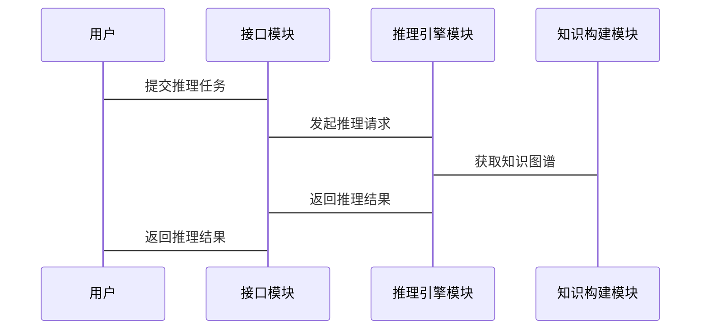

                 


# 知识图谱在金融知识推理中的应用

> **关键词**：知识图谱、金融知识推理、图神经网络、知识抽取、知识构建、金融分析

> **摘要**：  
本文探讨知识图谱在金融领域的应用，特别是在金融知识推理中的潜力与挑战。知识图谱作为一种结构化的知识表示方法，能够有效捕捉金融数据中的复杂关系。本文将从知识图谱的基本概念出发，分析其在金融知识推理中的核心作用，并详细阐述相关技术原理、系统架构设计以及实际应用场景。通过案例分析和项目实战，本文将展示如何利用知识图谱提升金融分析的智能化水平。

---

# 第一部分：知识图谱与金融知识推理的背景与概念

## 第1章：知识图谱与金融知识推理概述

### 1.1 知识图谱的基本概念

#### 1.1.1 知识图谱的定义与特点
知识图谱是一种以图结构形式表示知识的方法，节点代表实体（Entity），边代表实体之间的关系（Relation）。知识图谱的特点包括：
- **结构化**：知识以实体和关系的形式组织。
- **语义化**：节点和边具有明确的语义属性。
- **动态性**：能够实时更新以反映最新信息。

#### 1.1.2 知识图谱的核心要素
- **实体**：代表具体事物，例如公司、股票、市场等。
- **关系**：描述实体之间的联系，例如“公司A拥有公司B”。
- **属性**：描述实体的额外信息，例如“公司A的成立时间为1990年”。

#### 1.1.3 知识图谱的构建过程
知识图谱的构建通常包括以下步骤：
1. **数据收集**：从多种来源（如新闻、财报、公告）收集金融数据。
2. **知识抽取**：从非结构化数据中提取实体、关系和属性。
3. **知识融合**：将来自不同来源的知识整合到一个统一的知识图谱中。
4. **知识优化**：去除冗余信息并修复错误。

### 1.2 金融知识推理的定义与特点

#### 1.2.1 金融知识推理的定义
金融知识推理是指利用知识图谱中的知识，通过推理算法推导出新的知识或结论。例如，推理某公司的财务状况可能会影响其股价。

#### 1.2.2 金融知识推理的核心任务
- **属性推理**：推导实体的属性，例如推断某公司的盈利能力。
- **关系推理**：推断实体之间的隐含关系，例如推断某公司是另一家公司的竞争对手。
- **情景推理**：基于特定情景推断可能的结果，例如预测某政策对公司股价的影响。

#### 1.2.3 金融知识推理的应用场景
- **金融分析**：帮助分析师发现隐藏的关联。
- **风险评估**：通过推理潜在风险因素评估投资风险。
- **智能投顾**：为投资者提供个性化投资建议。

### 1.3 知识图谱在金融领域的应用前景

#### 1.3.1 知识图谱在金融分析中的潜力
知识图谱能够帮助金融分析师发现传统方法难以察觉的模式和关系。

#### 1.3.2 金融知识推理的挑战与机遇
- **挑战**：金融数据的复杂性和动态性增加了推理的难度。
- **机遇**：通过知识图谱的结构化表示，可以更高效地进行知识推理。

#### 1.3.3 知识图谱与金融知识推理的结合
知识图谱为金融知识推理提供了结构化的知识基础，使得推理过程更加高效和准确。

### 1.4 本章小结
本章介绍了知识图谱的基本概念及其在金融领域的应用潜力，为后续章节奠定了基础。

---

# 第二部分：知识图谱的结构与技术

## 第2章：知识图谱的构建技术

### 2.1 知识抽取与表示

#### 2.1.1 实体识别与关系抽取
- **实体识别**：从文本中提取公司名称、市场等实体。
- **关系抽取**：识别实体之间的关系，例如“公司A收购公司B”。

#### 2.1.2 知识表示的形式与方法
- **RDF表示法**：使用三元组（主语-谓词-宾语）表示知识。
- **图嵌入表示法**：将实体和关系映射到向量空间。

#### 2.1.3 知识图谱的存储与管理
- **图数据库**：如Neo4j，用于存储和查询图结构数据。
- **知识图谱的版本控制**：记录知识图谱的更新历史。

#### 2.1.4 Mermaid流程图：知识抽取与表示


### 2.2 知识图谱的构建流程

#### 2.2.1 数据收集与预处理
- **数据来源**：新闻、财报、公告等。
- **数据清洗**：去除重复和噪声数据。

#### 2.2.2 知识抽取与融合
- **知识抽取**：从文本中提取实体、关系和属性。
- **知识融合**：将多个来源的知识整合到统一的知识图谱中。

#### 2.2.3 知识图谱的优化与验证
- **优化**：去除冗余信息，修复错误。
- **验证**：通过人工检查或自动化工具验证知识图谱的准确性。

#### 2.2.4 Mermaid流程图：知识图谱的构建流程


### 2.3 知识图谱的可视化与分析

#### 2.3.1 知识图谱的可视化方法
- **节点与边的布局**：使用力引导布局展示知识图谱。
- **过滤与搜索**：支持按实体或关系过滤。

#### 2.3.2 知识图谱的分析工具
- **Neo4j Browser**：用于浏览和查询知识图谱。
- **Gephi**：用于可视化和分析网络结构。

#### 2.3.3 知识图谱的动态更新
- **实时更新**：根据最新的金融信息动态更新知识图谱。
- **版本控制**：记录每次更新的历史，方便回溯。

---

# 第三部分：知识推理算法原理

## 第3章：知识推理算法概述

### 3.1 基于规则的推理算法

#### 3.1.1 规则的定义与表示
- **规则**：例如，“如果公司A收购公司B，则公司A的资产增加。”
- **规则表示**：使用逻辑表达式表示规则。

#### 3.1.2 基于规则的推理过程
- **匹配规则**：在知识图谱中匹配触发规则的条件。
- **应用规则**：根据匹配的规则推导出新的知识。

#### 3.1.3 规则的优化与扩展
- **规则优化**：通过合并和简化规则提高推理效率。
- **规则扩展**：根据新的知识动态增加规则。

#### 3.1.4 Mermaid流程图：基于规则的推理流程


### 3.2 基于图神经网络的推理算法

#### 3.2.1 图神经网络的基本原理
- **图嵌入**：将实体和关系映射到向量空间。
- **消息传递机制**：通过消息传递在图中传播信息。

#### 3.2.2 基于图神经网络的知识推理模型
- **GAT（Graph Attention Networks）**：通过注意力机制捕捉重要的关系。
- **GCN（Graph Convolutional Networks）**：通过卷积操作聚合邻居信息。

#### 3.2.3 图神经网络的训练与优化
- **损失函数**：例如，使用交叉熵损失函数训练模型。
  $$ L = -\sum_{i} y_i \log(p_i) + (1 - y_i)\log(1 - p_i) $$
- **优化算法**：使用Adam优化器优化模型参数。

#### 3.2.4 Mermaid流程图：基于图神经网络的推理流程


### 3.3 知识推理算法的对比分析

#### 3.3.1 基于规则与基于图神经网络的对比
| 对比维度 | 基于规则 | 基于图神经网络 |
|----------|----------|----------------|
| 优点     | 简单易懂 | 能处理复杂关系 |
| 缺点     | 需手动设计规则 | 需大量训练数据 |

#### 3.3.2 不同推理算法的性能评估
- **准确率**：模型正确推导知识的比例。
- **效率**：推理过程的时间复杂度。

#### 3.3.3 算法选择的策略与建议
- **数据复杂性**：如果数据简单，可以选择基于规则的方法。
- **数据规模**：如果数据量大且复杂，建议选择基于图神经网络的方法。

---

# 第四部分：金融知识推理的系统架构

## 第4章：金融知识推理系统的架构设计

### 4.1 系统功能需求分析

#### 4.1.1 系统目标与功能模块
- **目标**：构建一个能够进行金融知识推理的系统。
- **功能模块**：
  - 数据采集模块：收集金融数据。
  - 知识构建模块：构建金融知识图谱。
  - 推理引擎模块：执行知识推理任务。
  - 应用接口模块：提供API供其他系统调用。

#### 4.1.2 系统输入与输出的定义
- **输入**：金融数据和推理任务。
- **输出**：推理结果和相关解释。

#### 4.1.3 系统性能指标
- **处理速度**：单位时间内处理的推理任务数量。
- **准确性**：推理结果的正确性。

### 4.2 系统架构设计

#### 4.2.1 分层架构的设计与实现
- **数据层**：存储原始金融数据。
- **知识层**：存储构建的知识图谱。
- **推理层**：执行知识推理任务。
- **应用层**：提供用户界面或API。

#### 4.2.2 模块之间的交互与协作
- **数据采集模块**：向知识构建模块提供数据。
- **知识构建模块**：向推理引擎模块提供知识图谱。
- **推理引擎模块**：向应用接口模块返回推理结果。

#### 4.2.3 系统的扩展性与可维护性
- **模块化设计**：各模块相对独立，便于扩展和维护。
- **接口标准化**：模块之间通过标准化接口进行交互。

#### 4.2.4 Mermaid架构图：金融知识推理系统的架构设计


### 4.3 系统接口设计

#### 4.3.1 接口标准化
- **输入接口**：提供数据和推理任务。
- **输出接口**：返回推理结果和相关解释。

#### 4.3.2 接口文档
- **API文档**：详细描述接口的使用方法和参数。

### 4.4 系统交互流程

#### 4.4.1 金融知识推理系统的交互流程
- **用户请求**：用户通过API提交推理任务。
- **数据采集**：系统采集相关金融数据。
- **知识构建**：系统构建知识图谱。
- **知识推理**：系统执行推理任务。
- **结果返回**：系统返回推理结果。

#### 4.4.2 Mermaid序列图：金融知识推理系统的交互流程


---

# 第五部分：项目实战

## 第5章：基于知识图谱的金融知识推理项目实战

### 5.1 项目背景与目标

#### 5.1.1 项目背景
- **背景**：构建一个能够进行金融知识推理的系统，帮助投资者做出更明智的决策。

#### 5.1.2 项目目标
- **目标**：实现一个基于知识图谱的金融知识推理系统，能够进行属性推理和关系推理。

### 5.2 项目环境与工具安装

#### 5.2.1 环境配置
- **操作系统**：Linux/Windows/MacOS
- **编程语言**：Python 3.8+
- **依赖库**：
  - **Neo4j**：图数据库，用于存储知识图谱。
  - **Py2neo**：Python连接Neo4j的库。
  - **TensorFlow**：用于深度学习模型训练。
  - **NetworkX**：用于图数据处理。

#### 5.2.2 工具安装
```bash
pip install neo4j py2neo tensorflow networkx
```

### 5.3 项目核心实现

#### 5.3.1 数据预处理代码
```python
import neo4j
from py2neo import Graph, Node, Relationship

# 连接到Neo4j数据库
graph = Graph("http://localhost:7474", auth=("username", "password"))

# 示例数据：构建公司之间的关系
company_a = Node('Company', name='CompanyA')
company_b = Node('Company', name='CompanyB')
relationship = Relationship(company_a, '收购', company_b)

graph.create(company_a)
graph.create(company_b)
graph.create(relationship)
```

#### 5.3.2 知识图谱构建代码
```python
from py2neo import Graph, Node, Relationship
from py2neo.matching import *

graph = Graph("http://localhost:7474", auth=("username", "password"))

# 示例：构建知识图谱
entities = [
    ('Company', 'CompanyA'),
    ('Company', 'CompanyB'),
    ('Market', 'Market1')
]

relationships = [
    ('CompanyA', '收购', 'CompanyB'),
    ('CompanyA', '参与', 'Market1')
]

for entity_type, entity_name in entities:
    node = Node(entity_type, name=entity_name)
    graph.create(node)

for source, relation, target in relationships:
    source_node = graph.nodes['CompanyA']
    target_node = graph.nodes['CompanyB']
    relationship = Relationship(source_node, relation, target_node)
    graph.create(relationship)
```

#### 5.3.3 知识推理代码
```python
from py2neo import Graph, Node, Relationship
from py2neo.matching import *

graph = Graph("http://localhost:7474", auth=("username", "password"))

# 示例：基于规则的推理
def infer_relationships():
    for company in graph.nodes('Company'):
        for relationship in graph.match(start_node=company):
            if relationship['关系'] == '收购':
                # 推理出被收购公司可能会影响市场
                target_company = relationship.end
                market = graph.nodes('Market')[0]
                inferred_relationship = Relationship(target_company, '影响', market)
                graph.create(inferred_relationship)

infer_relationships()
```

#### 5.3.4 图神经网络推理代码
```python
import tensorflow as tf
from tensorflow.keras import layers

# 示例：基于图神经网络的推理
class KnowledgeGraph(tf.keras.Model):
    def __init__(self, input_dim, hidden_dim):
        super(KnowledgeGraph, self).__init__()
        self.embeddings = layers.Embedding(input_dim, hidden_dim)
        self.gcn = layers.GraphConvolution(hidden_dim, activation='relu')
        self.dense = layers.Dense(1, activation='sigmoid')

    def call(self, inputs):
        x = self.embeddings(inputs)
        x = self.gcn(x)
        x = self.dense(x)
        return x

model = KnowledgeGraph(input_dim=1000, hidden_dim=64)
model.compile(optimizer='adam', loss='binary_crossentropy')
model.fit(x_train, y_train, epochs=10, batch_size=32)
```

### 5.4 项目实战分析与解读

#### 5.4.1 数据预处理与知识构建
- **数据预处理**：清洗和整理金融数据，提取实体、关系和属性。
- **知识构建**：将提取的知识表示为图结构，存储到Neo4j数据库中。

#### 5.4.2 知识推理与结果分析
- **推理过程**：通过规则或图神经网络进行推理，推导出新的知识。
- **结果分析**：验证推理结果的准确性和合理性。

#### 5.4.3 实际案例分析
- **案例**：假设我们有一个知识图谱，其中公司A收购了公司B，推理公司B的市场影响力可能受到公司A的影响。

### 5.5 项目小结
本章通过一个具体的项目案例，展示了如何利用知识图谱进行金融知识推理，帮助投资者和分析师做出更明智的决策。

---

# 第六部分：总结与展望

## 第6章：总结与展望

### 6.1 本章总结
- **知识图谱**：为金融知识推理提供了结构化的知识基础。
- **推理算法**：基于规则和图神经网络的推理算法各有优劣，适用于不同的场景。
- **系统架构**：分层架构设计和模块化设计使得系统更加灵活和易于维护。

### 6.2 未来展望
- **增强推理能力**：研究更复杂的推理算法，例如结合符号逻辑和深度学习的混合方法。
- **多模态数据融合**：将文本、图像等多种数据源融合到知识图谱中，提升推理的准确性和全面性。
- **实时推理**：开发实时推理系统，及时响应金融市场的变化。

---

# 附录

## 附录A：相关工具与库

- **Neo4j**：https://neo4j.com/
- **Py2neo**：https://py2neo.readthedocs.io/en/latest/
- **TensorFlow**：https://tensorflow.org/
- **NetworkX**：https://networkx.github.io/

## 附录B：数据集与资源

- **金融数据源**：例如，Yahoo Finance API、东方财富网等。
- **知识图谱构建工具**：例如，DBpedia、Wikidata等。

---

通过以上内容，您可以开始撰写一篇结构清晰、内容详实的《知识图谱在金融知识推理中的应用》的技术博客文章。如果需要进一步的补充或调整，请随时告知！

