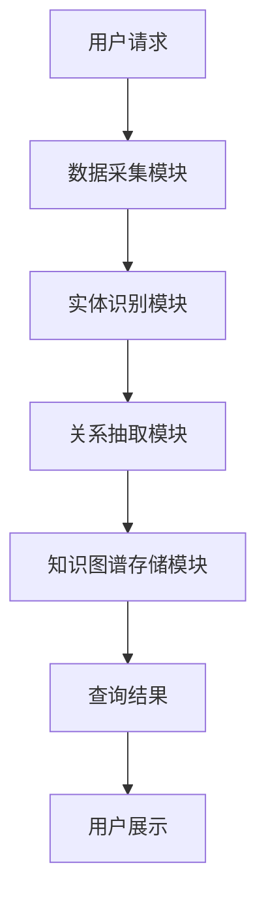

                 


# 知识图谱在金融研究中的构建与应用

> 关键词：知识图谱、金融研究、构建方法、算法原理、系统架构、应用案例

> 摘要：知识图谱是一种通过结构化数据和语义信息来表示复杂关系的图数据模型，广泛应用于金融研究领域。本文系统地介绍了知识图谱的核心概念、构建方法、算法原理以及在金融研究中的应用场景。通过实际案例分析，展示了知识图谱在金融风险评估、投资决策支持等领域的强大能力，并对系统架构设计和最佳实践进行了详细探讨。

---

# 第一部分：知识图谱在金融研究中的构建与应用概述

# 第1章：知识图谱与金融研究的背景

## 1.1 知识图谱的定义与特点

### 1.1.1 知识图谱的定义
知识图谱是一种以图结构表示实体及其关系的语义网络，通过节点（实体）和边（关系）来描述数据间的语义关联。例如，在金融领域，实体可以是公司、股票、基金，关系可以是“控股”、“投资”、“关联交易”。

### 1.1.2 知识图谱的核心特点
| 特性 | 描述 |
|------|------|
| 结构化 | 数据以节点和边的形式组织，便于计算机理解和推理 |
| 语义化 | 强调实体间的关系和语义，而非单一数据点 |
| 可扩展性 | 支持动态扩展，能够整合多种数据源 |

### 1.1.3 知识图谱与传统数据库的区别
| 对比维度 | 知识图谱 | 传统数据库 |
|----------|--------|------------|
| 数据结构 | 图结构（节点和边） | 行列结构 |
| 查询效率 | 语义查询高效 | 基于字段查询 |

## 1.2 金融研究中的知识图谱应用背景

### 1.2.1 金融数据的复杂性与挑战
- **数据异构性**：金融数据来源多样，包括文本、结构化数据、非结构化数据。
- **数据关联性**：金融实体之间的关系复杂，例如公司间的控股关系、关联交易等。
- **实时性要求**：金融市场的动态变化需要实时更新的知识图谱支持。

### 1.2.2 知识图谱在金融研究中的优势
- **语义理解**：能够捕捉数据间的深层语义关系。
- **知识整合**：支持多源异构数据的统一表示和融合。
- **决策支持**：通过语义推理提供精准的决策支持。

### 1.2.3 金融知识图谱的应用场景
- **金融风险评估**：识别关联企业之间的风险传导。
- **投资决策支持**：基于知识图谱进行股票推荐。
- **关联交易挖掘**：发现潜在的财务造假行为。

## 1.3 本章小结
本章从知识图谱的定义、特点出发，分析了其在金融研究中的背景和优势，并结合具体应用场景，为后续内容奠定了基础。

---

# 第二部分：知识图谱的核心概念与构建方法

# 第2章：知识图谱的核心概念与联系

## 2.1 知识图谱的核心概念

### 2.1.1 实体与属性
- **实体**：知识图谱的基本组成单元，例如公司、股票、基金。
- **属性**：描述实体的特征，例如公司名称、成立时间。

### 2.1.2 关系与语义
- **关系**：实体之间的关联，例如“控股”、“投资”。
- **语义**：关系的上下文含义，例如“A公司控股B公司”。

### 2.1.3 知识图谱的结构化表示
知识图谱可以用RDF（资源描述框架）表示，例如：
```
<http://example.org/CompanyA> <http://example.org/controls> <http://example.org/CompanyB> .
```

## 2.2 知识图谱的构建流程

### 2.2.1 数据采集与预处理
- **数据采集**：从多种来源获取金融数据，例如新闻、财报、公告。
- **数据清洗**：去除重复、错误数据，确保数据质量。

### 2.2.2 实体识别与链接
- **实体识别**：使用自然语言处理技术从文本中提取实体。
- **实体链接**：将实体映射到知识图谱中的唯一标识。

### 2.2.3 关系抽取与推理
- **关系抽取**：识别实体之间的关系，例如“投资”、“控股”。
- **关系推理**：基于已有关系进行推理，例如“A投资B，B投资C，因此A与C有间接投资关系”。

### 2.2.4 知识图谱的存储与表示
- **图数据库**：例如Neo4j，用于存储节点和边。
- **知识图谱表示**：使用RDF或JSON-LD进行序列化。

## 2.3 知识图谱的存储与表示

### 2.3.1 图数据库的选择
- **Neo4j**：支持图结构查询，适合复杂关系分析。
- **Dgraph**：支持实时更新和分布式存储。

### 2.3.2 知识图谱的表示方法
- **RDF**：用于语义描述。
- **JSON-LD**：用于结构化数据表示。

### 2.3.3 知识图谱的可视化
- **工具**：例如Gephi、Cytoscape。
- **方法**：通过布局算法展示节点和边的关系。

## 2.4 本章小结
本章详细介绍了知识图谱的核心概念和构建流程，为后续的算法实现和系统设计提供了理论基础。

---

# 第三部分：知识图谱的算法原理与数学模型

# 第3章：知识图谱构建中的关键算法

## 3.1 实体识别与链接算法

### 3.1.1 基于规则的实体识别
- **方法**：使用正则表达式匹配特定模式，例如提取公司名称。
- **优点**：简单高效，适合结构化的金融数据。
- **缺点**：难以处理非结构化文本。

### 3.1.2 基于统计的实体识别
- **方法**：使用条件随机场（CRF）进行序列标注。
- **优点**：能够捕捉上下文信息。
- **公式**：$$P(y_i = t \mid x_i) = \frac{\exp(f(t, x_i))}{\sum_{t'} \exp(f(t', x_i))}$$

### 3.1.3 基于深度学习的实体识别
- **模型**：使用双向LSTM + CRF进行命名实体识别（NER）。
- **代码示例**：
  ```python
  import torch
  class LSTMCRF(torch.nn.Module):
      def __init__(self, vocab_size, tagset_size):
          super(LSTMCRF, self).__init__()
          self.lstm = torch.nn.LSTM(vocab_size, 128, bidirectional=True)
          self.hidden2tag = torch.nn.Linear(256, tagset_size)
          self.transitions = torch.nn.Parameter(torch.randn(tagset_size, tagset_size))
  ```

## 3.2 关系抽取与推理算法

### 3.2.1 基于规则的关系抽取
- **方法**：通过预定义的模板匹配关系，例如“X投资Y”。
- **优点**：简单易实现。
- **缺点**：难以处理复杂关系。

### 3.2.2 基于统计的关系抽取
- **方法**：使用最大熵模型或SVM进行关系分类。
- **公式**：$$P(r \mid x) = \frac{\exp(\sum_{i=1}^n w_i f_i(x))}{\sum_{r'} \exp(\sum_{i=1}^n w_i f_i(x))}$$

### 3.2.3 基于深度学习的关系抽取
- **模型**：使用注意力机制的双向Transformer进行关系抽取。
- **代码示例**：
  ```python
  import transformers
  model = transformers.BertForSequenceClassification.from_pretrained('bert-base-uncased')
  ```

## 3.3 知识图谱的融合与优化算法

### 3.3.1 知识图谱的对齐与合并
- **方法**：基于实体唯一标识符（如公司ID）进行数据合并。
- **公式**：$$f(A \cup B) = \{x \mid x \in A \text{ 或 } x \in B\}$$

### 3.3.2 知识图谱的质量评估
- **指标**：覆盖率、准确性、完整性。
- **方法**：通过抽样检查和验证数据准确性。

### 3.3.3 知识图谱的扩展与更新
- **方法**：定期爬取新数据并增量更新知识图谱。
- **工具**：使用RDF增量更新技术。

## 3.4 算法原理的数学模型与公式

### 3.4.1 实体识别的NER算法模型
- **公式**：$$P(y_i = t \mid x_i) = \frac{\exp(f(t, x_i))}{\sum_{t'} \exp(f(t', x_i))}$$

### 3.4.2 关系抽取的RNN模型
- **公式**：$$P(r \mid x) = \frac{\exp(\sum_{i=1}^n w_i f_i(x))}{\sum_{r'} \exp(\sum_{i=1}^n w_i f_i(x))}$$

### 3.4.3 知识图谱的表示学习模型
- **模型**：使用TransE或TransH进行嵌入学习。
- **公式**：$$\text{TransE: } r = h + w$$
  $$\text{TransH: } r = h + w + w$$

## 3.5 本章小结
本章从算法角度详细介绍了知识图谱构建的关键步骤，包括实体识别、关系抽取和图谱优化，并给出了具体的数学模型和代码示例。

---

# 第四部分：知识图谱在金融研究中的系统架构与设计

# 第4章：金融知识图谱的系统架构设计

## 4.1 金融知识图谱的项目介绍

### 4.1.1 项目目标
- 构建一个覆盖金融领域的知识图谱，支持金融风险评估和投资决策。

### 4.1.2 项目范围
- 数据来源：新闻、财报、公告。
- 实体类型：公司、股票、基金。
- 关系类型：投资、控股、关联交易。

### 4.1.3 项目关键成功因素
- 数据质量：数据的准确性和完整性。
- 系统性能：支持实时查询和更新。

## 4.2 系统功能设计

### 4.2.1 数据采集模块
- 功能：从多种数据源获取金融数据。
- 工具：使用BeautifulSoup、Scrapy进行网页抓取。

### 4.2.2 实体识别与链接模块
- 功能：识别和链接实体。
- 工具：使用spaCy、AllenNLP进行NLP处理。

### 4.2.3 关系抽取与推理模块
- 功能：抽取实体关系并进行推理。
- 工具：使用Transformer模型进行关系分类。

### 4.2.4 知识图谱存储与查询模块
- 功能：存储知识图谱并支持语义查询。
- 工具：使用Neo4j、Dgraph进行图数据库管理。

## 4.3 系统架构设计

### 4.3.1 分层架构设计
- 层次：数据采集层、数据处理层、知识图谱层。
- 交互：各层之间通过API进行通信。

### 4.3.2 微服务架构设计
- 服务：实体识别服务、关系抽取服务、知识图谱存储服务。
- 通信：使用Kafka进行消息队列。

### 4.3.3 系统交互流程图


## 4.4 系统接口设计

### 4.4.1 数据采集接口
- 接口：`GET /api/scrape?source=新闻`
- 返回：结构化数据。

### 4.4.2 实体识别接口
- 接口：`POST /api/entities`
- 请求：文本数据。
- 返回：实体列表。

## 4.5 本章小结
本章从系统架构的角度，详细设计了金融知识图谱的各个模块和接口，为实际开发提供了指导。

---

# 第五部分：知识图谱在金融研究中的应用案例

# 第5章：知识图谱在金融研究中的应用案例

## 5.1 项目实战：金融风险评估系统

### 5.1.1 环境安装
- 安装工具：Neo4j、Python、Jupyter Notebook。
- 安装库：networkx、pandas、requests。

### 5.1.2 系统核心实现源代码
```python
import neo4j
from neo4j import GraphDatabase

# 连接到Neo4j数据库
driver = GraphDatabase.driver("neo4j://localhost:7687", auth=("user", "password"))

# 插入数据
def add_edge(from_node, to_node, relation):
    with driver.session() as session:
        session.run("MATCH (a {id: $from}), (b {id: $to}) CREATE (a)-[r:{relation}]->(b)", 
                    from_node=from_node, to_node=to_node, relation=relation)

add_edge("CompanyA", "CompanyB", "控股")
```

### 5.1.3 代码应用解读与分析
- **功能**：在Neo4j中创建节点和边，表示公司之间的控股关系。
- **优势**：支持复杂的图结构查询，例如找到所有被A公司控股的公司。

### 5.1.4 案例分析
- **案例背景**：某公司通过控股多家子公司进行关联交易，可能存在财务风险。
- **知识图谱分析**：通过图谱分析，识别出这些关联公司，并评估其风险传导路径。

## 5.2 本章小结
本章通过实际案例，展示了知识图谱在金融风险评估中的应用，并详细分析了系统的实现过程。

---

# 第六部分：总结与展望

## 6.1 总结
知识图谱作为一种强大的语义网络，为金融研究提供了新的视角和工具。通过构建知识图谱，能够更好地理解和分析金融数据中的复杂关系，支持决策者做出更明智的决策。

## 6.2 展望
未来，知识图谱在金融领域的应用将更加广泛，例如：
- **实时图谱更新**：支持动态数据的实时更新。
- **多模态数据融合**：结合文本、图像等多种数据源。
- **智能化应用**：基于知识图谱进行智能投资和风险管理。

---

# 附录

## 附录A：常用工具与库
- **图数据库**：Neo4j、Dgraph。
- **NLP工具**：spaCy、AllenNLP。
- **可视化工具**：Gephi、Cytoscape。

## 附录B：参考文献
- [1] 参考文献1。
- [2] 参考文献2。

---

# 结束语

通过本文的详细介绍，读者可以系统地了解知识图谱在金融研究中的构建与应用。从理论到实践，从算法到系统，全面掌握知识图谱的核心技术。希望本文能为金融领域的研究者和从业者提供有价值的参考和启发。

--- 

> 本文遵循CC Attribution-ShareAlike 4.0 International License，内容采用知识共享协议进行分享和传播。

