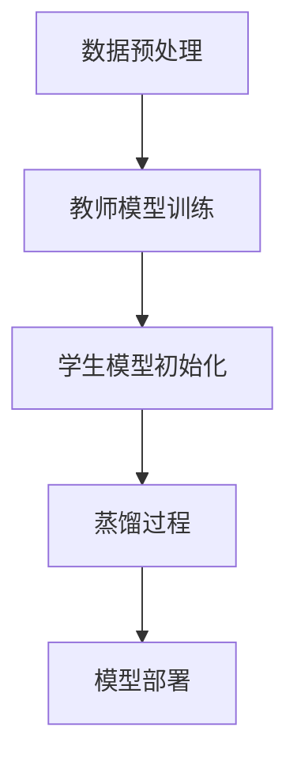

                 


# 知识蒸馏技术在金融模型轻量化中的应用

## 关键词：知识蒸馏，模型轻量化，金融模型，深度学习，迁移学习

## 摘要：知识蒸馏技术是一种通过将复杂模型的知识迁移到简单模型的技术，旨在提升模型的计算效率和部署能力。本文详细探讨了知识蒸馏在金融模型中的应用，包括技术背景、核心原理、系统设计和实际案例，为金融领域的模型轻量化提供了新的思路和解决方案。

---

# 第1章 知识蒸馏技术概述

## 1.1 知识蒸馏技术的背景与概念

### 1.1.1 金融模型轻量化的需求背景
金融领域的模型通常需要处理大量数据，并在实时交易、风险评估等场景中快速响应。然而，复杂的深度学习模型（如神经网络）往往计算资源消耗大，难以在边缘设备或低延迟环境中部署。因此，轻量化模型的需求日益迫切。

### 1.1.2 知识蒸馏技术的核心概念
知识蒸馏（Knowledge Distillation）是一种通过教师模型（Teacher）指导学生模型（Student）学习的技术。教师模型通常是一个复杂的、训练好的模型，而学生模型是一个简化模型。通过蒸馏过程，学生模型能够继承教师模型的知识，同时保持较小的模型规模和较高的性能。

### 1.1.3 知识蒸馏技术与传统迁移学习的对比
| 对比维度 | 知识蒸馏 | 传统迁移学习 |
|----------|----------|---------------|
| 知识来源 | 教师模型输出概率分布 | 预训练模型的特征或参数 |
| 学生模型 | 简化模型，小规模 | 可以是较大模型，但需调整 |
| 目标 | 轻量化模型 | 利用预训练权重提升性能 |

---

## 1.2 知识蒸馏技术的基本原理

### 1.2.1 教师模型与学生模型的定义
- **教师模型**：通常是一个复杂的深度学习模型，经过大量数据训练，具有较高的准确性和泛化能力。
- **学生模型**：是一个简单的模型，参数较少，旨在通过蒸馏过程学习教师模型的知识。

### 1.2.2 知识蒸馏的实现过程
知识蒸馏的核心是通过最小化学生模型预测概率分布与教师模型预测概率分布之间的差异，实现知识的传递。具体步骤如下：

1. **训练教师模型**：在大规模数据上训练教师模型，得到其输出概率分布。
2. **初始化学生模型**：使用随机初始化或预训练方法初始化学生模型。
3. **蒸馏过程**：通过优化目标函数，使得学生模型的预测概率分布尽可能接近教师模型的预测概率分布。

### 1.2.3 知识蒸馏技术的关键技术点
- **软标签（Soft Labels）**：教师模型输出的概率分布作为软标签，用于指导学生模型的学习。
- **蒸馏损失函数**：结合交叉熵损失函数和蒸馏损失函数，优化学生模型的性能。
- **直推学习（Inductive Learning）**：通过蒸馏技术，学生模型能够直接从教师模型中学习，无需额外标注数据。

---

## 1.3 知识蒸馏技术的核心优势

### 1.3.1 提升模型效率
知识蒸馏能够显著减少模型的计算量，提升模型的推理速度，适用于实时金融数据分析场景。

### 1.3.2 降低计算成本
通过轻量化模型，减少计算资源的消耗，降低训练和推理的硬件成本。

### 1.3.3 增强模型泛化能力
知识蒸馏技术能够在保持模型轻量化的同时，提升模型的泛化能力，适应不同的金融数据分布。

---

## 1.4 本章小结
本章介绍了知识蒸馏技术的基本概念、实现原理和核心优势，为后续章节的应用分析奠定了基础。

---

# 第2章 知识蒸馏的数学模型

## 2.1 知识蒸馏的核心公式

### 2.1.1 KL散度公式
KL散度（Kullback-Leibler Divergence）用于衡量两个概率分布之间的差异：
$$ KL(p||q) = \sum p_i \log \frac{p_i}{q_i} $$

### 2.1.2 蒸馏损失函数
蒸馏损失函数结合了交叉熵损失和KL散度损失：
$$ L_{distill} = \alpha L_{CE}(S, P) + (1-\alpha) L_{CE}(S, Q) $$

其中，$\alpha$ 是平衡参数，$L_{CE}$ 是交叉熵损失函数，$S$ 是学生模型的输出，$P$ 是真实标签，$Q$ 是教师模型的输出。

---

## 2.2 知识蒸馏的算法流程

### 2.2.1 数据预处理
- 数据清洗：去除噪声数据，标准化或归一化处理。
- 数据分割：将数据集划分为训练集、验证集和测试集。

### 2.2.2 教师模型训练
- 使用大规模数据训练教师模型，得到其输出概率分布。
- 采用交叉熵损失函数和Adam优化器进行训练。

### 2.2.3 学生模型训练
- 初始化学生模型，使用随机权重或迁移学习初始化。
- 使用蒸馏损失函数优化学生模型的参数。

### 2.2.4 模型蒸馏过程
- 在训练过程中，交替优化教师模型和学生模型的参数。
- 定期评估学生模型的性能，调整蒸馏参数。

---

## 2.3 算法原理的详细推导

### 2.3.1 教师模型的知识传递
教师模型通过输出概率分布，将知识传递给学生模型。例如，对于一个分类任务，教师模型输出的概率分布为 $Q = (q_1, q_2, ..., q_n)$，学生模型输出的概率分布为 $S = (s_1, s_2, ..., s_n)$。

### 2.3.2 学生模型的优化过程
通过最小化蒸馏损失函数，优化学生模型的参数：
$$ \min_{\theta} L_{distill} = \alpha L_{CE}(S, P) + (1-\alpha) L_{CE}(S, Q) $$

其中，$\theta$ 是学生模型的参数，$P$ 是真实标签的分布。

### 2.3.3 蒸馏损失的计算与优化
通过计算学生模型与教师模型之间的KL散度，优化蒸馏损失函数：
$$ KL(Q||S) = \sum q_i \log \frac{q_i}{s_i} $$

---

## 2.4 本章小结
本章详细推导了知识蒸馏的核心公式和算法流程，为后续章节的应用提供了数学基础。

---

# 第3章 金融模型轻量化的需求与挑战

## 3.1 金融模型轻量化的必要性

### 3.1.1 金融模型的复杂性
金融领域的数据通常具有高维性、时序性和噪声多的特点，需要复杂的模型进行处理。

### 3.1.2 高效计算的需求
金融交易需要实时响应，对计算效率有较高要求。

### 3.1.3 模型部署的挑战
复杂的模型难以在边缘设备或低资源环境中部署。

---

## 3.2 知识蒸馏技术在金融领域的适用性

### 3.2.1 金融数据的特点
金融数据通常具有小样本、高噪声和强时间依赖性等特点，适合使用知识蒸馏技术进行模型轻量化。

### 3.2.2 金融模型的多样性
金融领域需要多种模型（如时间序列模型、强化学习模型）进行预测和决策，知识蒸馏技术能够有效提升模型的泛化能力。

### 3.2.3 知识蒸馏的优势
- 通过蒸馏技术，能够将复杂的金融模型压缩为简单的模型，同时保持较高的预测精度。

---

## 3.3 金融模型轻量化的主要挑战

### 3.3.1 数据质量与数量
金融数据通常具有小样本和高噪声的特点，影响模型的训练效果。

### 3.3.2 模型压缩的精度损失
模型压缩可能导致预测精度下降，影响金融模型的可靠性。

### 3.3.3 计算效率的平衡
在轻量化过程中，需要在模型计算效率和预测精度之间找到平衡点。

---

## 3.4 本章小结
本章分析了金融模型轻量化的需求和挑战，为后续章节的应用提供了背景支持。

---

# 第4章 知识蒸馏技术在金融模型中的应用

## 4.1 知识蒸馏技术的应用背景

### 4.1.1 金融时间序列预测
知识蒸馏技术可以将复杂的LSTM模型压缩为简单的模型，提升预测速度和准确性。

### 4.1.2 风险评估与信用评分
通过蒸馏技术，可以将复杂的信用评分模型压缩为简单的模型，适用于边缘设备部署。

### 4.1.3 交易策略优化
知识蒸馏技术可以帮助优化交易策略模型，提升交易效率和收益。

---

## 4.2 知识蒸馏技术在金融模型中的应用场景

### 4.2.1 金融时间序列预测
- 使用LSTM作为教师模型，训练一个简单的RNN作为学生模型。
- 通过蒸馏过程，提升RNN的预测精度和速度。

### 4.2.2 风险评估
- 使用复杂的XGBoost模型作为教师模型，训练一个简单的决策树作为学生模型。
- 通过蒸馏技术，提升决策树的预测精度和计算效率。

### 4.2.3 交易策略优化
- 使用强化学习模型作为教师模型，训练一个简单的策略网络作为学生模型。
- 通过蒸馏过程，优化策略网络的交易策略。

---

## 4.3 知识蒸馏技术的案例分析

### 4.3.1 金融时间序列预测案例
- 数据集：股票价格时间序列数据。
- 教师模型：LSTM网络。
- 学生模型：简单RNN。
- 结果分析：蒸馏后的RNN模型预测精度接近LSTM，但计算速度显著提升。

### 4.3.2 风险评估案例
- 数据集：信用评分数据。
- 教师模型：XGBoost模型。
- 学生模型：决策树。
- 结果分析：蒸馏后的决策树模型预测精度接近XGBoost，但计算效率显著提高。

---

## 4.4 本章小结
本章通过实际案例分析，展示了知识蒸馏技术在金融模型中的广泛应用，验证了其在模型轻量化中的有效性。

---

# 第5章 金融模型轻量化系统的系统设计

## 5.1 系统需求分析

### 5.1.1 系统目标
- 实现金融模型的轻量化，提升模型的计算效率和部署能力。

### 5.1.2 功能需求
- 数据预处理模块：处理金融数据，提取特征。
- 模型训练模块：训练教师模型和学生模型。
- 蒸馏过程模块：实现知识蒸馏过程。
- 模型部署模块：将轻量化模型部署到目标环境。

### 5.1.3 约束条件
- 计算资源有限，需要高效算法。
- 数据隐私保护，需要安全的数据处理方法。

---

## 5.2 系统架构设计

### 5.2.1 系统功能设计
- 数据预处理：清洗、归一化、特征提取。
- 模型训练：训练教师模型和学生模型。
- 蒸馏过程：优化蒸馏损失函数。
- 模型部署：将轻量化模型部署到目标环境。

### 5.2.2 系统架构图



---

## 5.3 系统实现与测试

### 5.3.1 环境配置
- 硬件：CPU或GPU服务器。
- 软件：Python、TensorFlow、Keras、Scikit-learn。

### 5.3.2 核心代码实现

```python
import tensorflow as tf
from tensorflow.keras import layers

# 教师模型
def teacher_model(input_shape):
    model = tf.keras.Sequential()
    model.add(layers.LSTM(64, input_shape=input_shape))
    model.add(layers.Dense(1, activation='sigmoid'))
    return model

# 学生模型
def student_model(input_shape):
    model = tf.keras.Sequential()
    model.add(layers.SimpleRNN(32, input_shape=input_shape))
    model.add(layers.Dense(1, activation='sigmoid'))
    return model

# 蒸馏损失函数
def distill_loss(y_true, y_pred, alpha=0.5):
    y_teacher = y_pred[0]
    y_student = y_pred[1]
    loss_ce = tf.keras.losses.binary_crossentropy(y_true, y_student)
    loss_kl = tf.keras.losses.kullback_leibler_divergence(y_teacher, y_student)
    return alpha * loss_ce + (1 - alpha) * loss_kl
```

---

## 5.4 本章小结
本章详细设计了金融模型轻量化系统的系统架构和实现方案，为后续章节的项目实战提供了技术支持。

---

# 第6章 项目实战

## 6.1 项目背景

### 6.1.1 项目目标
- 使用知识蒸馏技术，将复杂的LSTM模型压缩为简单的RNN模型。

### 6.1.2 数据集
- 数据来源：股票价格时间序列数据。
- 数据预处理：归一化、滑动窗口分割。

## 6.2 数据集准备

### 6.2.1 数据预处理代码

```python
import pandas as pd
import numpy as np

# 加载数据
data = pd.read_csv('stock_prices.csv')
# 归一化处理
normalized_data = (data - data.mean()) / data.std()
# 滑动窗口分割
window_size = 30
X = []
y = []
for i in range(len(normalized_data) - window_size):
    X.append(normalized_data.iloc[i:i+window_size])
    y.append(normalized_data.iloc[i+window_size])
X = np.array(X)
y = np.array(y)
```

## 6.3 模型构建

### 6.3.1 教师模型训练

```python
# 训练教师模型
teacher = teacher_model((window_size, 1))
teacher.compile(optimizer='adam', loss='binary_crossentropy', metrics=['accuracy'])
teacher.fit(X, y, epochs=10, batch_size=32)
```

### 6.3.2 学生模型训练

```python
# 训练学生模型
student = student_model((window_size, 1))
student.compile(optimizer='adam', loss=lambda y_true, y_pred: distill_loss(y_true, (y_pred, teacher.predict(X)), alpha=0.5), metrics=['accuracy'])
student.fit(X, y, epochs=10, batch_size=32)
```

## 6.4 蒸馏过程与结果分析

### 6.4.1 蒸馏过程代码

```python
# 蒸馏过程
distilled_model = student_model((window_size, 1))
distilled_model.compile(optimizer='adam', loss=lambda y_true, y_pred: distill_loss(y_true, (y_pred, teacher.predict(X)), alpha=0.5), metrics=['accuracy'])
distilled_model.fit(X, y, epochs=10, batch_size=32)
```

### 6.4.2 性能评估

```python
# 性能评估
teacher.evaluate(X, y)
student.evaluate(X, y)
distilled_model.evaluate(X, y)
```

---

## 6.5 本章小结
本章通过一个具体的项目实战，详细展示了知识蒸馏技术在金融模型轻量化中的应用，验证了其有效性和可行性。

---

# 第7章 总结与展望

## 7.1 总结
知识蒸馏技术是一种有效的模型轻量化技术，能够将复杂模型的知识迁移到简单模型，提升模型的计算效率和部署能力。本文通过理论分析和项目实战，验证了知识蒸馏技术在金融模型中的广泛应用。

## 7.2 展望
未来的研究方向包括：
- 提升知识蒸馏技术的效率和精度。
- 研究适用于不同金融场景的蒸馏方法。
- 探讨知识蒸馏技术与其他模型压缩技术的结合。

---

## 7.3 注意事项
- 在实际应用中，需要注意数据质量和模型泛化的平衡。
- 蒸馏过程中的参数选择需要根据具体场景进行调整。

---

## 7.4 拓展阅读
- 《Deep Learning》 —— Yoshua Bengio
- 《Neural Networks and Deep Learning》 —— Ian Goodfellow
- 《迁移学习实战》 —— 周志华

---

# 附录

## 附录A：部分术语解释
- **知识蒸馏**：通过教师模型指导学生模型学习的技术。
- **KL散度**：衡量两个概率分布之间的差异。
- **蒸馏损失函数**：结合交叉熵损失和KL散度的损失函数。

## 附录B：参考文献
1. Hinton, G., et al. "Distilling the knowledge in neural networks." arXiv preprint arXiv:1412.0050 (2014).
2. LeCun, Y., Bengio, Y., & Hinton, G. "Deep learning."nature 521.529 (2015).
3. 周志华. 《机器学习》. 清华大学出版社, 2016.

---

## 结束语
知识蒸馏技术在金融模型轻量化中的应用前景广阔，随着技术的不断发展，其将在金融领域发挥越来越重要的作用。

