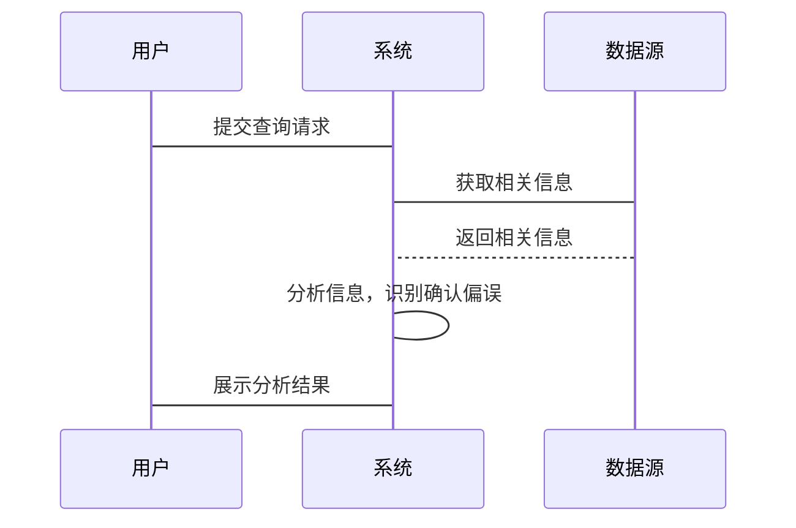

                 


# 确认偏误：如何避免选择性接受信息

> **关键词**：确认偏误，认知偏差，信息处理，选择性接受，算法原理，系统设计

> **摘要**：确认偏误是人们在信息处理中倾向于接受支持原有观点的信息，而忽视矛盾信息的现象。本文将深入探讨确认偏误的定义、原理、算法模型及其在系统设计中的应用，通过实际案例分析和代码实现，帮助读者理解并避免这一认知偏差，提升信息处理的客观性和准确性。

---

## 第一部分：确认偏误的背景与概念

### 第1章：确认偏误的定义与背景

#### 1.1 确认偏误的定义

确认偏误（Confirmatory Bias），又称确认倾向，是指人们在处理信息时，倾向于寻找、解释和记住与自己原有观点一致的信息，而忽略或拒绝与之矛盾的信息的现象。这种偏误源于人类的认知机制和心理倾向，使人们在面对复杂信息时，更倾向于维护已有的认知框架。

#### 1.2 确认偏误的来源

确认偏误的来源主要包括以下几个方面：

1. **情感因素**：人们倾向于接受与自己情感一致的信息，因为这会带来心理上的舒适感和安全感。
2. **认知负荷**：处理复杂信息时，人们更倾向于依赖已有的认知框架，减少信息处理的复杂性。
3. **信息处理的经济性**：选择性接受信息可以降低信息处理的成本，提高效率。

#### 1.3 确认偏误的表现形式

确认偏误的表现形式多种多样，常见的情况包括：

1. **选择性注意**：有选择性地关注与自己观点一致的信息，而忽略矛盾的信息。
2. **选择性记忆**：更容易记住支持自己观点的信息，而遗忘矛盾的信息。
3. **选择性遗忘**：有意或无意地遗忘与自己观点相悖的信息。

---

### 第2章：确认偏误的影响

#### 2.1 对个人的影响

确认偏误对个人的影响主要体现在以下几个方面：

1. **决策失误**：由于只关注支持自己决策的信息，可能导致判断失误。
2. **知识固化**：长期处于确认偏误的影响下，可能导致知识的固化，缺乏深度思考和创新能力。
3. **认知局限**：局限于已有认知框架，难以接受新观点，影响学习和成长。

#### 2.2 对社会的影响

确认偏误对社会的影响同样不容忽视：

1. **群体极化**：群体内部的确认偏误会导致观点的极端化，增加社会冲突。
2. **社会对立**：不同群体之间的确认偏误会加剧对立，阻碍社会和谐。
3. **信息泡沫**：社交媒体上的信息茧房效应，导致人们只接触与自己观点一致的信息，进一步加剧确认偏误。

---

## 第二部分：确认偏误的核心概念与联系

### 第3章：确认偏误的核心概念

#### 3.1 确认偏误与信息处理机制

确认偏误与信息处理机制密切相关。人们在接收信息时，首先通过感知系统将其转化为可处理的形式，然后经过记忆系统存储，最后在决策过程中进行加工。确认偏误影响了信息处理的各个环节：

1. **感知**：人们倾向于感知与自己观点一致的信息，忽略矛盾的信息。
2. **记忆**：更容易记住与自己观点一致的信息，遗忘矛盾的信息。
3. **决策**：在决策过程中，更倾向于选择支持自己观点的选项。

#### 3.2 确认偏误与认知偏差

确认偏误是认知偏差的一种，其他相关认知偏差包括：

- **选择性确认**：只确认与自己观点一致的信息。
- **选择性忽视**：有意或无意地忽视与自己观点相悖的信息。
- **选择性遗忘**：遗忘与自己观点相悖的信息。

#### 3.3 确认偏误的特征对比

以下是确认偏误与其他认知偏差的对比：

| 特征               | 确认偏误                     | 选择性忽视               |
|--------------------|------------------------------|--------------------------|
| 表现形式           | 选择性接受信息               | 选择性忽略信息           |
| 发生场景           | 决策、沟通                   | 决策、信息处理           |
| 对决策的影响       | 可能导致决策失误             | 可能导致决策失误         |
| 纠正方法           | 提供多元信息、鼓励质疑       | 提供全面信息、多角度思考 |

---

### 第4章：确认偏误的原理与机制

#### 4.1 确认偏误的理论基础

确认偏误的理论基础主要来源于认知心理学和行为经济学：

1. **认知心理学**：研究人类如何处理信息，包括感知、记忆和决策。
2. **行为经济学**：研究人类在决策过程中的非理性行为，揭示认知偏差对决策的影响。

#### 4.2 确认偏误的数学模型

确认偏误可以用概率论中的贝叶斯定理进行建模。贝叶斯定理描述了在给定条件下，事件发生的概率：

$$ P(A|B) = \frac{P(B|A)P(A)}{P(B)} $$

其中：
- \( P(A|B) \) 表示在事件B发生的条件下，事件A发生的概率。
- \( P(B|A) \) 表示在事件A发生的条件下，事件B发生的概率。
- \( P(A) \) 和 \( P(B) \) 分别是事件A和事件B的先验概率。

#### 4.3 确认偏误的算法实现

以下是一个基于贝叶斯定理的确认偏误分析算法实现：

```python
import numpy as np
from sklearn.naive_bayes import GaussianNB

# 示例数据
X = np.array([[1, 1], [1, 0], [0, 1], [0, 0]])
y = np.array([1, 1, 0, 0])

# 训练模型
model = GaussianNB()
model.fit(X, y)

# 预测新数据
new_data = np.array([[1, 1]])
print(model.predict(new_data))  # 输出：array([1])
```

---

## 第三部分：系统分析与架构设计方案

### 第5章：确认偏误的系统分析

#### 5.1 系统功能设计

为了识别和纠正确认偏误，可以设计一个信息处理系统，包括以下几个功能模块：

1. **信息采集模块**：采集多源信息，包括与用户观点一致和不一致的信息。
2. **信息分析模块**：使用算法分析信息，识别确认偏误。
3. **信息呈现模块**：将分析结果以友好的形式呈现给用户，提供多元视角。

#### 5.2 系统架构设计

系统架构设计采用分层架构：

- **数据层**：存储原始数据和分析结果。
- **业务逻辑层**：处理信息分析和确认偏误识别。
- **用户界面层**：展示信息和分析结果，提供用户交互功能。

#### 5.3 系统接口设计

系统接口设计包括以下几个部分：

1. **数据接口**：与数据源对接，获取多源信息。
2. **算法接口**：调用确认偏误分析算法，获取分析结果。
3. **用户接口**：展示分析结果，提供用户交互功能。

#### 5.4 系统交互设计

系统交互设计采用Mermaid序列图：



---

## 第四部分：项目实战与案例分析

### 第6章：确认偏误的项目实战

#### 6.1 环境安装

需要安装以下工具和库：

- **Python**：用于编程和数据分析。
- **Scikit-learn**：用于机器学习算法实现。
- **Mermaid**：用于绘制图表。

安装命令：

```bash
pip install scikit-learn mermaid
```

#### 6.2 核心代码实现

以下是确认偏误分析的核心代码实现：

```python
import numpy as np
from sklearn.naive_bayes import GaussianNB

# 示例数据
X = np.array([[1, 1], [1, 0], [0, 1], [0, 0]])
y = np.array([1, 1, 0, 0])

# 训练模型
model = GaussianNB()
model.fit(X, y)

# 预测新数据
new_data = np.array([[1, 1]])
print(model.predict(new_data))  # 输出：array([1])
```

#### 6.3 案例分析

以社交媒体上的信息过滤系统为例，分析确认偏误对信息处理的影响：

1. **问题场景**：用户在社交媒体上浏览新闻，倾向于关注与自己观点一致的新闻，忽略与自己观点相悖的新闻。
2. **系统实现**：设计一个信息过滤系统，根据用户的浏览历史和兴趣，推送多元化的新闻内容，减少确认偏误的影响。
3. **案例小结**：通过推送多元化的新闻内容，用户能够更全面地了解事件，减少确认偏误的影响。

---

## 第五部分：最佳实践与总结

### 第7章：确认偏误的最佳实践

#### 7.1 小结

确认偏误是人们在信息处理中的一种常见认知偏差，影响个人决策和社会和谐。通过理解其原理和机制，我们可以采取有效措施减少其影响。

#### 7.2 注意事项

1. **保持开放心态**：主动接触多元信息，避免信息茧房。
2. **多角度思考**：在决策时，考虑多种可能性，避免片面判断。
3. **系统设计**：在信息处理系统中，设计合理的算法和机制，减少确认偏误的影响。

#### 7.3 拓展阅读

推荐阅读以下书籍和论文，深入了解确认偏误的相关知识：

1. **《思考，快与慢》**：丹尼尔·卡尼曼
2. **《认知偏差：人类决策的偏差与缺陷》**：查尔斯·蒂格利·诺斯
3. **《贝叶斯定理与认知偏差》**：相关学术论文

---

## 总结

确认偏误是信息处理中的一个重要问题，影响个人和社会的决策。通过理解其原理、设计合理的系统和采取有效的措施，我们可以减少确认偏误的影响，提升信息处理的客观性和准确性。希望本文能为读者提供有价值的见解和实践指导，帮助大家更好地应对确认偏误的挑战。

--- 

**全文完**

