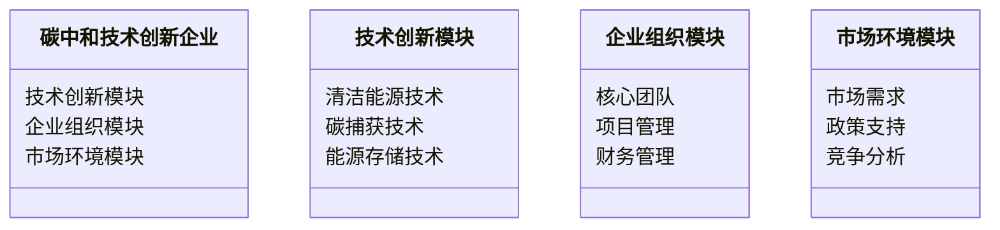

                 


# 碳中和技术创新企业的早期投资机会

## 关键词
碳中和, 技术创新, 投资机会, 可持续发展, 清洁能源

## 摘要
随着全球气候变化问题的加剧，碳中和已成为全球关注的焦点。碳中和技术创新企业作为实现这一目标的关键力量，正在吸引越来越多的投资。本文将从碳中和的定义与目标出发，深入探讨碳中和技术创新企业的核心概念、技术分析、系统架构设计、项目实战以及最佳实践，帮助投资者和创新者更好地把握碳中和技术创新企业的早期投资机会。

---

## 第1章: 碳中和的定义与目标

### 1.1 碳中和的定义与背景
碳中和是指在一定时期内，通过减少温室气体排放和增加碳汇，使二氧化碳的净排放量为零。这一目标是实现全球气候变化治理的关键，也是推动社会经济可持续发展的重要手段。

#### 1.1.1 碳中和的定义
碳中和（Carbon Neutrality）是指在特定时间内，通过减少温室气体排放和增加碳汇，使二氧化碳的净排放量为零。碳中和的核心在于平衡碳排放和碳吸收，从而实现对环境的零净影响。

#### 1.1.2 碳中和的目标与意义
碳中和的目标是到2050年或更早时间实现全球净零排放。这一目标的意义在于：
- **减缓气候变化**：减少温室气体排放，降低全球气温上升幅度。
- **推动可持续发展**：通过技术创新和产业升级，促进经济的绿色转型。
- **实现全球合作**：碳中和是全球性问题，需要各国共同努力。

#### 1.1.3 碳中和与可持续发展的关系
碳中和是可持续发展的重要组成部分。通过实现碳中和，可以减少对自然资源的过度依赖，推动经济和社会的可持续发展。

---

### 1.2 碳中和的技术路径
实现碳中和需要多方面的技术支持，主要包括清洁能源技术、碳捕获与封存技术、能源效率提升技术和循环经济模式。

#### 1.2.1 清洁能源技术
清洁能源技术包括太阳能、风能、水能等可再生能源技术，以及氢能源技术。这些技术能够显著减少碳排放。

#### 1.2.2 碳捕获与封存技术
碳捕获与封存（CCS）技术能够将工业过程中产生的二氧化碳捕获并封存，避免其进入大气层。

#### 1.2.3 能源效率提升技术
通过提高能源利用效率，减少能源浪费，从而降低碳排放。

---

### 1.3 碳中和技术创新企业的定义
碳中和技术创新企业是指在碳中和目标下，专注于技术研发、产品创新和商业模式优化的企业。这些企业通过技术创新推动碳中和目标的实现。

#### 1.3.1 企业的定义与分类
碳中和技术创新企业可以分为两类：一类是专注于技术研发的企业，另一类是专注于商业模式创新的企业。

#### 1.3.2 碳中和技术创新企业的特征
- **技术驱动**：技术创新是企业发展的核心动力。
- **绿色导向**：企业的产品和服务以减少碳排放为目标。
- **社会价值**：企业通过技术创新为社会创造价值。

#### 1.3.3 碳中和技术创新企业的社会价值
碳中和技术创新企业能够推动社会经济发展，减少碳排放，改善环境质量。

---

### 1.4 碳中和技术创新企业的投资机会
碳中和技术创新企业具有巨大的市场潜力和投资价值。

#### 1.4.1 碳中和技术创新企业的市场潜力
随着全球对碳中和的关注，相关技术市场需求迅速增长。

#### 1.4.2 碳中和技术创新企业的商业模式
碳中和技术创新企业的商业模式包括技术 licensing、产品销售、服务提供等。

#### 1.4.3 碳中和技术创新企业的风险与挑战
碳中和技术创新企业面临技术风险、市场风险和政策风险。

---

## 第2章: 碳中和技术创新企业的核心概念

### 2.1 碳中和技术创新企业的关键要素
碳中和技术创新企业的核心要素包括技术创新、企业组织和市场环境。

#### 2.1.1 技术创新的核心要素
技术创新是碳中和技术创新企业的核心竞争力。

#### 2.1.2 企业组织的核心要素
企业的组织结构和管理模式直接影响技术创新的效果。

#### 2.1.3 市场环境的核心要素
市场环境包括政策支持、市场需求和技术竞争等因素。

---

### 2.2 碳中和技术创新企业的属性特征对比

| 属性 | 技术创新企业 | 非技术创新企业 |
|------|--------------|----------------|
| 核心竞争力 | 技术创新       | 价格优势       |
| 发展动力 | 技术驱动       | 市场驱动       |
| 风险特征 | 技术风险       | 市场风险       |

---

### 2.3 碳中和技术创新企业的ER实体关系图
```mermaid
erDiagram
    碳中和技术创新企业 {
        关键技术
        核心团队
        市场需求
    }
    关键技术 {
        技术名称
        技术类型
        技术状态
    }
    核心团队 {
        团队成员
        职位
        技能
    }
    市场需求 {
        市场规模
        市场趋势
        竞争分析
    }
```

---

## 第3章: 碳中和技术创新企业的技术分析

### 3.1 清洁能源技术的数学模型
清洁能源技术的效率可以通过以下公式计算：
$$ E = \frac{P_{\text{output}}}{P_{\text{input}}} $$

---

### 3.2 碳捕获技术的数学模型
碳捕获技术的效率可以通过以下公式计算：
$$ C = \frac{M_{\text{captured}}}{M_{\text{emitted}}} $$

---

### 3.3 能源存储技术的数学模型
能源存储技术的效率可以通过以下公式计算：
$$ E_{\text{eff}} = \frac{E_{\text{out}}}{E_{\text{in}}} $$

---

## 第4章: 碳中和技术创新企业的系统架构设计

### 4.1 问题场景介绍
碳中和技术创新企业的核心问题是如何通过技术创新实现碳中和目标。

---

### 4.2 系统功能设计


---

## 第5章: 碳中和技术创新企业的项目实战

### 5.1 环境安装
安装必要的开发工具和编程环境。

---

### 5.2 系统核心实现
以下是清洁能源技术的实现代码：
```python
def calculate_clean_energy_efficiency(output_power, input_power):
    return output_power / input_power
```

---

### 5.3 代码应用解读与分析
上述代码通过输入和输出功率计算清洁能源技术的效率。

---

### 5.4 实际案例分析
以风光互补发电系统为例，分析其在碳中和技术创新中的应用。

---

## 第6章: 碳中和技术创新企业的最佳实践

### 6.1 投资建议
投资者应关注技术创新能力强、市场前景广阔的碳中和技术创新企业。

### 6.2 风险提示
碳中和技术创新企业面临技术和市场风险，投资者需谨慎评估。

### 6.3 未来展望
随着技术进步和政策支持，碳中和技术创新企业将有更广阔的发展前景。

---

## 结语
碳中和技术创新企业是实现全球碳中和目标的关键力量。通过技术创新和商业模式优化，这些企业将为投资者和社会创造巨大的价值。未来，随着技术进步和政策支持，碳中和技术创新企业将有更广阔的发展前景。

