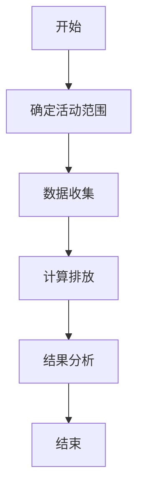
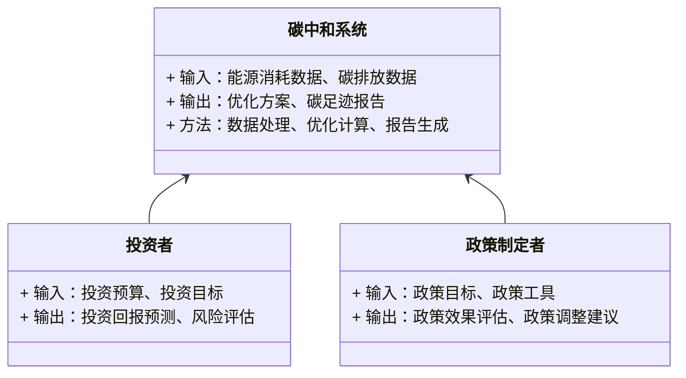
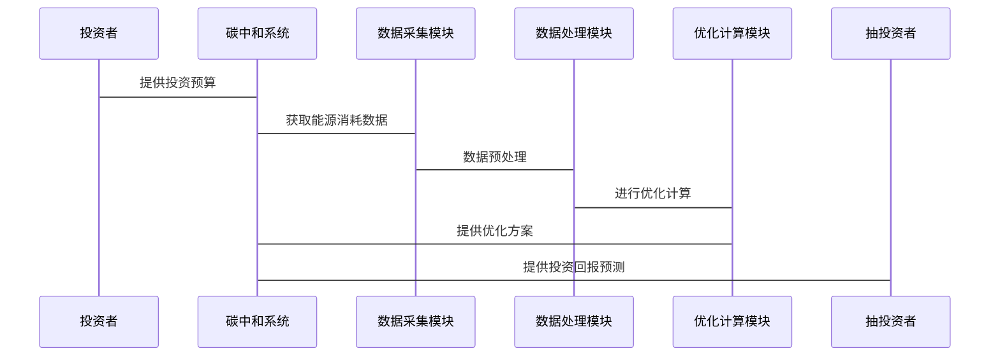

                 


# 碳中和技术路线图与投资策略制定

> 关键词：碳中和、技术路线图、投资策略、清洁能源、碳捕获、碳排放模型、能源优化

> 摘要：本文将详细介绍碳中和的目标与实现路径，分析其核心技术与关联，探讨碳中和算法原理与数学模型，制定碳中和系统的分析与架构设计方案，提供碳中和项目实战案例，并总结碳中和的最佳实践与投资策略。通过本文，读者将能够全面了解碳中和的技术路线图与投资策略的制定方法，并通过实际案例分析和详细的技术解读，掌握碳中和项目实施的关键点。

---

## 第1章: 碳中和的背景与目标

### 1.1 碳中和的基本概念
- 1.1.1 碳中和的定义与内涵
  - 碳中和是指在一定时间内，通过减少温室气体排放和增加碳汇，使二氧化碳的净排放量为零的状态。
  - 碳中和的核心是平衡碳排放与碳吸收，实现能源结构的绿色转型。

- 1.1.2 碳中和的目标与意义
  - 全球气候治理的目标：减少全球变暖，应对气候变化。
  - 经济可持续发展的必要条件：推动绿色经济转型，促进产业升级。
  - 国家战略目标：实现碳中和是许多国家应对气候变化的重要承诺。

- 1.1.3 碳中和的背景与趋势
  - 全球气候变化的加剧：工业化以来的温室气体排放导致全球变暖。
  - 国际社会的共识：《巴黎协定》等国际协议推动全球碳中和进程。
  - 技术进步与政策支持：清洁能源技术的快速发展和各国政策的推动。

### 1.2 碳中和的实现路径
- 1.2.1 清洁能源的使用
  - 可再生能源（风能、太阳能、水能等）的广泛应用。
  - 智能电网的建设与能源互联网的发展。

- 1.2.2 碳捕获与封存技术
  - 碳捕获与封存（CCS）技术：将二氧化碳捕获并封存在地下或海洋中。
  - 碳利用技术：将二氧化碳转化为有价值的化学品或材料。

- 1.2.3 能源结构调整与优化
  - 逐步淘汰化石能源，推广清洁能源。
  - 提高能源利用效率，减少能源浪费。

### 1.3 碳中和的技术路线图
- 1.3.1 技术路线图的定义
  - 碳中和技术路线图是一种系统化的技术规划，明确了实现碳中和所需的关键技术及其发展路径。

- 1.3.2 技术路线图的核心要素
  - 关键技术：清洁能源技术、储能技术、碳捕获技术等。
  - 时间节点：不同阶段的技术发展目标。
  - 投资策略：技术开发的资金投入与资源分配。

- 1.3.3 不同行业的技术路线差异
  - 工业领域：推广绿色制造技术，减少工业过程中的碳排放。
  - 能源领域：发展可再生能源，优化能源结构。
  - 交通领域：推广电动汽车，发展绿色交通。

### 1.4 碳中和投资策略的必要性
- 1.4.1 碳中和对投资的影响
  - 碳中和目标的实现需要大量的资金投入，特别是在清洁能源和储能技术领域。
  - 碳中和政策的实施可能影响传统能源行业的投资价值。

- 1.4.2 投资策略在碳中和中的作用
  - 通过合理的投资策略，优化资源配置，提高技术开发效率。
  - 降低投资风险，确保投资回报。

- 1.4.3 碳中和目标与投资策略的匹配
  - 根据不同行业的技术路线图，制定差异化的投资策略。
  - 考虑政策支持和市场环境，调整投资方向和力度。

### 1.5 本章小结
- 本章从碳中和的背景与目标出发，分析了其实现路径，并提出了技术路线图的核心要素与投资策略的必要性。

---

## 第2章: 碳中和的核心技术与关联

### 2.1 碳中和的关键技术
- 2.1.1 清洁能源技术
  - 太阳能、风能等可再生能源的技术发展。
  - 智能电网和能源互联网的技术创新。

- 2.1.2 能源存储技术
  - 锂电池、钠离子电池等储能技术的发展。
  - 储能系统优化与管理。

- 2.1.3 能源转换技术
  - 电能与氢能的转换技术。
  - 其他形式的能源转换技术。

### 2.2 碳中和相关技术的对比分析
- 2.2.1 技术属性对比表
  | 技术类别 | 优势 | 劣势 | 适用场景 |
  |----------|------|------|----------|
  | 清洁能源 | 环保、可再生 | 间歇性、成本高 | 可再生能源发电 |
  | 碳捕获  | 减碳效果显著 | 成本高、技术难度大 | 高碳排放行业 |

- 2.2.2 技术优劣势分析
  - 清洁能源技术的优势在于环保和可持续性，但存在间歇性和成本高的问题。
  - 碳捕获技术的优势在于能够显著减少碳排放，但技术和成本的挑战较大。

- 2.2.3 技术间的协同效应
  - 清洁能源与碳捕获技术的结合：在可再生能源发电的基础上，利用碳捕获技术减少排放。
  - 能源存储与能源转换技术的结合：通过储能技术解决可再生能源的不稳定问题，通过能源转换技术实现多种能源形式的优化利用。

### 2.3 碳中和技术的ER实体关系图
```mermaid
erDiagram
    actor 投资者 {
        <attribute>抽选技术
        <attribute>投资金额
    }
    actor 政策制定者 {
        <attribute>政策支持
        <attribute>监管力度
    }
    actor 技术研发者 {
        <attribute>技术创新
        <attribute>研发投入
    }
    actor 市场需求 {
        <attribute>市场需求量
        <attribute>价格敏感性
    }
    actor 环保机构 {
        <attribute>碳排放标准
        <attribute>环境影响评估
    }
    关系：投资者 ->抽选技术
    关系：政策制定者 ->政策支持
    关系：技术研发者 ->技术创新
    关系：市场需求 ->市场需求量
    关系：环保机构 ->碳排放标准
```

### 2.4 本章小结
- 本章分析了碳中和的核心技术，对比了不同技术的优劣势，并通过ER实体关系图展示了技术间的协同关系。

---

## 第3章: 碳中和算法原理与数学模型

### 3.1 碳足迹计算模型
- 3.1.1 碳足迹的定义与计算方法
  - 碳足迹是指一个产品或活动在整个生命周期中产生的温室气体排放量。
  - 计算方法包括生命周期评价（LCA）和碳足迹评价标准（如ISO 14067）。

- 3.1.2 碳足迹计算的数学公式
  $$ 碳足迹 = \sum_{i=1}^{n} (活动_i \times 排放因子_i) $$

- 3.1.3 碳足迹计算的流程图（Mermaid）


### 3.2 碳中和优化算法
- 3.2.1 碳中和优化算法的原理
  - 通过优化模型，寻找最小化碳排放的解决方案。
  - 算法目标：在满足碳中和目标的前提下，最小化成本或最大化效益。

- 3.2.2 算法的数学模型与公式
  $$ \min \sum_{i=1}^{n} c_i x_i $$
  $$ \text{s.t.} \quad \sum_{i=1}^{n} a_i x_i = 0 $$

- 3.2.3 算法实现的Python代码示例
```python
import numpy as np

# 定义目标函数
def objective_function(x):
    return np.sum(x * [1, 2, 3])

# 定义约束条件
def constraint(x):
    return np.sum(x * [4, 5, 6]) == 0

# 使用优化算法求解
from scipy.optimize import minimize

result = minimize(objective_function, x0=[0, 0, 0], constraints={'type': 'eq', 'fun': constraint})
print(result)
```

### 3.3 碳中和预测模型
- 3.3.1 碳排放预测模型的构建
  - 基于历史数据，使用时间序列分析方法预测未来碳排放量。

- 3.3.2 碳排放预测的数学公式
  $$ \hat{y}_t = \alpha + \beta t $$

- 3.3.3 预测模型的实现与验证
  ```python
  import pandas as pd
  import matplotlib.pyplot as plt

  # 数据加载
  data = pd.read_csv('carbon_emissions.csv')
  data['日期'] = pd.to_datetime(data['日期'])
  data.set_index('日期', inplace=True)

  # 时间序列分析
  model = ARIMA(data, order=(1, 1, 1))
  model_fit = model.fit()

  # 预测
  forecast = model_fit.forecast(steps=10)

  # 可视化
  plt.plot(data.index, data['排放量'], label='实际值')
  plt.plot(forecast.index, forecast.values, label='预测值')
  plt.legend()
  plt.show()
  ```

### 3.4 本章小结
- 本章详细讲解了碳足迹计算模型、碳中和优化算法和碳排放预测模型的原理与实现方法。

---

## 第4章: 碳中和系统的分析与架构设计

### 4.1 问题场景介绍
- 以工业园区为例，分析碳中和项目的实施背景与目标。
- �园区内能源消耗高，碳排放主要来源于化石能源的使用。

### 4.2 系统功能设计（领域模型类图）


### 4.3 系统架构设计（Mermaid架构图）


### 4.4 系统接口设计
- 数据接口：与能源消耗数据源对接，获取实时数据。
- 优化接口：与投资策略模块对接，提供优化方案。

### 4.5 系统交互流程（Mermaid序列图）


### 4.6 本章小结
- 本章通过系统分析与架构设计，展示了碳中和系统的实现过程与关键模块的交互关系。

---

## 第5章: 碳中和项目实战

### 5.1 环境配置与核心代码实现
- 环境配置：安装必要的Python库（如numpy、pandas、scipy等）。
- 核心代码实现：基于前面的算法模型，实现碳足迹计算、优化算法和预测模型。

### 5.2 代码应用解读与分析
- 碳足迹计算代码：
  ```python
  import numpy as np

  def calculate_carbon_footprint(activities, emission_factors):
      return np.sum(activities * emission_factors)
  ```

- 优化算法代码：
  ```python
  from scipy.optimize import minimize

  def optimize_emissions(x, emission_factors):
      return np.sum(x * emission_factors)
  ```

### 5.3 实际案例分析
- 以工业园区为例，分析碳中和项目的实施过程：
  - 数据收集：园区内各设备的能源消耗数据。
  - 模型计算：使用碳足迹计算模型和优化算法，制定减排方案。
  - 结果分析：评估减排效果，调整投资策略。

### 5.4 本章小结
- 本章通过实际案例分析，展示了碳中和技术路线图与投资策略在实际项目中的应用。

---

## 第6章: 碳中和的最佳实践与小结

### 6.1 碳中和技术路线图的优化建议
- 技术研发：加大清洁能源和碳捕获技术的研发投入。
- 投资策略：根据技术成熟度和市场前景，合理分配资金。

### 6.2 碳中和投资策略的注意事项
- 风险控制：评估技术的可行性和投资的回报率。
- 政策支持：关注政策变化，合理调整投资方向。

### 6.3 碳中和的未来发展趋势
- 清洁能源的进一步发展：太阳能、风能等可再生能源的技术突破。
- 碳捕获技术的商业化：降低技术成本，提高捕获效率。
- 数字化与智能化：通过人工智能和大数据技术优化能源管理和碳排放控制。

### 6.4 本章小结
- 本章总结了碳中和技术路线图与投资策略的最佳实践，并展望了未来的发展趋势。

---

## 第7章: 结语

### 7.1 碳中和目标的重要性
- 碳中和不仅是应对气候变化的关键，也是推动经济转型的重要动力。

### 7.2 对投资者的建议
- 加强对碳中和技术的关注，合理配置投资组合。
- 与政策制定者和技术创新者合作，共同推动碳中和目标的实现。

### 7.3 未来展望
- 碳中和技术的进一步发展将推动全球能源结构的深刻变革。
- 投资者在碳中和进程中将扮演越来越重要的角色。

### 7.4 本章小结
- 本章总结了碳中和目标的重要性，并对未来的技术发展与投资策略提出了展望。

---

## 附录: 资料参考与扩展阅读

### 附录A: 术语表
- 碳中和：指在一定时间内，通过减少温室气体排放和增加碳汇，使二氧化碳的净排放量为零的状态。
- 碳足迹：指一个产品或活动在整个生命周期中产生的温室气体排放量。

### 附录B: 参考文献
- [1] IPCC, 2021. �气变报告.
- [2] 国家能源局，2022. 碳中和白皮书.
- [3] 国际可再生能源机构，2023. 清洁能源发展报告.

--- 

# END

