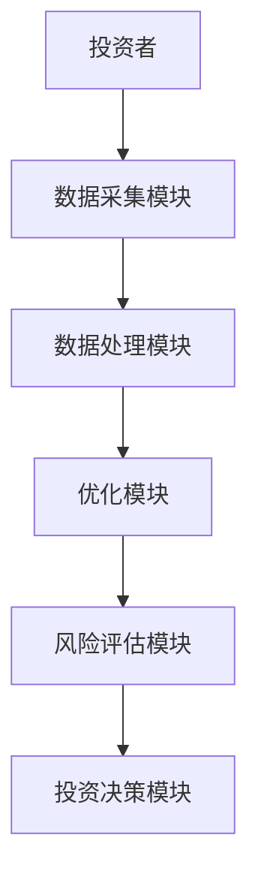

                 


# 《碳中和目标下的绿色投资策略》

## 关键词：碳中和、绿色投资、投资策略、量化分析、系统设计、项目实战

## 摘要：  
本文旨在探讨在碳中和目标下的绿色投资策略，分析绿色投资的核心概念、策略制定、量化分析、系统设计及实际案例。通过理论与实践相结合的方式，深入剖析绿色投资的内在逻辑、数学模型及系统架构，为读者提供一套完整的绿色投资解决方案。

---

## 第1章 碳中和目标下的绿色投资概述

### 1.1 碳中和的概念与目标

碳中和是指通过减少温室气体排放、增加碳汇等方式，使二氧化碳的净排放量降为零的过程。碳中和目标的实现需要全球范围内的协同努力，涉及能源转型、产业升级和技术创新等多个方面。

#### 1.1.1 碳中和的背景与意义  
全球气候变化是当前人类面临的重大挑战。碳中和不仅是应对气候变化的关键举措，也是推动经济可持续发展的重要抓手。通过实现碳中和，可以减少对化石能源的依赖，促进绿色能源的广泛应用，推动全球经济向低碳模式转型。

#### 1.1.2 绿色投资的核心目标  
绿色投资的核心目标是支持那些符合碳中和目标的项目和企业。通过投资绿色能源、低碳技术和环保产业，绿色投资可以为实现碳中和目标提供资金支持，同时为投资者带来长期稳定的收益。

### 1.2 绿色投资的背景与意义

随着全球气候变化问题的加剧，绿色投资逐渐成为资本市场的重要趋势。绿色投资不仅有助于减少碳排放，还能推动技术创新和产业升级，为投资者带来经济效益和社会价值的双重回报。

#### 1.2.1 绿色投资的定义  
绿色投资是指将资金投向符合环保要求、具有可持续发展能力的项目或企业。绿色投资不仅关注财务回报，还注重项目的环境效益和社会效益。

#### 1.2.2 绿色投资与传统投资的区别  
与传统投资相比，绿色投资更加注重环境和社会因素，强调投资项目的可持续性和环保效益。绿色投资通常采用ESG（环境、社会、治理）标准来评估投资项目的价值。

### 1.3 碳中和目标下的投资挑战

#### 1.3.1 碳中和目标下的投资风险  
碳中和目标的实现需要大量资金支持，但同时也伴随着一定的投资风险。例如，政策变化、技术不确定性以及市场波动都可能对绿色投资产生影响。

#### 1.3.2 绿色投资的风险管理  
绿色投资的风险管理需要综合考虑环境、社会和治理因素。投资者需要通过建立完善的风险评估体系，识别和应对绿色投资中的潜在风险。

---

## 第2章 绿色投资的核心概念与联系

### 2.1 绿色投资的核心概念

#### 2.1.1 绿色金融的定义与分类  
绿色金融是指为了支持环境改善、应对气候变化和资源节约的经济活动而提供的金融服务。绿色金融包括绿色债券、绿色贷款、绿色基金等多种形式。

#### 2.1.2 碳足迹与碳排放的计算方法  
碳足迹是指一个产品或活动在整个生命周期中产生的温室气体排放量。碳排放的计算需要考虑直接排放和间接排放，可以通过生命周期评价方法进行估算。

#### 2.1.3 绿色投资的评价标准与指标  
绿色投资的评价标准包括ESG评分、碳排放强度、资源利用效率等指标。投资者可以通过这些指标来评估投资项目在环境和社会方面的表现。

### 2.2 碳中和目标下的绿色投资策略

#### 2.2.1 碳中和目标下的绿色投资策略原理  
碳中和目标下的绿色投资策略强调通过优化投资组合，降低碳排放强度，实现长期的财务回报与环境效益的双赢。

#### 2.2.2 绿色投资策略的数学模型与公式  
绿色投资策略可以通过数学模型进行优化。例如，投资者可以通过线性规划模型来优化投资组合的碳排放强度，同时最大化投资收益。

$$ \text{目标函数：最大化} \sum_{i=1}^{n} w_i r_i $$
$$ \text{约束条件：} \sum_{i=1}^{n} w_i = 1, \sum_{i=1}^{n} w_i e_i \leq E_{target} $$

其中，$w_i$是第$i$个资产的投资权重，$r_i$是第$i$个资产的预期收益率，$e_i$是第$i$个资产的碳排放强度，$E_{target}$是目标碳排放强度。

---

## 第3章 碳中和目标下的绿色投资策略制定

### 3.1 碳中和目标下的投资目标设定

#### 3.1.1 碳中和目标下的投资目标分解  
投资者需要将碳中和目标分解为具体的可量化目标，例如在投资组合中减少高碳资产的比例，增加低碳资产的投资。

#### 3.1.2 绿色投资策略的制定步骤  
1. 确定投资目标：明确投资组合的碳排放目标和财务回报目标。
2. 选择投资工具：根据目标选择合适的绿色投资工具，例如绿色债券、ESG基金等。
3. 风险管理：建立风险评估机制，识别和应对投资中的潜在风险。

#### 3.1.3 绿色投资策略的实施路径  
绿色投资策略的实施需要结合政策支持、技术创新和市场环境。投资者需要与政府、企业和非营利组织合作，共同推动绿色投资目标的实现。

### 3.2 绿色投资工具的选择与应用

#### 3.2.1 绿色债券  
绿色债券是专门用于支持绿色项目的债务工具。投资者通过购买绿色债券，可以支持可再生能源、节能建筑等绿色项目的发展。

#### 3.2.2 ESG投资  
ESG投资是指根据环境、社会和治理因素评估企业的投资价值。ESG投资强调企业的社会责任和治理结构，有助于实现长期可持续发展。

#### 3.2.3 碳交易  
碳交易是指通过买卖碳配额或碳信用来实现碳排放权的交易。碳交易可以为投资者提供新的投资机会，同时促进碳排放的减少。

---

## 第4章 绿色投资的量化分析

### 4.1 绿色投资的量化模型与算法

#### 4.1.1 蒙特卡洛模拟  
蒙特卡洛模拟是一种用于评估投资组合风险的随机模拟方法。通过模拟不同的市场情景，投资者可以评估绿色投资组合的潜在收益和风险。

#### 4.1.2 碳排放风险评估模型  
碳排放风险评估模型可以帮助投资者量化投资组合在不同碳排放情景下的风险。例如，可以通过情景分析法评估投资组合在政策收紧、技术进步等情况下的碳排放风险。

### 4.2 绿色投资的数学模型与代码实现

#### 4.2.1 碳排放优化模型  
碳排放优化模型可以通过线性规划方法来优化投资组合的碳排放强度。以下是一个简单的Python代码示例：

```python
import numpy as np
from scipy.optimize import minimize

# 定义目标函数
def objective(w, e, r):
    return -np.dot(w, r)

# 定义约束条件
def constraint(w, e, E_target):
    return np.dot(w, e) - E_target

# 参数设置
n = 5
e = [0.2, 0.3, 0.1, 0.4, 0.1]  # 各资产的碳排放强度
r = [0.05, 0.07, 0.03, 0.08, 0.04]  # 各资产的预期收益率
E_target = 0.25  # 目标碳排放强度

# 初始权重
w0 = [0.2, 0.2, 0.2, 0.2, 0.2]

# 使用scipy.optimize.minimize进行优化
result = minimize(objective, w0, args=(e, r), method='SLSQP', 
                  constraints={'type': 'eq', 'fun': lambda w: np.sum(w) - 1},
                  bounds=[(0, 1)] * n)

# 输出结果
print("最优权重:", result.x)
print("最优收益:", -result.fun)
```

#### 4.2.2 量化分析的实际案例  
通过实际案例分析，我们可以看到绿色投资在量化分析中的具体应用。例如，某投资者可以通过量化模型优化其投资组合的碳排放强度，同时实现预期收益的最大化。

---

## 第5章 绿色投资的系统分析与架构设计

### 5.1 绿色投资系统的需求分析

#### 5.1.1 系统目标  
绿色投资系统的目标是帮助投资者优化投资组合，评估投资项目的风险和收益。

#### 5.1.2 系统功能需求  
- 数据采集与处理：采集绿色项目的碳排放数据、财务数据等。
- 投资组合优化：通过量化模型优化投资组合的碳排放强度和预期收益。
- 风险评估：评估投资组合在不同情景下的风险。

#### 5.1.3 系统架构设计  
绿色投资系统的架构可以分为数据层、计算层和展示层。数据层负责存储和管理数据，计算层负责进行量化分析，展示层为用户提供直观的决策支持。

### 5.2 绿色投资系统的架构设计

#### 5.2.1 数据流图  
以下是绿色投资系统的数据流图：



#### 5.2.2 系统功能模块  
- 数据采集模块：负责采集绿色项目的碳排放数据、财务数据等。
- 数据处理模块：对数据进行清洗、转换和预处理。
- 优化模块：通过量化模型优化投资组合的碳排放强度和预期收益。
- 风险评估模块：评估投资组合在不同情景下的风险。
- 投资决策模块：根据优化结果和风险评估结果，制定投资决策。

---

## 第6章 绿色投资的项目实战

### 6.1 绿色投资的环境安装与配置

#### 6.1.1 系统环境  
- 操作系统：Windows/Mac/Linux
- Python版本：Python 3.8+

#### 6.1.2 工具安装  
- Python库：numpy, pandas, scipy, matplotlib

### 6.2 绿色投资系统的实现

#### 6.2.1 核心代码实现  
以下是绿色投资系统的核心代码实现：

```python
import numpy as np
import pandas as pd
from scipy.optimize import minimize

# 数据准备
data = pd.read_csv('green_projects.csv')
e = data['carbon_emission'].values
r = data['return'].values

# 定义目标函数
def objective(w):
    return -np.dot(w, r)

# 定义约束条件
def constraint(w):
    return np.dot(w, e) - 0.25

# 初始权重
w0 = np.ones(len(w)) / len(w)

# 使用scipy.optimize.minimize进行优化
result = minimize(objective, w0, method='SLSQP', 
                  constraints=[{'type': 'eq', 'fun': lambda w: np.sum(w) - 1},
                               {'type': 'eq', 'fun': lambda w: constraint(w)}],
                  bounds=[(0, 1)] * len(w))

# 输出结果
print("最优权重:", result.x)
print("最优收益:", -result.fun)
```

#### 6.2.2 代码应用解读与分析  
通过上述代码，投资者可以优化其投资组合的碳排放强度和预期收益。代码中的数据准备部分需要根据具体项目调整，目标函数和约束条件也需要根据实际需求进行修改。

### 6.3 绿色投资的实际案例分析

#### 6.3.1 投资组合优化案例  
某投资者希望通过绿色投资实现投资组合的碳中和目标。通过量化模型优化，投资者可以将高碳资产的比例降低，增加低碳资产的投资，从而实现碳排放强度的优化。

#### 6.3.2 风险管理案例  
某投资者在进行绿色投资时，需要评估投资组合在不同碳排放情景下的风险。通过风险评估模型，投资者可以识别潜在风险，并制定相应的风险管理策略。

---

## 第7章 总结与展望

### 7.1 总结

通过本文的分析，我们可以看到绿色投资在实现碳中和目标中的重要作用。绿色投资不仅有助于减少碳排放，还能为投资者带来长期稳定的收益。通过量化分析和系统设计，投资者可以更好地优化其投资组合，实现财务回报与环境效益的双赢。

### 7.2 展望

随着全球气候变化问题的加剧，绿色投资将成为资本市场的重要趋势。未来，绿色投资将更加注重技术创新和政策支持，投资者需要不断优化其投资策略，以应对碳中和目标下的挑战和机遇。

### 7.3 最佳实践 tips

1. 投资者在进行绿色投资时，需要综合考虑环境、社会和治理因素。
2. 绿色投资的风险管理是实现长期稳定收益的关键。
3. 通过量化分析和系统设计，投资者可以优化其投资组合的碳排放强度和预期收益。

---

通过本文的详细分析，我们希望读者能够更好地理解绿色投资的核心概念和策略，并能够在实际投资中灵活运用这些方法，为实现碳中和目标贡献力量。

