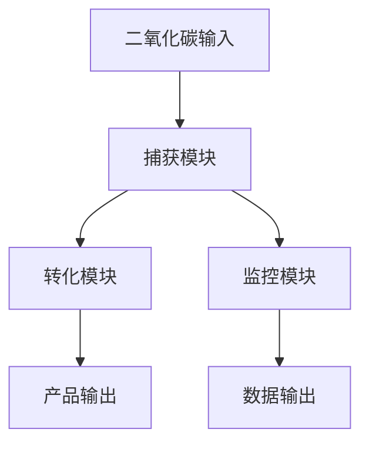

                 

# 碳捕获与利用技术的经济可行性分析

## 关键词：碳捕获，碳利用，经济可行性，碳中和，气候变化

## 摘要：  
碳捕获与利用技术作为应对气候变化的重要手段，近年来受到广泛关注。本文从技术原理、经济模型、案例分析等多维度，系统探讨碳捕获与利用技术的经济可行性，分析其成本结构、市场前景及政策影响，为决策者和投资者提供参考。

---

## 第1章：碳捕获与利用技术概述

### 1.1 碳捕获与利用技术的背景

#### 1.1.1 全球气候变化与碳中和目标
全球气候变化导致极端天气频发，各国政府和企业纷纷设定碳中和目标。碳捕获与利用技术（Carbon Capture and Utilization, CCU）成为实现这一目标的关键技术之一。

#### 1.1.2 碳捕获与利用技术的定义
碳捕获技术通过化学或物理方法捕获二氧化碳，随后将其转化为燃料、材料或用于矿化封存。CCU技术不仅减少碳排放，还能创造经济价值。

#### 1.1.3 碳捕获与利用技术的重要性
CCU技术可应用于燃煤电厂、水泥厂等高排放行业，帮助这些行业实现低碳转型，减少对环境的负面影响。

### 1.2 碳捕获与利用技术的分类

#### 1.2.1 吸收法
吸收法利用化学溶液吸收二氧化碳，如胺基溶液。优点是捕获效率高，缺点是成本较高。

#### 1.2.2 膜分离法
膜分离法通过特殊膜分离二氧化碳，适用于小规模项目。优点是操作简单，缺点是分离效率有限。

#### 1.2.3 化学链法
化学链法通过化学反应循环捕获二氧化碳，适用于大规模工业应用。优点是捕获效率高，缺点是技术复杂。

### 1.3 碳利用技术的经济性分析

#### 1.3.1 碳利用的主要途径
- **燃料转化**：将二氧化碳转化为甲醇、乙醇等燃料。
- **材料生产**：用于生产碳酸盐、塑料等材料。
- **矿化封存**：将二氧化碳固定在地质构造中。

#### 1.3.2 碳利用技术的经济性特点
- 成本高：设备投资和运行成本较高。
- 政策依赖：依赖政府补贴和碳定价政策。

#### 1.3.3 碳利用技术的市场前景
随着环保政策趋严和市场需求增长，碳利用技术的市场前景广阔。

---

## 第2章：碳捕获与利用技术的核心原理

### 2.1 碳捕获技术的原理

#### 2.1.1 吸收法的化学反应机制
胺基溶液吸收二氧化碳的反应方程式：
$$ \text{2NH}_2\text{OH} + \text{CO}_2 \rightarrow \text{NH}_2\text{COOH} + \text{H}_2\text{O} $$

#### 2.1.2 膜分离法的工作原理
二氧化碳通过膜分离，利用其物理特性进行分离。

#### 2.1.3 化学链法的反应过程
化学链法通过循环反应捕获二氧化碳，例如：
$$ \text{CaO} + \text{CO}_2 \rightarrow \text{CaCO}_3 $$

### 2.2 碳利用技术的原理

#### 2.2.1 碳转化为燃料的反应机制
二氧化碳转化为甲醇的反应方程式：
$$ \text{CO}_2 + 3\text{H}_2 \rightarrow \text{CH}_3\text{OH} + \text{H}_2\text{O} $$

#### 2.2.2 碳转化为材料的化学过程
二氧化碳用于生产聚碳酸酯的过程：
$$ \text{CO}_2 + \text{CH}_2\text{OH} \rightarrow \text{聚碳酸酯} $$

#### 2.2.3 碳矿化封存的技术原理
将二氧化碳注入地下，与矿物质反应生成稳定化合物。

### 2.3 碳捕获与利用技术的系统架构

#### 2.3.1 系统输入与输出
- **输入**：二氧化碳气体、化学试剂。
- **输出**：捕获的二氧化碳、转化的产品。

#### 2.3.2 系统功能模块划分
- 捕获模块：负责捕获二氧化碳。
- 转化模块：将捕获的二氧化碳转化为燃料或材料。
- 监控模块：实时监控系统运行状态。

#### 2.3.3 系统流程图

---

## 第3章：碳捕获与利用技术的经济性分析模型

### 3.1 经济性分析的核心指标

#### 3.1.1 投资成本
设备投资成本包括捕获设备、转化设备等。

#### 3.1.2 运行成本
包括能源消耗、化学试剂消耗、维护费用等。

#### 3.1.3 收益分析
收益来自捕获的二氧化碳转化为产品的销售收入。

### 3.2 经济性分析的数学模型

#### 3.2.1 成本函数
$$ C = C_{\text{固定}} + C_{\text{可变}} \times Q $$

#### 3.2.2 收益函数
$$ R = P \times Q $$

#### 3.2.3 净收益函数
$$ N = R - C $$

### 3.3 经济性分析的假设条件

#### 3.3.1 技术成熟度
假设技术已成熟，无研发风险。

#### 3.3.2 市场价格波动
假设市场价格稳定，无重大波动。

#### 3.3.3 政策支持
假设政府提供一定的补贴和支持。

---

## 第4章：碳捕获与利用技术的经济性影响因素

### 4.1 技术成本的影响

#### 4.1.1 设备投资成本
设备投资成本占总成本的50%以上。

#### 4.1.2 运行维护成本
运行维护成本每年约为设备投资成本的10%。

#### 4.1.3 技术研发成本
技术研发成本取决于技术复杂度。

### 4.2 市场因素的影响

#### 4.2.1 碳价波动
碳价波动直接影响项目的收益。

#### 4.2.2 石油价格波动
石油价格波动影响替代能源的需求。

#### 4.2.3 市场需求变化
市场需求变化影响项目的销售情况。

### 4.3 政策因素的影响

#### 4.3.1 碳税政策
碳税政策增加企业的碳排放成本。

#### 4.3.2 补贴政策
政府补贴降低项目的经济成本。

#### 4.3.3 技术标准
技术标准影响项目的合规性。

---

## 第5章：碳捕获与利用技术的经济性案例分析

### 5.1 案例一：某燃煤电厂碳捕获项目

#### 5.1.1 项目背景
某燃煤电厂采用吸收法捕获二氧化碳，随后将其转化为甲醇。

#### 5.1.2 经济性分析
- 投资成本：1000万美元。
- 年运行成本：50万美元。
- 年收益：100万美元。

#### 5.1.3 经验总结
项目初期成本高，但随着技术成熟和碳价上涨，经济效益逐渐显现。

### 5.2 案例二：某工业尾气利用项目

#### 5.2.1 项目背景
某水泥厂利用尾气中的二氧化碳生产碳酸盐。

#### 5.2.2 经济性分析
- 投资成本：800万美元。
- 年运行成本：40万美元。
- 年收益：80万美元。

#### 5.2.3 经验总结
技术创新和成本控制是项目成功的关键。

---

## 第6章：结论与展望

### 6.1 结论

碳捕获与利用技术在经济可行性方面具有潜力，但目前仍面临高成本和技术成熟度的挑战。通过技术创新和政策支持，可以降低成本，提升经济效益。

### 6.2 展望

未来，随着技术进步和政策支持，碳捕获与利用技术将得到更广泛应用，助力全球实现碳中和目标。

---

## 参考文献

（此处列出相关文献和数据来源）

