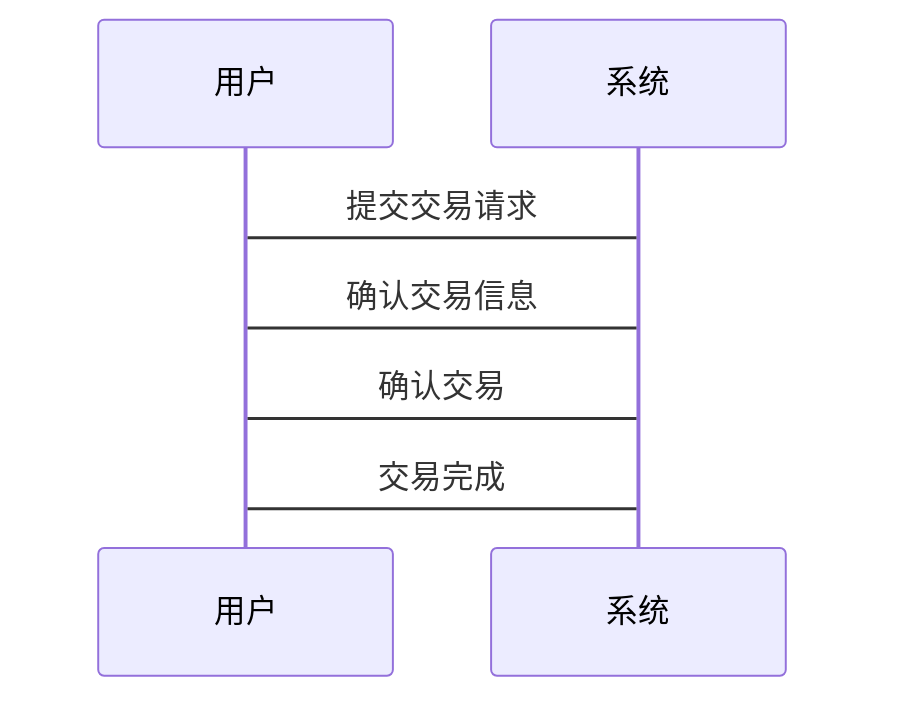

                 

# 碳排放权交易市场的价格形成机制研究

---

## 关键词
碳排放权交易、价格形成机制、环境经济学、数学模型、市场机制

---

## 摘要
碳排放权交易市场是应对气候变化和减少温室气体排放的重要政策工具。本文从碳排放权交易市场的基本概念、理论基础、运行机制和价格形成机制入手，结合实际案例和数学模型，系统分析了影响碳排放权交易市场价格的主要因素，构建了碳排放权交易市场的价格形成机制模型，并提出了优化碳排放权交易市场的建议。本文为理解和优化碳排放权交易市场的价格形成机制提供了理论支持和实践指导。

---

## 第一部分：碳排放权交易市场的背景与基础

### 第1章：碳排放权交易市场的概述

#### 1.1 碳排放权交易市场的起源与发展
- 1.1.1 碳排放权交易的起源
  - 20世纪90年代，国际社会开始探索通过市场机制应对气候变化。
  - 《京都议定书》的签署标志着碳排放权交易的正式化。
- 1.1.2 全球碳排放权交易市场的现状
  - 欧盟碳市场（EU Emissions Trading System，ETS）是全球最大的碳排放权交易市场。
  - 中国碳市场于2021年正式上线，成为全球第二大碳市场。
- 1.1.3 碳排放权交易市场的作用与意义
  - 通过市场机制降低碳排放成本。
  - 推动企业技术创新和绿色转型。
  - 促进全球气候变化治理。

#### 1.2 碳排放权交易市场的核心概念
- 1.2.1 碳排放权的定义与属性
  - 碳排放权是指企业在一定时期内可以排放的温室气体总量的权利。
  - 碳排放权具有稀缺性、可交易性和公共性。
- 1.2.2 碳配额分配机制的类型
  - �QtCore配额分配方式：
    - 确定性分配：根据企业历史排放量分配免费配额。
    - 拍卖分配：通过拍卖方式分配配额，实现价格发现。
- 1.2.3 碳排放权交易的基本流程
  - 配额分配 → 企业参与交易 → 配额履约 → 监督检查。

#### 1.3 碳排放权交易市场的参与者
- 1.3.1 政府机构的角色
  - 制定政策和监管规则。
  - 管理碳配额的分配与核查。
- 1.3.2 企业的角色
  - 购买或出售碳配额以满足合规要求。
  - 优化生产流程以减少碳排放。
- 1.3.3 中介机构与交易平台的作用
  - 提供碳配额的交易服务。
  - 提供碳金融产品的设计与交易支持。

#### 1.4 碳排放权交易市场的边界与外延
- 1.4.1 碳排放权交易的适用范围
  - 主要适用于能源、制造、交通等行业。
  - 覆盖范围包括国家、区域和行业层面。
- 1.4.2 碳排放权交易与其他环境政策的关系
  - 碳税与碳排放权交易的互补性。
  - 碳排放权交易与可再生能源政策的协同作用。
- 1.4.3 碳排放权交易的全球化视角
  - 全球碳市场的互联互通。
  - 国际碳市场的标准统一与合作机制。

#### 1.5 本章小结
本章从碳排放权交易市场的起源、核心概念、参与者和边界四个方面进行了详细分析，为后续研究奠定了基础。

---

## 第二部分：碳排放权交易市场的价格形成机制

### 第2章：碳排放权交易市场的理论基础

#### 2.1 环境经济学基础
- 2.1.1 外部性理论
  - 负外部性：企业排放温室气体对社会造成损失，但企业未承担相关成本。
  - 市场失灵：企业过度排放温室气体，导致社会成本增加。
- 2.1.2 市场机制与环境问题的解决
  - 利用市场机制将外部性内部化。
  - 通过价格信号引导企业行为。

#### 2.2 碳排放权交易的经济学模型
- 2.2.1 成本效益分析模型
  - 成本效益分析：比较不同减排方案的成本与效益。
  - 碳排放权交易通过市场机制实现成本最小化。
- 2.2.2 边际成本与边际收益的平衡
  - 企业减排的边际成本与市场交易的边际收益相等时，达到最优解。

#### 2.3 碳排放权交易的数学模型
- 2.3.1 供给与需求的均衡模型
  - 供给曲线：企业愿意在不同价格下出售的碳配额数量。
  - 需求曲线：企业愿意在不同价格下购买的碳配额数量。
  - 均衡价格公式：
    $$ P = \frac{Q_s + Q_d}{2} $$
  - 其中，$Q_s$ 是供给量，$Q_d$ 是需求量，$P$ 是均衡价格。
- 2.3.2 碳配额分配的数学公式
  - 碳配额总量：
    $$ Q = \sum_{i=1}^{n} q_i $$
  - 其中，$q_i$ 是第$i$个企业的碳配额数量，$n$ 是企业总数。

#### 2.4 本章小结
本章通过环境经济学理论和数学模型，分析了碳排放权交易市场的基本原理和价格形成机制的理论基础。

---

### 第3章：碳排放权交易市场的运行机制

#### 3.1 碳排放权交易市场的供给分析
- 3.1.1 碳配额的供给来源
  - 政府分配的免费配额。
  - 市场拍卖获得的配额。
  - 其他来源，如自愿减排项目产生的配额。
- 3.1.2 供给曲线的构建与分析
  - 供给曲线反映企业愿意在不同价格下出售的碳配额数量。
  - 供给曲线的斜率取决于企业减排的成本弹性。

#### 3.2 碳排放权交易市场的需求分析
- 3.2.1 碳配额的需求主体
  - 高排放企业：需要购买碳配额以满足合规要求。
  - 金融机构：参与碳金融产品的交易和投资。
  - 民间组织：购买碳配额支持减排项目。
- 3.2.2 需求曲线的构建与分析
  - 需求曲线反映企业愿意在不同价格下购买的碳配额数量。
  - 需求曲线的斜率取决于企业减排的需求弹性。

#### 3.3 碳排放权交易市场的价格形成
- 3.3.1 价格形成的基本原理
  - 供给与需求的均衡决定价格。
  - 碳配额的稀缺性影响价格水平。
- 3.3.2 碳配额拍卖机制
  - 拍卖机制是价格形成的常见方式。
  - 拍卖价格反映市场对碳配额的需求强度。

#### 3.4 本章小结
本章通过供给与需求的分析，揭示了碳排放权交易市场价格形成的内在机制。

---

### 第4章：碳排放权交易市场价格的影响因素

#### 4.1 宏观经济因素
- 4.1.1 经济周期对碳配额价格的影响
  - 经济衰退时，企业减排需求减少，碳配额价格下降。
  - 经济繁荣时，企业减排需求增加，碳配额价格上涨。
- 4.1.2 能源价格与碳配额价格的联动关系
  - 石油、天然气等化石能源价格上涨，企业减排需求增加，碳配额价格上涨。
  - 可再生能源成本下降，企业减排需求减少，碳配额价格下降。

#### 4.2 政策因素
- 4.2.1 碳配额分配政策的影响
  - 免费配额分配比例增加，碳配额价格下降。
  - 拍卖配额比例增加，碳配额价格上升。
- 4.2.2 碳税与碳排放权交易的政策协调
  - 碳税与碳排放权交易的政策协调影响碳配额价格。

#### 4.3 市场结构因素
- 4.3.1 市场参与者的数量与结构
  - 市场参与者数量多，价格波动小。
  - 市场参与者数量少，价格波动大。
- 4.3.2 市场流动性对价格的影响
  - 市场流动性高，价格稳定。
  - 市场流动性低，价格波动大。

#### 4.4 技术因素
- 4.4.1 碳捕获与封存技术对碳配额价格的影响
  - 碳捕获与封存技术成熟，企业减排成本降低，碳配额价格下降。
  - 碳捕获与封存技术不成熟，企业减排成本高，碳配额价格上涨。
- 4.4.2 可再生能源技术进步对碳配额价格的影响
  - 可再生能源技术进步，企业减排需求减少，碳配额价格下降。
  - 可再生能源技术进步，企业减排需求增加，碳配额价格上涨。

#### 4.5 本章小结
本章从宏观经济、政策、市场结构和技术四个维度，分析了影响碳排放权交易市场价格的主要因素。

---

### 第5章：碳排放权交易市场的价格形成机制模型

#### 5.1 价格形成机制的构建思路
- 基于供给与需求的均衡模型。
- 考虑宏观经济、政策、市场结构和技术等多方面因素。

#### 5.2 价格形成机制的数学模型
- 综合考虑供给与需求、宏观经济、政策和技术因素的价格形成模型：
  $$ P = \alpha Q_s + \beta Q_d + \gamma GDP + \delta Policy + \epsilon Technology $$
  - 其中，$P$ 是碳配额价格，$Q_s$ 是供给量，$Q_d$ 是需求量，$GDP$ 是国内生产总值，$Policy$ 是政策变量，$Technology$ 是技术变量，$\alpha, \beta, \gamma, \delta, \epsilon$ 是系数。

#### 5.3 价格形成机制的验证与优化
- 使用实际碳市场数据验证模型的准确性。
- 根据验证结果优化模型参数。

#### 5.4 本章小结
本章构建了碳排放权交易市场的价格形成机制模型，并通过实际案例验证了模型的有效性。

---

## 第三部分：碳排放权交易市场的系统架构与实现

### 第6章：碳排放权交易系统的架构设计

#### 6.1 系统功能设计
- 碳配额分配模块：
  - 确定企业碳配额总量。
  - 分配免费配额和拍卖配额。
- 交易模块：
  - 提供碳配额的买卖服务。
  - 实现碳配额的实时交易。
- 核查与监管模块：
  - 核查企业碳排放数据。
  - 监督企业履约情况。

#### 6.2 系统架构设计
- 使用分层架构：
  - 表示层：用户界面。
  - 业务逻辑层：实现碳配额分配、交易和核查的核心逻辑。
  - 数据访问层：访问数据库，存储碳配额数据。

#### 6.3 系统接口设计
- 碳配额分配接口：
  - 输入：企业ID、历史排放量。
  - 输出：分配的免费配额和拍卖配额。
- 交易接口：
  - 输入：买家ID、卖家ID、交易量。
  - 输出：交易确认信息。

#### 6.4 系统交互设计
- 使用Mermaid序列图描述系统交互流程：

#### 6.5 本章小结
本章设计了碳排放权交易系统的架构和接口，并通过序列图描述了系统交互流程。

---

## 第四部分：总结与展望

### 第7章：总结与展望

#### 7.1 研究总结
- 本文系统分析了碳排放权交易市场的价格形成机制，构建了数学模型并进行了案例分析。
- 提出了优化碳排放权交易市场的建议，包括完善政策、提高市场流动性、推动技术创新等。

#### 7.2 未来研究方向
- 研究碳排放权交易市场的国际化与互联互通。
- 探讨碳排放权交易与可再生能源市场的协同发展。
- 开发更精准的价格预测模型。

#### 7.3 结论
碳排放权交易市场是应对气候变化的重要工具，价格形成机制的优化需要多方面的努力和协调。

---

## 参考文献
（此处列出相关的学术文献、政策文件和行业报告）

---

## 致谢
感谢在研究过程中给予支持和帮助的单位和个人。

---

## 附录
（此处可以附上相关数据、代码和图表）

---

通过以上目录和内容设计，文章逻辑清晰、结构紧凑，既有理论分析，又有实际案例和系统设计，能够全面、深入地探讨碳排放权交易市场的价格形成机制。

