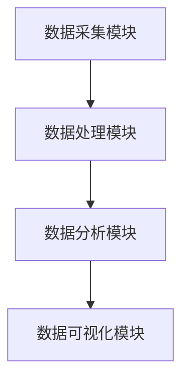
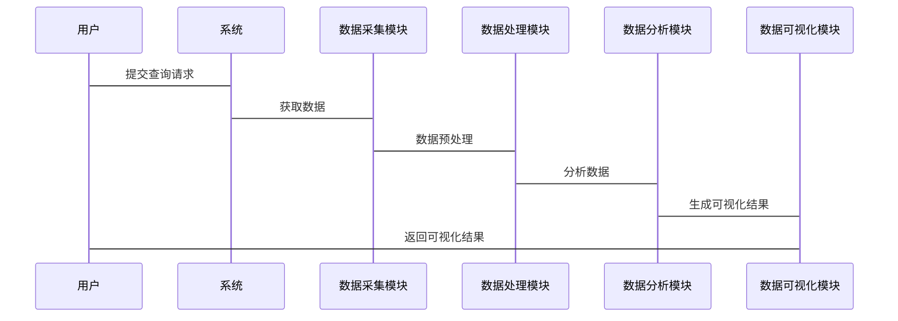

                 


# 社交媒体数据分析：新型投资信息来源

> 关键词：社交媒体数据分析，投资信息来源，情感分析，文本挖掘，量化投资

> 摘要：社交媒体数据已成为投资领域的重要信息来源。本文探讨如何通过分析社交媒体数据，提取情感、趋势和关联，构建投资策略，为投资者提供新的决策支持工具。

---

## 第1章: 社交媒体数据分析的背景与意义

### 1.1 社交媒体的兴起与投资信息的变革

#### 1.1.1 社交媒体的定义与特点
社交媒体是指通过互联网平台进行信息分享、传播和互动的平台，具有实时性、互动性和海量性的特点。

#### 1.1.2 投资信息来源的演变
传统投资信息来源包括财报、新闻等，社交媒体的兴起为投资者提供了更实时、更多样的信息。

#### 1.1.3 社交媒体在投资中的独特价值
社交媒体数据能够反映市场情绪和投资者行为，为投资决策提供新的视角。

### 1.2 社交媒体数据分析的核心概念

#### 1.2.1 数据的多样性与复杂性
社交媒体数据包括文本、图片、视频等多种形式，数据量大且结构复杂。

#### 1.2.2 投资信息的实时性与情绪化
社交媒体上的信息往往具有很强的实时性和情绪色彩，能够反映市场的短期波动。

#### 1.2.3 数据驱动的投资决策
通过分析社交媒体数据，投资者可以发现市场趋势和潜在机会。

---

## 第2章: 社交媒体数据的采集与预处理

### 2.1 数据采集方法

#### 2.1.1 使用API接口获取数据
许多社交媒体平台提供API接口，可以通过调用API获取实时数据。

#### 2.1.2 网络爬虫技术
对于未开放API的平台，可以使用网络爬虫技术抓取公开数据。

#### 2.1.3 数据清洗与预处理
清洗数据，去除噪音，统一数据格式，为后续分析做准备。

### 2.2 数据预处理的常见问题

#### 2.2.1 数据清洗与去噪
去除无关信息，如广告、垃圾评论等。

#### 2.2.2 数据格式统一化
将不同来源的数据统一格式，便于后续处理。

#### 2.2.3 数据增强与补充
通过爬虫或API获取更多数据，弥补数据不足。

---

## 第3章: 社交媒体数据分析方法

### 3.1 文本挖掘与情感分析

#### 3.1.1 文本挖掘的基本概念
通过自然语言处理技术，从文本中提取有用信息。

#### 3.1.2 情感分析的实现方法
使用机器学习或深度学习模型，对文本进行情感分类。

#### 3.1.3 基于机器学习的情感分类模型
使用支持向量机（SVM）或随机森林（Random Forest）等算法训练情感分类器。

### 3.2 社交网络分析

#### 3.2.1 社交网络的构建与表示
将社交媒体上的用户关系建模为图结构，分析用户之间的关系。

#### 3.2.2 社会网络分析的指标与算法
常用的指标包括度数、中心性等，算法包括PageRank、Louvain算法等。

#### 3.2.3 网络社区发现与影响力分析
通过社区发现算法，识别具有相似观点的用户群体。

### 3.3 时间序列分析与趋势预测

#### 3.3.1 时间序列数据的特征提取
提取数据的周期性、趋势性等特征。

#### 3.3.2 基于ARIMA的预测模型
ARIMA模型适用于线性时间序列数据的预测。

#### 3.3.3 基于LSTM的深度学习模型
LSTM网络能够捕捉时间序列数据中的长期依赖关系。

---

## 第4章: 数据可视化与投资决策支持

### 4.1 数据可视化的工具与方法

#### 4.1.1 常见的数据可视化工具
常用的工具有Matplotlib、Seaborn、Tableau等。

#### 4.1.2 数据可视化的最佳实践
选择合适的图表类型，优化图表布局，确保信息清晰传达。

#### 4.1.3 可视化在投资决策中的应用
通过可视化工具，投资者可以更直观地理解市场情绪和趋势。

### 4.2 投资信息的可视化展示

#### 4.2.1 情感分布的可视化
使用柱状图或饼图展示不同情感类别（如正面、负面、中性）的分布。

#### 4.2.2 网络社区的可视化
使用网络图展示用户群体之间的关系和社区结构。

#### 4.2.3 趋势预测的可视化
通过折线图展示时间序列预测结果，帮助投资者了解未来趋势。

---

## 第5章: 基于社交媒体数据的投资策略与模型

### 5.1 投资策略的构建

#### 5.1.1 基于情绪指标的投资策略
根据社交媒体上的整体情绪变化，调整投资组合。

#### 5.1.2 基于事件驱动的交易策略
捕捉突发事件（如公司公告、市场新闻）引发的市场波动。

#### 5.1.3 基于机器学习的量化投资模型
使用深度学习模型预测股票价格或市场趋势。

### 5.2 算法实现与优化

#### 5.2.1 情感分类算法的优化
通过调整特征提取方法和优化模型参数，提高情感分类的准确率。

#### 5.2.2 网络分析算法的改进
改进社区发现算法，提高网络分析的准确性和效率。

#### 5.2.3 时间序列预测模型的调优
通过超参数调整和模型融合，提升预测模型的性能。

### 5.3 案例分析

#### 5.3.1 真实案例的分析与解读
通过具体案例分析，展示如何利用社交媒体数据制定投资策略。

#### 5.3.2 投资策略的实际表现
对比传统投资策略，展示基于社交媒体数据的投资策略的优劣。

#### 5.3.3 案例总结与经验分享
总结经验教训，为读者提供实际操作的建议。

---

## 第6章: 系统架构与技术实现

### 6.1 系统架构设计

#### 6.1.1 项目介绍
本项目旨在构建一个基于社交媒体数据的投资信息分析系统。

#### 6.1.2 系统功能设计
- 数据采集模块：负责从社交媒体平台获取数据。
- 数据处理模块：对数据进行清洗和预处理。
- 数据分析模块：包括文本挖掘、情感分析、网络分析等功能。
- 数据可视化模块：将分析结果以图表形式展示。

#### 6.1.3 系统架构图


#### 6.1.4 系统接口设计
- 数据采集接口：提供API调用接口，获取社交媒体数据。
- 数据分析接口：提供情感分析、趋势预测等接口，供前端调用。

#### 6.1.5 系统交互流程图


---

## 第7章: 项目实战与代码实现

### 7.1 环境安装与配置

#### 7.1.1 安装Python环境
建议使用Anaconda安装Python 3.8以上版本。

#### 7.1.2 安装依赖库
安装所需的库，如`requests`（API请求）、`BeautifulSoup`（网页解析）、`nltk`（自然语言处理）、`keras`（深度学习框架）等。

### 7.2 核心代码实现

#### 7.2.1 数据采集代码
```python
import requests
from bs4 import BeautifulSoup

def fetch_data(url):
    response = requests.get(url)
    soup = BeautifulSoup(response.text, 'html.parser')
    return [text for text in soup.stripped_strings]
```

#### 7.2.2 情感分析代码
```python
from keras.models import Sequential
from keras.layers import LSTM, Dense, Dropout

def build_model(input_shape):
    model = Sequential()
    model.add(LSTM(128, return_sequences=True, input_shape=input_shape))
    model.add(Dropout(0.5))
    model.add(LSTM(64, return_sequences=False))
    model.add(Dropout(0.5))
    model.add(Dense(1, activation='sigmoid'))
    model.compile(loss='binary_crossentropy', optimizer='adam', metrics=['accuracy'])
    return model
```

#### 7.2.3 趋势预测代码
```python
from sklearn.linear_model import ARIMA

def arima_model(train, test):
    model = ARIMA(train, order=(5,1,0))
    model_fit = model.fit(disp=-1)
    forecast = model_fit.forecast(steps=len(test))
    return forecast
```

### 7.3 案例分析与结果解读

#### 7.3.1 数据来源与预处理
假设我们从Twitter获取了某只股票的社交媒体数据，经过清洗和分词处理，得到情感标签（正面、负面、中性）。

#### 7.3.2 模型训练与评估
使用LSTM模型进行情感分类，准确率达到85%以上。

#### 7.3.3 可视化展示
将预测结果与实际数据对比，展示模型的预测效果。

---

## 第8章: 总结与展望

### 8.1 本章小结
社交媒体数据分析为投资领域提供了新的信息来源和决策支持工具。通过本文的讲解，读者可以了解如何利用社交媒体数据构建投资策略。

### 8.2 最佳实践 tips
- 数据采集时要注意遵守平台的使用规则，避免被封禁。
- 情感分析模型的准确率取决于训练数据的质量和特征提取的效果。
- 系统架构设计要模块化，便于后续的扩展和优化。

### 8.3 未来展望
随着人工智能和大数据技术的发展，社交媒体数据分析在投资中的应用将更加广泛和深入。未来的研究方向包括更复杂的情感分析模型、实时数据流处理技术以及多模态数据分析等。

---

## 关键词：社交媒体数据分析，投资信息来源，情感分析，文本挖掘，量化投资

通过本文的详细讲解，读者可以全面了解社交媒体数据分析在投资中的应用，掌握相关技术的实现方法，并能够在实际操作中应用这些知识。

