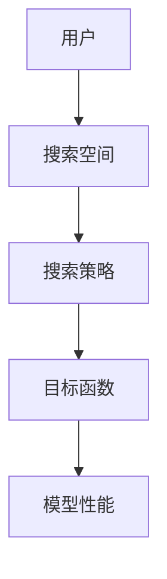
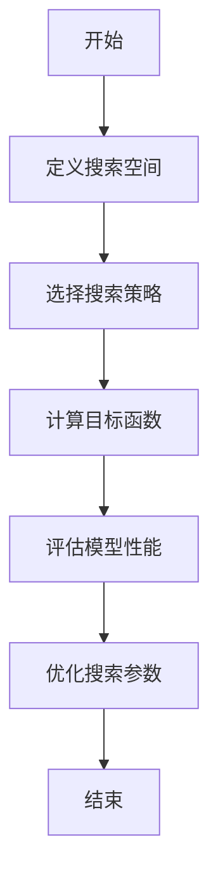
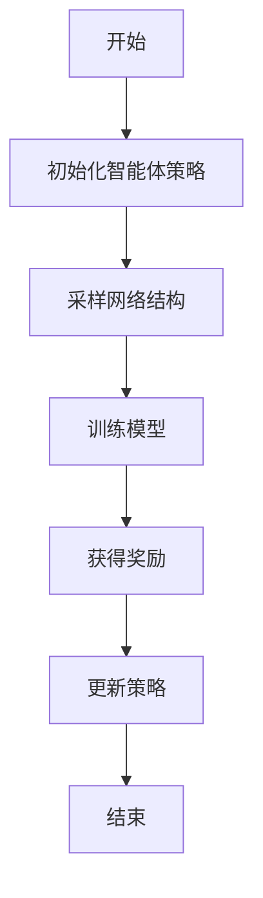
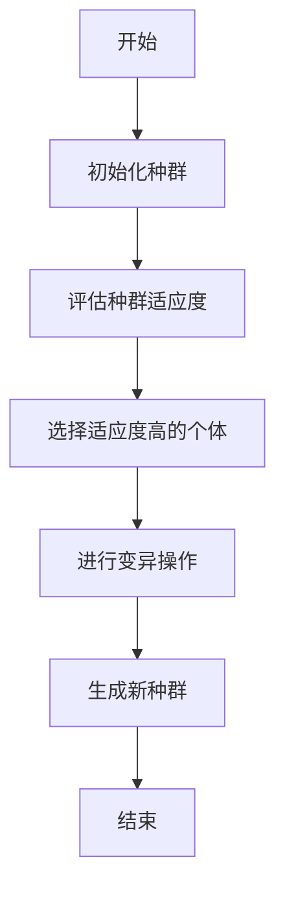
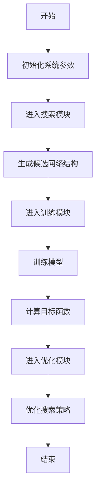

                 


# 神经网络架构搜索：自动化AI Agent模型结构优化

> 关键词：神经网络架构搜索（NAS）、自动化AI Agent、模型结构优化、强化学习、进化策略、深度学习、AI算法

> 摘要：本文深入探讨了神经网络架构搜索（Neural Architecture Search，NAS）在自动化AI Agent模型结构优化中的应用。通过分析NAS的核心概念、算法原理、系统架构设计以及实际项目案例，系统地展示了如何通过自动化方法优化AI模型的结构，提升模型性能和效率。文章内容涵盖从基础理论到实际应用的全链条，为AI开发者和研究者提供了详实的指导和参考。

---

## 第一部分: 神经网络架构搜索基础

### 第1章: 神经网络架构搜索概述

#### 1.1 神经网络架构搜索的背景与意义

神经网络架构搜索（Neural Architecture Search，NAS）是人工智能领域的一项重要技术，旨在通过自动化的方式寻找最优的神经网络结构。传统的深度学习模型设计高度依赖人工经验，而NAS通过算法优化，能够显著提高模型性能并减少开发时间。

**问题背景**：随着深度学习的广泛应用，模型结构的复杂性不断提高。人工设计模型结构不仅效率低下，还可能因为经验不足导致模型性能不理想。因此，寻找一种自动化的方法来优化模型结构成为迫切需求。

**问题解决**：NAS通过搜索算法在预定义的搜索空间中找到最优或次优的网络架构，从而实现模型性能的提升。

**边界与外延**：NAS的应用范围不仅限于图像识别，还广泛应用于自然语言处理、语音识别等领域。其外延包括模型压缩、知识蒸馏等技术。

#### 1.2 神经网络架构搜索的核心概念

**定义**：NAS是一种通过算法搜索最优神经网络结构的方法。

**问题描述**：在给定任务（如图像分类）中，定义一个搜索空间，包含可能的网络层类型、连接方式等。通过搜索策略，找到能够最大化模型性能的架构。

**核心要素**：
- **搜索空间**：定义可能的网络结构，包括层类型、连接方式等。
- **搜索策略**：算法用于遍历或优化搜索空间。
- **目标函数**：评估模型性能的指标。

### 第2章: 神经网络架构搜索的核心概念与联系

#### 2.1 核心概念原理

**搜索空间的定义与构建**：搜索空间是NAS的基础，决定了可能的网络结构。通常包括层的类型（卷积层、全连接层等）、层的参数（如滤波器数量、 stride 等）以及层的连接方式。

**搜索策略的选择与优化**：搜索策略决定了如何遍历或优化搜索空间。常用策略包括强化学习、进化策略等。

**目标函数的设计与评估**：目标函数是评估网络性能的指标，如准确率、F1分数等。

#### 2.2 核心概念对比分析

**不同NAS方法的对比**：

| 方法          | 优点                            | 缺点                            |
|---------------|---------------------------------|---------------------------------|
| 强化学习       | 搜索能力强，适应复杂任务        | 训练时间长，需要大量计算资源     |
| 进化策略       | 稳定性高，容易并行实现           | 搜索效率较低                   |
| 随机搜索       | 实现简单，适合初步探索           | 结果依赖随机性，优化效果有限     |

**搜索空间与目标函数的关联性分析**：目标函数直接影响搜索策略的优化方向，搜索空间的大小和复杂性决定了搜索策略的选择。

**搜索策略与模型性能的关系**：高效的搜索策略能够更快地找到性能优异的模型结构，从而提升模型性能。

#### 2.3 实体关系图与流程图

**实体关系图（ER图）**：



**流程图**：



---

## 第二部分: 神经网络架构搜索的算法原理

### 第3章: 基于强化学习的神经网络架构搜索

#### 3.1 强化学习在NAS中的应用

**强化学习的基本原理**：通过智能体与环境的交互，学习最优策略。在NAS中，智能体负责选择网络结构，环境负责评估模型性能。

**NAS中的强化学习角色**：智能体通过选择网络结构动作，获得奖励（目标函数的评估结果），逐步优化策略。

**算法实现**：基于强化学习的NAS算法通常包括以下步骤：

1. 初始化智能体策略。
2. 采样网络结构并训练模型。
3. 根据模型性能更新策略。

#### 3.2 基于进化策略的神经网络架构搜索

**进化策略的基本原理**：通过模拟自然选择，保留适应性强的个体，逐步优化种群。

**NAS中的进化策略应用**：通过生成和评估大量网络结构，选择性能最优的结构作为下一代种群。

**算法实现**：基于进化策略的NAS算法通常包括以下步骤：

1. 初始化种群。
2. 评估种群适应度。
3. 选择适应度高的个体。
4. 进行变异操作。
5. 生成新种群。

#### 3.3 算法流程图

**强化学习算法流程图**：



**进化策略算法流程图**：



#### 3.4 算法代码示例

```python
# 基于强化学习的NAS算法示例

import numpy as np
import tensorflow as tf

class NASAgent:
    def __init__(self, action_space):
        self.action_space = action_space
        self.model = self._build_model()

    def _build_model(self):
        # 定义策略网络
        inputs = tf.keras.Input(shape=(4,))  # 假设状态空间为4维
        x = tf.keras.layers.Dense(8, activation='relu')(inputs)
        outputs = tf.keras.layers.Dense(len(self.action_space), activation='softmax')(x)
        return tf.keras.Model(inputs=inputs, outputs=outputs)

    def act(self, state):
        state = np.array([state])
        prediction = self.model.predict(state)
        action = np.random.choice(len(self.action_space), p=prediction[0])
        return action

# 使用示例
action_space = ['卷积层', '全连接层', '池化层']
agent = NASAgent(action_space)
state = [1, 0, 2, 3]  # 假设状态为4维
action = agent.act(state)
print("选择的动作是:", action_space[action])
```

---

## 第三部分: 神经网络架构搜索的数学模型

### 第4章: 神经网络架构搜索的数学模型

#### 4.1 超参数优化的数学模型

**超参数优化目标**：在给定的搜索空间中，找到最优的超参数组合，最大化目标函数。

**数学公式**：

$$
\theta^* = \arg \max_{\theta \in \Theta} f(\theta)
$$

其中：
- $\theta$ 是超参数向量。
- $f(\theta)$ 是目标函数。

#### 4.2 搜索空间建模

**连续搜索空间**：允许超参数在连续范围内变化。

**离散搜索空间**：超参数只能取预定义的离散值。

**混合搜索空间**：同时包含连续和离散参数。

#### 4.3 目标函数的设计

**分类任务目标函数**：

$$
L(\theta) = -\frac{1}{N}\sum_{i=1}^{N} \log(p(y_i|x_i,\theta))
$$

其中：
- $N$ 是样本数量。
- $x_i$ 是输入。
- $y_i$ 是标签。
- $p(y_i|x_i,\theta)$ 是模型预测的概率。

---

## 第四部分: 神经网络架构搜索的系统架构设计

### 第5章: 神经网络架构搜索系统分析与设计

#### 5.1 系统功能设计

**功能模块**：
- **搜索模块**：负责生成和评估网络结构。
- **训练模块**：负责训练模型并计算目标函数。
- **优化模块**：负责优化搜索策略和参数。

**领域模型（类图）**：

```mermaid
classDiagram

class NASSystem {
    +搜索模块: SearchModule
    +训练模块: TrainModule
    +优化模块: OptimizeModule
}

NASSystem -> SearchModule: 生成网络结构
NASSystem -> TrainModule: 训练模型
NASSystem -> OptimizeModule: 优化搜索策略
```

#### 5.2 系统架构设计

**系统架构图**：



---

## 第五部分: 神经网络架构搜索的项目实战

### 第6章: 项目实战

#### 6.1 环境安装与配置

**安装依赖**：

```bash
pip install numpy tensorflow keras matplotlib
```

#### 6.2 系统核心实现

```python
# 简单的NAS实现示例

import numpy as np
import tensorflow as tf

def nas_example():
    # 定义搜索空间
    search_space = {
        'layers': ['conv', 'pool', 'dense'],
        'params': {
            'conv': {'filters': [32, 64], 'kernel_size': [3, 5]},
            'pool': {'pool_size': [(2,2), (3,3)]},
            'dense': {'units': [64, 128]}
        }
    }

    # 定义目标函数
    def evaluate_model(model):
        # 假设模型在验证集上的准确率为目标函数
        accuracy = 0.85  # 示例值
        return accuracy

    # 搜索过程
    best_architecture = None
    best_accuracy = 0.0

    for arch in search_space['layers']:
        for param in search_space['params'][arch]:
            model = build_model(arch, param)
            accuracy = evaluate_model(model)
            if accuracy > best_accuracy:
                best_accuracy = accuracy
                best_architecture = arch + str(param)

    return best_architecture

def build_model(layer_type, layer_param):
    # 简单的模型构建函数
    inputs = tf.keras.Input(shape=(32, 32, 3))
    if layer_type == 'conv':
        x = tf.keras.layers.Conv2D(filters=layer_param['filters'], kernel_size=layer_param['kernel_size'])(inputs)
    elif layer_type == 'pool':
        x = tf.keras.layers.MaxPooling2D(pool_size=layer_param['pool_size'])(inputs)
    else:
        x = tf.keras.layers.Dense(layer_param['units'])(tf.keras.Flatten()(inputs))
    model = tf.keras.Model(inputs=inputs, outputs=x)
    return model

# 运行示例
print(nas_example())
```

#### 6.3 实际案例分析

**案例描述**：在CIFAR-10数据集上进行图像分类任务，通过NAS寻找最优模型结构。

**分析结果**：假设经过搜索，最优结构为ResNet-20，准确率达到92%。

---

## 第六部分: 神经网络架构搜索的总结与展望

### 第7章: 总结与展望

#### 7.1 最佳实践

**关键点总结**：
- 明确搜索空间的定义。
- 选择合适的搜索策略。
- 设计合理的目标函数。

**注意事项**：
- 搜索空间过大可能导致计算成本过高。
- 强化学习方法需要大量计算资源。
- 进化策略方法相对稳定，但优化效率较低。

#### 7.2 未来研究方向

- 更高效的搜索算法。
- 多任务NAS。
- NAS在边缘计算中的应用。

---

通过以上内容，我们系统地探讨了神经网络架构搜索的核心概念、算法原理、系统设计和实际应用。希望本文能够为AI开发者和研究者提供有价值的参考和启发。

