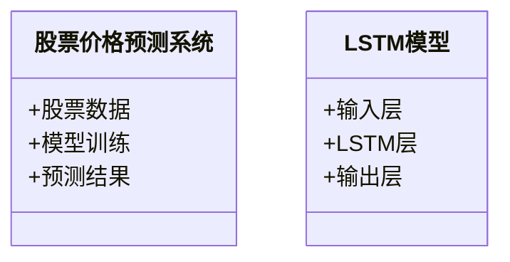
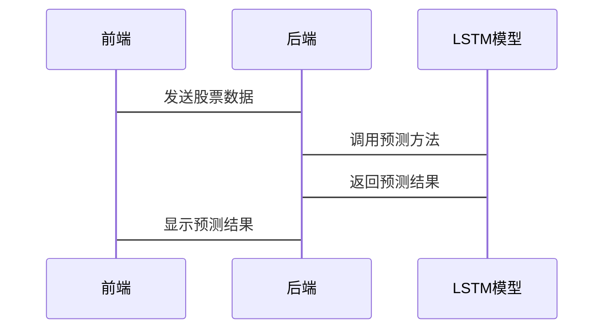

                 


# 神经网络模型在资产定价中的应用研究

> 关键词：神经网络模型，资产定价，深度学习，LSTM，股票预测，信用评分

> 摘要：本文系统探讨了神经网络模型在资产定价中的应用，分析了其核心原理和优势，并结合具体案例展示了如何利用神经网络模型实现股票价格预测和信用评分。文章内容涵盖神经网络模型的基本概念、资产定价的理论基础、神经网络模型在资产定价中的具体应用、技术实现、系统架构设计以及项目实战。

---

# 第1章: 神经网络模型与资产定价概述

## 1.1 神经网络模型的基本概念

神经网络模型是一种模拟人脑神经网络结构的数学模型，由一系列节点（神经元）和边（连接权重）组成。其核心特点包括非线性、自适应性和分布式计算能力。与传统统计模型相比，神经网络模型能够处理高维、非线性数据，并具有强大的特征学习能力。

$$\text{神经元模型的输入-输出关系：}$$
$$a = \sigma(wx + b)$$
其中，\(x\) 是输入，\(w\) 是权重，\(b\) 是偏置，\(\sigma\) 是激活函数。

## 1.2 资产定价的基本概念

资产定价是指对资产的公允价值进行评估的过程，其核心目标是确定资产的内在价值。资产定价的主要理论包括资本资产定价模型（CAPM）和套利定价理论（APT）。传统方法依赖于线性回归和时间序列分析，但存在数据假设严格、模型复杂度低等局限性。

## 1.3 神经网络模型在资产定价中的应用背景

传统资产定价模型假设数据服从正态分布且市场效率较高，但在实际金融市场中，数据可能存在缺失、噪声大、非线性关系复杂等问题。神经网络模型能够有效捕捉这些复杂关系，因此在资产定价领域具有广泛应用潜力。

---

# 第2章: 神经网络模型的核心原理

## 2.1 神经网络的基本结构

神经网络由输入层、隐藏层和输出层组成，激活函数（如ReLU、sigmoid）和损失函数（如均方误差、交叉熵）是其核心组件。优化器（如随机梯度下降、Adam）用于调整权重以最小化损失。

$$\text{损失函数：}$$
$$L = \frac{1}{n}\sum_{i=1}^{n}(y_i - \hat{y}_i)^2$$

$$\text{优化器：}$$
$$\theta_{t+1} = \theta_t - \eta \frac{\partial L}{\partial \theta_t}$$

其中，\(\eta\) 是学习率。

## 2.2 神经网络的训练过程

### 2.2.1 前向传播

输入数据通过网络层传递，计算每个节点的输出值。

### 2.2.2 反向传播

计算损失函数对权重的梯度，并通过链式法则更新权重。

### 2.2.3 梯度下降算法

优化器根据梯度更新权重，降低损失函数值。

## 2.3 深度学习与神经网络的关系

深度学习是神经网络的一种扩展，通过增加网络深度提高模型表达能力。深度学习的优势在于能够自动提取高维特征，但需要更多计算资源。

---

# 第3章: 资产定价的理论基础

## 3.1 资产定价的主要理论

### 3.1.1 CAPM模型

CAPM假设市场是有效的，投资者是理性的。其公式为：
$$R_i = R_f + \beta_i (R_m - R_f)$$

### 3.1.2 APT模型

APT模型假设资产回报与多个因子相关，公式为：
$$R_i = \alpha_i + \beta_i F_1 + \beta_i F_2 + \dots + \beta_i F_n + \epsilon_i$$

### 3.1.3 Fama-French三因子模型

三因子模型扩展了CAPM，引入了规模和价值因子：
$$R_i = \alpha_i + \beta_i R_m + s_i SMB + h_i HML + \epsilon_i$$

## 3.2 资产定价的传统方法

### 3.2.1 线性回归模型

$$R_i = \beta x + \epsilon$$

### 3.2.2 时间序列分析

ARIMA模型用于预测未来价格：
$$R_t = \phi R_{t-1} + \theta R_{t-2} + \epsilon_t$$

### 3.2.3 风险中性定价方法

利用风险中性原理定价衍生品。

## 3.3 传统资产定价模型的局限性

### 3.3.1 数据假设的局限性

假设数据服从正态分布，但在现实中可能存在厚尾现象。

### 3.3.2 模型假设的局限性

假设市场有效，但现实中存在信息不对称和市场失灵。

### 3.3.3 实际应用中的问题

传统模型难以捕捉复杂非线性关系。

---

# 第4章: 神经网络模型在资产定价中的应用

## 4.1 神经网络模型在股票价格预测中的应用

### 4.1.1 基于LSTM的股票价格预测

LSTM通过门控机制捕捉时间序列数据中的长期依赖关系。

$$\text{LSTM单元：}$$
$$f_t = \sigma(W_f x_t + U_f h_{t-1} + b_f)$$
$$i_t = \sigma(W_i x_t + U_i h_{t-1} + b_i)$$
$$o_t = \sigma(W_o x_t + U_o h_{t-1} + b_o)$$
$$h_t = f_t \cdot c_{t-1} + i_t \cdot tanh(W_c x_t + U_c h_{t-1} + b_c)$$

### 4.1.2 基于CNN的股票价格预测

CNN通过卷积操作提取局部特征。

$$\text{卷积操作：}$$
$$y_j = \sum_{i=1}^{n} w_i x_{i+j}$$

### 4.1.3 混合模型的应用

混合模型结合LSTM和CNN的优势，提升预测精度。

## 4.2 神经网络模型在信用评分中的应用

### 4.2.1 信用评分的定义

信用评分是评估借款人违约概率的指标。

### 4.2.2 基于神经网络的信用评分模型

神经网络模型通过非线性关系捕捉借款人特征之间的复杂关系。

### 4.2.3 模型的优缺点

优点：非线性能力强；缺点：解释性较差。

## 4.3 神经网络模型在风险评估中的应用

### 4.3.1 风险评估的定义

风险评估是衡量资产价格波动性的过程。

### 4.3.2 基于神经网络的风险评估模型

神经网络模型能够捕捉市场波动中的复杂模式。

### 4.3.3 模型的实际应用案例

例如，利用LSTM预测股票价格波动。

## 4.4 本章小结

神经网络模型在股票价格预测、信用评分和风险评估中具有广泛应用潜力。

---

# 第5章: 神经网络模型在资产定价中的技术实现

## 5.1 数据处理与特征提取

### 5.1.1 数据清洗

处理缺失值、异常值和重复值。

### 5.1.2 特征工程

提取如移动平均线、相对强弱指数等技术指标。

### 5.1.3 数据标准化

归一化数据以适应模型输入要求。

## 5.2 神经网络模型的构建与训练

### 5.2.1 模型设计

设计网络结构，如LSTM层数、节点数等。

### 5.2.2 模型训练

使用训练数据更新权重，优化损失函数。

### 5.2.3 模型评估

利用测试数据评估模型性能，如均方误差（MSE）、R平方值等。

## 5.3 项目实战

### 5.3.1 环境安装

安装Python、TensorFlow、Keras等工具。

### 5.3.2 核心实现

编写代码实现LSTM模型：

```python
import numpy as np
import tensorflow as tf
from tensorflow.keras.models import Sequential
from tensorflow.keras.layers import LSTM, Dense, Dropout

# 数据预处理
# 假设data为股票价格序列
train_data = data[:-100]
test_data = data[-100:]

# 滑动窗口法生成输入数据
window_size = 30
X_train = []
y_train = []
for i in range(len(train_data) - window_size):
    X_train.append(train_data[i:i+window_size])
    y_train.append(train_data[i+window_size])

X_train = np.array(X_train)
y_train = np.array(y_train)

# 模型构建
model = Sequential()
model.add(LSTM(50, return_sequences=True, input_shape=(window_size, 1)))
model.add(Dropout(0.2))
model.add(LSTM(50, return_sequences=False))
model.add(Dense(1))

model.compile(loss='mean_squared_error', optimizer='adam')
model.fit(X_train, y_train, epochs=50, batch_size=32)

# 预测
X_test = []
for i in range(len(test_data) - window_size):
    X_test.append(test_data[i:i+window_size])
X_test = np.array(X_test)
predictions = model.predict(X_test)
```

### 5.3.3 案例分析

以股票价格预测为例，展示模型训练和预测过程。

## 5.4 本章小结

详细讲解了神经网络模型在资产定价中的技术实现过程，包括数据处理、模型构建和训练。

---

# 第6章: 神经网络模型在资产定价中的系统架构设计

## 6.1 系统功能设计

### 6.1.1 领域模型

展示系统模块划分的类图：



### 6.1.2 系统架构设计

展示系统架构的分层架构图：


### 6.1.3 系统接口设计

展示系统交互的接口：



## 6.2 本章小结

详细描述了资产定价系统的功能设计、架构设计和接口设计。

---

# 第7章: 神经网络模型在资产定价中的项目实战

## 7.1 环境安装

安装必要的Python库，如TensorFlow、Keras、Pandas等。

## 7.2 核心实现

编写完整的LSTM模型代码，并进行数据处理和模型训练。

## 7.3 案例分析

以具体股票为例，展示模型的预测结果，并与实际价格进行对比。

## 7.4 项目小结

总结项目的实现过程，分析优缺点，并提出改进建议。

---

# 第8章: 最佳实践与展望

## 8.1 最佳实践 tips

### 8.1.1 数据预处理的重要性

确保数据质量，避免噪声干扰。

### 8.1.2 模型调优的技巧

尝试不同的网络结构和超参数。

## 8.2 未来研究方向

### 8.2.1 多模态数据的整合

结合文本、图像等多模态数据进行预测。

### 8.2.2 解释性模型的开发

开发可解释的神经网络模型，提高决策透明度。

## 8.3 本章小结

总结了神经网络模型在资产定价中的应用，并展望了未来的研究方向。

---

# 参考文献

（此处列出相关参考文献）

---

# 致谢

感谢读者的支持与关注！

