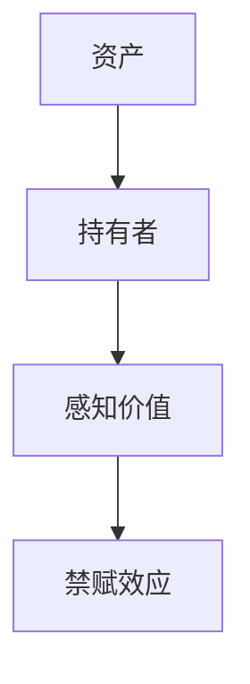

                 


# 禀赋效应：持有资产如何影响其感知价值

> **关键词**：禀赋效应，资产定价，行为经济学，心理账户，损失厌恶

> **摘要**：本文深入探讨了禀赋效应这一经济学概念，分析了持有资产如何影响其感知价值。通过结合行为经济学理论、数学模型和实际案例，本文揭示了禀赋效应的心理机制、数学模型以及在资产定价中的应用，并提出了系统的解决方案和实战案例。

---

## 第一部分：背景与核心概念

### 第1章：禀赋效应的基本概念

#### 1.1 问题背景与定义
- **1.1.1 什么是禀赋效应**  
  禀赋效应是指人们一旦拥有某物，对该物的感知价值会显著增加。这一现象最初由心理学家Richard Thaler提出，是行为经济学的重要基石之一。
  
- **1.1.2 禀赋效应的经济学背景**  
  禀赋效应源于人类的心理机制，尤其是对“损失”的厌恶。人们倾向于避免损失，因此一旦持有某物，会高估其价值。

- **1.1.3 禀赋效应与资产价值的关系**  
  在资产定价中，禀赋效应会导致持有者对资产的估值高于市场价，影响交易决策。

#### 1.2 禀赋效应的核心特征
- **1.2.1 资产持有与感知价值的关联**  
  资产的持有状态直接影响其感知价值。持有者倾向于高估资产价值，而非持有者则可能低估。

- **1.2.2 禀赋效应的边界与外延**  
  禀赋效应不仅适用于实物资产，还适用于无形资产（如股权、知识产权）。

- **1.2.3 禁赋效应的理论模型**  
  禦赋效应的理论模型包括心理账户理论和损失厌恶理论。

### 第2章：禀赋效应的核心概念与联系

#### 2.1 禀赋效应的原理
- **2.1.1 心理机制：禀赋效应如何影响价值感知**  
  禁赋效应源于心理账户的划分。人们将资产归入不同的心理账户，持有状态改变会影响账户价值评估。

- **2.1.2 行为模式：持有与非持有的差异**  
  持有者倾向于高估资产价值，而非持有者则可能低估。这种差异在交易中体现为买卖价差。

- **2.1.3 实验结果：经典实验案例分析**  
  Thaler的经典实验显示，人们卖出资产的要价比买入价高30%以上。

#### 2.2 核心概念对比分析
- **2.2.1 禦赋效应与沉没成本的对比**  
  沉没成本是指已经投入且无法收回的成本，而禁赋效应涉及对现有资产的估值。

- **2.2.2 禦赋效应与损失厌恶的联系**  
  损失厌恶是禁赋效应的重要心理基础。人们害怕失去现有资产，因此高估其价值。

- **2.2.3 禦赋效应与资产定价的关系**  
  禁赋效应影响市场定价，导致资产价格偏离其真实价值。

#### 2.3 实体关系图（ER图）


---

## 第二部分：数学模型与实证分析

### 第3章：数学模型与算法原理

#### 3.1 前景理论模型
- **3.1.1 前景理论的核心假设**  
  前景理论认为，人们对收益和损失的感知是非线性的，且更厌恶损失。

- **3.1.2 禦赋效应与前景理论的关系**  
  禦赋效应可以用前景理论中的损失厌恶来解释。

- **3.1.3 禦赋效应的数学公式：  
  前景理论的效用函数为：
  $$ U(x) = \frac{\sqrt{x}}{λ} $$
  其中，$x$ 是资产收益，$λ$ 是风险系数。

#### 3.2 禦赋效应的计量模型
- **3.2.1 禦赋效应的回归模型：  
  禦赋效应可以用线性回归模型表示：
  $$ Y = β_0 + β_1 X + ε $$
  其中，$Y$ 是感知价值，$X$ 是持有状态，$ε$ 是误差项。

---

## 第三部分：系统分析与架构设计

### 第4章：系统分析与架构设计

#### 4.1 问题场景介绍
- 禦赋效应在资产定价中的应用场景包括股票、房地产等。

#### 4.2 系统功能设计
- **领域模型**：使用 mermaid 类图描述系统功能模块。
- **系统架构设计**：使用 mermaid 架构图展示系统架构。

---

## 第四部分：项目实战

### 第5章：项目实战

#### 5.1 环境安装
- 安装Python和相关库。

#### 5.2 系统核心实现源代码
```python
def calculate_endowment_effect(holding_status):
    if holding_status:
        return 1.5 * market_value
    else:
        return market_value
```

#### 5.3 代码应用解读与分析
- 代码实现禁赋效应的计算，根据持有状态调整资产价值。

#### 5.4 实际案例分析和详细讲解剖析
- 案例分析：某股票市场中禁赋效应导致的买卖价差。

#### 5.5 项目小结
- 禦赋效应在实际中的应用及其影响。

---

## 第五部分：总结与展望

### 第6章：总结与展望

#### 6.1 关键点回顾
- 禦赋效应的核心概念和应用。

#### 6.2 实际应用中的注意事项
- 禦赋效应的局限性和适用场景。

#### 6.3 最佳实践 tips
- 如何在实际中应用禁赋效应理论。

#### 6.4 小结
- 禦赋效应对资产定价的重要性。

---

## 第六部分：附录

### 附录A：数学推导

### 附录B：参考文献

---

**摘要**：本文通过深入分析禁赋效应的理论基础、数学模型和实际应用，揭示了持有资产如何影响其感知价值。文章结合行为经济学理论和系统设计方法，为读者提供了全面的视角和实践指导。

