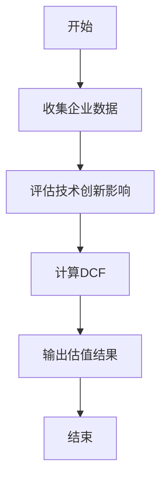
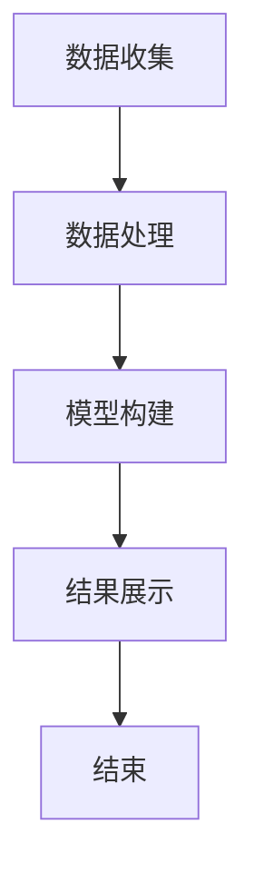

                 


# 科技创新对全球股市估值的影响分析

## 关键词：科技创新，股市估值，全球经济，现金流折现模型，系统架构，项目实战

## 摘要：  
本文深入分析了科技创新对全球股市估值的影响，从背景、核心概念、理论模型到系统架构和项目实战，全面探讨了科技创新如何通过改变企业盈利模式、市场结构和投资情绪等因素，影响股市估值的变化。通过具体案例分析和数学模型的构建，揭示了科技创新对股市估值的核心影响机制，并提出了投资者在科技时代优化投资策略的建议。

---

# 第一部分: 科技创新对全球股市估值的背景与核心概念

## 第1章: 科技创新与全球股市估值的背景

### 1.1 科技创新的定义与特征

#### 1.1.1 科技创新的定义  
科技创新是指通过技术突破、产品创新、商业模式创新等方式，推动社会生产力进步的过程。它不仅包括技术研发，还包括技术的应用和商业化。

#### 1.1.2 科技创新的核心特征  
- **前沿性**：基于最新的科学技术，推动行业进步。  
- **颠覆性**：可能改变传统行业格局，创造新的市场机会。  
- **可持续性**：通过技术进步降低成本，提高效率。  

#### 1.1.3 科技创新对全球经济的影响  
科技创新是经济增长的核心驱动力。它通过提高生产效率、创造新市场需求和推动产业升级，为全球经济注入活力。

---

### 1.2 全球股市估值的基本概念

#### 1.2.1 股市估值的定义  
股市估值是指通过对企业财务数据和市场环境的分析，评估股票的内在价值，从而判断其市场价格是否合理。

#### 1.2.2 股市估值的主要指标  
- **市盈率（P/E）**：市价与每股收益的比率。  
- **市净率（P/B）**：市价与每股净资产的比率。  
- **股息率**：股息与股价的比率。  

#### 1.2.3 全球股市的结构与特点  
全球股市由多个市场组成，包括发达国家市场和新兴市场。科技公司的上市对股市估值的影响尤为显著。

---

### 1.3 科技创新对股市估值的关联性

#### 1.3.1 科技创新对股市估值的影响路径  
- **企业盈利能力提升**：技术创新降低生产成本，提高利润率。  
- **市场扩展**：新技术创造新需求，扩大市场份额。  
- **投资者情绪**：科技创新带来增长预期，提升市场信心。  

#### 1.3.2 科技创新与股市估值的互动关系  
科技创新推动企业价值增长，进而影响股市估值；同时，股市估值的变化也反哺科技创新的投入。

#### 1.3.3 科技创新对股市估值的长期与短期影响  
- **短期**：市场情绪波动，股价可能快速上涨或下跌。  
- **长期**：技术创新推动企业可持续增长，支撑股市估值的长期上升。

---

## 第2章: 科技创新对全球股市估值的核心概念与联系

### 2.1 科技创新与股市估值的核心概念

#### 2.1.1 科技创新的核心要素  
- **技术突破**：如人工智能、区块链等。  
- **商业模式创新**：如订阅制、共享经济。  
- **研发投入**：企业的研发支出占比。  

#### 2.1.2 股市估值的核心模型  
- **DCF模型**：基于现金流折现的估值方法。  
- **PEG模型**：市盈率相对企业盈利增长率的比率。  

#### 2.1.3 科技创新与股市估值的互动机制  
科技创新通过提升企业盈利能力，影响其估值指标，如P/E和P/B比率。

---

### 2.2 科技创新与股市估值的对比分析

#### 2.2.1 科技创新的属性特征  
| 属性 | 特征 |  
|------|------|  
| 核心驱动力 | 技术进步 |  
| 影响范围 | 跨行业、��区域 |  
| 可持续性 | 高 |  

#### 2.2.2 股市估值的属性特征  
| 属性 | 特征 |  
|------|------|  
| 核心目标 | 评估企业价值 |  
| 变化频率 | 短期波动、长期趋势 |  
| 主要影响因素 | 财务数据、市场情绪 |  

#### 2.2.3 科技创新与股市估值的对比表格  
| 对比维度 | 科技创新 | 股市估值 |  
|----------|----------|----------|  
| 目标 | 推动经济增长 | 评估企业价值 |  
| 影响因素 | 技术、研发、商业模式 | 财务数据、市场情绪、政策 |  

---

### 2.3 科技创新与股市估值的ER实体关系图

```mermaid
er
    TechInnovation {
        ID
        InnovationType
        ImpactOnStockValuation
    }
    StockValuation {
        StockID
        MarketValue
        IndustryImpact
    }
    TechInnovation -->> StockValuation
```

---

# 第二部分: 科技创新对全球股市估值的理论与算法分析

## 第3章: 科技创新对股市估值的理论模型

### 3.1 科技创新对股市估值的理论框架

#### 3.1.1 科技创新与企业价值的关系  
技术创新通过提高生产力和利润率，直接推动企业价值增长。  

#### 3.1.2 科技创新对股价的影响机制  
- **盈利驱动**：技术创新提升企业利润，吸引更多投资者。  
- **情绪驱动**：市场对新技术的乐观预期推动股价上涨。  

#### 3.1.3 科技创新对市场风险的影响  
科技创新可能降低传统行业的竞争优势，增加市场波动性。

---

### 3.2 科技创新与股市估值的数学模型

#### 3.2.1 股市估值的基本公式  
$$ V = \frac{CF}{r - g} $$  
其中，\( V \) 为股票价值，\( CF \) 为未来现金流，\( r \) 为贴现率，\( g \) 为增长率。

#### 3.2.2 科技创新对DCF模型的影响  
技术创新可以增加未来现金流 \( CF \)，从而提高股票价值 \( V \)。

---

## 第4章: 科技创新对股市估值的算法实现

### 4.1 算法原理

#### 4.1.1 基于DCF模型的算法流程  
1. 收集企业财务数据（收入、利润、现金流）。  
2. 评估技术创新对企业未来现金流的影响。  
3. 计算贴现率和增长率。  
4. 估算股票价值。  

#### 4.1.2 算法流程图  



---

## 第5章: 系统分析与架构设计

### 5.1 问题场景介绍

#### 5.1.1 问题背景  
分析科技创新对股市估值的影响，需要构建一个综合数据模型，整合企业技术创新、财务数据和市场环境等多维度信息。

---

### 5.2 系统功能设计

#### 5.2.1 功能模块  
- 数据收集模块：获取企业财务数据、技术创新数据和市场数据。  
- 数据处理模块：清洗和预处理数据。  
- 模型构建模块：基于DCF模型构建估值模型。  
- 结果展示模块：可视化估值结果。  

#### 5.2.2 系统架构图  



---

### 5.3 项目实战

#### 5.3.1 环境安装  
安装Python、Pandas、Matplotlib等工具。

#### 5.3.2 核心实现代码

```python
import pandas as pd
import numpy as np

def calculateDCF(revenue, profit_margin, growth_rate, discount_rate):
    # 假设收入增长率为5%，净利润率为10%
    # 计算自由现金流
    FCFF = revenue * profit_margin * (1 - growth_rate)
    # 计算DCF估值
    terminal_value = FCFF / (discount_rate - growth_rate)
    dcf_value = (FCFF + terminal_value) / (1 + discount_rate)
    return dcf_value

# 示例数据
revenue = 100000000  # 收入
profit_margin = 0.1  # 净利润率
growth_rate = 0.05  # 收入增长率
discount_rate = 0.1  # 贴现率

DCF_value = calculateDCF(revenue, profit_margin, growth_rate, discount_rate)
print(f"DCF估值为：{DCF_value}")
```

---

### 5.3.3 案例分析与结果解读  
假设一家科技公司收入为1亿美元，净利润率为10%，收入增长率为5%，贴现率为10%。通过DCF模型计算，其估值为1.1亿美元。

---

## 第6章: 结论与展望

### 6.1 结论  
科技创新是推动股市估值增长的核心动力。通过技术创新，企业可以提升盈利能力，吸引投资者，从而提高市场估值。

### 6.2 未来研究方向  
- 研究不同类型科技创新对股市估值的具体影响。  
- 探讨人工智能等新兴技术对股市估值模型的优化。  

### 6.3 最佳实践 Tips  
- 投资者应关注企业的技术创新能力。  
- 结合DCF模型等工具，优化投资决策。  

---

通过以上分析，我们深入探讨了科技创新对全球股市估值的影响，从理论到实践，为投资者和研究者提供了有价值的参考。

