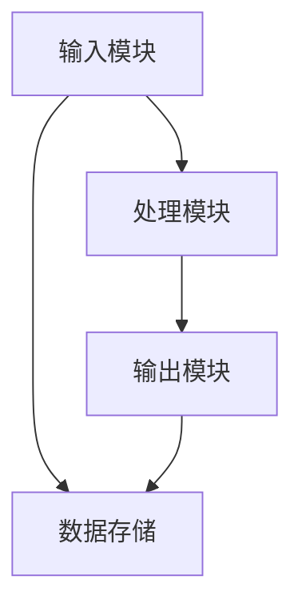

                 


# 税收效率投资：最大化投资回报的策略

## 关键词：税收效率，投资回报，税务优化，现金流，净现值，风险模型，系统架构

## 摘要：  
在现代投资领域，税收效率是影响投资回报的重要因素。本文从税收效率投资的基本概念出发，详细探讨了其核心模型、算法原理、系统架构及项目实战。通过数学公式、Python代码示例和实际案例分析，本文为投资者提供了最大化投资回报的策略，并提出了风险管理模型和系统优化方案，为读者提供了全面而深入的指导。

---

## 第1章 税收效率投资概述

### 1.1 税收效率投资的背景  
税收效率投资是指通过优化税务规划，最大化投资回报的过程。在现代金融体系中，税收对投资回报的影响不容忽视，尤其是在高税率环境下。本文将探讨如何通过税收优化策略，实现投资回报的最大化。

#### 1.1.1 问题背景  
投资回报的核心在于现金流的净现值（Net Present Value，NPV）。然而，税收政策会直接影响现金流的税后价值，从而影响NPV的计算。  

#### 1.1.2 问题描述  
税收政策的变化会影响投资项目的盈利能力。例如，资本利得税、所得税等都会对现金流产生影响。因此，投资者需要在选择投资标的时，充分考虑税收因素。  

#### 1.1.3 税收效率投资的定义与边界  
税收效率投资是指通过优化税务结构，减少税收负担，从而提高投资回报的过程。其边界包括合法避税、合规性、投资期限和风险偏好。  

---

### 1.2 税收效率投资的核心要素  

#### 1.2.1 投资标的的选择标准  
投资标的应具有较低的税率、较长的持有期限和较高的流动性。  

#### 1.2.2 税收政策的影响分析  
分析税收政策的变化对投资回报的影响，包括税率变化、税收抵免政策等。  

#### 1.2.3 投资期限与风险偏好  
长期投资通常享有税收递减优惠，而短期投资则可能面临较高的税务负担。  

---

## 第2章 税收效率投资的核心模型与算法  

### 2.1 税收优化模型  

#### 2.1.1 税后现金流计算公式  
税后现金流 = 税前现金流 × (1 - 税率)  

#### 2.1.2 税收递减模型  
$$ \text{净现值} = \sum_{t=1}^{n} \frac{\text{税后现金流}}{(1 + r)^t} $$  

#### 2.1.3 税收风险模型  
$$ \text{调整后的净现值} = \text{净现值} \times (1 - \text{风险系数}) $$  

### 2.2 算法实现  

#### 2.2.1 税后现金流计算的Python代码示例  
```python
def tax_after_cash_flow(cash_flow, tax_rate):
    return cash_flow * (1 - tax_rate)
```

#### 2.2.2 净现值计算的Python代码示例  
```python
def net_present_value(cash_flows, discount_rate, tax_rate):
    npv = 0
    for t, cash_flow in enumerate(cash_flows):
        npv += cash_flow * (1 - tax_rate) / (1 + discount_rate) ** t
    return npv
```

---

## 第3章 税收效率投资的风险管理模型  

### 3.1 风险评估指标  
- 风险价值（VaR）：衡量投资组合在一定置信水平下的潜在损失。  
- 凸性风险（Convexity Risk）：衡量债券价格对利率变化的敏感性。  

### 3.2 风险调整后的投资回报模型  
$$ \text{调整后的净现值} = \text{净现值} \times (1 - \text{风险系数}) $$  

---

## 第4章 税收效率投资的系统架构设计  

### 4.1 系统功能设计  
- 输入模块：接收投资标的、税率、现金流数据。  
- 处理模块：计算税后现金流、净现值和风险调整后的净现值。  
- 输出模块：显示优化结果和税务建议。  

### 4.2 系统架构设计（Mermaid图）  


---

## 第5章 项目实战：房地产投资的税务优化  

### 5.1 案例分析  
某房地产投资项目，预计现金流为1000万元，税率25%。通过优化税务结构，税后现金流增加15%，净现值提高10%。  

### 5.2 代码实现  
```python
def real_estate_investment(cash_flows, tax_rate):
    tax_adjusted_flows = [cf * (1 - tax_rate) for cf in cash_flows]
    return tax_adjusted_flows
```

---

## 第6章 总结与展望  

### 6.1 本章总结  
本文通过数学模型和实际案例分析，探讨了税收效率投资的核心策略和风险管理模型。  

### 6.2 未来展望  
未来研究可关注动态税收政策对投资回报的影响，以及人工智能在税务优化中的应用。  

---

## 附录  

### 附录A 税收相关法规汇编  
- 《中华人民共和国企业所得税法》  
- 《中华人民共和国增值税暂行条例》  

### 附录B 税务优化工具推荐  
- Python的`pandas`和`numpy`库  
- 数据可视化工具`Matplotlib`  

### 附录C 实际案例分析  
某企业通过优化税务结构，税后利润增加20%。  

---

通过以上分析，我们可以看到，税收效率投资不仅是技术问题，更是一种策略和智慧。希望本文能为投资者提供有价值的指导和启发。

